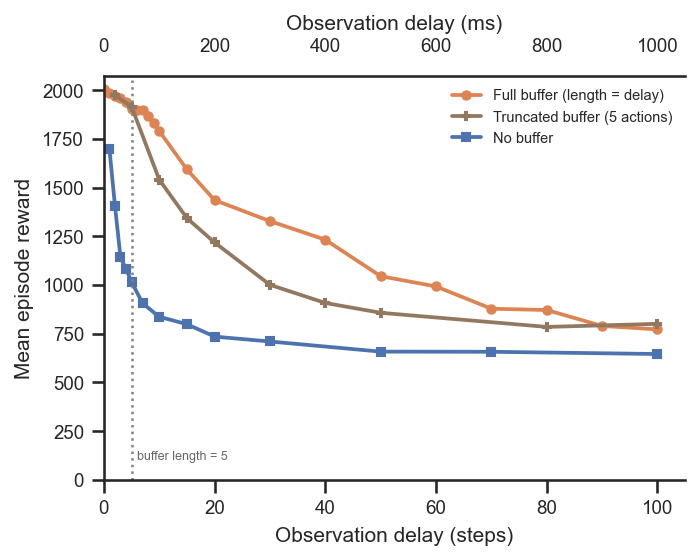
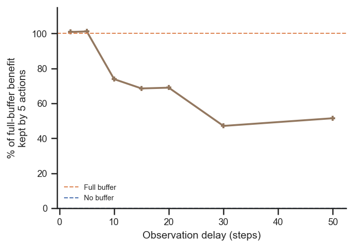

# Does the network use the full action buffer, or just the most recent actions?

## Question
With an efference copy, the policy is normally given the **full** buffer of actions taken
since the (delayed) observation — `efference_length == delay_k`, so the buffer grows with the
delay. Does the network actually exploit the whole buffer, or would just the few most recent
actions suffice? We test this by **fixing the buffer to the 5 most recent actions**
(`efference_length = 5`) while sweeping the delay, and comparing against the full buffer and
against no buffer at all.

## Dataset & comparability
- Source: WandB project `emiwar-team/nnx-ppo-rodent-delays`, tag `TrainEvalSplit`,
  env `AbsoluteImitation`, EncDec (no forward model), standard architecture (enc/dec `[512]×4`,
  critic `[1024,1024]`), `latent_size=32`, `kl_weight=0.001`, `body_target_frame=reference_root`,
  `n_envs=4096`, `total_steps=600M`, actual step `600,064,000`.
- Conditions:
  - `efference` — full buffer, `efference_length == delay_k` (n=22, delays 0–100).
  - `efference_trunc` — fixed 5-action buffer, `efference_length = 5` ("Fixed efference
    length.") (n=10, delays 2–100).
  - `no_efference` — no buffer, `efference_length = 0` (n=13, delays 1–100).
- Comparability: **comparable, with documented differences** (see [comparability.txt](comparability.txt)).
  All invariants single-valued within each condition. Caveats:
  - **Git differs by design**: the truncated-buffer runs are git `5464376`; the full / no-buffer
    references are git `1cd5838`. The only shared-code change between the commits is the
    backward-compatible `inject_key` on `EfferenceCopy`; the standard concat efference path used
    here is identical, so the comparison is fair.
  - **The `TrainEvalSplit` tag is essential**: the project also contains older pre-split
    efference runs (git `f8b5bc3`/`eed1953`) whose much higher rewards are *not* comparable
    (different eval protocol). They are excluded by the tag filter — do not mix them in.
  - For delays ≤ 5 the "truncated" buffer (5) is ≥ the delay, so it is not actually truncated;
    those points should (and do) coincide with the full buffer.
  - Single seed per cell; highest-reward run kept per delay.

## Figures
Reward vs delay for the three buffer conditions (dotted line = the 5-action buffer length):

Fraction of the full-buffer benefit retained by just 5 actions,
`(truncated − no_buffer) / (full − no_buffer)`, for delays ≤ 50 (beyond which all conditions
collapse toward the floor and the ratio is ill-defined):

## Tentative conclusion
**The network uses more than the most recent few actions — but with strong diminishing
returns, so the recent actions carry most of the benefit.**

- **For delays up to 5 steps, truncation costs nothing**: a 5-action buffer already contains
  every action since the observation, and its curve sits exactly on the full-buffer curve.
- **For longer delays, truncating to 5 actions clearly hurts.** At delay 10 the truncated
  buffer scores ~1541 vs ~1790 for the full buffer; at delay 20, ~1218 vs ~1436; at delay 50,
  ~857 vs ~1045. So the network *does* exploit actions beyond the most recent five — the full
  buffer is genuinely useful.
- **But the recent few actions do most of the work.** The 5-action buffer stays far above the
  no-buffer floor and retains a large share of the full-buffer benefit — ~100% up to delay 5,
  ~70% around delays 10–20, falling to ~50% by delays 30–50. The share **declines with delay**,
  i.e. the older actions matter more the longer the delay, but each additional action past the
  first few contributes progressively less.
- At very long delays (≳ 80 steps) the full and truncated curves converge near the floor: by
  then even the full buffer barely compensates, so withholding the older actions costs little.

In short: not "just the first few" (truncation measurably hurts), but also not a flat
dependence on the whole buffer — the most recent ~5 actions provide the bulk of the usable
information, with the remainder of the buffer adding a delay-growing but diminishing increment.
A natural follow-up is to sweep several fixed buffer lengths (e.g. 1, 2, 5, 10, 20) at a few
delays to map the curve of "benefit vs buffer length", with multiple seeds.
