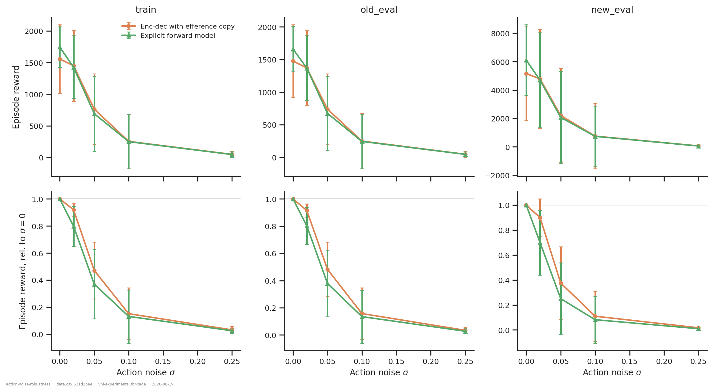
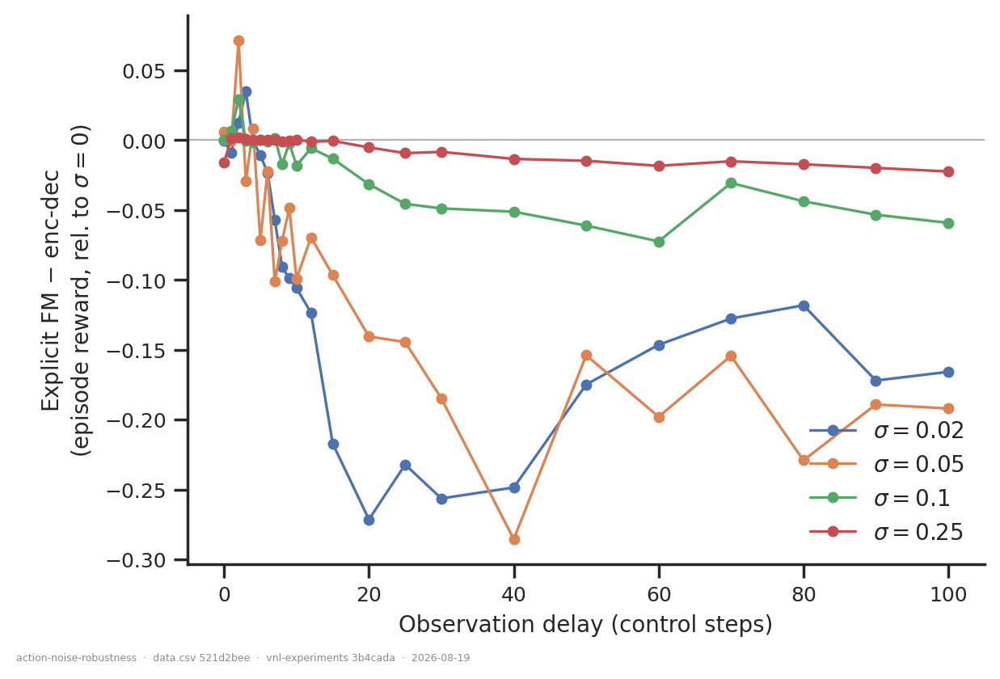
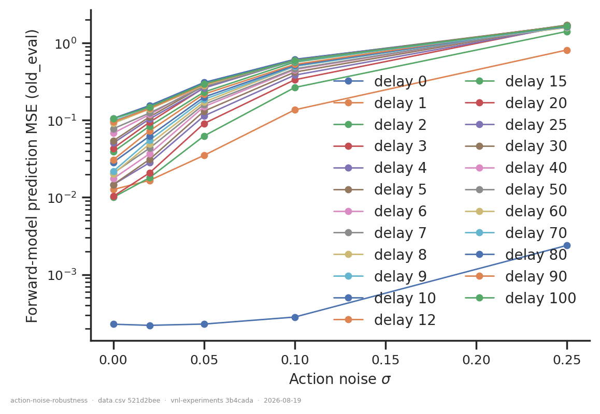
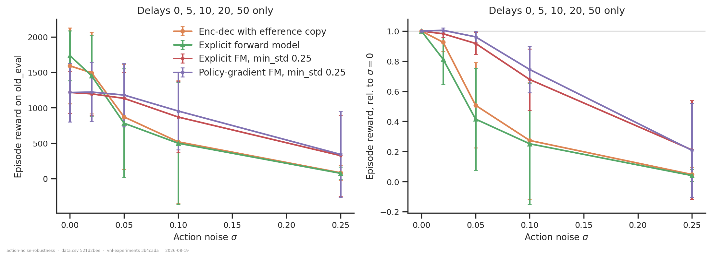

# Is the explicit forward model more sensitive to motor noise than the enc-dec?

**Yes — and the effect appears exactly where the mechanism predicts it should.** The
explicit forward model retains less of its own noise-free reward than the enc-dec at every
σ tested — 0.80 vs 0.92 at σ = 0.02 and 0.38 vs 0.48 at σ = 0.05 — so its 12 % advantage in
absolute terms at σ = 0 is gone by σ = 0.02 and inverted by σ = 0.05. Its advantage is
conditional on clean execution. The penalty scales with the delay the predictor has to
bridge (Spearman ρ = −0.79 to −0.92, every p < 1e-5) and vanishes at delay 0, where there
is nothing to predict.

A second, **larger** effect fell out of the same sweep: training with wider exploration
(`min_std = 0.25`) costs ~30 % of the noise-free reward but buys far more robustness than
either architecture choice, overtaking the `min_std = 0.1` runs by σ = 0.05 and beating
them 4.3× at σ = 0.25.

> **Rebuilt 2026-08-19 on the post-fix eval spec.** All 280 eval artifacts were re-produced
> after the 2026-08-18 walker-XML fix (every run here is new-XML, so every one of them had
> been evaluated on the wrong body) and the σ = 0.02 gap closed at the same time. Absolute
> rewards rose 1.1–1.8× on average. **Every conclusion above survived**, because the headline
> metric normalises each run to its own σ = 0 and the bug hit numerator and denominator
> together — unlike [`collision-model-xml/`](../collision-model-xml/), whose contrast was
> across bodies and did reverse. See *What the rebuild changed*.

## Question

The explicit forward model hands its decoder the predictor's output *instead of* the
delayed proprioception, with no skip path (`vnl_experiments/delays/forward_model.py`).
Does its advantage over the enc-dec depend on execution being clean? An answer is a curve
of performance vs. a fixed action-noise σ for each arm: if the explicit arm's *fractional*
degradation is steeper, the advantage is conditional.

## Design

Each checkpoint was re-evaluated with a fixed Gaussian perturbation added to the executed
action — σ in post-tanh action units (a fraction of the actuator half-range), clipped back
into `[-1, 1]`. 56 runs × 5 σ × 3 datasets.

- **Fixed σ, not the policy's learned `std`**, which is state-dependent and differs per
  run and architecture; reusing it would confound robustness with distribution width.
- **Unobserved motor noise.** The noise is added after the network's action and outside
  `EfferenceCopy`, so the efference queue holds the *intended* action while the body
  executes the perturbed one. The predictor's error is irreducible, not merely
  out-of-distribution. Both arms carry an efference copy and both get a clean queue.
- **σ = 0 is measured**, from the same code path, spec and batch as the noisy points.
- **Headline metric is cumulative `episode_reward`**, which folds in tracking quality and
  survival, compared only *within* a dataset. Each run is normalised to its **own** σ = 0
  value, which also cancels the ~1 % GPU-physics irreproducibility (numerator and
  denominator come from the same checkpoint). `reward_per_step` conditions on being alive
  and is the rate-only view.
- **Paired by delay.** With n = 1 per (condition, delay), the 23 matched delays *are* the
  replication, so the primary test is a paired one across delays, not a seed average.

## Dataset & comparability

WandB `emiwar-team/nnx-ppo-rodent-delays`, selected by `CONDITIONS` in `extract.py`,
frozen in `runs.csv`. All new XML (`rodent_no_tail_collisions.xml`), `reference_root`
targets, torque actuators, seed 42, 600 M steps, `[512]×4` enc/dec, `[1024]×2` critic.

| condition | n | arm | min_std | delays | commit | state |
|---|---:|---|---|---|---|---|
| `expfm` | 23 | explicit FM | 0.1 | 0–10, 12, 15, 20, 25, 30, 40, 50, 60, 70, 80, 90, 100 | `ef060b73` | failed |
| `encdec` | 23 | enc-dec + efference | 0.1 | same 23 | `ef060b73` | failed |
| `expfm_std25` | 5 | explicit FM | 0.25 | 0, 5, 10, 20, 50 | `d02b854a` | finished |
| `pgfm_std25` | 5 | policy-gradient FM | 0.25 | 0, 5, 10, 20, 50 | `d02b854a` | finished |

- **The primary arms are exactly matched**: same 23 delays, one run per delay, same launch
  tranche and commit.
- **Included despite `state = failed`:** both primary conditions are the 2026-08-11
  `ef060b73` tranche, which died in the *post-training* evaluation. The rule (following
  `collision-model-xml`) is `state ∈ {finished, failed}` **and** `summary._step ==
  600_064_000`; a run that died during training cannot satisfy the second. The three
  `crashed` runs at `25732c42` have `_step = NaN` and are excluded by that gate.
- **Coverage: 840/840 cells — complete.** Every (run, σ, dataset) cell is present, on the
  post-fix v2 specs (`eval3ds-n00-6a6b8d4e` and its four siblings). The previous version was
  801/840, missing `encdec` at 13 of 23 delays at σ = 0.02, which was the single weakest cell
  in the analysis; it is now full. Pooled comparisons are still restricted to delays both arms
  share at that σ (`paired_delays` in `plot.py`), which is now every delay at every σ.
- **Every artifact is verified to have simulated the new-XML body**, from its
  `resolved.walker_xml_path` stamp (`assert_artifact_body`): 840/840 rows read
  `rodent_no_tail_collisions.xml`. An absent stamp means pre-fix and is a hard error.
- **Programmatic comparability:** `comparability.txt` — every condition is single-valued
  on every invariant, `git_commit` included. Pooled, only `min_std` and `git_commit` vary,
  and they vary together (the `std25` tranche is a separate launch 2 days later).
- **Manual comparability:** *(outstanding)* `git diff ef060b73 d02b854a` — needed only for
  the secondary `min_std` comparison; the primary pair is a single commit.

## Result 1 — the explicit forward model degrades faster

`old_eval`, paired by delay, episode reward relative to each run's own σ = 0:

| σ | paired delays | expfm | encdec | difference | expfm worse in | Wilcoxon |
|---|---:|---:|---:|---:|---:|---:|
| 0.02 | 23 | 0.802 | 0.915 | **−0.113** | 21/23 | p < 0.001 |
| 0.05 | 23 | 0.378 | 0.483 | **−0.104** | 20/23 | p < 0.001 |
| 0.10 | 23 | 0.135 | 0.157 | −0.023 | 18/23 | p < 0.001 |
| 0.25 | 23 | 0.027 | 0.034 | −0.007 | 15/23 | p = 0.007 |

All four rows are now the full 23 delays. The direction is near-unanimous (21/23 at
σ = 0.02, 20/23 at σ = 0.05) and weakens only at σ = 0.25, where both arms are near the floor
and there is little left to lose. In absolute terms the ranking **reverses** between σ = 0
and σ = 0.05 (`old_eval`, all 23 delays):

| σ | expfm | encdec | expfm / encdec | survived (expfm / encdec) |
|---|---:|---:|---:|---|
| 0.00 | **1660** | 1477 | 1.12 | 0.77 / 0.64 |
| 0.02 | 1369 | 1371 | **1.00** | 0.62 / 0.59 |
| 0.05 | 675 | **739** | **0.91** | 0.20 / 0.26 |
| 0.10 | 244 | **249** | 0.98 | 0.05 / 0.06 |
| 0.25 | 46 | **47** | 0.97 | 0.00 / 0.00 |

So the explicit arm's 12 % lead is spent by σ = 0.02 and negative by σ = 0.05, then the two
converge as both approach the floor. The reversal is one σ step later than the previous
version of this table reported, and that table was built on the 10 σ = 0.02 delays then
available; the retention view above is the one that does not depend on which σ the crossing
happens to land in.

Absolute (top) and relative-to-own-σ=0 (bottom) episode reward, per dataset. The two arms
sit on top of each other in absolute terms from σ = 0.05 down; the bottom row is where the
consistent separation lives.

## Result 2 — the penalty tracks the delay, and disappears at delay 0

The explicit arm's paired disadvantage per delay. It is ~0 for delays 0–5, then grows
monotonically: at σ = 0.05 it reaches −0.15 to −0.23 by delays 50–100. The σ = 0.02 row is
the one that changed on the rebuild — it was ρ = −0.67 at p = 0.03 on 10 delays, and is now
ρ = −0.79 at p = 7.5e−06 on all 23.

Now that it is complete, **σ = 0.02 carries the deepest gap of any σ**, −0.22 to −0.27 across
delays 20–40, and the effect shrinks again at σ = 0.10 and 0.25. That non-monotonicity is a
floor effect rather than a reversal: by σ = 0.10 the enc-dec has itself dropped to 0.16 of its
noise-free reward, so there is little left for the explicit arm to lose relative to it. The
largest *separation* is where the perturbation is big enough to break the predictor but small
enough that the baseline still works — which is the mechanism's own prediction, and it was not
visible while the σ = 0.02 row had 10 delays.

| σ | Spearman ρ (delay, gap) | p | n |
|---|---:|---:|---:|
| 0.02 | −0.79 | 7.5e−06 | 23 |
| 0.05 | −0.92 | 8.7e−10 | 23 |
| 0.10 | −0.91 | 2.4e−09 | 23 |
| 0.25 | −0.80 | 3.9e−06 | 23 |

This is the analysis's strongest internal control. At delay 0 the predictor has nothing to
bridge, so a mechanism that runs *through* prediction error must show no penalty there —
and it doesn't. A generic "this architecture is just more fragile" story predicts no such
delay dependence.

The mechanism is directly visible: the predictor's own L2 error against true current
proprioception rises **35×** across the sweep (`expfm`, `old_eval`):
0.045 → 0.078 → 0.200 → 0.481 → 1.552.

## Result 3 — it is not a generalisation effect

Relative episode reward at σ = 0.05 is 0.371 / 0.472 (expfm / encdec) on **train**,
0.378 / 0.483 on `old_eval`, 0.251 / 0.376 on `new_eval`. The same ordering and almost
exactly the same magnitude appear on the training clips, so this is a control phenomenon,
not overfitting. It is clearly *larger* on `new_eval`, i.e. noise and novel clips compound.

## Result 4 — wider training exploration buys much more robustness than architecture does

Shared delays (0, 5, 10, 20, 50), `old_eval`, absolute episode reward:

| σ | encdec | expfm | expfm_std25 | pgfm_std25 |
|---|---:|---:|---:|---:|
| 0.00 | 1590 | **1734** | 1216 | 1214 |
| 0.02 | **1493** | 1451 | 1196 | 1221 |
| 0.05 | 870 | 781 | 1132 | **1179** |
| 0.10 | 519 | 499 | 868 | **953** |
| 0.25 | 83 | 75 | 325 | **342** |

`min_std = 0.25` costs ~30 % of the noise-free reward, crosses over between σ = 0.02 and
0.05, and by σ = 0.25 retains 27–28 % of its baseline against 4–5 % — with survival
0.15–0.16 vs **0.000–0.002**, i.e. the `min_std = 0.1` policies essentially never finish a
clip. At σ = 0.25 the wider-exploration runs score **4.3× more reward**. The effect dwarfs
the architecture difference.

Two details reinforce Result 1. `pgfm_std25` (predictor trained only by the policy
gradient) beats `expfm_std25` at *every* σ ≥ 0.02 — and its noise-free prediction error is
0.756 vs 0.049, i.e. it never learned to predict well but also never came to depend on the
prediction being right. The more a policy leans on an accurate forward prediction, the more
unobserved motor noise costs it.

## What the rebuild changed

All 280 artifacts were re-produced on the post-fix eval spec on 2026-08-19. Absolute rewards
rose by 1.1–1.8× on average (individual cells up to 3.6×), and the rise was **not** uniform in
σ — mean v2/v1 was 1.47 at σ = 0, 1.80 at σ = 0.05 and 1.11 at σ = 0.25, because at high noise
the policies were failing anyway and the wrong body cost them less on top. So the bug did not
simply cancel; it compressed the dynamic range of every degradation curve.

What survived, and why: the headline metric normalises each run to **its own** σ = 0 value, so
the wrong-body penalty largely divides out. Every conclusion is unchanged in direction, and two
are stronger:

| claim | before | after |
|---|---|---|
| expfm retains less, σ = 0.02 | −0.177 on 10 delays, p = 0.027 | **−0.113 on 23 delays, p < 0.001** |
| ρ(delay, gap) at σ = 0.02 | −0.67, p = 0.03, n = 10 | **−0.79, p = 7.5e−06, n = 23** |
| absolute crossover | between σ = 0 and 0.02 | between σ = 0.02 and 0.05 |
| `min_std = 0.25` advantage at σ = 0.25 | 4× | 4.3× |
| predictor error across the sweep | 25× | 35× |

The one substantive revision is the crossover σ, which moved one step later. It was read off a
table restricted to the 10 σ = 0.02 delays then available — exactly the kind of claim a partial
sweep should not have carried.

This is the contrast with [`collision-model-xml/`](../collision-model-xml/), whose headline
**did** reverse: its primary contrast is *across bodies*, so the bug hit one arm only and could
not divide out. A within-run ratio was the right choice here for reasons unrelated to the bug,
and it happened to make this analysis robust to it.

## Caveats

- ~~**σ = 0.02 is the weakest row.**~~ Filled 2026-08-19: `encdec` now has all 23 delays at
  σ = 0.02. The caveat correctly predicted the direction — it warned that the −0.177 mean was an
  *over*-estimate because the 10 available delays skewed mid-to-long, and the full 23-delay
  value is **−0.113**. The row is now the strongest in Result 1 (21/23, p < 0.001) rather than
  the weakest.
- n = 1 per (condition, delay); the pairing is across delays, and the reported spread is
  across-delay spread, not seed spread.
- One noise realisation per (run, σ). The consistency across 23 independent delays is what
  carries Result 1, not any single cell.
- At σ = 0.25 both `min_std = 0.1` arms are on the floor (survived 0.000–0.002), so the small
  gap there says little; Results 1–2 rest on σ = 0.02–0.10.
- The `min_std` comparison confounds exploration width with launch tranche/commit
  (`ef060b73` vs `d02b854a`, 2 days apart) and rests on 5 delays × 1 run.
- No enc-dec run exists at `min_std = 0.25` anywhere in the project, so Result 4 is
  internal to the forward model.

## Follow-ups

- Add `pgfm_new_reference` (13 runs, `25732c42`, min_std 0.1) so the policy-gradient arm
  has a matched-`min_std` twin, separating "implicit predictor" from "wide exploration".
- Train an enc-dec at `min_std = 0.25` to cross the two axes.
- The mirror experiment: inject noise *inside* the sampler so the efference queue holds the
  executed action. That separates "the noise is unpredictable" from "the noise shifts the
  predictor's input distribution", and Result 2 predicts the penalty should largely vanish.
- Sensory (proprioception) noise as a second axis, stressing the encoder rather than the
  predictor.

---

*Reproduce:* `../.venv/bin/python analysis/action-noise-robustness/extract.py && ../.venv/bin/python analysis/action-noise-robustness/plot.py`
(add `--sync --refresh` to the extract to pull in runs added since `runs.csv` was frozen).
