# Lab meeting, August 2026 — five claims about proprioceptive delay

Talk figures, not a new question. Each claim below already has a home folder in
`analysis/`; this one rebuilds the essential figure for each from one script with the
conventions the slides need. **What is new here** is the concatenated-layer probe
(figure 5h), which no previous folder computed.

Structure is deliberately non-standard, as requested: no `comparability.txt`, no condition
table per figure. The comparability facts that matter are stated next to the figure they
affect, and the numeric ones live in [`checks.txt`](checks.txt).

**Rebuild:**

```
../.venv/bin/python analysis/aug-2026-labmeeting-summary/extract.py     # frozen, ~40 s
../.venv/bin/python analysis/aug-2026-labmeeting-summary/plot.py
```

`extract.py --part groups --redecode` refits the concatenated probes from the activation
HDF5s (~3 min per recording, 7 recordings); everything else is cached in the committed
CSVs. `extract.py --check` passes: all six tables rebuild bit-identically.

---

## The cohorts, in one table

Everything is `AbsoluteImitation`, standard architecture (enc/dec `[512]×4`, critic
`[1024,1024]`, latent 32), `efference_length == delay_k` unless stated, 4096 envs,
`min_std = 0.1`.

| name | n | delays | body / frame | commit | used by |
|---|---|---|---|---|---|
| `encdec` | 23 | 0–100 | **new XML, reference_root** | `ef060b73` | 1, 2, 4 |
| `expfm` (explicit FM) | 23 | 0–100 | new XML, reference_root | `ef060b73` | 2, 3, 4, 5 |
| `pgfm` (policy-gradient FM) | 13 | 0–100 | new XML, reference_root | `25732c42` | 2, 3, 5 |
| `expfm_2g` / `pgfm_2g` | 4 + 4 | 0/10/20/50 | new XML, reference_root | `25732c42` | 3, 5 |
| `expfm_4g` / `pgfm_4g` | 5 + 5 | 20/30/40/50 | new XML, reference_root | `13637960`, `afbeea09` | 3 |
| `efference_old` | 22 | 0–100 | **old XML, current_root** | `1cd5838f` | 1 |
| `no_efference_old` | 13 | 1–100 | old XML, current_root | `1cd5838f` | 1 |

Two things to keep in mind for the whole deck:

* **Reward is the offline held-out eval (`old_eval`, 169 unseen clips) wherever a figure
  has a checkpoint to evaluate** — claims 1, 2, 4, 5. Claim 3 has to use the **training
  curve** instead, because the 4 B runs have no eval artifacts; that series is
  eval-on-*training*-clips for every run in this project (the `eval_env = train_env`
  override, fixed 2026-08-20, after all of these ran). Its axis says so. The two agree
  closely where both exist — Pearson r = 0.983 over 44 runs, held-out/train-clip ratio
  1.007 (`checks.txt`) — so nothing in claim 3 hangs on the difference.
* **The whole new-XML 2026-08-11 sweep is WandB `state = failed`.** Those 46 runs reached
  the full 600 064 000 steps and died afterwards in the post-training inline eval. Step
  count is the inclusion criterion, not exit state.

---

## Claim 1 — the efference copy is necessary

**1a.** 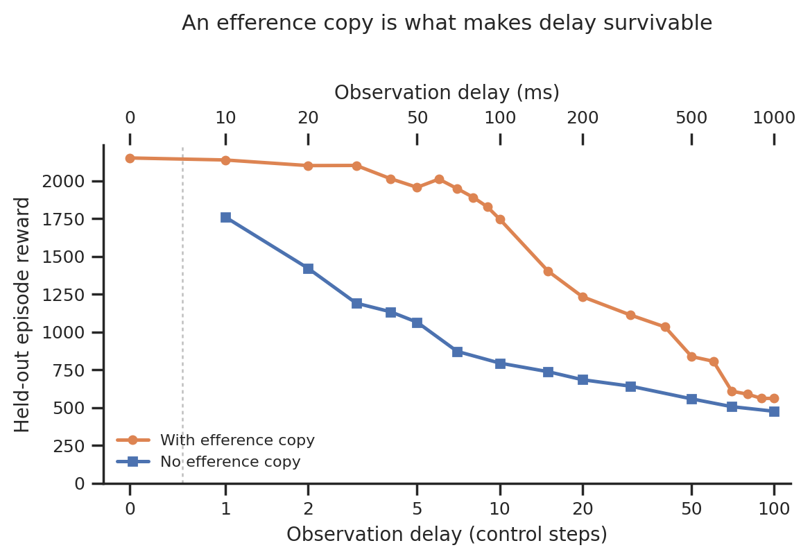

Without a copy of its own recent actions the policy loses **half its reward** through the
middle of the delay range: 794 vs 1746 at delay 10 (45 %), bottoming out at 45 % at delay
7 and still 55 % down at delay 20. The two curves converge again past delay 70, where
neither network is doing much.

> **Caveat, and the one real gap in this deck.** This is the **old** walker XML with
> `current_root` targets. It is the only cohort in the project that has a no-efference arm
> at all — nothing equivalent was ever trained on the going-forward configuration. Seven
> runs would move it (see *What would close the gaps*). The evals are the unhashed
> `legacy-batch` generation, which is the only one these runs hold; on the 22 with-efference
> runs that hold both, `legacy-batch` and the current v2 eval agree to **+0.09 % on average,
> ±1.4 % worst case** — inside the ~1 % eval nondeterminism floor.
>
> There is no delay-0 point on the blue line because at delay 0 the two conditions are the
> *same network* (`efference_length == delay_k == 0`).

**1b.** 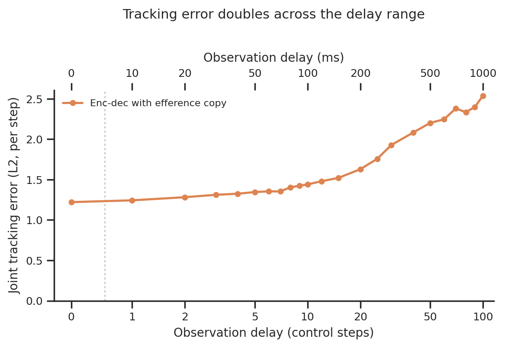
**1c.** 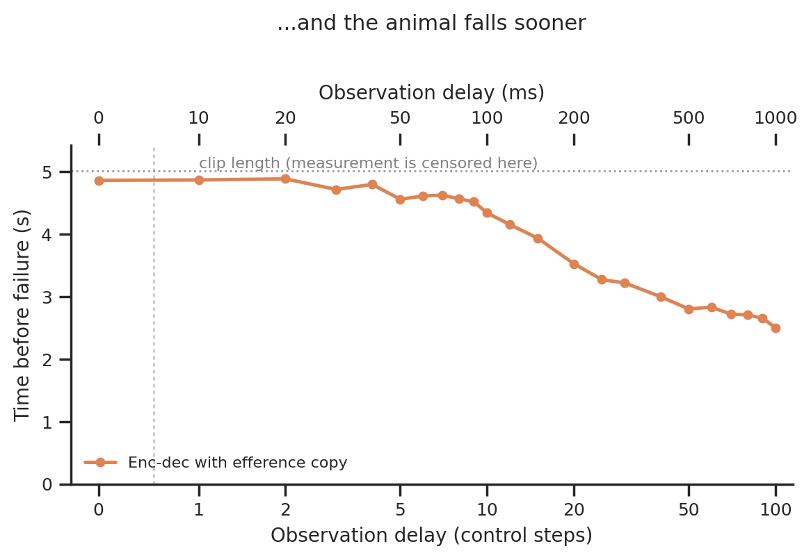

These two are the going-forward `encdec` cohort (new XML, `reference_root`) — one line,
with an efference copy, so nothing is being contrasted. Joint tracking error rises
**1.22 → 2.54** (2.1×) from delay 0 to 100, and mean time before failure falls **4.87 s →
2.51 s**, with survival to the end of the clip going 99 % → 14 %. The degradation is
gradual to ~delay 5 and then accelerates.

Two measurement notes worth knowing but not worth a slide: tracking error is computed only
over steps the animal is alive, so it is conditioned on not having fallen yet and
*understates* the damage at long delay; and lifetime is censored at the 5 s clip length,
which is why the curve saturates on the left rather than continuing to rise.

---

## Claim 2 — a forward model improves learning

**2.** 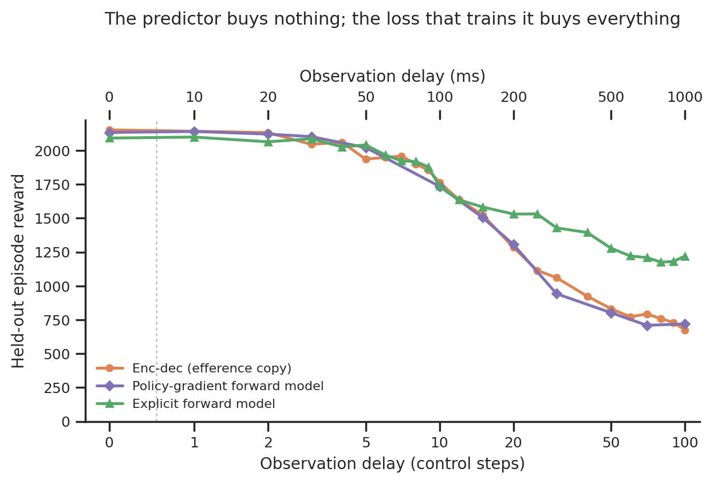

The three arms are identical up to delay ~12 and then split **two against one**: the
policy-gradient forward model tracks the plain enc-dec almost exactly all the way out
(1307 vs 1286 at delay 20; 802 vs 832 at delay 50; 719 vs 676 at delay 100), while the
explicitly trained one pulls away and stays there — **1531 at delay 20, 1279 at 50, 1221 at
100**, i.e. 1.5× the other two at delay 50 and 1.8× at 100.

The comparison is exact in the way that matters: the policy-gradient and explicit arms are
the *same network*, `RodentForwardModel`, differing only in `fm_loss_weight` (1 vs 0) and
`detach_prediction`. So the predictor sub-network by itself is worth nothing — what buys
the delay tolerance is the self-supervised loss that trains it.

> The `pgfm` sweep is 13 delays against the other arms' 23, and comes from a different
> commit (`25732c42` vs `ef060b73`); the diff between those two commits touches only
> `analysis/`, so the training code is identical.

---

## Claim 3 — the improvement is partly slower convergence

**3a.** 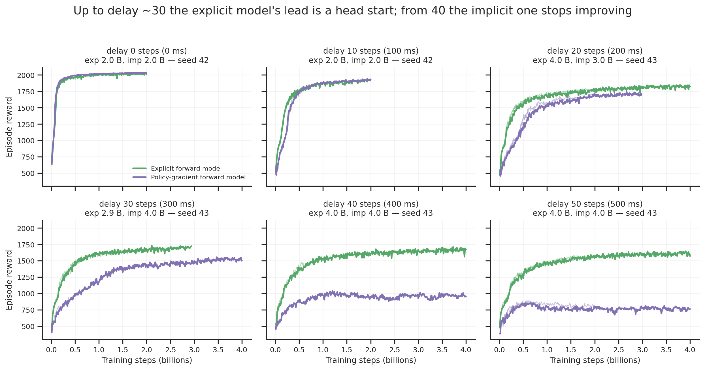

Read left to right along the top row and the gap is a **head start**, not a ceiling: at
delays 0 and 10 the two arms are indistinguishable at every point; at 20 and 30 the
explicit arm is ahead for the first ~1.5 B steps and the implicit one is still climbing
toward it at the end. Read the bottom-right two panels and it is not: at delay 40 the
implicit arm plateaus near 950 by ~1 B, and at delay 50 it *peaks around 0.8 B and then
declines*, which is the one cell where more training makes things worse.

Quantitatively, the explicit-minus-implicit gap as a fraction of the implicit arm:

| delay | 0 | 10 | 20 | 30 | 40 | 50 |
|---|---:|---:|---:|---:|---:|---:|
| at 600 M | −1 % | +1 % | **+18 %** | **+49 %** | — | **+55 %** |
| at the largest budget | −1 % | −0 % | +6 % | +12 % | +71 % | **+110 %** |

**3b.** 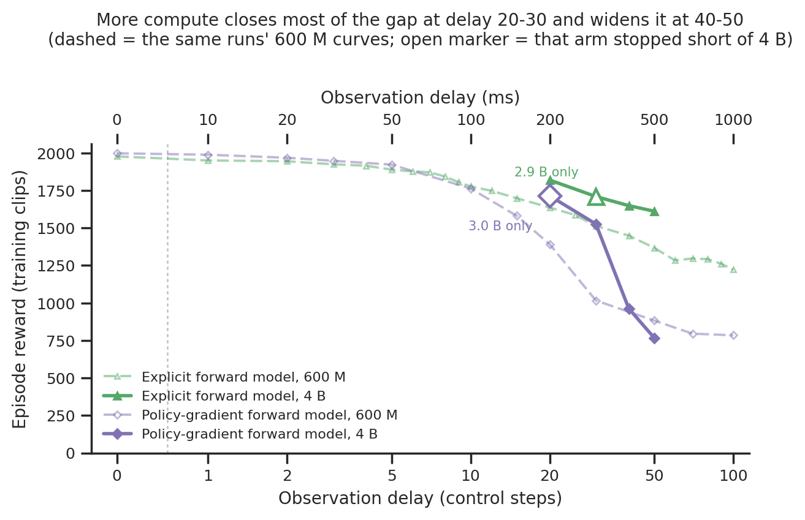

The same numbers as a delay sweep, with each arm's 600 M curve dashed behind it. Six times
the budget closes most of the delay-20/30 gap and **widens** the delay-40/50 one.

> **Two caveats sit on this pair of figures.**
> **(i) The 4 B runs are seed 43; everything else is seed 42.** They were launched as a
> second seed, not as a budget extension. `explicit-vs-implicit-fm-budgets/` measures the
> seed effect directly at matched budget and delay and finds it inside the ±2.9 % run-to-run
> floor, but a 600 M-to-4 B reading does cross a seed boundary.
> **(ii) The 4 B tier is ragged.** Delays 0 and 10 have nothing past 2 B, and two cells
> stopped early — explicit delay 30 at 2.9 B, implicit delay 20 at 3.0 B, drawn as open
> markers rather than interpolated. This is why the solid curves only span delays 20–50.
> Four runs would fix it (below).

---

## Claim 4 — forward models are sensitive to motor noise

The perturbation is Gaussian, added to the executed action **after** the network has acted
and **outside** `EfferenceCopy`, so the efference queue holds the *intended* action while
the body executes the perturbed one. That is unobserved motor noise: the predictor's input
is the command, its target is the consequence of the command plus noise, and the mismatch
is irreducible by construction. Both arms get a clean queue, so the comparison is symmetric.

> **On "is σ = 0.02 one percent?"** — Actions live in `[-1, 1]` after the tanh, so σ = 0.02
> is **1 % of the full actuator range** and 2 % of the half-range (the half-range is what
> maps to max force under torque actuators). Both readings are defensible; say "1 % of the
> full command range" and it is unambiguous.

**4a.** 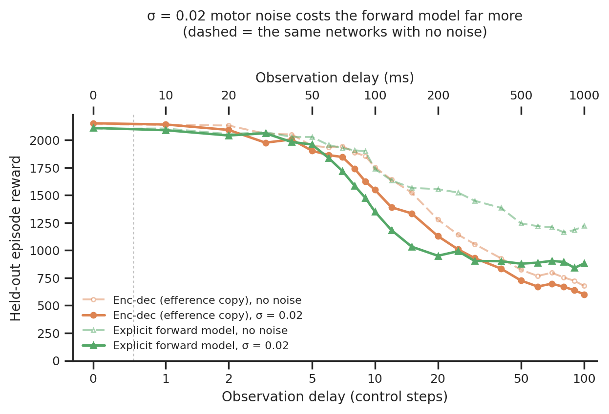

Dashed is the same networks with no noise. The forward model's advantage does not merely
shrink — at delays 7–30 the ranking **inverts**, e.g. 951 vs 1130 at delay 20. Past delay
40 it still wins, because its noise-free lead there is so large.

**4b.** 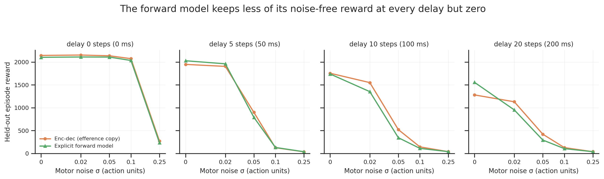

The fraction of its own noise-free reward each arm keeps at σ = 0.02:

| delay | 0 | 5 | 10 | 20 | 50 |
|---|---:|---:|---:|---:|---:|
| enc-dec | 1.00 | 0.98 | 0.88 | 0.88 | 0.88 |
| explicit FM | 1.00 | 0.97 | **0.78** | **0.61** | 0.71 |

At delay 0 the two are identical, which is the control: with no delay there is nothing to
predict, so there is no predictor to corrupt. The penalty appears exactly where the
mechanism says it should and scales with the delay the predictor has to bridge.

**4c.** 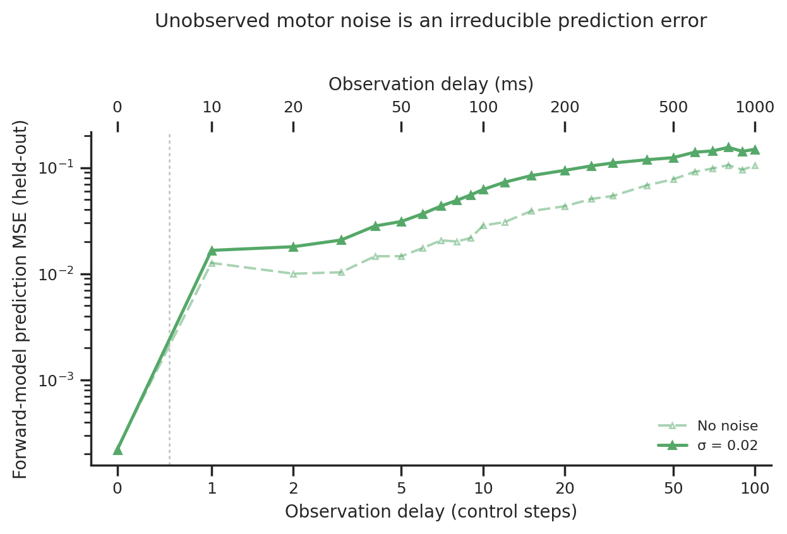

The mechanism itself. Noise raises the prediction MSE by **1.3–2.5×** at every delay above
zero (0.029 → 0.062 at delay 10, 0.043 → 0.094 at delay 20) and the two curves coincide
exactly at delay 0 — again, nothing to predict, nothing to corrupt.

> **This claim is explicit-FM vs enc-dec, not explicit vs implicit.** The noise sweep was
> only ever produced for those two cohorts at `min_std = 0.1`; the `pgfm` arm has no noise
> evals. 65 evals would add it (below), and would make figure 4c a two-line comparison.

---

## Claim 5 — the policy gradient does not learn a forward model

**5a.** 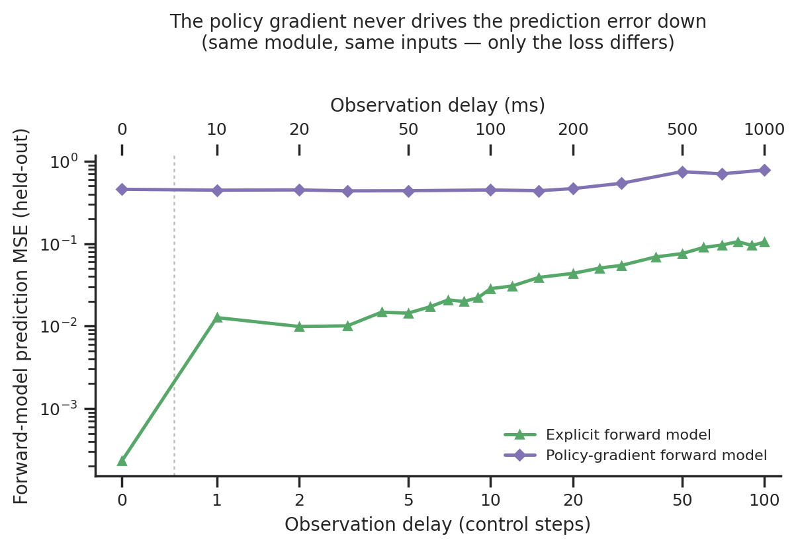

The explicit predictor's error tracks the difficulty of the problem it is given — 0.0002 at
delay 0 rising to 0.104 at delay 100, a **460× range**. The implicit one sits at
**0.44–0.78 regardless**, a 1.8× range, and is already 0.457 at delay 0, where the task is
to copy an input it is handed for free.

**5b.** 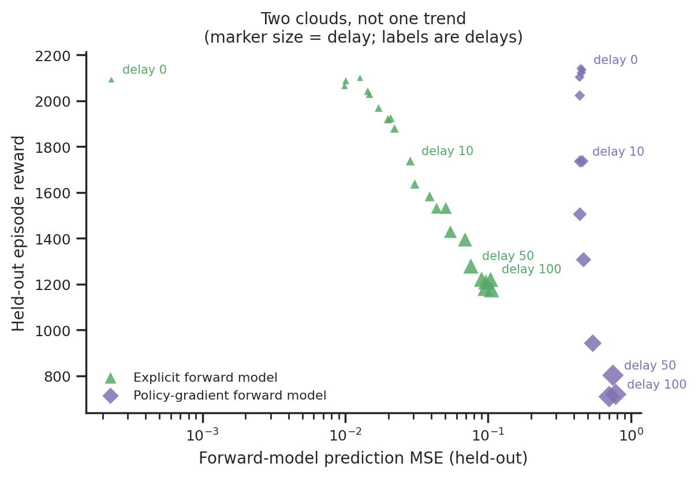

Two vertical clouds, not one trend. Within the explicit arm, prediction error and reward
are almost perfectly rank-correlated (Spearman ρ = −0.99, n = 23) — but that is largely
because both are driven by delay. The point of the figure is the horizontal separation:
the implicit arm reaches the *same reward* as the explicit one at short delay with a **16×
worse predictor**, so reward does not require the prediction until the delay is long.

**5c.** 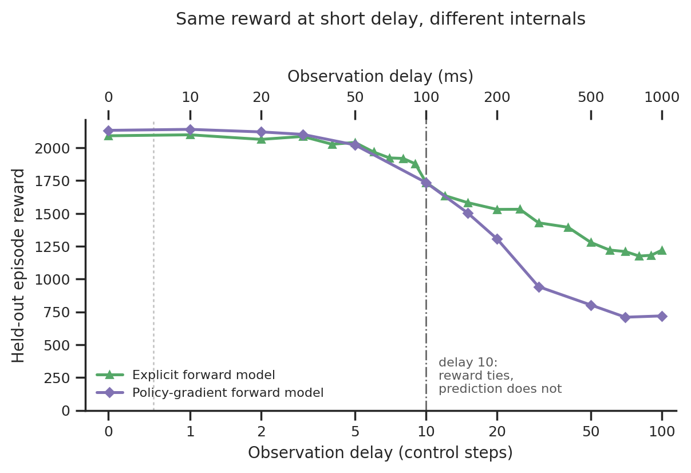

Which sets up the probe. At delay 10 the two arms tie in reward (1737 vs 1736) while their
predictors differ 16× in MSE. If the policy gradient were building a forward model of its
own, delay 10 is where it should be most visible.

**5d.** 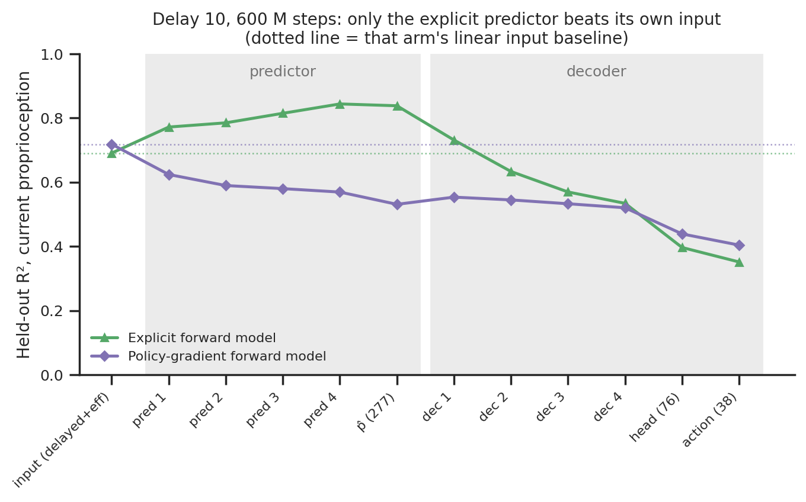

Ridge-decode the **current, un-delayed** proprioception from each layer, cross-validated by
clip, on held-out clips. The dotted line is *that arm's own linear input baseline* — stage 0,
what a linear readout of [delayed proprioception + efference copy] already achieves — so
the question is never "is R² high" but "does any layer beat its own inputs".

**The explicit predictor climbs above its baseline and peaks at p̂ (+0.147). The implicit
one starts below its baseline and stays there (−0.187).** Both then shed current-state
information through the decoder, which is expected: the decoder's job is torques, not state.

**5e.** 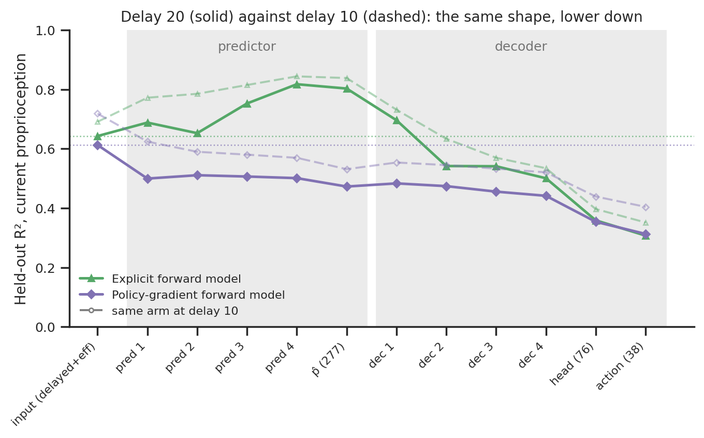
**5f.** 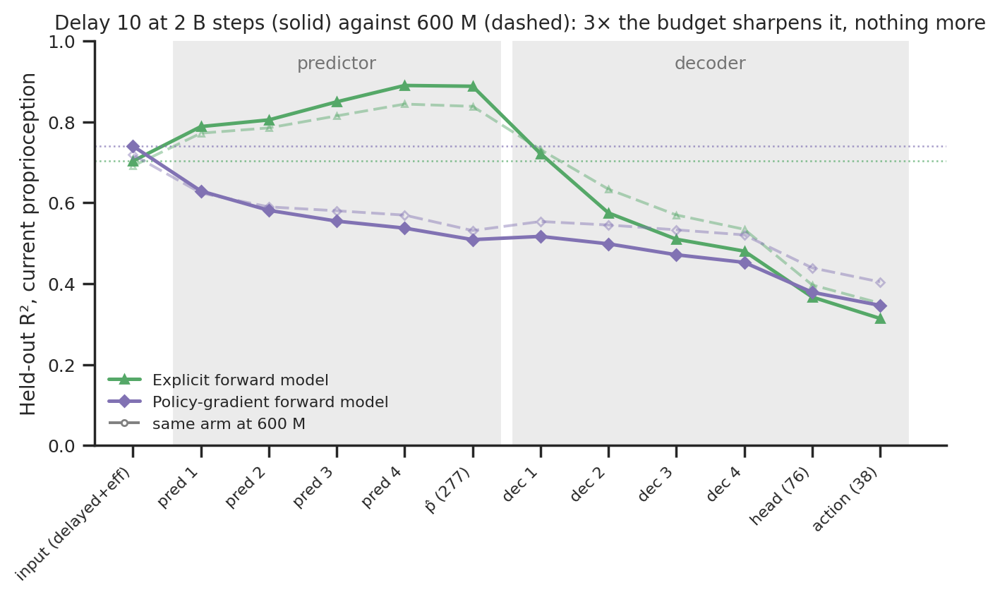

The shape is not an artefact of the delay or the budget. At delay 20 the margins are +0.160
and −0.140; at 2 B steps and delay 10 they are **+0.185 and −0.231** — more training
sharpens the difference rather than erasing it.

> 4 B has no activation recordings and, at delays 0–10, no runs at all, so the budget check
> tops out at 2 B. The 600 M and 2 B cohorts are separate runs, not one run at two
> checkpoints; `explicit-vs-implicit-fm-probe/` verifies they are the same training process
> by reading the 2 B runs' own curves at step 600 M (−2.5 % to +1.9 %, inside the ±2.9 %
> floor).

**5g.** 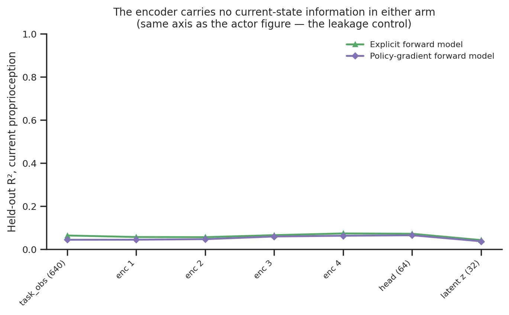

The leakage control, on the same 0–1 axis. Current proprioception decodes at R² 0.035–0.073
from every encoder stage in **both** arms — the encoder sees the imitation target, not the
body — so the high actor numbers are not the current pose arriving through the reference
target. Drawn at the same scale deliberately: the comparison should be visual, not
arithmetic.

**5h.** 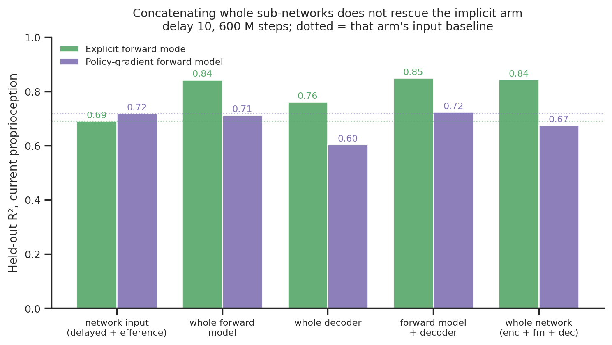

**The strongest version of the claim, and the one new measurement in this folder.** A
per-layer probe can only see what a single layer holds; a sub-network could in principle
distribute the state across several layers and be invisible to it. So concatenate whole
sub-networks into one design matrix (2 124 to 7 233 features) and ask again:

| group | features | explicit | implicit | implicit − its own input baseline |
|---|---:|---:|---:|---:|
| network input (delayed + efference) | 657 | 0.691 | 0.718 | — |
| whole forward model | 2 325 | **0.842** | 0.712 | **−0.006** |
| whole decoder | 2 124 | 0.761 | 0.604 | −0.114 |
| forward model + decoder | 4 449 | **0.849** | 0.724 | **+0.006** |
| whole network (enc + fm + dec) | 7 233 | 0.843 | 0.675 | −0.043 |

Concatenation *does* recover what the per-layer probe missed — the implicit predictor's
five layers together reach 0.712 where its p̂ alone reached 0.531, so the earlier layers do
carry the input forward. What it does not do is add anything: **the implicit arm never
exceeds a linear readout of its own raw inputs, by more than +0.006, anywhere in the
network.** The explicit arm exceeds it by +0.15.

Method notes: the critic is excluded (it is handed the current proprioception directly and
would decode the target from the target), as are the network's own delay buffer and the
pre-delay Normalizer output. The ridge λ grid is widened to 1e5 for these fits, because at
7 233 features the standard grid's top value 1e3 is a boundary optimum and would
under-regularise the wide groups relative to the narrow ones; every bar including the input
baseline uses the same grid. On the layers both tables share, wide and standard grids differ
by at most 0.004 R² (`checks.txt`).

---

## What would close the gaps

In rough order of how much each buys the talk.

**1. A no-efference sweep on the going-forward configuration — 7 runs, 600 M each.**
Claim 1 is the opening slide and it is the one figure still on the old body. Delays
{1, 2, 5, 10, 20, 50, 100}, `efference_length = 0`, new XML, `reference_root`, torque,
seed 42, otherwise the `encdec` config. Then all three claim-1 panels come from one cohort
on the current body, and the deck has no old-XML figure in it at all.

**2. Noise evals for the implicit arm — 65 eval artifacts, no training.**
Turns claim 4 from "forward model vs enc-dec" into the three-way contrast, and makes the
prediction-MSE panel a comparison rather than a single line:

```
python -m vnl_experiments.artifacts plan --kind eval \
    --runs analysis/aug-2026-labmeeting-summary/runs.csv --set action_noise=0.02
# ... and for 0.0, 0.05, 0.1, 0.25; 13 pgfm runs x 5 sigmas
```

**3. Delay 0 and 10 at 4 B — 4 runs.** Both arms, seed 43 to match the existing 4 B batch.
Makes the claim-3 delay sweep span 0–50 instead of 20–50, and closes the top row of the
six-panel figure. Optionally also resume the two stalled cells (explicit delay 30 at 2.9 B,
implicit delay 20 at 3.0 B) so every point on that curve is a real 4 B point.

**4. Activation recordings for the `encdec` arm — 4 recordings.** Delays 0/10/20/50 of the
23 existing 600 M runs. This is the control the probe figures cannot currently show: does an
architecture with *no predictor at all* build one anyway? It would let figure 5h carry three
bars per group instead of two, and it is the follow-up
`explicit-vs-implicit-fm-probe/report.md` already asks for.

**5. A second seed at delays 20 and 50.** Every cell carrying a reward claim in claims 2, 3
and 5 is a single seed. The in-cohort noise estimate we do have — the duplicated
implicit/600 M/delay-10 pair — is 1.1 % in reward and 0.0035 in R², and the effects above are
far larger than that, but "far larger than a one-pair estimate" is what it is.

**Not worth doing for this talk:** re-producing everything at eval `VERSION = 3`. Nothing in
the store is v3 yet, this folder is internally consistent at v2, and the v2→v3 change is a
~5e-4 shift in actions from restoring `latent_min_std` at eval time.

---

## Suggested slide order

1. **1a** efference or nothing → **1b/1c** what delay actually does to the animal.
2. **2** three architectures — the predictor is free, the loss is not.
3. **3a** six learning curves → **3b** the delay sweep at 4 B. ("...but a lot of it is just
   convergence — except at long delay, where it isn't.")
4. **4a** noise inverts the ranking → **4b** the σ sweep → **4c** why (prediction error).
5. **5a** prediction error → **5b** two clouds → **5c** reward ties at delay 10 → **5d**
   the probe → **5e/5f/5h** it survives delay, budget, and concatenating the whole
   network → **5g** the encoder control, if there is time.

---

*Sources:* [`proprioceptive-delay-efference/`](../proprioceptive-delay-efference/),
[`explicit-forward-model/`](../explicit-forward-model/),
[`forward-loss-vs-architecture/`](../forward-loss-vs-architecture/),
[`explicit-vs-implicit-fm-2g/`](../explicit-vs-implicit-fm-2g/),
[`explicit-vs-implicit-fm-budgets/`](../explicit-vs-implicit-fm-budgets/),
[`action-noise-robustness/`](../action-noise-robustness/),
[`explicit-vs-implicit-fm-probe/`](../explicit-vs-implicit-fm-probe/).
