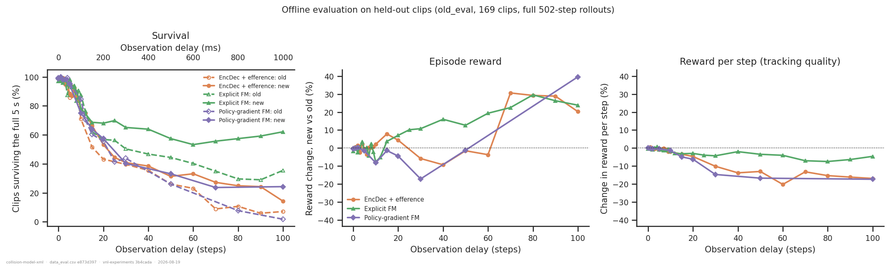
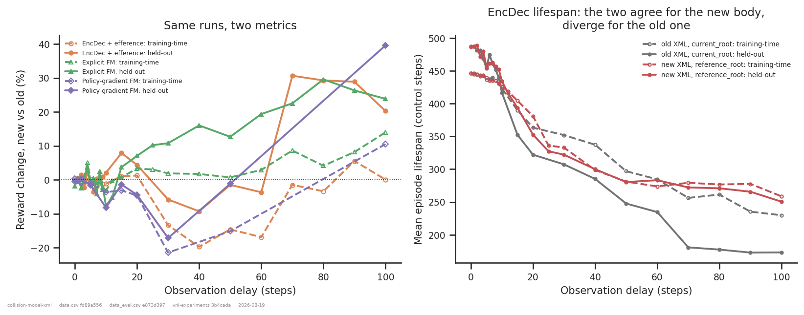
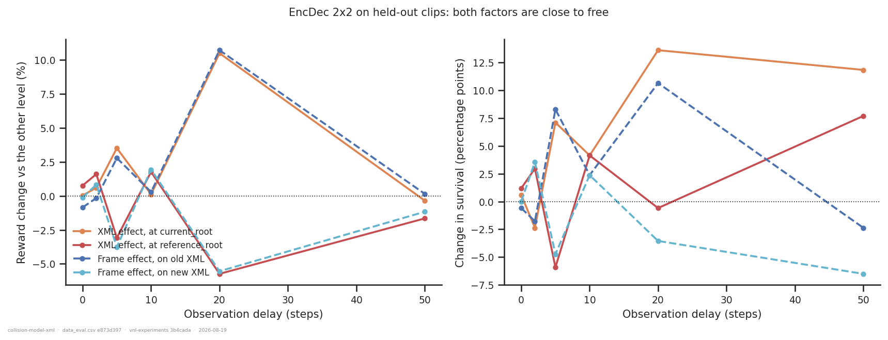
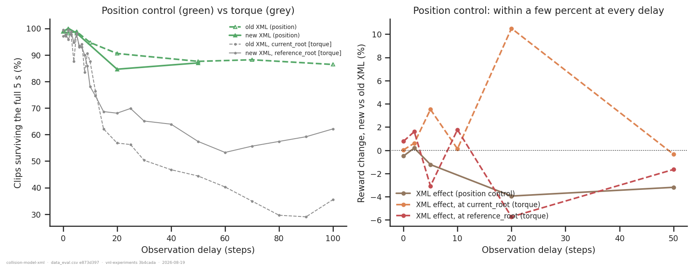
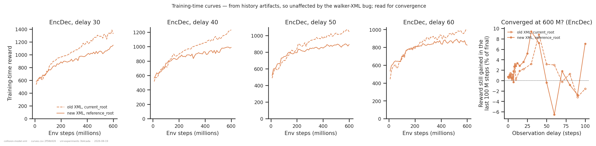
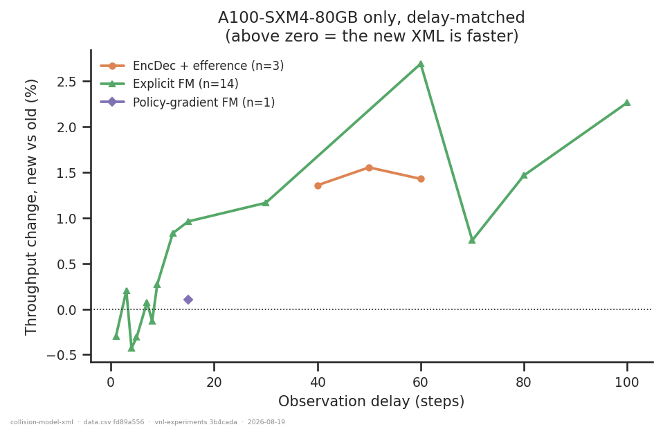

# New walker XML + reference_root vs the old baseline

> ## ⚠ Retraction, 2026-08-19
>
> **The 2026-08-15 version of this report was wrong, and wrong in the direction opposite to
> what it claimed.** Its headline — *"the new body falls over far more often; survival
> collapses; that is the entire effect"* — was an artefact of a bug in the offline
> evaluation, not a property of the walker.
>
> Until the 2026-08-18 fix, every offline path that rebuilt an env from a checkpoint
> overwrote the run's `walker_xml_path` with the local default `rodent.xml`. So **every
> new-XML policy in this report was evaluated driving a body it had never been trained on**,
> and the mismatch cost it more the harder the control problem — which is to say, more with
> delay. The v1 evals understated new-XML held-out reward by:
>
> | delay | 0 | 1–5 | 6–10 | 12–20 | 25–40 | 50–70 | 90–100 |
> |---|---:|---:|---:|---:|---:|---:|---:|
> | mean understatement | 3.8 % | 5.3 % | 14.1 % | 31.7 % | 52.4 % | 72.5 % | 77.2 % |
>
> (51 new-XML runs holding both generations. The 79 old-XML runs are **bit-identical**
> across the fix — their stored XML basename already equalled the local default, so the fix
> is a provable no-op there, and their v2 files are the same bytes adopted by hardlink. The
> bug therefore acted on exactly one arm of every contrast in this folder.)
>
> **What reverses.** Corrected survival on held-out clips, old → new:
>
> | delay | EncDec (was) | EncDec (is) | explicit FM (was) | explicit FM (is) | PG-FM (was) | PG-FM (is) |
> |---:|---|---|---|---|---|---|
> | 0 | 99→96 % | 99→99 % | 99→93 % | 99→97 % | 99→91 % | 99→99 % |
> | 20 | 43→30 % | 43→53 % | 57→41 % | 57→68 % | — | 56→57 % |
> | 50 | 26→6 % | 26→31 % | 44→12 % | 44→57 % | 26→4 % | 26→33 % |
> | 100 | 7→0 % | 7→14 % | 36→17 % | 36→62 % | 2→2 % | 2→24 % |
>
> The new body does not fall over more. At delays ≥ 20 it survives *better*, and at delay
> 100 dramatically so.
>
> **What this reinstates.** The 2026-08-15 revision retracted three conclusions from the
> earlier training-time analysis. All three were right and are reinstated: *the new XML is
> free out to delay 20*, *the explicit forward model is essentially immune*, and *position
> control is unaffected*. The note that replaced them — "training-time reward is biased in
> favour of the new body, overstating its lifespan by up to 2.3×" — described the bug, not
> the metric. Corrected, the offline `train` eval and the training curve agree to a few
> percent (EncDec at delays 30/40/50: −12.7/−15.9/−14.2 % offline vs −13.4/−19.7/−14.6 %
> on the curve).
>
> **Why the report's own body check did not catch it.** It said *"every eval was verified to
> have used the run's own body and frame"*. That check compared the run's **stored config**
> against itself; it never saw what the eval process actually loaded. The v2 artifacts now
> stamp `resolved.walker_xml_path` with the body the eval really simulated, and
> `extract.py::assert_artifact_body` refuses any artifact whose stamp is missing or
> disagrees with the run. Verifying provenance against the same record that was already
> trusted is not verification — that is the transferable lesson here.
>
> **Status of the numbers below: complete.** Everything is rebuilt on the post-fix spec
> `eval3ds-347333e3` at **149/149** coverage — every run, every condition. `artifacts
> audit-env` reports zero broken artifacts across `eval`, `activations` and `video`, so the
> 2026-08-18 repair is finished and nothing here is provisional.

## Question

The configuration going forward is **new (almost-full-collision) XML + `reference_root`
target frame + torque actuators**. How does it compare with the old baseline it replaces
(**old sparse-collision XML + `current_root` + torque**), across observation delays? That
contrast moves two things at once — can the walker XML and the target frame be told apart?
And is position control different?

## Dataset & comparability

**Source:** WandB `emiwar-team/nnx-ppo-rodent-delays`, tag `TrainEvalSplit`, selected by
the `CONDITIONS` in `extract.py` and frozen in `runs.csv` (149 runs).

| condition | n | XML | control | frame | network | delays | commit |
|---|---|---|---|---|---|---|---|
| `encdec_old_current` | 22 | old | torque | current | EncDec | 0–100 | `1cd5838f` |
| `encdec_old_reference` | 6 | old | torque | reference | EncDec | 0–50 | `909e774d` |
| `encdec_new_current` | 6 | new | torque | current | EncDec | 0–50 | `201d6e11` |
| `encdec_new_reference` | 23 | new | torque | reference | EncDec | 0–100 | `ef060b73` |
| `expfm_old_current` | 23 | old | torque | current | explicit FM | 0–100 | `54643764` |
| `expfm_old_reference` | 6 | old | torque | reference | explicit FM | 0–50 | `909e774d` |
| `expfm_new_reference` | 23 | new | torque | reference | explicit FM | 0–100 | `ef060b73` |
| `pgfm_old_current` | 14 | old | torque | current | PG-FM | 0–100 | `d33e5bcf`, `d4bd4dc0` |
| `pgfm_new_reference` | 13 | new | torque | reference | PG-FM | 0–100 | `25732c42` |
| `expfm_old_position` | 8 | old | position | current | explicit FM | 0–100 | `891cd0d3` |
| `expfm_new_position` | 5 | new | position | current | explicit FM | 0–50 | `201d6e11` |

The primary contrast is measured in **three independent networks**, with full 0–100 delay
sweeps on both sides for EncDec and the explicit FM. The four EncDec cells form a complete
**2 × 2** in XML × frame.

**Primary evidence is the offline evaluation**: the held-out `old_eval` split (169 unseen
clips, full 502-step rollouts from frame 0), batch spec **`eval3ds-347333e3`** (post-fix,
`EvalProducer.VERSION = 2`), **149/149 runs — every condition complete**. `data_eval.csv`
carries the body stamp per row: 79 old-XML runs read `rodent.xml`, 70 new-XML ones read
`rodent_no_tail_collisions.xml`, no exceptions.

The last two runs to land (`th9oxbti` at delay 5, `via4qt5i` at delay 30) had never held an
eval of *any* spec, so they were absent from the walker-XML re-production lists and needed
producing from scratch rather than repairing.

The training curve (`data.csv`, from `history` artifacts) is unaffected by the bug and is
byte-identical to the pre-fix version; it is quoted below as an independent measurement
rather than as the primary one.

**Included despite `state = failed`:** the 46 runs at `ef060b73` (2026-08-11) that make up
`encdec_new_reference` and `expfm_new_reference` died in the *post-training* evaluation.
All reached `summary._step = 600_064_000`, ran a normal 3.5–7.5 h, and have no
`final_eval/*` keys. The inclusion rule is `state ∈ {finished, failed}` **and**
`_step == EXPECTED_STEP`; a run that died during training cannot satisfy the second.

**Excluded by design** (`min_std == 0.1`, `_step == 600_064_000`): the larger-`min_std`
(0.25) and 2 G-step new-XML runs, per request. Also seeds 43/44, non-standard
architectures, `efference_length != delay_k`, and the `fm_loss_weight = 0` **detached**
control.

**Comparability.** Every invariant is single-valued within each condition except
`git_commit` in `pgfm_old_current`. Manual checks: configs read from the index, not tags;
`min_std` / `latent_min_std` / `std_scale` verified (this is what separates in-scope from
out-of-scope new runs and is invisible in a run's name); the `d4bd4dc0`→`d33e5bcf` diff is
additive-only; the `d33e5bcf`→`25732c42` network diff is a default-inert `latent_key`
signature change; and across every primary pair all network, PPO and env invariants are
identical, which is stronger evidence than reading a six-week diff.

**Every eval is verified to have simulated the run's own body**, from the artifact's
`resolved.walker_xml_path` stamp — what the eval process actually loaded, not what the run's
config said it should. `data_eval.csv` carries the stamp per row: `rodent.xml` on every
old-XML condition, `rodent_no_tail_collisions.xml` on every new-XML one, with no exceptions.
The previous version of this check compared the run config against itself and passed while
the evals were on the wrong body; see the retraction.

**Caveats.**

1. **Single seed per cell** (all seed 42). What carries weight is that the shape
   replicates across three networks, not any single point.
2. **Not commit-controlled**: six to eight weeks separate the arms of each primary pair.
3. `encdec_new_current` and `expfm_new_position` reach only delay 50, limiting the 2 × 2
   and the position contrast to delays ≤ 50.
4. Offline eval is not bit-reproducible (~1 % on reward; `survived` moves by ~0.6 pp per
   clip at 169 clips). Differences below a few percent mean nothing.

## Primary result — a mild tracking cost, more than repaid in stability at long delay

The effect splits cleanly into two components that pull in **opposite** directions:

- **Per-step tracking is genuinely worse on the new body at long delay**, and this is the
  real cost. Reward per step is flat (±1 %) out to delay ~10, then falls: at delay 50,
  −13.0 % (EncDec), −16.7 % (PG-FM), **−3.5 % (explicit FM)**.
- **Survival is *better* on the new body**, and increasingly so with delay: +5 to +13 pp at
  delay 50 and +7 to +27 pp at delay 100.

Episode reward multiplies the two, so it is close to neutral at short delay and its sign at
long delay depends on which component wins in that network:

| delay | EncDec | explicit FM | PG-FM |
|---:|---:|---:|---:|
| 0 | −0.1 % | −1.8 % | −0.5 % |
| 5 | −0.4 % | −1.1 % | −1.5 % |
| 10 | +2.1 % | −7.7 % | −8.2 % |
| 20 | +4.4 % | +7.0 % | −4.4 % |
| 30 | −5.8 % | +10.8 % | **−17.2 %** |
| 40 | −9.3 % | +16.0 % | — |
| 50 | −1.5 % | +12.7 % | −1.2 % |
| 60 | −3.7 % | +19.3 % | — |
| 80 | +29.3 % | +29.6 % | — |
| 100 | +20.2 % | +23.8 % | +39.6 % |

**The explicit forward model is essentially immune, and past delay 20 the new body is simply
better for it.** Its per-step cost stays small (−2 to −7.5 %, against −10 to −20 % for the
other two), so the survival gain is never cancelled: held-out reward is positive at **every
one of the nine delays ≥ 20**, rising from +7.0 % to +23.8 %. This is the condition whose
sweep is complete, so that run of nine same-signed cells is the strongest single claim in the
report. The explicit FM is also the best architecture on both bodies, and its lead *widens* on
the new one (57 % vs 33 % survival at delay 50; 62 % vs 14–24 % at delay 100).

`xml-ceiling-vs-convergence` measures the same explicit-FM pair independently and lands on
**+12.7 % at delay 50**, identical to the value above — the two folders pin the same
tranches, so this is a consistency check on the rebuild rather than a second sample.

**Where a real cost does show:** there is a genuine deficit band in the two networks without
an explicit predictor, centred on delay 30. The PG-FM's worst cell is **−17.2 % at delay 30**
and EncDec's is −9.3 % at delay 40; both track 10–17 % worse per step from delay 30 up. Even
there the cost does not persist — EncDec is back to +29 % by delay 80, because survival keeps
improving while per-step tracking stops getting worse. Whatever the extra contact geometry
costs, the explicit predictor absorbs it and the other two networks do not.

That delay-30 PG-FM cell is worth flagging: it was the last artifact to arrive, and it lands
where the *original* training-time analysis put the worst point of the band (−21.5 % on the
curve). So the deficit band that motivated
[`xml-ceiling-vs-convergence/`](../xml-ceiling-vs-convergence/) is real and held-out-confirmed
— it is just narrower, shallower, and confined to the two networks lacking an explicit
predictor, rather than the −20 to −50 % everywhere that the pre-fix evals showed.

Read the delay-80/90/100 cells with the caveat that both bodies are near the survival floor
there (7–14 % for EncDec, 2–24 % for the PG-FM), so a large *percentage* gain is a small
absolute one.

## The training curve and the offline eval now agree

This section previously argued that training-time reward was *biased in favour of the new
body*, overstating its lifespan by up to 2.3×. That factor was the bug: the offline number
was depressed, not the training-time one inflated.

Corrected, the two agree. Comparing the offline **`train`** evaluation (673 clips the
policies trained on — so clip novelty is held fixed and only rollout structure differs)
against the training curve:

| network | delay | offline `train` | training curve |
|---|---:|---:|---:|
| EncDec | 30 | −12.7 % | −13.4 % |
| EncDec | 40 | −15.9 % | −19.7 % |
| EncDec | 50 | −14.2 % | −14.6 % |
| EncDec | 60 | −8.8 % | −16.9 % |
| explicit FM | 50 | +7.2 % | +0.7 % |
| explicit FM | 100 | +14.9 % | +14.0 % |
| PG-FM | 50 | −13.4 % | −15.2 % |

Two measurements with different episode structure, on the same clips, agreeing to a few
percent. The remaining spread between the offline `train` and `old_eval` columns is a
**generalization** effect, not a rollout-length one, and it is asymmetric. Held-out reward as
a fraction of training-clip reward, by delay band:

| delay band | old XML | new XML |
|---|---:|---:|
| 0–10 | 0.978 (n=40) | 0.976 (n=26) |
| 12–30 | 0.892 (n=16) | 0.917 (n=12) |
| 40–100 | **0.851** (n=22) | **0.923** (n=18) |

Identical at short delay, then the old body's gap opens to twice the new body's by delay 40+.
`xml-ceiling-vs-convergence` finds the same pattern in its own cohort. That is why held-out
numbers are consistently a little kinder to the new body than the training curve, and it is
worth a question of its own — with one seed per cell it is an observation, not a result.

## Decomposition — XML or frame?

| delay | XML at `current_root` | XML at `reference_root` | Frame on old XML | Frame on new XML |
|---:|---:|---:|---:|---:|
| 0 | +0.0 % | +0.8 % | −0.6 % | — |
| 2 | +0.6 % | — | −0.2 % | — |
| 5 | +3.5 % | −3.1 % | +2.8 % | −3.8 % |
| 10 | +0.1 % | — | +0.3 % | — |
| 20 | +10.5 % | −5.7 % | +10.7 % | −5.5 % |
| 50 | −0.3 % | −1.7 % | +0.2 % | −1.2 % |

**The XML is close to free in this decomposition** — every cell is within ±10.5 % with no
trend in delay, where the pre-fix table read −2 % to −48 % and got monotonically worse. The
XML-alone contrast is where the earlier "the XML carries the entire effect" claim came from,
and it does not survive.

**The frame remains free**, as it has in every version of this analysis: no trend, no
consistent sign, `frame_expfm` spanning −5.2 % to +2.4 % in a second network. This is the
one conclusion the bug never touched, because both its arms are old-XML runs and therefore
bit-identical across the fix.

Read the two ±5–10 % excursions at delay 20 with care: the `encdec_old_current` delay-20 run
is the shared baseline of both the `+10.5 %` and the `+10.7 %` cells, so those are one run's
worth of evidence appearing twice, not two independent findings.

## Position control

**Position control is essentially unaffected**, which reinstates the original training-time
conclusion. On held-out clips the XML costs it −0.5 % at delay 0, −1.2 % at delay 5, −3.9 %
at delay 20 and −3.2 % at delay 50 — flat, small, and inside the few-percent
irreproducibility of the offline eval. The pre-fix version of this section reported −4.8 %,
−10.1 % and −14.5 % and concluded that "free" had been an artefact of the training-clip
metric; it was the other way round.

Position control remains the *least* affected mode, but with the torque numbers now also
near zero at these delays that is no longer a meaningful contrast. What the position cohort
cannot say is anything about long delay: it stops at delay 50.

## Convergence

These come from `history` artifacts and are untouched by the walker-XML bug. At delay 30
the new arm is still climbing hard at 600 M (gaining 9.4 % of its final reward in the last
100 M steps, against 3.2 % for the baseline); at delays 50 and 60 it has flattened or
turned down (−0.4 %, −6.5 %) while the baseline still gains ~3 %.

This is answered directly in [`xml-ceiling-vs-convergence/`](../xml-ceiling-vs-convergence/),
which trained the going-forward configuration to 2 G steps: at delays 0–20 the 600 M deficit
is entirely convergence speed and closes, and at delay 50 it closes in the explicit FM but
becomes a genuine ceiling in the PG-FM, whose predictor degrades late in training.

## Speed

Unchanged and settled: 18 A100-matched, delay-matched pairs, all between −0.4 % and
+2.7 %; median ratios 1.005 (explicit FM, n = 14) and 1.014 (EncDec, n = 3). The new XML
is not slower.

## Bottom line

*At full 149/149 eval coverage on the post-fix spec.*

- **`reference_root` is free.** Confirmed on held-out data, at both XML levels, in two
  networks, with no interaction. Adopt it. (Untouched by the bug: both arms are old-XML.)
- **No speed penalty.** Settled, and never in question — throughput comes from `history`.
- **The new XML is close to free at delays ≤ 20 and better at long delay.** The one real cost
  is per-step tracking beyond delay ~40 in EncDec and the PG-FM (−13 to −20 %), and it is
  outweighed by better survival, so held-out episode reward is positive at delay 100 in all
  three networks (+20 to +40 %).
- **The explicit forward model is essentially immune**, and its advantage over the other two
  networks is *larger* on the new body — 57 % vs 33 % survival at delay 50, 62 % vs 14–24 %
  at delay 100. If the going-forward setup keeps the explicit FM, the new collision model
  costs nothing measurable here.
- **Position control is unaffected** out to delay 50, the range it covers.
- **Training-time reward is a usable proxy for this change after all.** It agrees with the
  offline `train` eval to a few percent. It is, if anything, mildly *pessimistic* about the
  new body, because the old body generalises worse off its training clips at long delay.

## Follow-ups

- ~~**Finish the eval sweep.**~~ Complete at 149/149 as of 2026-08-19; `audit-env` reports
  zero broken artifacts. The delay-30 PG-FM cell that arrived last turned out to be the
  deepest point of the whole deficit band, so it was worth waiting for.
- **The asymmetric generalization gap deserves its own question.** Held-out/train reward is
  0.851 for old-XML runs at delays 40–100 against 0.923 for new-XML ones, and identical at
  short delay. If the extra contact geometry really does suppress clip-specific solutions
  that is a point in the new body's favour that neither this folder nor
  `xml-ceiling-vs-convergence` was designed to test. Needs no new runs — the cohort is here.
- **Where does the per-step tracking cost come from?** It is the one surviving cost, it is
  ~4× larger in EncDec and the PG-FM than in the explicit FM, and it only appears past delay
  ~40. `env/joint_l2_error` is already logged, so this is analysis-only.
- **Look at terminations anyway.** The eval records carry per-reason `termination_rate`
  (`root_too_far`, `root_too_rotated`, `pose_error`). The story has changed — the new body
  survives *better* — so the question is now which failure mode it avoids.
- **Watch the rendered rollouts**, but re-render first: the existing videos were produced on
  the wrong body by the same bug, and `todo_video.txt` covers them.
- **Multiple seeds**, still n = 1 per cell everywhere. Several claims above rest on a single
  run at a single delay.
- **A new-XML `current_root` cell for the explicit FM and PG-FM**, to confirm the
  no-interaction result outside EncDec.

---

*Reproduce:* `../.venv/bin/python analysis/collision-model-xml/extract.py && ../.venv/bin/python analysis/collision-model-xml/plot.py`
(add `--sync --refresh` to pull in runs added since `runs.csv` was frozen).
