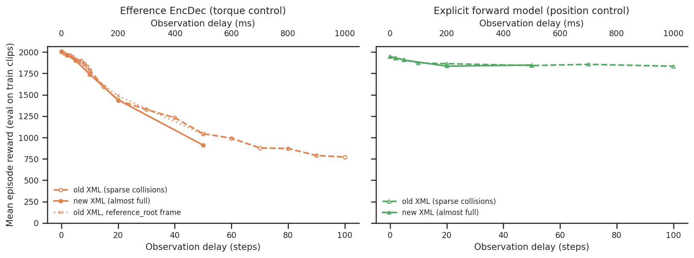
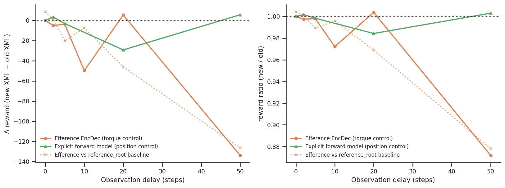
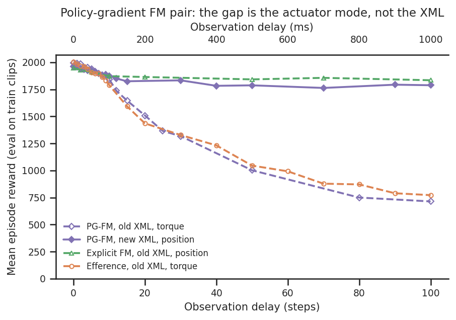

# New (almost-full-collision) vs old (sparse-collision) rodent walker XML

## Question
A cohort of runs was trained with `env_params.walker_xml_path` switched from
`rodent.xml` (**old**: only 16 of 100 geoms collide — hands, feet, fingers, toes) to
`rodent_no_tail_collisions.xml` (**new**: 70 of 100 collide — everything except the 30
tail vertebrae; `rodent_full_collisions.xml` would be 100/100). Five questions:

1. How does the new XML perform relative to the old one?
2. Is the difference the same across conditions/networks, or is it larger somewhere?
3. What role does `body_target_frame` play — the new runs were intended to use
   `reference_root`?
4. Does convergence speed change?
5. How much slower is the new model (careful: runs sat on different GPUs)?

## Dataset & comparability
Source: WandB `emiwar-team/nnx-ppo-rodent-delays`, tag `TrainEvalSplit`. Every included
run: `env == AbsoluteImitation`, seed 42, standard architecture (enc `[512]×4`, dec
`[512]×4`, critic `[1024,1024]`, `latent_size=32`, `kl_weight=0.001`),
efference-matched (`efference_length == delay_k`), finished at
`actual_step = 600,064,000`, train clip 250 frames, `ctrl_dt = 0.01`, newton solver,
warp, `njmax=256`, `naconmax=131072`, `rescale_factor=0.9`. Selection is in
[extract.py](extract.py); the invariants are verified in
[comparability.txt](comparability.txt).

The XML is compared **inside matched cells**, so each primary pair differs only in the
XML (plus the code commit, checked by hand below):

| condition | XML | control | network | delays | commit |
|---|---|---|---|---|---|
| `old_efference` | old | torque | efference EncDec | 0…100 | `1cd5838f` (canonical eff sweep, 2026-06-11) |
| `old_efference_refroot` | old | torque | efference EncDec | 0,2,5,10,20,50 | `909e774d` (2026-07-06, `reference_root`) |
| `new_efference` | new | torque | efference EncDec | 0,2,5,10,20,50 | `201d6e11` (2026-07-09) |
| `old_forward_model` | old | **position** | explicit FM (`fm_loss_weight=1`, detached) | 0,2,5,10,20,50,70,100 | `891cd0d3` (2026-07-06) |
| `new_forward_model` | new | **position** | explicit FM (`fm_loss_weight=1`, detached) | 0,2,5,20,50 | `201d6e11` (2026-07-09) |
| `old_pg_forward_model` | old | torque | PG-FM (`fm_loss_weight=0`, no detach) | 0…100 | `d4bd4dc0`/`d33e5bcf` |
| `new_pg_forward_model` | new | **position** | PG-FM (`fm_loss_weight=0`, no detach) | 0…100 | `0560d402` (2026-07-19) |

- **Two clean pairs, one confounded one.** `*_efference` (torque) and `*_forward_model`
  (position) each hold network *and* actuator mode fixed across the XML switch. The
  `*_pg_forward_model` pair does **not**: the old-XML PG-FM runs are torque and the
  new-XML ones are position, so that pair is doubly confounded and is reported
  separately, never as evidence about the XML.
- **Why `old_efference_refroot` is the primary efference baseline.** The canonical
  `1cd5838f` sweep predates two changes that the new cohort has: the **nnx-ppo 0.3.0-dev
  pin** (`pyproject.toml` at `1cd5838f` has no pin; every later commit does) and the
  **logging-api rename** `episode_reward/mean` → `eval/episode_reward/mean`. The
  `909e774d` cohort is 3 days before the new cohort, post-pin, post-rename, and differs
  only in the frame — which the [reference-root-frame](../reference-root-frame/)
  analysis showed is worth ≲1 % here. Both baselines are plotted; they agree
  (see the figures), which is itself the check that neither the nnx-ppo update nor the
  key rename is driving anything.
- **Commit diffs are training-inert.** `0560d402` and `201d6e11` have an **identical**
  `vnl_experiments/` tree. `891cd0d3`/`909e774d` → `201d6e11` touches only
  `forward_model.py` (adds `latent_key: str | None`, default unchanged `"task_obs"`,
  plus docs), `train_delays.py` (the **dm_control** script, not used here),
  `make_delayed_networks.py` (new file) and `eval_runs.txt`. `1cd5838f` → `201d6e11`
  additionally touches `efference_copy.py` (adds `inject_key=None`, which reproduces the
  original path exactly) and `train_rodent_delays.py` (the frame fix + a print-key
  rename); everything else in that diff is eval/analysis/video tooling. `d4bd4dc0` →
  `d33e5bcf` only adds metrics.
- **The env code itself did not move.** `vnl-playground` has had no commit since
  2026-06-02 (and the last ones touch only the *modular* rodent), so across the whole
  2026-06-11 → 2026-07-19 window the env, reward, termination and both XML files are
  byte-identical. The XML switch really is a one-line `walker_xml_path` change.
- **Metric.** End-of-training **eval-on-train-clips** episode reward (the training
  script sets `eval_env = train_env`); `extract.py` coalesces the old and new logging
  keys. The reward function, termination criteria and clip set are identical across
  XMLs, so the number is directly comparable — with the honest caveat that the two XMLs
  are *different tasks* (self-collision is possible in the new one), so this measures
  "how well is each task solved", not a pure algorithmic comparison.
- **Files beyond the standard layout.** [curves.csv](curves.csv) holds every run's eval
  series (~61 points per run, written by the same `extract.py`) for the convergence
  question; [convergence_table.csv](convergence_table.csv) is derived from it by
  `plot.py`. [benchmark_xml.py](benchmark_xml.py) → [benchmark.csv](benchmark.csv) is a
  **second, local data source** for Q5 only (a controlled GPU benchmark, see there).
- **Caveats.** Single seed (42) per cell — differences below a few percent are not
  seed-significant. The new-XML cohort covers only 6 delays (efference) / 5 delays (FM),
  with no delay-10 FM point. **No offline batch eval exists for any of the 32 new-XML
  runs** (`eval_results/` has 0/32), so there is no held-out / long-clip / termination-mode
  view here — training-clip reward only. The duplicate delay-0 `old_efference` run is
  collapsed by keeping the higher-reward row in `plot.py`.

## Figures

**Q1/Q2 — reward vs delay, per matched cell.** Old (dashed, open markers) vs new (solid).
The efference/torque cell (left) tracks the old XML exactly out to delay 10 and then
falls away; the forward-model/position cell (right) is indistinguishable everywhere.

**The difference itself.** Δ(new − old) and the ratio, per cell. Both old-XML efference
baselines give the same curve, so the delay-50 drop is not a logging-key or nnx-ppo-version
artefact.

**The doubly-confounded PG-FM pair.** Shown only to explain it away: the enormous
apparent "new-XML advantage" (+1074 reward at delay 100) is the *actuator mode*, not the
XML — the new-XML position-control PG-FM sits right on top of the **old**-XML
position-control explicit FM across the whole sweep.

**Q4 — convergence.** Learning curves at delay 20 for both cells (top), the steps needed
to reach 80 %/90 % of the pair's common final reward (bottom left), and the gap at half
budget vs at the end (bottom right). The torque/efference pair separates for most of
training and only closes in the last ~100 M steps; the forward-model pair is
superimposed throughout.

**Q5 — throughput, A100 runs only.** Training throughput (rollout + update) and
rollout-only throughput vs delay.

## Tentative conclusions

### Q1 — performance is unchanged except at long delay under torque control

Δ reward, new − old (vs the `909e774d` reference baseline for efference):

| delay | efference (torque) | explicit FM (position) |
|---|---|---|
| 0 | +8.5 (+0.4 %) | −0.2 (−0.0 %) |
| 2 | +1.3 (+0.1 %) | +3.4 (+0.2 %) |
| 5 | −20.5 (−1.1 %) | −3.2 (−0.2 %) |
| 10 | −7.4 (−0.4 %) | — |
| 20 | −46.1 (−3.1 %) | −29.3 (−1.6 %) |
| 50 | **−126.5 (−12.2 %)** | +5.6 (+0.3 %) |

Against the canonical `1cd5838f` efference sweep the delay-50 gap is −133.9 (−12.8 %) —
the two independent old-XML baselines agree to within 8 reward, so the effect is real
rather than a baseline artefact. Everything at delay ≤ 10 is inside single-seed noise.

### Q2 — no: the difference is condition-dependent, and tracks how hard the task already is

The new XML costs nothing (≤ 1 %) wherever the policy is tracking well (reward ≳ 1800),
and costs ~12 % in the one cell where the baseline has already degraded badly
(torque + delay 50, where reward has fallen from ~2000 to ~1040). Plotting the deficit
against the baseline reward rather than against delay lines the two cells up: the
position-control forward-model cell never drops below ~1840 reward at any delay out to
100, and never shows a deficit. A reasonable reading is that the extra collision
geometry only bites once the animal is already mistracking — a policy that is stumbling
now has 70 collidable geoms to catch on instead of 16 — but with one seed per cell and
one long-delay point in the new cohort this is a hypothesis, not a result.

Three supporting details:
- **Lifespan is not what changed.** At delay 50 the new-XML efference run survives
  290.7 steps vs 292.7 (refroot) / 297.0 (canonical) — essentially identical. The 12 %
  reward loss is per-step tracking quality, not extra early terminations.
- **The cross-network check agrees.** The new-XML PG-FM (position) matches the *old*-XML
  explicit FM (position) to within 0.1–5 % at every shared delay from 0 to 100 — a
  second, independent indication that the new XML is free under position control.
- **The same cell split shows up in convergence (Q4).** The torque/efference cell is
  also the one that learns more slowly with the new XML, at every delay; the
  position/forward-model cell is unaffected there too. Whatever the extra collision
  geometry costs, it costs it in one regime and not the other.

### Q3 — the new runs did **not** use `reference_root`; they all used `current_root`

This is the important finding for the frame question. For all 32 new-XML runs the
authoritative `env_params.body_target_frame` is **`current_root`**, and the post-fix
script no longer writes the key into `net_params` at all (the inert copy is absent), so
there is no conflicting label to misread this time — the value logged is the value the
env was built with.

What happened is the mirror image of the original
[`body_target_frame` bug](../README.md): the *committed* script at `201d6e11` (and at
`0560d402`) does say `env_config.body_target_frame = "reference_root"`, but the cluster
working copy had been edited to `current_root` at the same time the XML and
`torque_actuators` lines were changed — exactly the state later committed as `456fbd7`
("Changing some delay parameters directly on the cluster", 2026-08-11), whose diff shows
`reference_root` → `current_root` landing together with
`walker_xml_path = RODENT_NO_TAIL_COLLISION_XML`. WandB stored no `diff.patch` for these
runs, so `env_params` is the only record — and it is unambiguous.

Consequences:
- **Good news for this analysis:** the frame is *matched* (`current_root`) on both sides
  of every primary pair, so it is not a confound here. `old_efference_refroot` is the
  single deliberate exception and it differs from the `current_root` baseline by ≲1 %,
  reproducing the [reference-root-frame](../reference-root-frame/) conclusion.
- **Bad news for the intent:** there is still no `reference_root` run on the new XML. If
  `reference_root` is to be the standard going forward, the switch has not actually
  happened yet in any trained checkpoint — the current committed `456fbd7` sets
  `current_root` in both training scripts, so the next cluster launch will keep
  producing `current_root` runs unless that line is changed back.
- The existing evidence says the frame choice is nearly free (≲1 % on old-XML training
  reward, no consistent sign), so adopting `reference_root` should be safe — but that
  evidence is old-XML-only and single-seed, and it has never been tested against the
  long-delay regime where the XML *does* matter.

### Q4 — yes, the new XML converges slower — but again only in the torque/efference cell

Steps to reach 80 % / 90 % of the pair's common final reward, as a **ratio new / old**
(full table in [convergence_table.csv](convergence_table.csv); the eval cadence is 10 M
steps, so each number is quantised to ±10 M):

| delay | efference 80 % | efference 90 % | FM 80 % | FM 90 % |
|---|---|---|---|---|
| 0 | 1.12 | 1.09 | 0.80 | 1.00 |
| 2 | 1.25 | 1.25 | 1.25 | 0.90 |
| 5 | 1.44 | 1.32 | 1.00 | 1.00 |
| 10 | 1.63 | 1.33 | — | — |
| 20 | 1.67 | 1.60 | 1.20 | 1.00 |
| 50 | 0.69 | 1.06 | 1.17 | 1.30 |

The efference/torque cell needs **1.1–1.7× more environment steps** to reach the same
level, and the effect grows with delay up to 20. The same thing seen as a reward gap:
at the half-way point (300 M steps) the new-XML efference runs are behind by 109 (delay
5), **269** (delay 10) and **237** (delay 20) reward, yet by 600 M those gaps have closed
to −4, −50 and +5. So for delays ≤ 20 the new XML is **slower to learn but reaches the
same place**. The forward-model/position cell shows no convergence penalty at all
(ratios scatter around 1.0 with no trend; half-budget gaps of −4 to −21 reward).

The delay-50 row is the exception and should not be read as "faster": there the common
target is set by the *lower* new-XML final, so the threshold is easy to hit. The
delay-50 deficit is **not** an unfinished-training artefact — all three delay-50 runs are
flat over the last 100 M steps (new: 911/915/916/881/923/911 at 550–600 M; old: 1026 →
1045; refroot: 1026 → 1038), so the new XML really does plateau lower there.

### Q5 — the new XML is essentially free (0–10 %, most measurements 0–7 %)

Runs were scheduled across **A100-SXM4-80GB** and **H200** nodes, and the H200s are
~1.6–1.8× faster (e.g. old-XML efference: 59 342 steps/s at delay 0 on an H200 vs 33 359
at delay 20 on an A100). Any raw comparison that ignores this is meaningless — the
naive `old_efference` vs `new_efference` comparison at delays 0–10 "shows" a 1.7× slowdown
that is entirely the GPU. Restricting to **A100 runs at matched delays**:

| pair | `train_sps` new/old (median of per-delay ratios) | `eval_sps` new/old | wall-clock |
|---|---|---|---|
| efference (torque), vs `reference_root` baseline | **1.010** (1.001–1.014) | 1.003 (0.989–1.019) | 5.47–5.88 h new vs 5.45–5.90 h old |
| efference (torque), vs canonical sweep (A100 delays only) | 1.011 (1.001–1.013) | 1.004 (1.001–1.015) | — |
| explicit FM (position) | **0.913** (0.894–0.920) | 0.987 (0.954–0.994) | 7.74–8.30 h new vs 7.06–7.97 h old |

(`throughput/*_sps` here is the median over each run's logged history, not the last
value; ratios > 1 mean the new XML is *faster*.)

The two cells disagree. The efference cell — old and new on the same GPU model three
days apart — shows **no slowdown at all** on any of the three measures. The
forward-model cell shows a very consistent **−8.7 %** in `train_sps` (and ~+7 % in
wall-clock), but only −1.3 % in `eval_sps`. Note that `eval_sps` is measured with 1024
envs rather than 4096, so it is not a strictly like-for-like probe of the rollout cost;
it is suggestive, not decisive.

**Controlled local benchmark.** Because nothing on the cluster is a clean A/B, the same
comparison was run locally back-to-back on one GPU (RTX 4060 laptop, 512 envs, 200-step
scans, 3 repeats, identical env config, only `walker_xml_path` changed) — measuring the
**environment step alone**, no network, no PPO update. See [benchmark_xml.py](benchmark_xml.py)
→ [benchmark.csv](benchmark.csv):

| control | actions | old steps/s | new steps/s | new is | mean contacts old → new |
|---|---|---|---|---|---|
| torque | zeros | 32 421 | 30 452 | **6.5 % slower** | 16.8 → 18.8 |
| torque | random | 9 539 | 8 675 | 9.1 % slower | 16.8 → 18.8 |
| position | zeros | 35 967 | 35 940 | 0.1 % slower | 5.8 → 8.2 |
| position | random | 27 829 | 30 179 | 8 % *faster* | 5.8 → 8.2 |

(An earlier identical run reproduced these to within a percentage point: 7.0 % / 8.3 % /
2.0 % / −8.5 %.) The mechanism is visible in the contact counts: going from 16 to 70
collidable geoms only raises the number of *active* contacts by ~2 (17 → 19 for a
collapsed body), because the extra geoms mostly sit on parts that never touch anything.
That is why the cost is single-digit percent rather than proportional to the geom count.
Caveats: the random-action regimes overflow `njmax = 256` ("nefc overflow"), so they
drive the solver far outside the training distribution, and a 512-env laptop GPU is not a
4096-env A100.

**Bottom line on speed:** the physics step itself costs **0–7 %** more, and end-to-end
training throughput cost ranged from **0 % (efference cell) to ~9 % (forward-model
cell)**. Budget **≤ 10 %**, most likely ~5 %. It is not a factor-level cost, and the
naive cross-GPU comparison that suggests 1.7× is entirely the H200-vs-A100 scheduling.

## Bottom line

Switching to the almost-full-collision XML is close to free **under position control**:
identical reward at every delay out to 50, identical convergence, ≲ 1 % throughput
difference. **Under torque control it is not free**: learning takes 1.1–1.7× more steps,
and at delay 50 the run settles ~12 % lower and stays there. Compute cost is ≤ 10 % and
probably ~5 %. Given that the new body is far more physically honest — 70 collidable
geoms instead of 16, so limbs and torso can no longer pass through each other or the
floor — the trade looks worth taking, especially since position control is where the
project's delay results are strongest anyway.

The `reference_root` switch, however, has **not** happened — every one of the 32
new-XML checkpoints is `current_root`, despite the committed script saying otherwise.

### Follow-ups
- **Run the offline batch eval** (`eval_runs.py`) on the 32 new-XML checkpoints — none
  has one. The held-out `new_eval` (32 × 30 s clips) is exactly where a more
  collision-prone body should show up, and the training-clip reward used here cannot see
  it. This is the single highest-value follow-up.
- **A reference_root × new-XML cell**, since that is the intended going-forward config
  and it has never been trained. Fix `train_rodent_delays.py` / `train_rodent_forward_model.py`
  back to `reference_root` first (`456fbd7` currently sets `current_root`), and prefer
  setting these from the CLI so the cluster copy stops drifting from the committed one.
- **Long-delay new-XML points** (70, 100) and an **actuator-matched new-XML PG-FM**, to
  test whether the delay-50 efference deficit keeps growing and whether it is torque
  control or the efference network that carries it.
- **Multiple seeds** at delay 50 — the one place the two XMLs actually differ is
  currently a single-seed 12 % gap.
