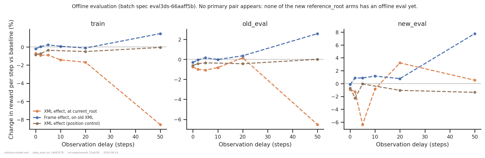

# New walker XML + reference_root vs the old baseline

## Question

The configuration going forward is **new (almost-full-collision) XML + `reference_root`
target frame + torque actuators**. How does it compare with the old baseline it replaces
(**old sparse-collision XML + `current_root` + torque**), across observation delays? That
contrast moves two things at once — can the walker XML and the target frame be told apart?
And is position control different?

## Dataset & comparability

**Source:** WandB `emiwar-team/nnx-ppo-rodent-delays`, tag `TrainEvalSplit`, selected by
the `CONDITIONS` in `extract.py` and frozen in `runs.csv` (149 runs).

| condition | n | XML | control | frame | network | delays | commit |
|---|---|---|---|---|---|---|---|
| `encdec_old_current` | 22 | old | torque | current | EncDec | 0–100 | `1cd5838f` |
| `encdec_old_reference` | 6 | old | torque | reference | EncDec | 0–50 | `909e774d` |
| `encdec_new_current` | 6 | new | torque | current | EncDec | 0–50 | `201d6e11` |
| `encdec_new_reference` | 23 | new | torque | reference | EncDec | 0–100 | `ef060b73` |
| `expfm_old_current` | 23 | old | torque | current | explicit FM | 0–100 | `54643764` |
| `expfm_old_reference` | 6 | old | torque | reference | explicit FM | 0–50 | `909e774d` |
| `expfm_new_reference` | 23 | new | torque | reference | explicit FM | 0–100 | `ef060b73` |
| `pgfm_old_current` | 14 | old | torque | current | PG-FM | 0–100 | `d33e5bcf`, `d4bd4dc0` |
| `pgfm_new_reference` | 13 | new | torque | reference | PG-FM | 0–100 | `25732c42` |
| `expfm_old_position` | 8 | old | position | current | explicit FM | 0–100 | `891cd0d3` |
| `expfm_new_position` | 5 | new | position | current | explicit FM | 0–50 | `201d6e11` |

The primary contrast (old XML + `current_root` → new XML + `reference_root`, torque) is
measured in **three independent networks**, with full 0–100 delay sweeps on both sides for
EncDec and the explicit FM. The four EncDec cells form a complete **2 × 2** in XML ×
frame, which is what makes the decomposition a measurement rather than a bound.

**Included despite `state = failed`:** the 46 runs at `ef060b73` (2026-08-11) that make up
`encdec_new_reference` and `expfm_new_reference` are marked failed because they died in
the *post-training* evaluation. All 46 reached `summary._step = 600_064_000`, have every
training metric, ran a normal 3.5–7.5 h, and have no `final_eval/*` keys at all — the
signature of completing training and then failing the final eval. The inclusion rule in
`extract.py` is therefore `state ∈ {finished, failed}` **and** `_step == EXPECTED_STEP`; a
run that died during training cannot satisfy the second condition.

**Excluded by design** (`min_std == 0.1`, `_step == 600_064_000`): the 10 larger-`min_std`
(0.25) and 8 longer-training (2 G-step) new-XML runs, per request. Also excluded: seeds
43/44, non-standard architectures, `efference_length != delay_k`, and the
`fm_loss_weight = 0` **detached** runs (an untrained-predictor control from another
question).

**Artifacts** (`coverage.txt`): `history` 149/149. Batch offline eval
(`eval3ds-66aaff5b`) 61/149 — see *Missing data*.

**Programmatic comparability** (`comparability.txt`): every invariant is single-valued
within each condition except `git_commit` in `pgfm_old_current` (`d4bd4dc0`/`d33e5bcf`).
The experimental axes are labelled from `env_params`, never inferred from the training
script.

**Manual comparability.** Configs read from the index rather than from tags; `min_std`,
`latent_min_std` and `std_scale` checked explicitly (this is what separates in-scope from
out-of-scope new runs and is invisible in a run's name or tags). Three `git diff`s:

- *Within the PG-FM baseline*: `d4bd4dc0` and `d33e5bcf` cover **disjoint** delays, and the
  delay-30 point comes from the minority commit. The diff touches only `analysis/`,
  `eval_runs.txt`, a plotting-style entry, and an *additive* metrics dict in
  `forward_model.py`. The baseline is smooth across the tranche boundary.
- *Between the PG-FM arms* (`d33e5bcf` → `25732c42`): in the network path only
  `latent_key: str` → `str | None`, with a `None` branch these runs never take.
- *Between the EncDec / explicit-FM arms* (`1cd5838f`, `54643764` → `ef060b73`): a six- to
  eight-week span. Empirically decisive rather than the diff: every network, PPO and env
  invariant is identical across the arms (`comparability.txt`), so whatever else changed
  did not reach the training configuration.

**Caveats.**

1. **Single seed per cell** (all seed 42). Every number below is one run versus one run;
   what carries weight is that the *shape* replicates across networks, not any single point.
2. **Not commit-controlled.** Six to eight weeks separate the arms of each primary pair.
3. Two conditions (`encdec_new_current`, `expfm_new_position`) have only 5–6 runs to
   delay 50, which limits the 2 × 2 and the position contrast to delays ≤ 50.

## Primary result — a deficit confined to a delay band, and only in some networks


Out to delay ~20 the new configuration is indistinguishable from the baseline in all three
networks (within ±3 %). Then the networks separate:

| delay | EncDec | explicit FM | PG-FM |
|---:|---:|---:|---:|
| 20 | +1.2 % | +3.3 % | −4.6 % |
| 30 | **−13.4 %** | +1.9 % | **−21.5 %** |
| 40 | **−19.7 %** | +1.7 % | — |
| 50 | **−14.6 %** | +0.7 % | **−15.2 %** |
| 60 | **−16.9 %** | +2.9 % | — |
| 70 | −1.5 % | +8.6 % | +4.6 % |
| 100 | 0.0 % | **+14.0 %** | +10.5 % |

Two things stand out.

**The deficit is a band, not a trend.** In EncDec it opens at delay 25–30, peaks at −19.7 %
(delay 40), and has closed by delay 70. PG-FM shows the same band shifted slightly
earlier. Beyond delay 70 both networks are at or above baseline. Episode lifespan follows
the same shape (−11.4 % at delay 40, +12.5 % at delay 100), so this is the policy failing
earlier in the band, not just tracking less accurately.

**The explicit forward model is immune.** Across all 23 matched delays its median change
is **+0.7 %**, it never drops below −3.1 %, and at long delay it is *better* with the new
configuration (+8.6 % at 70, +14.0 % at 100). It is also by far the strongest architecture
at long delay in absolute terms (1284 at delay 100, versus 772 for EncDec). Whatever the
new collision geometry costs, an explicitly trained forward model absorbs it.

## Decomposition — XML or frame?


With all four EncDec cells present, both factors can be measured at both levels of the
other:

| delay | XML effect at `current_root` | XML effect at `reference_root` | Frame effect on old XML | Frame effect on new XML |
|---:|---:|---:|---:|---:|
| 0 | −0.0 % | +0.4 % | −0.4 % | 0.0 % |
| 5 | −0.2 % | −0.8 % | +0.9 % | +0.3 % |
| 10 | −2.8 % | +1.2 % | −2.4 % | +1.7 % |
| 20 | +0.4 % | −2.3 % | +3.6 % | +0.9 % |
| 50 | **−12.8 %** | **−14.0 %** | −0.7 % | −2.1 % |

**The XML carries the entire effect**, and it does so identically at both frames: −12.8 %
and −14.0 % at delay 50. **The frame is free** at both XMLs: ±3.6 % everywhere, with no
trend and no consistent sign. And the two XML curves lie on top of each other, so **there
is no interaction** — the frame does not become costly on the new body, nor vice versa.

This is now a measurement inside one network rather than a bound stitched from several.
The frame contrast in the explicit FM (`frame_expfm`, old XML) agrees independently:
−1.6 % to +3.3 %.

## Convergence — partly a slower climb, partly a real plateau


At delay 30 the new arm is still climbing hard at 600 M (gaining 9.4 % of its final reward
in the last 100 M steps, against 3.2 % for the baseline), so part of that gap is simply
unfinished training. At delays 50 and 60 the picture reverses: the new arm has **flattened
or turned down** (−0.4 % and −6.5 % over the last 100 M) while the baseline is still
gaining 3.1 % and 3.0 %. There the deficit is a genuinely lower plateau.

So the band is a mixture: its leading edge (25–40) is convergence speed, its trailing edge
(50–60) is a lower ceiling. The excluded 2 G-step runs will sharpen this.

## Position control


Under position/PD control the XML costs **nothing at any delay** — the worst point across
delays 0–50 is −1.6 % at delay 20, and delay 50 is +0.3 %, against −12.8 % for the same XML
change under torque.

The reading that fits: the inner PD loop absorbs the extra contact disturbances, whereas a
torque policy must handle them in its outer loop — and in the 30–60 band it no longer has
fresh enough proprioception to do so. (The delay-50 point is the only overlap between this
contrast and the torque one, and this cell only reaches delay 50, so the comparison rests
on the low end of the band.)

## Speed — settled


With the new sweeps there are now **18 A100-matched, delay-matched pairs** rather than the
disjoint cells the earlier version had to reason around. Every one falls between −0.4 %
and +2.7 %; median ratios are 1.005 (explicit FM, n = 14) and 1.014 (EncDec, n = 3). The
new XML is **not slower** — marginally faster, if anything, consistent with the controlled
benchmark (`benchmark_xml.py`: 16 → 70 collidable geoms adds only ~2 active contacts).

## Offline evaluation



Held-out clips reproduce the training-time picture where coverage exists: the XML-alone
contrast at delay 50 is −6.5 % on `old_eval` and −8.6 % on `train`; the frame contrast
stays within +2.6 %; the position contrast within ±0.6 %. `new_eval` (32 clips, single
seed) is noisy and should be read for trend only.

**No primary pair appears here** — none of the new `reference_root` arms has an offline
evaluation.

## Bottom line

- **Adopt `reference_root`.** Free at both XML levels, in two networks, with no
  interaction. This question is settled.
- **No speed penalty.** Settled, with 18 GPU- and delay-matched pairs.
- **The new XML is free out to delay ~20**, free at *every* delay under position control,
  and free at *every* delay for the explicit forward model.
- **The cost is specific**: torque control, EncDec or PG-FM, delays 25–60, where it reaches
  −20 %. It closes again by delay 70. Part of that band is unfinished training (delay 30),
  part is a real lower plateau (delays 50–60).
- **If the going-forward setup keeps the explicit forward model, none of this bites** —
  and at long delay the new configuration is actively better.

## Missing data

- **No new-`reference_root` run has an offline evaluation** (`encdec_new_reference` 0/23,
  `expfm_new_reference` 0/23, `pgfm_new_reference` 0/13). The primary comparison rests
  entirely on training-clip reward, and the held-out and 30 s-clip view of the
  going-forward configuration is unknown. Highest-value thing to run:

  ```bash
  python -m vnl_experiments.artifacts plan --kind eval \
      --runs analysis/collision-model-xml/runs.csv --out eval_todo.txt
  # on the cluster:  sbatch slurm_eval.sh eval_todo.txt eval
  python -m vnl_experiments.artifacts pull --kind eval \
      --runs analysis/collision-model-xml/runs.csv
  ```

- Lower priority: `expfm_old_current` (23) and `expfm_old_reference` (6) hold only the
  older `legacy-batch` spec, so the explicit-FM contrasts are missing from the offline
  figure.

## Follow-ups

- **The 2 G-step runs**, which separate the "slower climb" and "lower plateau" halves of
  the band directly.
- **Multiple seeds at delays 30–60.** The whole effect lives in a band where every cell is
  n = 1, and the band's peak (−19.7 % at delay 40) rests on one run per arm.
- **Why is the explicit FM immune?** It is the most interesting result here and it is
  unexplained. The `fm_pred_mse` recorded in the eval artifacts would show whether the
  predictor's accuracy degrades on the new body at all.
- **A new-XML `current_root` cell for the explicit FM and PG-FM**, to check that the
  no-interaction result found in EncDec holds in the networks that carry the deficit.
- **Denser sampling across delays 20–70** in EncDec, since the band's edges are currently
  defined by single points at 25 and 70.

---

*Reproduce:* `../.venv/bin/python analysis/collision-model-xml/extract.py && ../.venv/bin/python analysis/collision-model-xml/plot.py`
(add `--sync --refresh` to pull in runs added since `runs.csv` was frozen).
