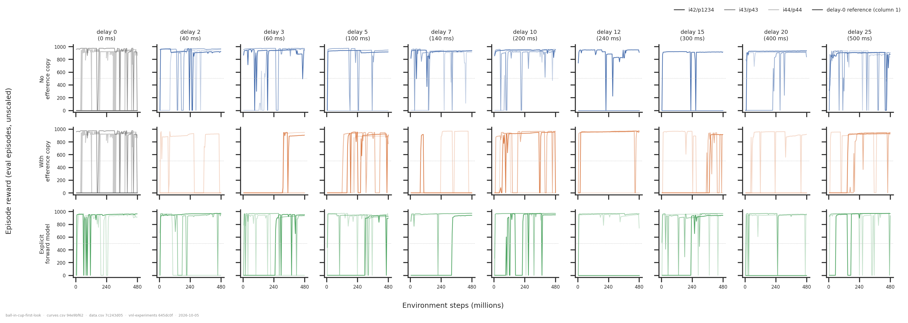
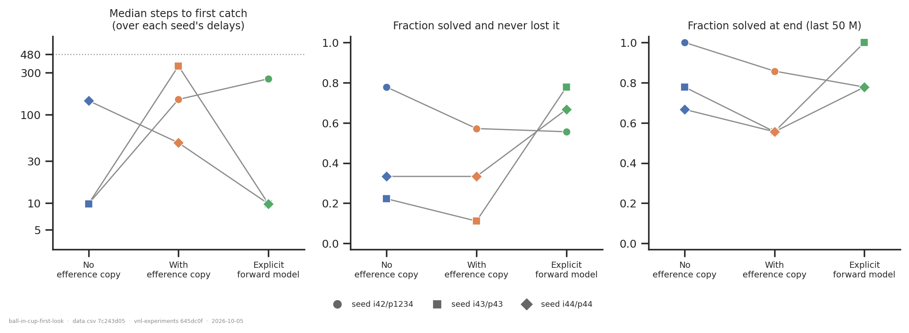
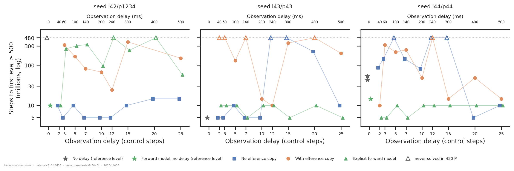
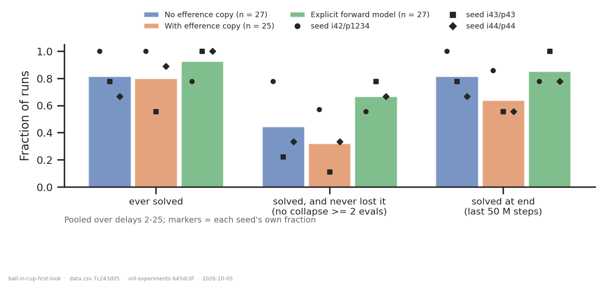
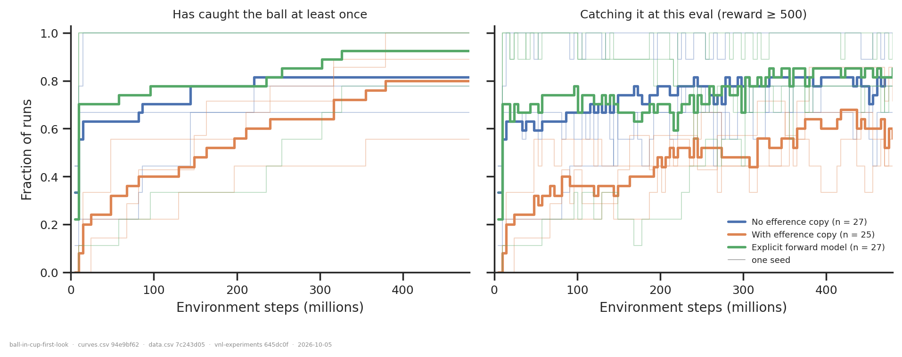
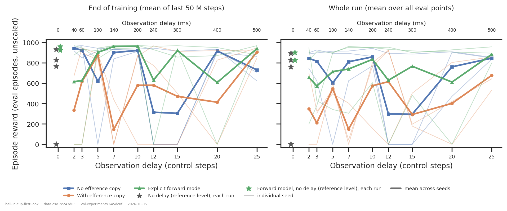

# BallInCup: no efference copy vs efference copy vs explicit forward model

> **Revised 2026-10-05.** Adding 30 runs brought every arm to the same three seed settings
> (forward model 42/1234 and 44/44, no-copy 44/44, forward model at delay 0). That
> **overturned the 2026-10-01 headline.** The earlier version reported two things:
>
> - "the efference copy makes learning ~16× slower" (p ≈ 10⁻⁴);
> - "the forward model removes the slowdown completely".
>
> Neither survives. The forward model's clean record was its single seed (43/43); at
> 42/1234 it is the slowest arm. More importantly, rebuilding the networks showed that
> **runs at different delays from one seed start from bit-identical or near-identical
> weights.** Each arm therefore has three independent samples, not 25–27, and the earlier
> p-values were overconfident. [What changed](#what-changed-on-2026-10-05) is at the end.

## Question

BallInCup had never been analysed, and until 2026-09-29 it had no no-copy arm (it is
excluded from [`efference-copy-across-tasks/`](../efference-copy-across-tasks/) for that
reason). This is the standard first pass, comparing three architectures swept over
observation delay:

1. **Mean reward:** how well does each arm end up doing, and over the run as a whole?
2. **Time to solve:** how many steps until the ball is first caught?
3. **Reliability:** what fraction of runs solve at all, keep the solution once found,
   and still have it at the end?

Question 3 is there because the task forces it. A policy either catches the ball or does
not, so a cell-mean reward is mostly a count of how many runs happened to be in the
caught state.

## Answers up front

| | no efference copy | **with** efference copy | explicit forward model |
|---|---|---|---|
| runs (delays 2–25) | 27 | 25 | 27 |
| ever solved | 22/27 (81 %) | 20/25 (80 %) | 25/27 (93 %) |
| solved and never lost it | 12/27 (44 %) | 8/25 (32 %) | 18/27 (67 %) |
| solved at end of training | 22/27 (81 %) | 16/25 (64 %) | 23/27 (85 %) |
| median steps to first catch, pooled | 9.8 M | 163 M | 9.8 M |
| … per seed (42/1234, 43/43, 44/44) | 9.8, 9.8, **144** | 149, 355, 48 | **255**, 9.8, 9.8 |
| reward, last 50 M (mean ± sd) | 731 ± 363 | 561 ± 412 | 796 ± 340 |
| reward, whole run (mean ± sd) | 681 ± 348 | 428 ± 325 | 712 ± 317 |

- **Which initialisation a run starts from matters more than its architecture.**
  - *How strong it is:* seed explains 77 % of the variance in log time-to-solve within
    the forward-model arm and 31 % within no-copy.
  - *Whether it is consistent across arms:* every arm has a slow seed, and the slow seed
    is a different one in each arm.
  - *What explains it:* at a fixed seed, every delay starts from 96–100 % identical
    weights and the same PPO stream. So a seed's nine delays are close to one experiment
    run nine times, and they tend to succeed or fail together (figures 1–3).
- **No architecture difference in learning speed is established.** I used a permutation
  test that reassigns arm labels within each seed, moving whole delay sweeps together:
  - copy vs no-copy, p = 0.29;
  - copy vs forward model, p = 0.11;
  - no-copy vs forward model, p = 1.0.

  With three seeds the smallest attainable p is 0.02, so this design could only detect a
  large, consistent effect. The descriptive pattern is that the copy arm is the only arm
  with no fast seed (per-seed medians 48–355 M). That is worth following up, but on its
  own it is weak evidence: the test above, which accounts for it, gives p = 0.29.
- **The forward model may be more reliable, at the edge of detectability.** It has the
  highest "never lost it" rate at two of three seeds, and at 42/1234 it is level with the
  copy arm (0.56 vs 0.57). Against the
  copy arm, "never lost it" gives p = 0.11 and "solved at end" p = 0.07 (seed-block). It
  is the most consistent of the arm differences, but it is not established.
- **Whether a run *ever* solves doesn't depend on the arm.** 80–93 % in every arm;
  seed-block p ≥ 0.41.
- **Delay has no visible effect.** The delay-0 references are no easier than delays 2–25.
  Of the four `DelayedMLP` runs at delay 0, one never solves; both `FlatForwardModel`
  runs at delay 0 solve within 15 M. Within a seed, success and failure scatter across
  delays with no trend.

## Dataset & comparability

- **Source:** WandB `emiwar-team/nnx-ppo-delays`, synced 2026-10-05, selected by
  `CONDITIONS` in [`extract.py`](extract.py) and frozen in [`runs.csv`](runs.csv). The
  cohort is every current-era BallInCup run. The only exclusions are the seven pre-Hydra
  legacy runs (2026-06-01, 240 M budget, before the eval fix) and one crashed run.
- **Conditions:**

| condition | n | delays | seed settings (init/ppo) | network |
|---|---|---|---|---|
| `undelayed` | 4 | 0 | 42/1234, 43/43, 44/44 (×2) | `DelayedMLP`. With no queue to copy, the two MLP arms coincide here, so this is a shared reference |
| `undelayed_fm` | 2 | 0 | 42/1234, 44/44 | `FlatForwardModel` at delay 0: its predictor has nothing to predict |
| `no_efference` | 27 | 2, 3, 5, 7, 10, 12, 15, 20, 25 | 42/1234, 43/43, 44/44 | `DelayedMLP`, `efference_length = 0` |
| `efference` | 25 | same | same (42/1234 lacks delays 2 and 20) | `DelayedMLP`, `efference_length = delay_k` |
| `flat_forward_model` | 27 | same | same | `FlatForwardModel`, `efference_length = delay_k`, 4×256 predictor, `fm_loss_weight = 1`, `detach_prediction = True` |

  Actor 4×256, critic 5×256; all runs at `b4012b30`, 480 M steps, `min_std = 0.001`,
  `entropy_weight = 0.01`. The copy arm's (42/1234, delay 2) run crashed with no logged
  steps, and its (42/1234, delay 20) run was never launched.

- **Reward reported:** `eval/*` (`dmc_eval`): 256 fresh episodes, 1 000 steps,
  unscaled. All runs are after the `971ab99` eval fix; the selector gates on this, and
  `reward_source` has a single value. This is not a held-out set. Lifespan is 1 000 at
  every eval point of every run. "End of training" means the mean of the last 50 M steps
  (11 points).
- **Why rates and times sit beside the reward axis:** 115 of 8 498 eval points fall
  between 50 and 800, and the rest sit in one of the two modes. A cell mean of ~600 is
  one seed at 0 and two at ~900. Raw reward is still shown (figure 6).
- **Solve threshold:** an eval point ≥ 500 counts as solved. Moving it to 800 shifts the
  first-catch step by a median of 0, and gives the same point in 68 % of solved runs
  (the worst case is 39 M steps later). No conclusion changes.
- **Time resolution:** evals are every 4.8 M steps, so 4.9 M is the floor. Fast runs in
  every arm sit at 5–10 M, and the data cannot tell fast runs apart from each other.
- **Artifacts used:** `REQUIRES = ["index", "history:hist2000-8b97281e"]`, 85/85 (see
  [`coverage.txt`](coverage.txt)). All were produced after their run finished, and all
  reach step 480 215 040.
- **Programmatic comparability:** see [`comparability.txt`](comparability.txt). Every
  invariant is constant across all 85 runs: the three repo commits, every PPO setting,
  `summary._step`, `reward_scale`, `episode_length`, `ctrl_dt` (0.02 s, so 20 ms per
  delay step), network sizes, `min_std`, `entropy_weight`, the eval settings and the
  OS/CUDA/Python stack. Only `repos.vnl_experiments.dirty` varies (see caveats).
- **Manual comparability:**
  - I read the configs directly from the index. The arms differ only in the designed
    fields: `efference_length`, `network_class` and the three predictor fields.
  - Notes match the split (*"no efference"*, *"forward model"*, *"another seed"*, …).
  - `git_commit` is identical everywhere, and no commit since `b4012b3` touches network
    code.
  - **Initial weights, checked directly (new):** I rebuilt every network from its logged
    `net_params` and seed with the registry builder and compared parameter arrays.
    - *Within an arm and seed, across delays:* `no_efference` is 100 % bit-identical at
      every delay, and the other two arms 96–99 %. Only the first actor and predictor
      layers, which are widened by the action queue, differ.
    - *Across arms at one seed:* no-copy and copy share 99 % of their weights, and the
      forward model shares 84–85 % with each (the critic and the decoder's hidden
      layers).

    So **same seed means almost the same starting network, whatever the delay**, and
    nearly the same across arms too. The real design is 3 initialisations × 3
    architectures, with delay as a perturbation.

- **Caveats:**
  - **Three independent samples per arm.** This limits everything above. The pooled
    tests in [`summary.txt`](summary.txt) are kept for reference but are invalid, and
    are labelled so. Use the seed-clustered section.
  - **The dirty working copy doesn't explain the results.** All 25 copy runs and most
    others were launched from a dirty `vnl_experiments` checkout. WandB stored no diff,
    so the uncommitted state can't be recovered. Within the arms that have both kinds of
    run, dirtiness lines up with seed and points in opposite directions:
    - no-copy: dirty runs are *slower* (they include all of 44/44);
    - forward model: dirty runs are *faster* (the slow 42/1234 batch is mostly clean).

    The flag also flips between runs submitted in the same minute. Treat it as a
    transient file, not a code difference.
  - **Restarts are uneven** (copy 6, forward model 6, no-copy 3) and mostly fall in the
    42/1234 batches. The slow forward-model runs at 42/1234 were already stuck at 0 for
    220–290 M steps before their resume, so preemption did not cause them (but see the
    curiosity in follow-ups).
  - **The arms are not parameter-matched.** The forward model adds a 4×256 predictor,
    and the copy arm's input grows by 2 (BallInCup's two actuators) per step of delay.
  - **GPUs vary** (A100, A40, H200, A6000, RTX PRO 6000). Nothing here is measured in
    wall clock.

## Figures

**Figure 1: every run, shaded by seed.** Read along one row at one shade: that is one
initialisation at ten delays, and it often behaves the same way throughout. For example,
the darkest green (forward model, 42/1234) sits at 0 for 200–300 M steps at most delays,
while the two lighter greens switch on within the first evals. Catastrophic forgetting
shows up in every arm as drops to 0, mostly for a single eval.

**Figure 2: the comparison at its real resolution.** Each point is one arm at one seed
(over its nine delays). Lines join the same seed, which is almost the same starting
network, across arms. If architecture dominated, the lines would be roughly parallel.
In the time-to-solve panel they cross, which is the seed effect. In the "never lost it"
panel, two of the three lines rise from copy to forward model, and none falls by much.
That is the weakly consistent reliability pattern.

**Figure 3: the same data per run.** Within a panel, each arm keeps roughly the same
level across delays. Between panels the ordering changes: no-copy is fastest at 42/1234
and slow at 44/44, and the forward model is the reverse. The two `FlatForwardModel`
delay-0 runs (green stars) solve at 10 and 14 M. Three of the four `DelayedMLP` delay-0
runs (grey) take 43 M or more, or never solve.

**Figure 4: fraction of seeds solving.** Bars pool the arm's runs; markers are each
seed's own fraction. The markers spread across a range of 0.2–0.7 within one bar, wider
than the gaps between bars. This is why the bars should not be read as precise rates.

**Figure 5: the time course.** Thick lines pool the runs and thin lines show each seed.
The copy arm's pooled curve rises most slowly, but the thin lines overlap across arms:
every arm has a seed that stays below 0.45 for the first 150 M steps.

**Figure 6: mean reward, for reference.** Every arm's mean dips wherever one seed scored
0, as the thin lines show. On the whole-run panel the copy arm is lowest at most delays.
That is the same slow-start pattern as figure 5, with the same caveat.

## Tentative conclusion

On BallInCup, with three initialisations per architecture, **time to first catch is
dominated by the initialisation**, not by whether the actor gets an efference copy or a
forward model. Every architecture has an initialisation that sits at 0 reward for
hundreds of millions of steps, and one that solves within the first two evals. Delay,
from 0 to 500 ms, has no visible effect.

Two patterns are consistent with the earlier reading, but neither is established at
this sample size:

- the raw efference copy is the only arm without a fast seed;
- the forward model holds on to its solution more often (never-lost 67 % vs 32 %,
  p = 0.11).

If they are real, they are smaller than the seed effect. The earlier exploration
hypothesis (noisy extra action inputs make the first catch rarer) is not ruled out, but
the data no longer require it. The forward model's 42/1234 batch is just as slow, and
it sees the same queue only through a predictor.

The main lesson is about the design. A delay sweep at a fixed seed is close to a single
experiment run many times. Conclusions about *architecture* need more seeds, and they
can afford fewer delays, since delay shows no effect here. This probably applies to
other folders in this track that sweep delay at one or two seeds per arm. It is worth
checking [`efference-copy-across-tasks/`](../efference-copy-across-tasks/) in
particular: its ReacherHard "8 of 8 matched-seed delays" result counts eight cells that
share an initialisation.

## Follow-ups

- **More seeds, fewer delays.** For example, 10 seeds × 3 arms at delays {2, 10, 25},
  which is 90 runs. That gives ten independent samples per arm, where this cohort's
  roughly 80 runs give three. It is the only thing that can settle the copy-arm slowdown
  and the forward model's reliability edge. Pass both `seed=N train.seed=N`.
- **Audit the matched-seed delay claims elsewhere.** First, ReacherHard's 8/8 in
  `efference-copy-across-tasks`, using the seed-block permutation in `extract.py`
  (`seed_clustered`).
- **A possible lead on unsticking runs.** Of the five runs that were still unsolved when
  a requeue resumed them, three solved within 25–37 M steps of the resume. The base rate
  for never-resumed runs still unsolved at a comparable point is 4/46. A light-checkpoint
  resume keeps weights and optimizer state but redraws every env state and zeroes the
  action queues. However, all three are forward-model runs at 42/1234, which are near
  replicates, so this is one observation, not three. A cheap test is to take a stuck
  checkpoint and resume it with and without redrawn env states.
- **Settle the dirty-checkout question** with `git status` on the cluster checkout. This
  is now low priority, since the flag doesn't line up with the results.
- **Denser early evals** (`train.eval.every_steps` ≈ 1 M for the first 50 M steps), so
  that fast runs can be told apart.
- **Forgetting as its own question.** One-eval drops are frequent in every arm (36–47
  collapses per arm in total). A `trace` of a run that drops to 0 for one eval would
  show whether these are whole-policy collapses.

## What changed on 2026-10-05

| | 2026-10-01 (55 runs) | 2026-10-05 (85 runs) |
|---|---|---|
| forward-model seeds | 43/43 only | 42/1234, 43/43, 44/44 |
| no-copy seeds | 42/1234, 43/43 | + 44/44 |
| forward-model median time to solve | 9.8 M, all 9 solved, all solved at end | per seed 255 / 9.8 / 9.8 M; 25/27 solved |
| copy vs no-copy time-to-solve test | Mann–Whitney p = 1.5 × 10⁻⁴ (runs as independent) | seed-block permutation p = 0.29 |
| copy vs forward model | p = 3 × 10⁻⁵ | p = 0.11 |
| headline | "the copy slows learning 16×; the forward model removes it" | the initialisation dominates; no architecture effect established |

Both changes have the same cause. The earlier forward-model arm was one initialisation,
and the earlier tests counted delays at a shared initialisation as independent. The
paired "sign test over delays at 43/43" (p = 0.008) was that same mistake on a smaller
scale. Before this revision I had not checked how `nnx.Rngs(seed)` behaves across
delays. I checked it this time by rebuilding the networks, and the result is recorded in
`extract.py`'s docstring so the next folder in this track doesn't repeat it.

---

*Reproduce:* `../.venv/bin/python analysis/dm_control_suite/ball-in-cup-first-look/extract.py && ../.venv/bin/python analysis/dm_control_suite/ball-in-cup-first-look/plot.py`
(add `--sync --refresh` to the extract to pull in runs added since `runs.csv` was frozen;
the history artifacts come from
`python -m vnl_experiments.artifacts ensure --kind history --runs analysis/dm_control_suite/ball-in-cup-first-look/runs.csv --set project='"emiwar-team/nnx-ppo-delays"'`).
