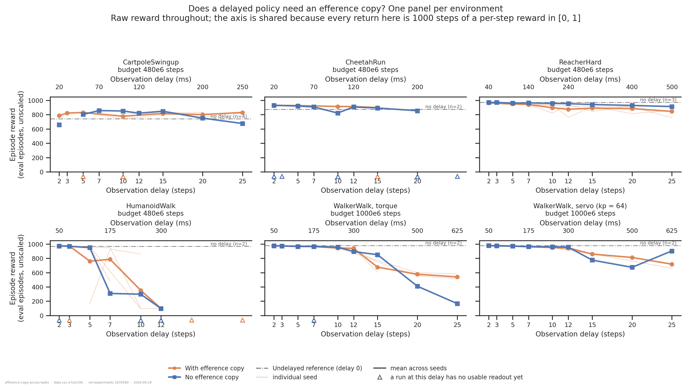
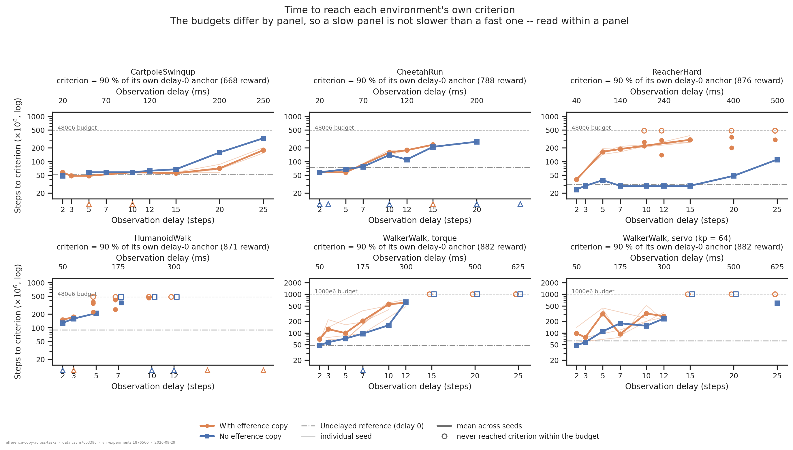
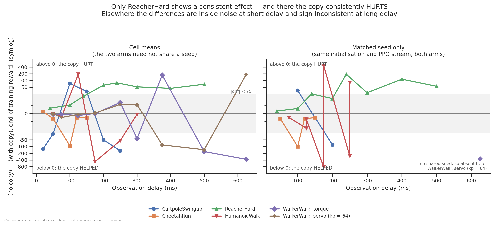
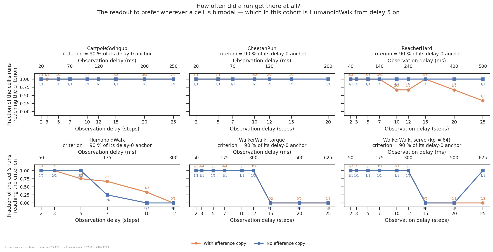
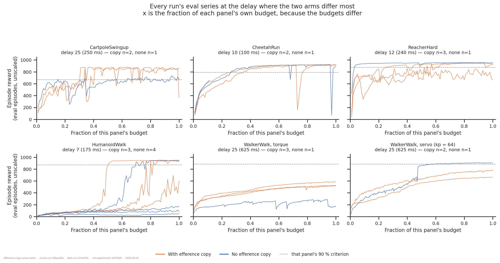

# Does a delayed policy need an efference copy? Six dm_control environments

> **Updated 2026-09-29** with 24 further runs, 22 of them HumanoidWalk, which takes that
> panel from 13 runs to 37 and settles it. HumanoidWalk is **bimodal in both arms** from
> delay 5 on — at delay 7 one *copy* run scores 481.7 while a no-copy run scores 940.7 — so
> the cell mean describes no run in the cell, and this report now leans on a **rate**
> readout there (figure 4). On that readout the copy is ahead in the transition region but
> not significantly. ReacherHard is unchanged and remains the only consistent effect.
> Revision notes: [2026-09-29](#what-changed-on-2026-09-29),
> [2026-09-28](#what-changed-on-2026-09-28).

## Question

Every delay run in this track has been *efference-matched* by default:
`efference_length == delay_k`, so the actor is handed the whole queue of actions taken
since the observation it is acting on. That is a design decision inherited from the rodent,
not a measurement. This folder tests it on **every dm_control environment where both arms
exist**, asking whether the answer is a property of *delay* or a property of the *task*.

An answer is, per environment and delay, the difference between the two arms in
end-of-training reward and in time-to-criterion, read against the seed spread of the cells
it is built from — and, where a seed pair ran both arms, as a **paired** difference.

## Answers up front

| | answer |
|---|---|
| **Is the effect a property of the delay?** | **No — of the task.** At short delay every panel is inside its own noise. At long delay the six panels disagree in *sign*, not just in size. |
| **ReacherHard** | **The copy consistently hurts.** All **8 of 8** matched-seed delays favour no copy (+3.3, +6.4, +24.9, +19.1, +190.1, +28.1, +113.9, +54.8 reward), and the no-copy arm reaches criterion in 2.4–3.9e7 steps at every delay out to 15 — its undelayed speed — while the copy arm needs 3.9e7 to 3.7e8 and is censored at four delays. This is the only consistent effect in the folder. |
| **HumanoidWalk** | **Bimodal in both arms; the copy raises the odds of crossing, not significantly.** From delay 5 on, individual runs land at ~1e2 or ~9.5e2 with nothing in between, in *both* arms — at delay 7 one copy run scores 481.7 and one no-copy run 940.7 — so the mean is uninterpretable. On the rate readout the copy arm crosses the criterion in **2/3** runs at delay 7 and **1/3** at delay 10, against **1/4** and **0/3** without it; pooled that is 3/6 vs 1/7, Fisher p = 0.22. Suggestive, not shown. |
| **WalkerWalk (torque and servo)** | **Nothing out to 125 ms; large but sign-inconsistent past 300 ms.** Differences at delays 2/3/5 are −0.4 to −5.2, inside the fixed-seed floor. Past delay 12 they reach ±1.9e2 and flip sign between adjacent delays in both panels — a regime where the cells are n=1 or n=2 and not converged. |
| **CartpoleSwingup, CheetahRun** | **No effect on CartpoleSwingup; a small consistent one on CheetahRun.** Cartpole's own delay-0 anchor spreads 19 %, so its criterion is not quotable, and its differences straddle zero. CheetahRun now has four matched-seed delays and **all four favour the copy** — but three by only 5–7 reward, and only delay 10 (−92.0) is outside its cell's spread. Every run of both arms crosses the criterion at every delay, so there is no rate effect. |
| **Is the manipulation real?** | **Yes, verified per task.** `efference_length = 0` builds no queue in any of the five tasks, `efference_length = L` builds one the policy reads, and it holds the right actions in the right order. See [Is the manipulation real?](#is-the-manipulation-real). |

## Dataset & comparability

- **Source:** WandB `emiwar-team/nnx-ppo-delays`, selected by the `CONDITIONS` in
  [`extract.py`](extract.py) and frozen in [`runs.csv`](runs.csv). Index synced 2026-09-28.
  **189 runs**, of which 172 have a usable readout.
- **Network:** `DelayedMLP` throughout. `FlatForwardModel` has no no-copy arm anywhere, and
  the single `FlatRecurrent` no-copy run (`8debmjui`, WalkerWalk delay 10) belongs to the
  "can recurrence replace the copy" question — pooling it would put an LSTM in a
  feedforward cell. It is worth its own look: at WalkerWalk delay 10 that arm has
  `efference_length` 0, 1 and 10 at one seed (i43/p43), which is the only three-point
  efference-*length* contrast in the project.
- **Panels.** A panel is a task **plus an actuator**, because the sibling folders establish
  that `servo_kp = 64` changes WalkerWalk's control problem rather than parameterising it.
  WalkerWalk appears twice and is never pooled.

| panel | task | `servo_kp` | budget | 1 step | delays with both arms usable | criterion (90 % of its own delay-0 anchor) |
|---|---|---|---|---|---|---|
| CartpoleSwingup | CartpoleSwingup | 0 | 4.8e8 | 10 ms | 2, 5, 10, 12, 15, 20, 25 | 668 (anchor 741.9, n=4, **spread 19 %**) |
| CheetahRun | CheetahRun | 0 | 4.8e8 | 10 ms | 2, 5, 10, 12, 15 | 788 (anchor 876.0, n=2, **spread 10 %**) |
| ReacherHard | ReacherHard | 0 | 4.8e8 | 20 ms | 2, 5, 7, 10, 12, 15, 20, 25 | 876 (anchor 973.4, n=3, spread 0.5 %) |
| HumanoidWalk | HumanoidWalk | 0 | 4.8e8 | 25 ms | 2, 3, 5, 7, 10, 12 | 871 (anchor 968.2, n=2, spread 1.3 %) |
| WalkerWalk, torque | WalkerWalk | 0 | 1e9 | 25 ms | 2, 3, 5, 10, 12, 15, 20, 25 | 882 (anchor 979.6, n=2, spread 0.2 %) |
| WalkerWalk, servo | WalkerWalk | 64 | 1e9 | 25 ms | 2, 3, 5, 7, 10, 12, 15, 20, 25 | 882 (anchor 980.1, n=2, spread 0.1 %) |

  `HopperHop` is excluded: three efference-matched runs and no no-copy arm at all.
  `WalkerRun`, `WalkerStand`, `BallInCup`, `CartpoleBalance` and `HumanoidStand` have no
  no-copy runs either. The other `servo_kp` values (0.25–128) belong to
  [`../walker-joint-stiffness/`](../walker-joint-stiffness/) and have no no-copy arm.

- **The budget is per panel, and is forced rather than chosen.** The no-copy arm exists at
  exactly one budget per panel. Nothing is mixed *within* a panel; *across* panels the step
  axis of figure 2 means different things, which is why each panel carries its own budget
  line. A WalkerWalk panel is not "slower" than CheetahRun — it had twice the budget to be
  slow in.
- **The criterion is per task, and derived.** 900 is a *WalkerWalk* convention;
  CartpoleSwingup never exceeds 8.8e2 at any delay in this cohort, so a fixed 900 would
  censor that panel entirely and report nothing. Each panel's criterion is 90 % of its own
  delay-0 anchor — what an undelayed policy achieves on that task at that budget — and the
  absolute level is printed in every panel title and written into `data.csv` as `thr_90`.
  `thr_80` / `thr_95` are extracted too. `steps_to_900` is *also* kept, so a WalkerWalk
  number here can still be put beside the sibling folders'.
- **The three arms.** `efference`, `no_efference`, and `undelayed` — the last is not a point
  on the sweep: at `delay_k = 0` an efference-matched run *is* an `efference_length = 0`
  run, one experiment under two names. It is drawn as a reference level and sets the
  criterion.
- **Reward reported:** `eval/episode_reward/mean`, unscaled, full 1000-step episodes,
  post-`971ab99` for every run. A dm_control "eval" is a fresh episode of the *same* task —
  there is no held-out set in this track, so none of these numbers is a generalisation
  measure.
- **Artifacts:** `REQUIRES = ["index", "history:hist2000-8b97281e"]`, **152/152 coverage**
  ([`coverage.txt`](coverage.txt)). Same spec id as every sibling WalkerWalk folder.
- **Programmatic comparability:** [`comparability.txt`](comparability.txt), grouped by the
  18 `{panel}_{arm}` cells. The check that matters is `panel_invariants`, which asks
  whether any invariant differs *between the arms of one panel* — the comparison every
  figure makes. **All six panels: every invariant agrees across arms.**
- **De-duplication.** Runs agreeing on every experimental parameter *and* both seeds are one
  experiment run twice, not two seeds; the earliest launched is kept, under the same rule
  and with the same result as
  [`../walker-servo-x-forward-model/duplicates.txt`](../walker-servo-x-forward-model/duplicates.txt),
  which also supplies this folder's fixed-seed noise floor (|Δreward| median 0.6, max 3.6).
- **Manual comparability.** Configs read from `env_params` / `net_params` directly, never
  from tags, run names or the script at the recorded commit.
  `repos.vnl_experiments.dirty` is `True` on part of the cohort, which per README §4 voids
  those commit hashes, so no argument here rests on one;
  [`efference_identity.py`](efference_identity.py) replaces the hash argument with a
  behavioural one.

### Is the manipulation real?

If the queue were inert, misaligned or never built, "no copy needed" is exactly what this
experiment would return on every task at once. [`efference_identity.py`](efference_identity.py)
→ [`efference_identity.txt`](efference_identity.txt) tests it directly. Four parts, all
passing:

| part | question | result |
|---|---|---|
| **A** | Is the queue's code the same across the cohort? | `EfferenceCopy`, `Delay`, `make_delayed_mlp_actor_critic`, `build_flat_delay_network`, `_parse_net_params` and the `net_params` literal in `train.py` are identical in docstring-stripped executable source at **all six `vnl-experiments` commits, both `nnx-ppo` commits, and the working tree** |
| **B** | Does each run's *logged* `net_params` build the network its label claims? | checked **per task**, because `obs_size`/`action_size` run from 5/1 (CartpoleSwingup) to 67/21 (HumanoidWalk): the actor's first layer is exactly `obs` wide for every `efference_length = 0` run and `obs + L·action` for every `efference_length = L` run, across all 77 (task, delay, length) cells, and the `efference_length = 0` carry contains **no `queue` entry at all** |
| **C** | Does the queue's *content* change what the policy does? | at initialised weights, same observation and RNG, two different action histories move the action by 0.116 (delay 5) and 0.076 (delay 20); at `efference_length = 0`, exactly 0.000 |
| **D** | Is the queue *aligned*? | at step t the actor receives `concat(obs[t−k], a[t−1], …, a[t−L])` — delayed observation then the actions taken since it, newest first, verified step by step against a recording stub |

**What it does not show.** Nothing local can prove the cluster executed that code. The check
that would is cheap and cluster-side: `eval` artifacts record `param_counts` from the
**restored checkpoint**, so one `eval` for a no-copy run and one for its copy-armed
neighbour at the same delay would settle the trained actor's width from the weights. That
is follow-up 1.

### Caveats

1. **22 of 165 runs have no usable readout, and they are not spread evenly.** Nineteen
   stopped training early — fourteen of them in CheetahRun, split evenly between seven
   crashes and seven runs still training when this was written; **three trained the full 4.8e8 and
   stopped logging `eval/*` partway** —
   `6sdnzid5`, `jorslhah` and `6bjbs3a6`, all HumanoidWalk efference runs, whose eval series
   end at 6.6e7 / 2.7e8 / 4.0e8. That is not a stale artifact: re-producing returns the same
   bytes, and a single-key WandB fetch confirms the rows do not exist. A "reached its budget"
   gate would have passed all three and then silently contributed blanks, which is why
   `reached_budget` and `has_readout` are separate columns. The cost is HumanoidWalk's
   delays 12/15/20 on the copy side, leaving that panel with **four** contrastable delays,
   and CheetahRun's **one**: of its 22 runs only 8 are usable, and the 2026-09-28 batch
   that would fix it is still training.
2. **Most no-copy cells are a single run, and the arms mostly do not share seeds.** The
   substitutes are the within-cell spread of the efference arm (per panel, in
   `comparability.txt`) and the paired contrasts below. Where the spread is large the
   cell-mean contrast cannot resolve its own effect: **ReacherHard's efference cells span
   117, 177, 115 and 166 reward at delays 10, 12, 20 and 25** — larger than the cell-mean
   differences there. That panel's result rests on the paired numbers, not the means.
   The one multi-seed *no-copy* cell in the cohort, HumanoidWalk delay 7, spreads **786**.
3. **23 paired contrasts exist and they are the strongest evidence here — but they are not
   proof against a bimodal cell.** Same panel, same delay, same seed pair, both arms, so
   network initialisation, PPO stream, task, delay and budget are identical and only the
   copy differs. ReacherHard has one at **all eight** of its delays, HumanoidWalk **eight**
   across four seeds, CheetahRun four, CartpoleSwingup two, WalkerWalk-torque one.
   **WalkerWalk servo has none** (no-copy is i45/p45, the efference arm i51–i54), so that
   panel is cell-means only.

   The limit is worth stating because this cohort has now demonstrated it twice. Pairing
   removes seed variation *between the arms*; it cannot tell you the cell is bimodal.
   HumanoidWalk delay 7 has **three** pairs and they read −793.6, **+459.0** and −835.3:
   same manipulation, same task, same delay, and a sign flip of 1.3e3 reward between seeds,
   because at that delay a run of *either* arm lands at ~1e2 or ~9.5e2 and each pair
   inherits whichever mode its seed drew. A paired difference is one observation of a
   difference; where the cell is bimodal one observation is not enough however well matched
   it is, and three are barely enough to see the problem. The per-panel sign count is a sign
   test over delays whose caveat is that most panels' delays share one no-copy seed and so
   are not independent draws of it.
4. **Two panels' criteria are set by noisy anchors.** CartpoleSwingup's four delay-0 runs
   span 661.8–805.8 (19 %) and CheetahRun's two span 834.0–918.1 (10 %), so those panels'
   `thr_90` sit well below where their runs plateau and nearly everything crosses early —
   which is what figure 4 shows, every cell of both at 1/1 or 2/2. Read those two panels'
   reward, not their times or rates. ReacherHard, HumanoidWalk and both WalkerWalk panels
   have anchors spreading ≤ 1.3 %.
5. **Preemption is no longer confounded with the arm** — unlike the earlier WalkerWalk-only
   version of this analysis. Both arms are requeued (no-copy up to 7 restarts, efference up
   to 5), and of the 19 requeued efference runs, five are the slowest in their cell, five
   are censored and nine are unremarkable. It remains a source of spread on the time
   readout, in both arms.
6. **Time-to-criterion sits inside a bimodal gap.** 16 of 115 qualifying runs stalled more
   than 1e8 steps between the 80 % and 90 % criteria. The stalls are not evenly spread:
   ReacherHard has 6 stalled efference runs and **0** stalled no-copy runs, which is the same
   story as its reward result and not independent evidence for it.
7. **The high-delay WalkerWalk cells are not converged**, in either arm, and that is where
   both panels' large sign-flipping differences live. `late_gain` is near zero for both arms
   overall but individual runs at delays 15–25 are still gaining 7–20 reward per 1e8 steps.
8. **`eval` here is not held-out.** No clip split in this track; an eval episode is a fresh
   episode of the same task.

## Figures

**Figure 1 — the six answers.** Read each panel's two lines against each other, not across
panels. ReacherHard is the one to look at: the no-copy line sits *above* the copy line at
every delay. WalkerWalk's two panels show the arms lying on top of each other out to delay
12 and then separating erratically. **HumanoidWalk's two lines should not be read at all** —
its cells are bimodal from delay 5, so both lines are averages over runs at ~1e2 and ~9.5e2
and the thin per-seed lines under them are the real content; figure 4 is that panel's
readout. The y axis is shared because every return here is 1000 steps of a per-step reward
in [0, 1] — nothing is normalised.

**Figure 2 — how long it took.** ReacherHard is the striking one: the no-copy arm reaches
criterion in 2.4–3.9e7 steps at every delay from 2 to 15 — a flat line sitting *on* its
undelayed reference of 3.1e7 — and 1.1e8 at delay 25, while the copy arm climbs an order of
magnitude and is censored at delays 10, 12, 20 and 25. Budgets differ by panel, so compare
within a panel only.

**Figure 3 — the cross-task summary, and the part of it that survives pairing.** The left
panel is the weaker evidence: cell means average over seeds the two arms do not share. The
right panel keeps only matched-seed comparisons. ReacherHard (green) stays entirely above
zero in both, which is the result. HumanoidWalk (red) has three paired points at delay 7
that span −835 to +459, and their appearance as a single line is caveat 3's warning made
visible: pairing did not rescue a bimodal cell. Everything else sits in the shaded "no
effect" band or changes sign. The y axis is symlog because the extreme points are ±1e3 while
most of the cohort lives within ±1e2.

**Figure 4 — how often a run got there at all.** This is the readout to prefer wherever a
cell is bimodal, and the figure shows which panels that is: in ReacherHard and both
WalkerWalk panels almost every marker sits at 0 or 1, so their means are fine, while
HumanoidWalk is fractional at every delay from 5. There the copy arm is behind at delay 5
(3/4 against 2/2) and ahead at 7 and 10 (2/3 against 1/4, 1/3 against 0/3). Read the
annotated counts, not the heights: 2/3 and 20/30 plot identically and are not the same
evidence. ReacherHard's no-copy arm is 1/1 at all eight delays, which is one seed succeeding
eight times and not a rate.

**Figure 5 — the curves the readouts come from.** HumanoidWalk at delay 7 is where the
bimodality is visible rather than inferred: all seven runs sit near 1e2 for the first 40 %
of training and then three step up to ~9.5e2 — at 48 %, 60 % and 78 % of the budget, two
with the copy and one without — while three never move and one copy run is still
mid-transition when the budget runs out. That last run is why this panel's `late_gain` is
large in both arms, and it is what follow-up 2's longer budget would resolve. The step is what HumanoidWalk's outcome at
this delay consists of, and the efference copy shifts how often it happens rather than
whether it can. ReacherHard at delay 12 is the mirror image: the no-copy run is at its
plateau within 5 % of the budget while all three copy runs are still climbing, noisily, at
the end.

## Tentative conclusion

**Whether a delayed policy needs an efference copy is decided by the task, not by the
delay — and on one of these six environments the copy is actively harmful.**

- **ReacherHard: the copy hurts, consistently and increasingly.** 8 of 8 matched-seed
  delays favour no copy, the differences growing from +3.3 at delay 2 to +113.9 at delay 20
  and +54.8 at delay 25 (with +190.1 at delay 12). A sign test over eight delays gives
  p = 0.008, subject to caveat 3's warning that those eight share one no-copy seed. On time it is not close: the no-copy arm reaches its criterion
  in ~2.9e7 steps at every delay, roughly its undelayed speed, while the copy arm needs
  1.6–3.5e8 and misses the criterion entirely at four delays. A 2-dimensional action
  appended to a 6-dimensional observation is a 1.3–9× widening of the actor's input for a
  task whose optimal policy barely needs its own action history, and the cost shows up as
  learning speed. Suggestive, not shown: this is a capacity/optimisation cost, not an
  information one.
- **HumanoidWalk: bimodal in both arms, with the copy ahead on the odds of crossing.** This
  panel has been read three ways as runs arrived and only the third is defensible. With one
  run per arm it looked like the largest effect in the cohort (948.1 vs 154.5); with two
  no-copy runs it looked like nothing (the second scored 940.7); with 37 runs it is clear
  what is happening. From delay 5 on, a HumanoidWalk run lands at ~1e2 or ~9.5e2 and nothing
  in between, in **either** arm — within-cell spreads of 801, 466 and 764 reward in the copy
  arm at delays 5/7/10 and 6, 897 and 479 without it. A cell mean is then a weighted average
  of two modes and describes no run in the cell. On the rate readout the copy arm crosses in
  3/4, 2/3 and 1/3 runs at delays 5, 7 and 10 against 2/2, 1/4 and 0/3 without it: behind at
  delay 5, ahead at 7 and 10. Pooling the two transition delays gives 3/6 against 1/7,
  Fisher p = 0.22 — the right direction for "the copy makes the transition more likely", and
  nowhere near enough runs to claim it. And 4.8e8 is reading the transition rather than
  its outcome: at delay 7 the copy arm's three runs gained 3, **332** and **518** reward
  over their final 1e8 steps, so two of the three crossed *inside the readout window*,
  while the no-copy arm's four gained 13–50 and only one crossed at all. The copy arm's
  2/3 is therefore partly "transitioned just in time", and a longer budget could move it
  either way — up if the late transitions are the rule, down towards the no-copy arm if
  the no-copy runs transition later still.
- **WalkerWalk: nothing out to 125 ms, then large and unreliable.** Both actuators show
  differences of −0.4 to −5.2 at delays 2/3/5, inside the fixed-seed floor of 3.6. Past
  delay 12 the differences reach ±1.9e2 but flip sign between adjacent delays in both
  panels (torque: +174 at 15, −168 at 20, −373 at 25; servo: −84 at 15, −138 at 20, +186 at
  25). Those cells are n=1 or n=2 and not converged; the honest reading is "large effects
  exist there and this cohort cannot sign them".
- **CartpoleSwingup: no readable effect.** Its anchor is too noisy to set a criterion, every
  cell crosses that criterion anyway, and its two matched-seed delays disagree (+35.5 and
  −82.5).
- **CheetahRun: a small effect, consistently signed.** All four matched-seed delays favour
  the copy, but by 5–7 reward at delays 5, 12 and 15 — inside anyone's noise — and by 92.0
  at delay 10, which is outside that cell's own spread of 14. One delay out of four is not a
  pattern; it is the one number in this panel worth another seed.
- **What the panels have in common:** at short delay (≤ 125 ms) *every* panel's difference is
  inside its own noise. The efference copy buys nothing anywhere until the delay is long
  enough to matter, and what happens after that is task-specific.
- **The mechanism is not tested here.** The obvious candidate for the ReacherHard/HumanoidWalk
  split is how much of the task is dead-reckonable: a reacher's target does not move and its
  arm is 2-DOF, while a humanoid at 175 ms of delay is a balance problem where knowing what
  you just commanded is most of what you know. Nothing here measures that.

## How this compares with the rodent

The corresponding rodent analysis is
[**`../../rodent/proprioceptive-delay-efference/`**](../../rodent/proprioceptive-delay-efference/)
— the identical manipulation (`efference_length == delay_k` against `efference_length = 0`,
`delay_k > 0`) — which concludes:

> *"The efference copy helps substantially and consistently. Without it, performance
> collapses almost immediately — within ~5 steps (50 ms) reward has already dropped to
> roughly half the zero-delay level and it keeps falling."*

Two things before the numbers. **That cohort is torque control** (`torque_actuators = True`
on all 35 runs; not in that folder's `data.csv`, so it was read from the run index), so it is
the counterpart of the `torque` panels here. And it predates the 2026-08-20
`eval_env = train_env` fix, so its rewards are eval-**on-training-clips**, not held-out. It is
also *paired* — every run is seed 42 on both streams, in both arms — which is cleaner than
five of the six panels here.

Matched on physical delay (the rodent runs at `ctrl_dt = 0.01`), the no-copy arm as a
fraction of the efference arm:

Each cell names the delay it comes from, because the four tasks run at different control
steps and no two of them land on exactly the same millisecond.

| physical delay | rodent (torque, imitation) | WalkerWalk, torque | ReacherHard | HumanoidWalk |
|---|---|---|---|---|
| ~40–50 ms | **53.3 %** (d5) | 99.9 % (d2) | 100.7 % (d2) | 100.0 % (d2) |
| ~100–125 ms | 46.8 % (d10) | 99.7 % (d5) | 101.1 % (d5) | bimodal (d5) |
| ~175–200 ms | 51.2 % (d20) | — (d7 crashed) | 106.8 % (d10) | bimodal (d7) |
| ~250 ms | — | 101.5 % (d10) | 108.9 % (d12) | bimodal (d10) |
| ~500–625 ms | — | 30.8 % (d25) | 108.0 % (d25) | — |

So the rodent sits at one extreme of a range these six tasks span, and **no dm_control panel
here reproduces its behaviour**. The one that appeared to, HumanoidWalk at 175 ms, is instead
a task that either learns to walk under delay or does not, in both arms — a qualitatively
different failure from the rodent's, whose no-copy arm degrades *smoothly* to about half its
undelayed reward and stays there. A ratio of means is the wrong summary for a bimodal panel,
which is why those cells read "bimodal" rather than a number. Three differences
plausibly account for the spread, none of them measured here:

* **A target to track.** `AbsoluteImitation` requires matching a specific mocap clip, so the
  policy must know where its body is relative to a moving reference. WalkerWalk and
  ReacherHard reward a steady gait and a static target, which a stereotyped policy collects
  almost open-loop — quantified from the other side in
  [`../../rodent/position-control-open-loop/`](../../rodent/position-control-open-loop/),
  which finds ~70 % of the rodent's reward collectable with no imitation target at all.
* **What is delayed.** In the rodent the `Delay` layer sits inside the proprioception branch
  only, so the imitation target reaches the decoder undelayed; in `DelayedMLP` the whole
  observation is delayed. The dm_control manipulation is the harsher one, which makes the
  direction of the difference more striking, not less.
* **Body complexity.** The rodent's proprioception is hundreds of channels; ReacherHard's
  observation is 6 numbers and HumanoidWalk's is 67. HumanoidWalk is the only panel where a
  run can fail to learn at all under delay, and where the copy appears to shift how often
  that happens — weak support for this being the relevant axis, and the reason follow-up 2
  is what it is.

The rodent's position-control counterpart does not exist as a single sweep;
[`../../rodent/efference-copy-vs-proprioception/`](../../rodent/efference-copy-vs-proprioception/)
sweeps efference length with proprioception *ablated* and finds the copy recovers 71 % of the
loss under position control against 10 % under torque, which is the same
action-to-posture-coupling argument the servo panel here rests on.

## Follow-ups

1. **`eval` artifacts for two runs, to confirm the width from the checkpoints.** One no-copy
   run and one copy run at the same delay turns "the logged config says there is no queue"
   into "the trained weights have no queue". It is the only gap
   [`efference_identity.py`](efference_identity.py) cannot close from a laptop, and it is
   minutes of cluster GPU.
2. **HumanoidWalk: more seeds at delays 7 and 10, and a longer budget.** Two rounds of
   repeats have turned this panel from an effect into a rate question, and the rate is the
   thing that is now under-powered: 3/6 against 1/7 pooled over the transition delays is
   Fisher p = 0.22, and getting that to p < 0.05 needs roughly 10–12 runs per arm per delay,
   not 3–4. Separately, 4.8e8 is plainly too short: two of the three delay-7 copy runs
   gained 332 and 518 reward over their *final* 1e8 steps, i.e. they transitioned inside the
   readout window, so "bimodal" here is partly "has not transitioned yet". The copy arm
   already has 1e9 and 2e9 runs at other delays, so re-running delays 7 and 10 at 1e9 would
   separate "never transitions" from "transitions late" — and that distinction is what the
   rate comparison currently rests on.
3. **A second seed in every no-copy arm**, prioritising ReacherHard — its result currently
   rests on seven paired comparisons that share one no-copy seed, so a single unusual draw
   would move all seven the same way.
4. **Fix the HumanoidWalk eval logging.** Three runs trained 4.8e8 steps and logged eval for
   part of it; that is 3 of 7 runs in the arm wasted, and the cause is unknown.
5. **Decouple queue length from actor width.** On ReacherHard the copy widens the actor's
   input by up to 9× for a task that appears not to need it, so "has a copy" and "has a much
   wider first layer" are one knob and the ReacherHard result cannot distinguish them.
   Projecting the queue through a fixed-width linear layer first would separate them — the
   same follow-up
   [`../../rodent/efference-copy-vs-proprioception/`](../../rodent/efference-copy-vs-proprioception/)
   lists, and here it is load-bearing rather than tidy-minded.
6. **Fill in the servo panel's seeds** so WalkerWalk-servo gets paired contrasts; it is
   currently the only panel with none.
7. **A no-copy arm on HopperHop, WalkerRun and CartpoleBalance**, which would turn six
   points into nine on figure 3.

---

*Reproduce:* `../.venv/bin/python analysis/dm_control_suite/efference-copy-across-tasks/extract.py && ../.venv/bin/python analysis/dm_control_suite/efference-copy-across-tasks/plot.py`
(add `--sync --refresh` to the extract to pull in runs added since `runs.csv` was frozen;
`--check` for a frozen rebuild diffed against the committed CSVs).
Verification script: [`efference_identity.py`](efference_identity.py), which also takes
`--check`; it reads git and `data.csv` and needs neither the artifact store nor a GPU.

**If you re-run after new runs finish:** `history` artifacts are snapshots (README §6).
`extract.py` distinguishes the two ways a curve can fall short of its run — an artifact made
*before* the run's last heartbeat is a snapshot and it tells you to re-produce with
`--override`; an artifact made *after* it means WandB has no more rows and re-producing
changes nothing. Only the first is an error.

## What changed on 2026-09-28

Worth recording, because one headline reversed and the reason is the methodological point
of caveat 3.

| | before (152 runs) | this version (165 runs) |
|---|---|---|
| ReacherHard matched-seed delays | 7 of 7 favour no copy | **8 of 8** (delay 20 completed at +113.9) |
| HumanoidWalk delay 7, no copy | 154.5 (n=1) | **154.5 and 940.7** (n=2) |
| HumanoidWalk conclusion | "the copy is load-bearing; its absence is catastrophic" | no effect that replicates — the panel is bimodal and unconverged |
| HumanoidWalk contrastable delays | 2 | 4 |
| CheetahRun usable runs | 8 of 16 | 8 of 22 (the new batch is still training) |
| paired contrasts | 13 | 14 |

The reversal is exactly what the previous version's follow-up 2 asked for — *"nothing else
here would change more if it failed to replicate"* — and it failed to replicate. The lesson
to carry forward is narrower than "n=1 is unreliable", which was already in the caveats: it
is that a **paired** contrast, which this folder introduced as its strongest evidence, gave
the same wrong answer as the unpaired one. Pairing controls the seed *between arms*; when
the cell itself is bimodal, both members of the pair can sit on the same side of the
bimodality and the difference is real, reproducible and meaningless. The defence is a second
seed in the arm that is n=1, not a better-matched single pair.

ReacherHard is unaffected by this and is now stronger, but it inherits the same warning: its
eight paired delays share one no-copy seed, so the thing that would break it is a second
no-copy seed, not a ninth delay.

## What changed on 2026-09-29

24 further runs, 22 of them HumanoidWalk, taking that panel from 13 runs to 37.

| | before (165 runs) | this version (189 runs) |
|---|---|---|
| HumanoidWalk runs / contrastable delays | 13 / 4 | **37 / 6** |
| HumanoidWalk paired contrasts | 2 (one seed) | **8** (four seeds) |
| HumanoidWalk delay-7 pairs | −793.6 | **−793.6, +459.0, −835.3** |
| HumanoidWalk conclusion | "no effect that replicates" | bimodal in both arms; copy ahead on the rate at delays 7 and 10, p = 0.22 |
| CheetahRun paired contrasts | 1 | **4**, all favouring the copy |
| CheetahRun usable runs | 8 of 22 | 22 of 22 |
| ReacherHard | 8 of 8 favour no copy | unchanged |
| paired contrasts, all panels | 14 | 23 |
| new readout | — | `mode_rate` / figure 4 |

**The substantive change is a readout, not a number.** With 37 HumanoidWalk runs it became
clear that from delay 5 that panel's cells contain runs at ~1e2 *and* runs at ~9.5e2 with
nothing between, in both arms — within-cell spreads up to 897 reward. A cell mean over two
modes describes no run in the cell and moves with the mix rather than with the policy, so
`mode_rate` (extract) and figure 4 (plot) report the fraction of each cell's runs that
crossed the criterion instead. That is the readout HumanoidWalk should always have been read
on; it was not obvious with one run per cell, which is how this panel produced a headline
result and then two retractions.

**The budget is also implicated, and that qualifies the rate result.** Two of the three
delay-7 copy runs gained 332 and 518 reward over their final 1e8 steps — they crossed
inside the readout window — where the no-copy runs gained 13–50. So part of the copy arm's
rate advantage at that delay is "transitioned just before the budget ran out", which a
longer run could confirm or erase. Follow-up 2.

**The delay-7 pairs are the cleanest thing in the folder about method.** Three matched-seed
comparisons of the same manipulation, at the same delay, on the same task, read −793.6,
+459.0 and −835.3. One of them has the *copy* run collapsing (481.7) and the no-copy run
solving (940.7). No amount of matching fixes that, because the quantity being differenced is
itself a coin flip; only counting flips does.

**CheetahRun became readable** when its 2026-09-28 batch finished — nine of its artifacts
were mid-training snapshots, which `extract.py`'s heartbeat check flagged for `--override`
rather than silently reading short curves. It now has four paired delays, all favouring the
copy, though only one of the four is outside its cell's spread.

ReacherHard is untouched by any of this and remains the only consistent effect in the
cohort, with the same caveat: its eight paired delays share one no-copy seed, so a second
no-copy seed is what would break it.
