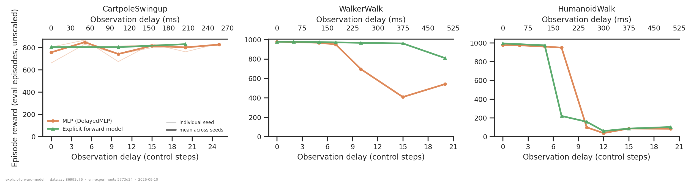
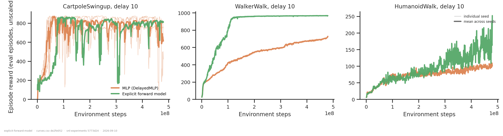
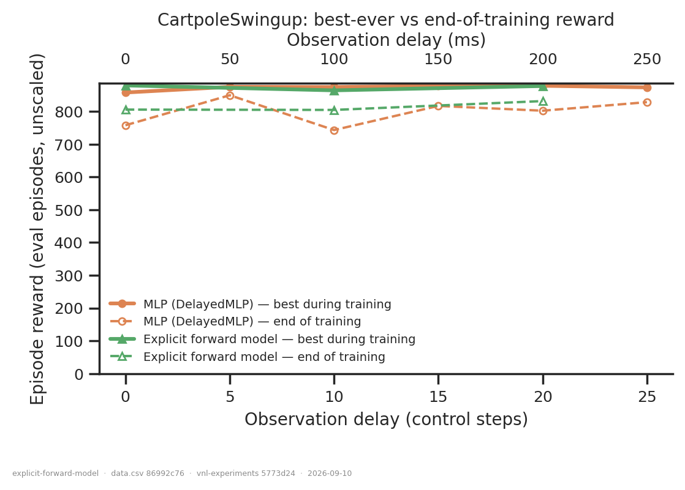

# Does an explicit forward model help under observation delay?

## Question

On three dm_control tasks, does replacing the implicit state estimate inside a delayed
actor with an **explicit** supervised forward model improve performance, and does the
answer depend on the task? An answer is a delay sweep per task where the two arms are
matched in everything but that factor.

## Dataset & comparability

- **Source:** WandB `emiwar-team/nnx-ppo-delays`, selected by the `CONDITIONS` in
  `extract.py` and frozen in `runs.csv`. 47 runs, all trained 2026-09-09/10.
- **Conditions:**

| condition | arm | n runs | tasks | delays |
|---|---|---|---|---|
| `delayed_mlp` | actor MLP on the delayed obs + efference copy; privileged critic | 29 | all three | 0–25 |
| `flat_forward_model` | as above, plus a supervised predictor (delayed obs, action buffer) → current obs, feeding the actor | 18 | all three | 0–20 |

  `efference_length == delay` in **every** run, so both arms are given the same
  information; they differ only in whether the state estimate is built explicitly.

- **Reward reported:** the in-training eval series `eval/episode_reward/mean`, *unscaled*
  and on full-length episodes — i.e. every run is on the **post-`971ab99`** side of the
  eval-env fix (`reward_source = dmc_eval` for all 47). The headline number is the mean of
  the eval points in the **last 50 M steps** (84 points at the 600 k cadence), not the
  final point, which moves by a few percent (README §6). `reward_max` is the best single
  eval point anywhere in training. Every y-axis is raw reward; nothing is normalised.
- **Artifacts used:** `REQUIRES = ["index", "history:hist2000-8b97281e"]` — **47/47, no
  gaps** (`coverage.txt`). Note the non-default spec id: the `history` producer takes the
  WandB project as a spec field defaulting to the *rodent* project, so these were produced
  with `--set project='"emiwar-team/nnx-ppo-delays"'`. Because the project is hashed into
  the spec, control-suite and rodent curves cannot be pooled by accident.
- **Programmatic comparability:** `comparability.txt`, one section per task. **Zero
  `*** VARIES ***` flags** on any invariant, in any task, in either arm: same
  `git_commit`, same `n_envs` / `total_steps` / `learning_rate`, same `summary._step`
  (480 215 040 exactly, all 47), same `reward_scale`, `episode_length`, `ctrl_dt`,
  `min_std`, `entropy_weight`, `critic_hidden_sizes`, eval settings, and the same
  `nnx_ppo` / `vnl_playground` commits.
- **Manual comparability:** all 47 runs are at a single vnl-experiments commit
  (`971ab99e`), so no `git diff` is needed. Run notes were read and are consistent with
  the arm each run was selected into ("Humanoid walk forward model", "New walker walk
  baseline", …). Two selection gates were applied that no tag or run name would reveal,
  each excluding runs that would otherwise have joined silently:
  * **`min_std`.** The cartpole batch contains a `min_std` sweep (0.01–0.2) whose runs are
    named exactly like the defaults. Gated to `min_std == 0.001`.
  * **The eval-env fix.** Twelve cartpole runs at `d168093` evaluated on the *training*
    env, so their `eval/*` is scaled ×10 on truncated episodes. One reports 6147 where its
    post-fix twins report ~830. Excluded. The discriminator is the commit, not
    `created_at` — both sides were created on 2026-09-09.
- **Caveats:**
  * **Single seed on the two locomotion tasks.** WalkerWalk and HumanoidWalk have n=1 per
    (arm, delay) cell — every point on those two panels is one run. Only CartpoleSwingup
    has replication (MLP 2–3 seeds, FM 1). Seeds vary network initialisation; the PPO
    seed is 1234 in every run.
  * **The FM arm is thinner on cartpole**: delays 0/10/20 only, one seed, against the
    MLP's 0–25 across three seeds.
  * Runs are split across A100 and H200 nodes, but **mixed within both arms** in all three
    tasks, so GPU is not confounded with the contrast. It would still confound any
    throughput comparison, which this analysis does not make.
  * HumanoidWalk lost 2 runs to crashes; they are excluded by `state == "finished"` and
    the delays they would have covered are held by other runs.

## Figures

The main result, and it differs by task. **WalkerWalk** (middle) is the clean case: the two
arms are identical to delay 7, then the baseline falls away while the forward model holds
— FM − MLP is +271 at delay 10, +552 at delay 15, +269 at delay 20 (raw reward, on a scale
whose ceiling is ~1000). **CartpoleSwingup** (left) shows no architecture effect at all;
both arms sit near 800 at every delay out to 25, and the visible raggedness is not a delay
trend. **HumanoidWalk** (right) collapses for both arms past delay 5–7, with the forward
model dropping *first* — but see below, that point is one run and is not converged.

Why the panels above look the way they do. On **WalkerWalk** the separation is a
convergence-speed difference that the budget does not resolve: the FM reaches ~970 by
1.2 × 10⁸ steps and is flat thereafter, while the baseline is **still climbing at the end
of training** (+33 reward over the last 10⁸ steps). The delay-10 gap is therefore an
at-this-budget statement, not a ceiling. On **CartpoleSwingup** both arms oscillate
violently for the whole run — repeatedly reaching ~870 and crashing back — which is what
makes any single end-of-training number for that task close to meaningless. On
**HumanoidWalk** neither arm exceeds ~250 of ~1000 and both are still rising, i.e. at
delay 10 neither has learned to walk; the FM is *above* the baseline here.

The supplement that reinterprets the left panel. Best-ever eval reward (solid) is
**flat at 855–881 across all 18 cartpole runs** — every one, both arms, every delay from 0
to 25, found a ~870 solution. End-of-training reward (dashed) sits 60–79 below it on
average and up to 204 below in the worst run. So on CartpoleSwingup a low score is the
policy having *lost* a solution it had, not having failed to find one, and delay up to 25
steps (250 ms) does not prevent the task being solved.

## Tentative conclusion

**It depends on the task, and only WalkerWalk gives a clean answer.**

- On **WalkerWalk** the explicit forward model is clearly better under delay: identical to
  delay 7, then a large and growing advantage. The mechanism visible in the curves is
  speed — the baseline is still improving at 4.8 × 10⁸ steps — so this is evidence that
  the FM *learns the delayed task far faster*, and only weaker evidence that it ends up
  somewhere the baseline could not reach.
- On **CartpoleSwingup** there is no architecture effect to find. The task is solved at
  every delay tested by both arms; what varies is retention, not competence.
- On **HumanoidWalk** the honest reading is that **the experiment does not yet test the
  question**: past delay 5–7 both arms are at 5–25 % of the achievable return and still
  climbing. The apparent FM disadvantage rests on the single delay-7 run, which is not
  converged (still +13 over its last 10⁸ steps from a much lower level) — a training
  failure, not a worse converged policy.

All of this is single-seed on the two locomotion tasks, so treat the WalkerWalk margin as
a strong hint rather than a measured effect size.

## Follow-ups

- **Seeds before anything else.** 2–3 more seeds per cell on WalkerWalk at delays 10–20
  would turn the headline from a hint into a result. Same for the HumanoidWalk delay-7
  point, which currently carries an interpretation on its own.
- **Longer budget on WalkerWalk delay ≥ 10**, to separate "the FM converges faster" from
  "the baseline cannot get there". The baseline's +33 per 10⁸ steps would need roughly
  another 8 × 10⁸ steps to close the delay-10 gap at that rate — a testable prediction.
- **HumanoidWalk needs a different budget or an easier delay grid** before the arms can be
  compared at all; nothing between delay 7 and 20 is informative as it stands.
- **The cartpole instability is its own question.** Best-ever is flat at ~870 while the end
  point swings by up to 204 — worth asking whether it is entropy collapse, and whether the
  `min_std` sweep already in the project (excluded here) answers it.
- The `FlatRecurrent` arm (14 cartpole runs) is a third architecture on the same axis and
  is deliberately out of scope here.

---

*Reproduce:* `../.venv/bin/python analysis/dm_control_suite/explicit-forward-model/extract.py && ../.venv/bin/python analysis/dm_control_suite/explicit-forward-model/plot.py`
(add `--sync --refresh` to the extract to pull in runs added since `runs.csv` was frozen).
