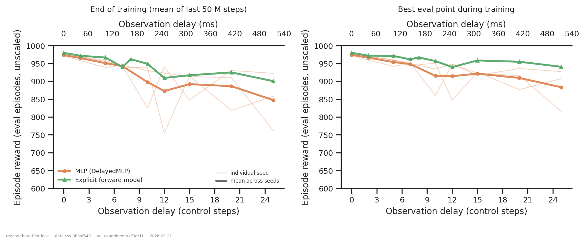
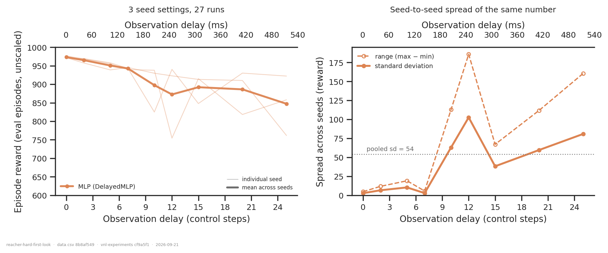
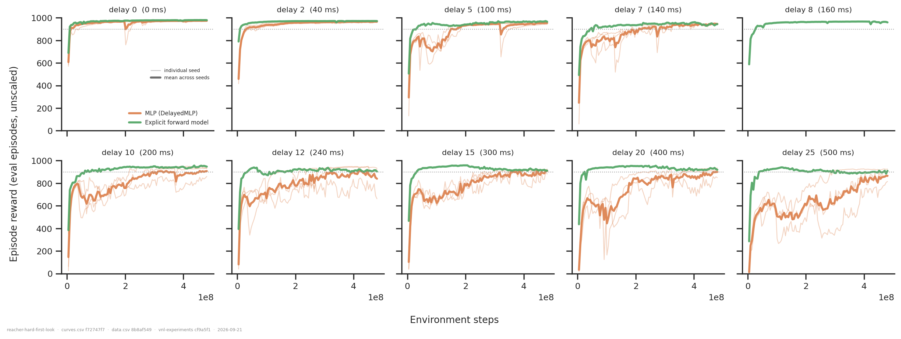
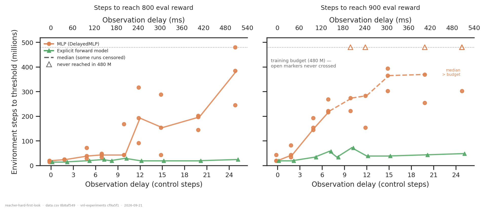

# ReacherHard: delay tolerance, seed spread, and what a forward model buys

## Question

ReacherHard is new to this track — the two-joint planar arm the equilibrium-point model
was posed about, added for the joint-stiffness sweep and not yet written about. Four
questions, off one 37-run cohort:

1. **How much observation delay does it tolerate?**
2. **How large is the seed-to-seed spread**, i.e. how big does a difference have to be
   before it means anything here?
3. **How much does an explicit forward model help?**
4. **How many training steps to reach 900 eval reward, with and without one?**

An answer to (1) is the delay at which end-of-training reward leaves the band set by (2).
An answer to (3) and (4) is a difference between the arms that clears the same band.

## Dataset & comparability

- **Source:** WandB `emiwar-team/nnx-ppo-delays`, selected by the `CONDITIONS` in
  [`extract.py`](extract.py) and frozen in [`runs.csv`](runs.csv). All 37 ReacherHard
  runs in the project as of 2026-09-21; nothing was excluded.
- **Conditions:**

| condition | n | delays | seed settings (init/ppo) | network | commit |
|---|---|---|---|---|---|
| `delayed_mlp` | 27 | 0, 2, 5, 7, 10, 12, 15, 20, 25 | 42/1234, 43/43, 45/45 | `DelayedMLP`, actor 4×256, critic 5×256 | `7bedb5cc` |
| `flat_forward_model` | 10 | 0, 2, 5, 7, **8**, 10, 12, 15, 20, 25 | 42/42 only | same + 4×256 predictor, `fm_loss_weight = 1`, `detach_prediction = True` | `7bedb5cc` |

  `efference_length == delay_k` everywhere, so both arms see the same information and
  differ only in whether the state estimate is built explicitly. Delay 8 exists only in
  the forward-model arm.

- **Reward reported:** `eval/*` — 256 fresh episodes of the same task, 1 000 steps, and
  **unscaled**. Every run is at `7bedb5cc`, well after the `971ab99` eval-env fix
  (2026-09-09), so none of them is on the scaled-and-truncated side of it; the selector
  gates on this rather than assuming it, and `reward_source` is a column with the single
  value `dmc_eval`. Training-side reward still carries `reward_scale = 10` and is not
  plotted. This is *not* a held-out set — there is no clip split in this track — so
  nothing below is a statement about generalisation.
  End-of-training reward is the **mean of the eval points in the last 50 M steps** (11
  points at the 4.8 M cadence), not the run's final point; `reward_last_point` is kept in
  `data.csv` for contrast and differs by up to 40 reward on the unstable runs.
- **Task:** one task, so no cross-task normalisation problem and every y-axis is raw
  reward. ReacherHard's control step is `ctrl_dt = 0.02` → **20 ms**, which is neither the
  25 ms of the Walker/Humanoid tasks nor `style.CTRL_DT_MS`'s rodent 10; the ms axes read
  it off `data.csv`.
- **Artifacts used:** `REQUIRES = ["index", "history:hist2000-8b97281e"]`, **37/37** — see
  [`coverage.txt`](coverage.txt). No gaps, nothing dropped. All 37 history artifacts were
  produced on 2026-09-21, after every run had finished, and each reaches
  `max_step = 480 215 040`, so none is the mid-training snapshot the pipeline README warns
  about.
- **Programmatic comparability:** see [`comparability.txt`](comparability.txt). Every
  invariant is constant across all 37 runs — the three repo commits, all PPO settings,
  `summary._step`, `reward_scale`, `episode_length`, `ctrl_dt`, `servo_kp`, the network
  sizes, the eval settings, and the OS/CUDA/Python stack. One flag varies:
  `repos.vnl_experiments.dirty` is `True` for 35 runs and `False` for 2.
- **Manual comparability:**
  - Configs read directly from the index, not from tags: the arms differ in exactly
    `network_class` and the three predictor fields (`fm_loss_weight`,
    `detach_prediction`, `predictor_hidden_sizes`), and in nothing else.
  - `git_commit` is identical across the cohort, so there is no diff to read. The
    `vnl_experiments.dirty` flag voids the commit in principle, but the two clean runs
    (`asf6fud3` d2 = 971.5, `6wctl1fo` d5 = 966.6) sit exactly on the curve their dirty
    neighbours trace, and `nnx_ppo` and `vnl_playground` — the algorithm and the task —
    are clean for all 37. Treated as a stray working-copy file, not as a code difference.
  - Notes read: `"Reacher Hard baseline."` and `"Reacher Hard forward model."`, matching
    the split.

- **Caveats:**
  - **The forward-model arm is one seed setting.** Its points carry a single run's
    spread, and the baseline's pooled seed sd (below) is the right yardstick for them.
    This is the main limitation of the answer to question 3.
  - **The arms are not parameter-matched.** `FlatForwardModel` adds a 4×256 predictor on
    top of an identical actor and critic, so it is also a larger and slightly more
    expensive network. Nothing here separates "an explicit prediction helps" from "more
    parameters help".
  - **Preemption is not balanced across the arms.** All nine baseline runs at
    seed 42/1234 and three at 43/43 were killed and requeued; seed 45/45 and all ten
    forward-model runs ran straight through. **Checked, and it does not explain the
    result:** resumed runs average 924.5 reward against 909.8 for the rest — the wrong
    sign and well inside the seed spread — and the worst run in the cohort (`cwlddpw2`,
    delay 12, 754) was already sitting at ~770 for 50 M steps *before* its 300 M resume,
    so its collapse is not a resume transient. `n_restarts` and `resumed_from_step` are
    columns in `data.csv` if this needs revisiting.
  - **GPUs vary** (A40, A6000, A100, H200, RTX PRO 6000). Irrelevant to everything below,
    which is measured in reward and in environment steps, never in wall clock.
  - Question 4's crossings are called on a **trailing 3-point mean**, not a single eval
    point. The naive single-point criterion is also in `data.csv`
    (`steps_to_900_first_point`) and dates every crossing a median of 9.6 M steps
    earlier; it changes no conclusion.

## Figures

**Q1 and Q3.** Left, what the run was left with; right, the best it ever was. The
baseline falls gently to delay 7 and then both drops and fans out. The right panel is
the one to read for the forward model: its *best* is nearly flat at 940–980 across the
whole delay range, while the baseline's best falls to ~885 — but the individual baseline
seeds (thin lines) straddle the FM curve at every delay past 10.

**Q2.** The spread is not a constant. Up to delay 7 the three seeds agree to within
3–10 reward; from delay 10 on, the standard deviation is 38–103 and the range up to 186.
The dotted line is the pooled sd, 54 reward (5.9 % of the grand mean) — that is the
noise floor for a single run on this task, and it is almost entirely contributed by the
long-delay half of the axis.

**Q4, as a shape.** This is the clearest panel in the folder. At every delay the forward
model is at ~950 within ~30 M steps and stays there; the baseline climbs for hundreds of
millions of steps and, past delay 10, is still climbing at 480 M. The two arms are not
converging to different places so much as arriving at different times.

**Q4, as a number.** Individual runs, with the five baseline runs that never crossed 900
drawn as open triangles on the budget line — they are failures, not slow successes, and
are not averaged away. At delay 0–2 the arms are level; from delay 5 the baseline's
crossing time grows roughly linearly with delay while the forward model's barely moves.

## Answers

**1. Delay tolerance.** Free to about **7 control steps (140 ms)**: 973 → 943 reward, a
3 % loss, with the three seeds agreeing to within 6. Past that the task does not so much
degrade as become unreliable — the mean sags to 850–900 while the seed spread grows an
order of magnitude. Even at delay 25 (500 ms) a good seed still reaches 922, so the
ceiling is not obviously gone; what is gone is the guarantee of getting there. Lifespan
is 1 000 for every run at every delay, so none of this is early termination.

**2. Seed-to-seed spread.** Pooled within-delay sd **54 reward (5.9 %)**, but strongly
delay-dependent: **~5 reward (0.5 %) at delay ≤ 7** and **40–100 reward (5–11 %) at
delay ≥ 10** — see [`seed_spread.txt`](seed_spread.txt) for the per-delay table. Two
practical consequences: a single-seed curve is an adequate description of this task at
short delay and a poor one at long delay, and any long-delay difference under ~50 reward
needs more than one seed per point to be worth discussing. Steps-to-threshold is noisier
still: at delay 15 the three baseline seeds cross 900 at 303 / 365 / 394 M.

**3. The forward model.** On **final reward**, +6 to +53 (mean +26 over the shared
delays), with the whole benefit at delay ≥ 10 — but that is **0.4–0.8 of the baseline's
seed sd** there, from a single FM seed. Suggestive, not established. On **best-ever
reward** the picture is cleaner: the FM holds 940–958 from delay 12 to 25 where the
baseline mean is 883–922, and the FM's curve is essentially flat in delay, which no
baseline seed is. Both arms lose 20–40 reward between their best and their last 50 M at
delay ≥ 12, so late instability is a property of the task at long delay, not of either
architecture.

**4. Steps to 900 eval reward.** This is where the forward model is unambiguous.

| delay | 0 | 2 | 5 | 7 | 8 | 10 | 12 | 15 | 20 | 25 |
|---|---|---|---|---|---|---|---|---|---|---|
| baseline, median (M steps) | 19 | 43 | 154 | 221 | – | 274 | 283 | 365 | 370 | > 480 |
| baseline, runs that never got there | 0/3 | 0/3 | 0/3 | 0/3 | – | 1/3 | 1/3 | 0/3 | 1/3 | 2/3 |
| forward model (M steps) | 19 | 19 | 34 | 58 | 34 | 72 | 39 | 39 | 43 | 48 |
| speed-up | 1.0× | 2.2× | 4.6× | 3.8× | – | 3.8× | 7.3× | 9.5× | 8.5× | > 10× |

The forward model reaches 900 in **19–72 M steps at every delay**, with no trend worth
speaking of; the baseline's requirement grows from 19 M to beyond the 480 M budget. At
delay 15 the gap is 39 M against 303 / 365 / 394 M — roughly seven baseline seed
standard deviations, so unlike the final-reward difference this one is far outside the
single-seed caveat. Read the 1.0× at delay 0 as the control it is: with no delay there is
nothing for a predictor to predict, and the two arms behave identically.

## Tentative conclusion

ReacherHard tolerates ~140 ms of observation delay essentially for free, and past that
degrades mainly by becoming unreliable rather than by lowering its ceiling — the seed
spread grows about tenfold while the mean falls ~10 %.

Against that, the explicit forward model's effect on **final competence is inside seed
noise** and cannot be called from one seed, while its effect on **learning speed is
large and robust**: roughly 4–10× fewer steps to 900 reward at delay ≥ 5, and it removes the
delay-dependence of learning time almost entirely. The natural reading is that the
predictor is not enabling a solution the MLP cannot represent, but supplying the state
estimate that the MLP otherwise has to discover for itself — and the cost of that
discovery is what grows with delay. That reading is consistent with the data here but is
not tested by it.

## Follow-ups

- **Two more forward-model seeds** (43/43 and 45/45, delays 10–25). ~5 runs × ~30 min on
  an H200 buys the single thing this folder cannot currently say: whether the +26 reward
  at long delay is real. This is the highest-value next run by a distance.
- **Fill delay 8 in the baseline**, so the FM arm's extra point is matched.
- **Push the delay axis past 25.** Nothing here has found the wall: the FM is still at
  900 at delay 25 and the baseline's best seed at 922. Delays 35 / 50 / 75 would locate
  where each arm actually fails.
- **A `FlatRecurrent` arm.** The third architecture in this track is absent from
  ReacherHard, and "learn the state estimate implicitly over time" is the obvious
  alternative to predicting it explicitly.
- **Parameter-matched control.** A `DelayedMLP` with the predictor's parameters added to
  its actor would separate "explicit prediction" from "more capacity".
- Compare with the sibling [`explicit-forward-model/`](../explicit-forward-model/) result
  on CartpoleSwingup / WalkerWalk / HumanoidWalk — if the FM's benefit is learning speed
  rather than final competence there too, the two folders are one finding.

---

*Reproduce:* `../.venv/bin/python analysis/dm_control_suite/reacher-hard-first-look/extract.py && ../.venv/bin/python analysis/dm_control_suite/reacher-hard-first-look/plot.py`
(add `--sync --refresh` to the extract to pull in runs added since `runs.csv` was frozen;
the `history` artifacts come from
`python -m vnl_experiments.artifacts ensure --kind history --runs analysis/dm_control_suite/reacher-hard-first-look/runs.csv --set project='"emiwar-team/nnx-ppo-delays"'`).
