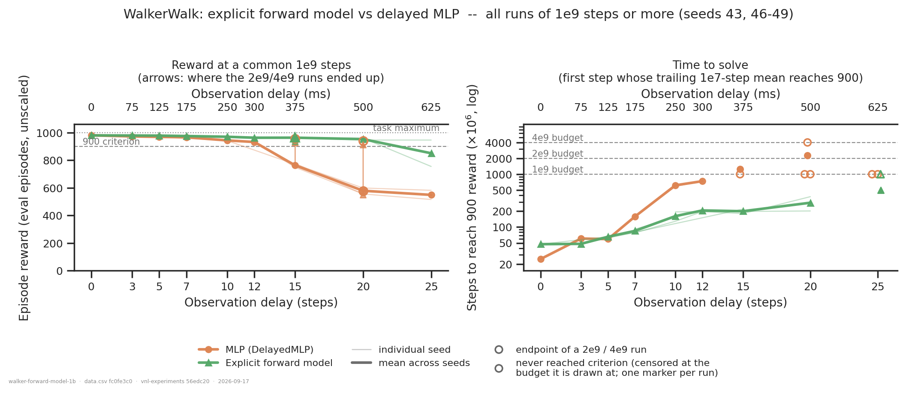
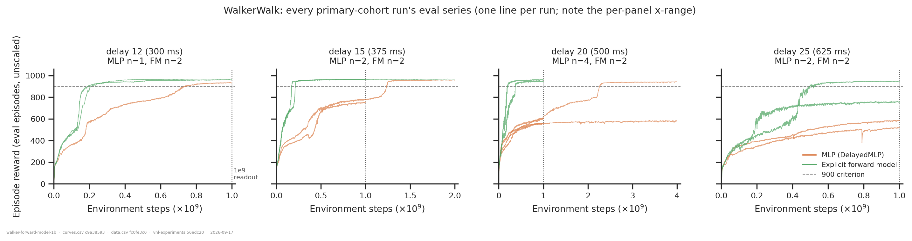
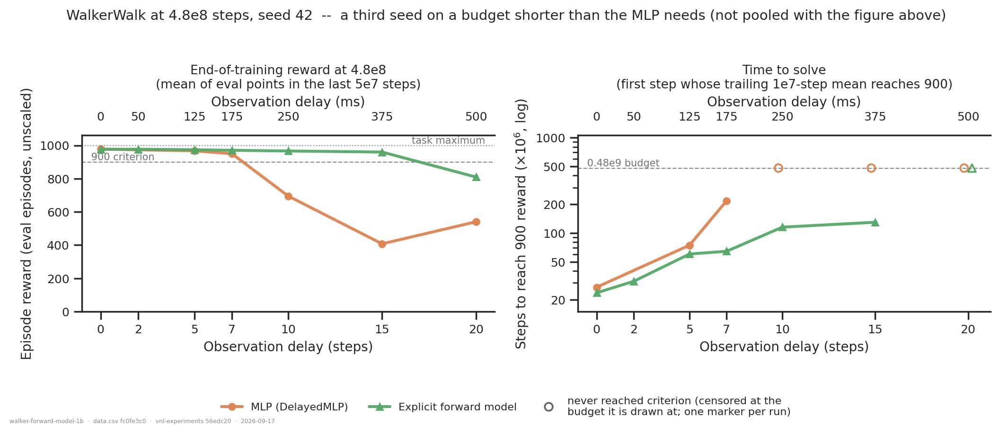
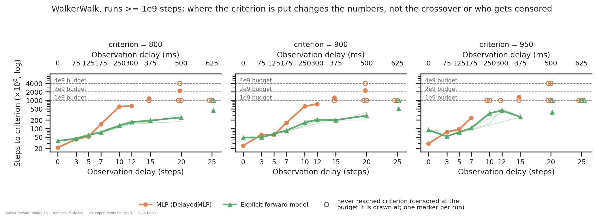

# WalkerWalk: how much delay does an explicit forward model absorb, and how much sooner does it solve the task?

## Question

On WalkerWalk, does replacing the implicit state estimate inside a delayed actor with an
**explicit** supervised forward model (a) raise the delay the policy can absorb, and
(b) shorten the training needed to solve the task?

An answer is two delay sweeps in which the arms are matched in everything but that factor:
one of reward at a common budget, one of **time to criterion**. The sibling folder
[`../explicit-forward-model/`](../explicit-forward-model/) asked (a) at 4.8e8 steps and had
to report its WalkerWalk answer as "at this budget" only, because its baseline was still
climbing at the end of training. This folder is the follow-up: a 1e9-step primary cohort,
plus four runs taken to 2e9 and 4e9 specifically to settle whether the baseline's failure
at high delay is slowness or incapacity.

**It is slowness.** That is the main change from the previous version of this analysis,
and it is a change of conclusion rather than of error bars — see *Tentative conclusion*.

## Dataset & comparability

- **Source:** WandB `emiwar-team/nnx-ppo-delays`, selected by the `CONDITIONS` in
  `extract.py` and frozen in `runs.csv`. 45 runs, 2026-09-09 → 2026-09-16.
- **Conditions:** two arms, faceted by cohort. `efference_length == delay_k` in **every**
  run, so both arms are given the same information and differ only in whether the state
  estimate is built explicitly.

| condition | cohort | n | budgets | seeds | delays | network |
|---|---|---|---|---|---|---|
| `delayed_mlp` | primary | 16 | 1e9 ×12, 2e9 ×1, 4e9 ×2 (+1 at 1e9) | 43, 46, 47, 49 | 0, 3, 5, 7, 10, 12, 15, 20, 25 | `DelayedMLP`: actor on delayed obs + efference copy; privileged critic |
| `flat_forward_model` | primary | 15 | 1e9 ×14, 2e9 ×1 | 43, 46, 47, 48 | 0, 3, 5, 7, 10, 12, 15, 20, 25 | `FlatForwardModel`: as above + supervised predictor (delayed obs, action buffer) → current obs, `fm_loss_weight = 1`, `detach_prediction = True` |
| `delayed_mlp` | support | 6 | 4.8e8 | 42 | 0, 5, 7, 10, 15, 20 | as above |
| `flat_forward_model` | support | 8 | 4.8e8 | 42 | 0, 2, 5, 7, 10, 15, 20 | as above |

  **The primary grid has no holes** — both arms at all nine delays. (The previous version
  of this analysis was missing a forward-model run at delay 5; `hy37byf0` fills it, and
  delays 3, 7 and 12 are new on both arms.) `extract.py` asserts the arm-defining
  `net_params` per condition, so a mislabelled condition is an error, not a caveat.

- **Reward reported:** the in-training eval series `eval/episode_reward/mean` — **unscaled
  and on full-length episodes**, i.e. every run is on the post-`971ab99` side of the
  eval-env fix (`reward_source = dmc_eval` for all 45). Note what this is *not*: there is
  no clip split in this track, so an eval episode is a fresh episode of the **same**
  distribution the policy trained on. Nothing here is held out, and nothing here is a
  generalisation result.
  - **`reward_at_1b`** — the mean of the eval points in `(9.5e8, 1e9]`. This is what the
    main figure plots, and it is what makes the 1e9/2e9/4e9 runs one comparable cohort.
    That rests on there being no schedule of any kind: `nnx_ppo.algorithms.ppo` builds
    `optax.adam(learning_rate=<scalar>)` with `learning_rate = 1e-4`, and `total_steps`
    enters nothing but the loop bound — so a 4e9 run's weights at 1e9 come from exactly
    the process a native 1e9 run ran. I checked that mechanically rather than taking it on
    trust, and the data agree: the 2e9 MLP at delay 15 reads 777 at 1e9 against the native
    1e9 run's 749, and the 4e9 MLP runs at delay 20 read 555 and 606 against the native
    runs' 555 and 599.
  - **`reward_final`** — the same window at the end of whatever the run actually ran.
    Equal to `reward_at_1b` for a 1e9 run; for the four longer runs the *pair* is the
    interesting object, and the main figure draws it as an arrow.
  - **`steps_to_900`** — the first step at which the trailing 1e7-step mean reaches 900,
    over the run's **full** length.
  - Raw reward on every reward axis; nothing normalised, and the task maximum (1e3 by
    construction) drawn as a reference line rather than divided through.
- **Task:** WalkerWalk only, so no across-task pooling arises. `ctrl_dt = 0.025` in all 45
  runs, so one delay step is 25 ms and the sweep spans 0–625 ms; `plot.py` asserts this
  against `data.csv` rather than trusting `add_ms_axis`'s rodent default of 10 ms.
- **Artifacts used:** `REQUIRES = ["index", "history:hist2000-8b97281e"]` — **45/45, no
  gaps** (`coverage.txt`). The non-default spec id is deliberate (the `history` producer's
  project is a spec field defaulting to the *rodent* project) and is the same id the
  sibling folder used, so the 4.8e8 curves here are literally the same bytes that analysis
  read.

### The "solved" criterion

**900 is this project's convention, not a published standard.** dm_control returns are
bounded in [0, 1000] by construction and the benchmark literature reports curves rather
than declaring a task solved, so there was no number to inherit. 900 sits clearly above
where these runs plateau when they fail (515–777) and clearly below where they plateau
when they succeed (932–981), and both arms reach ~980 at delay 0, so it is not a bar the
architecture question itself sets. The sensitivity figure shows 800 and 950 as well.

The estimator is a **trailing** 1e7-step mean, not a single eval point (which fires on
noise) and not a centred window (which reads the future). The window is in *steps*, not
samples, which matters because this cohort spans three eval cadences.

### Comparability verdict

**Programmatic** (`comparability.txt`). The file is split into INVARIANTS — things that are
*wrong* if they vary — and DESIGN AXES, which are expected to. **Both cohorts' INVARIANTS
sections are completely clean: zero `*** VARIES ***`, in either arm.** That covers every
PPO setting, `reward_scale`, `episode_length`, `ctrl_dt`, `sim_dt`, `impl`, `servo_kp`,
`min_std`, `entropy_weight`, both network size lists, `normalize_obs`, `activation`,
`initializer_scale`, `std_scale`, both eval settings, and the `vnl_playground` commit.

Five things vary by design, and each needed its own check:

**1. Budget (1e9 / 2e9 / 4e9 in the primary cohort).** Handled by reading reward at a
common 1e9 — see above. Time-to-criterion is budget-independent for a run that crosses,
and for one that does not, *how much* budget it had is part of the claim, so the figure
parks each censored run at its own budget rather than on a shared line.

**2. Code identity.** `git_commit` spans four commits in the MLP arm and two in the
forward-model arm, `repos.nnx_ppo.commit` two, and `repos.vnl_experiments.dirty` is `True`
on 23 of 45 runs — which per README §6 voids the hash outright, so the hashes cannot be
the argument. I read every diff in the span: the camera commit is render-path only; the
nnx-ppo commit adds non-finite counters and a `check_diagnostics` that raises, with
`optimizer.update` called identically; `b487eed` adds requeue/`resume_reset`; `7bedb5c`
changes only the eval/video cadence; `540e356` adds `servo_kp`, inert here (next point).
That leaves one change that could alter a trajectory — `9e216ae`'s `NaNGuardWrapper` — and
only on a step where MJX has already diverged.
[`nan_guard_inert.py`](nan_guard_inert.py) tests whether that ever happened, using the
fact that the guard produces a *termination* while a healthy WalkerWalk episode can only
be *truncated*: `max(done_rate − truncation_rate) = 0.000e+00` across every logged
iteration of **all 45 runs** ([`nan_guard_inert.txt`](nan_guard_inert.txt)). No run ever
diverged, so the guard never fired, and every stack in the cohort is functionally
identical on these runs. That is stronger than a clean hash and, unlike a hash, it
survives `dirty = True`.

**3. Servo control (`servo_kp`, `servo_center`).** Since `540e356` the dm_control envs take
a `servo_kp` that rewrites the torque motors as position servos — a different plant. The
gate is hard: `servo_kp > 0` cannot enter. `servo_kp == 0` *is* admissible and this is not
a judgement call — `actuator_mode.apply_servo` returns at `if kp == 0.0: return env`
before writing any field or re-running `put_model`, so it is the shipped env bit-for-bit,
identical to the older runs where the key is absent. All 45 runs are `servo_kp` ∈ {absent,
0}. Note that `servo_center` (`qpos0` on the new runs, absent on the old) is therefore
inert, not a second difference.

**4. The `walker-joint-stiffness` cohort is excluded on design grounds, not physics.**
That folder's `servo_kp` sweep contains its own `servo_kp = 0` baselines, which the
physics gate above would *admit*. They are excluded anyway: they are MLP-only at delays 0
and 5 on one seed at 4.8e8, so letting them in would add n=5 and n=4 to two cells of one
arm at the two delays where nothing happens, against n=1 in the arm they'd be compared to.
Several are named *exactly* like the defaults (`WalkerWalk_DelayedMLP_delay0_eff0`) — the
`min_std` trap in a new guise — so the gate uses two independent fingerprints (the
`env-override` tag and `servo_center == "range"`) and asserts they agree. Scoped to this
question's candidate pool on purpose: checked project-wide the assertion already fails, on
two **HopperHop** runs that carry `env-override` with `servo_center = "qpos0"`, so on that
task the tag alone would be the wrong gate.

**5. Eval cadence, and the requeue interaction.** Three *measured* spacings are in the
cohort — 4.92e5, 7.37e5 and 4.92e6 steps (2, 3 and 20 PPO iterations; none equals the
configured value, because evals land on iteration boundaries). Worse, **a requeued run's
`config.eval.every_steps` describes only its last attempt**: the three runs that straddled
the 2026-09-15 cadence change log `4.8e6` but evaluated their early portion at the fine
cadence, switching at 1.45e9 (`ayruh7m9`), 9.3e8 (`wh2fofyc`) and ~1.0e9 (`o3lsdt1n`). So
`data.csv` records the configured value and the measured median as separate columns, and
only the second describes the curve. A trailing window in steps means the same thing at
any cadence, but it is built from ~17 eval points at the fine spacing and ~2 at the
coarse one, so [`cadence_bias.py`](cadence_bias.py) measures the consequence directly:
every fine-cadence run is resampled onto the coarse grid and its crossing recomputed, each
run acting as its own control. Median shift **+2.0e6 steps** (range −2.5e6 to +5.9e6) —
1.6 % of the median crossing time — and it goes to **+0.0e6** when the window is widened.
It is also *positive*, i.e. a coarse grid rounding up to its own grid points, which is
granularity; a noise-driven bias would be negative and would shrink with a wider window.
Verdict in [`cadence_bias.txt`](cadence_bias.txt); the estimator is left alone.

**Manual.** I inspected the run configs directly rather than trusting tags or names, read
every run's notes (which is how the kp sweep and the requeue tests were identified), read
the commit diffs as above, and confirmed the three shared-code repos. GPU model is mixed
**within both arms** (primary: MLP 7×A100-80 + 1×A40 + 8×H200; FM 1×A100-40 + 4×A100-80 +
1×A40 + 9×H200) and so is requeue status (MLP 3 of 16, FM 3 of 15), so neither is
confounded with the contrast. Resume transients were looked for directly in the eval
series at each recorded resume step, not assumed small: `wh2fofyc` reads 962–964
continuously across its resume at 9.3e8, with no step and no dip.

### Caveats

- **Two seeds per cell at most, and several cells are n=1.** Delays 0, 3 and 12 (MLP) and
  0, 3, 5 (FM) are single runs. Treat every margin as an effect *direction* with a rough
  size, not as a measured effect size.
- **Time-to-criterion is heavy-tailed across seeds, and the only 3-seed estimate of that
  comes from outside this cohort.** [`walker-joint-stiffness`](../walker-joint-stiffness/)
  contains three `servo_kp = 0` MLP runs at delay 5 on seeds 50/51/52 — physics-identical
  to this cohort (see gate 4 above) but excluded from it on design grounds. They are the
  only place in the project with three seeds in one time-to-criterion cell, and they cross
  at **72, 72 and 192 Me steps**: a 2.7× spread. It is not a smoothing artefact —
  `p513kfj5` genuinely climbs smoothly (703 → 937 between 5.3e7 and 2.0e8) where its
  siblings jump by 6.7e7. Their end-of-training rewards agree to within 3.3 (961.8–965.1),
  so it is *specifically* the crossing time that is noisy, not the level. Consequence: the
  small-delay speed ratios below (≈1.9× at delay 7, 3.8× at 10, 3.6× at 12) are **not
  safely outside seed noise** and should be read as "the forward model is faster" without
  a number. The large ones (6.2× at delay 15, 7.9× at 20) and the censoring pattern
  survive a 2.7× spread comfortably.
- **Delay 20 is where the seeds disagree most, and it is the load-bearing cell.** Of the
  two MLP runs given 4e9 steps, one crosses the criterion at 2.27e9 and ends at 941; the
  other never crosses, ends at 578, and its smoothed curve never exceeds 582. So "the MLP
  solves delay 20 in ~2.3e9 steps" describes one of two seeds. The figure shows both.
- **Delay 25 has no extended run on either arm**, so the MLP's failure there is still
  only "not within 1e9 steps" — the weaker statement the extended runs retired at delays
  15 and 20. Same for the one forward-model seed that stalls at 755 there.
- **Reward at 1e9 for the 2e9/4e9 runs is a mid-training readout of those runs**, which is
  legitimate (no schedule, cross-checked above) but means the arrows in the main panel are
  the only place their actual endpoints appear. Do not read the arrowheads as part of the
  mean line.
- **Learning here is a phase transition, not a ramp** (see the training curves), so
  time-to-criterion is really time-to-transition — a high-variance quantity, and one that
  linear extrapolation predicts badly. Quantified this round: the previous version of this
  report extrapolated the MLP's residual slope at delay 15 to a crossing at ~2.8e9. It
  actually crossed at 1.24e9, i.e. the linear guess was 2.3× too pessimistic. The caution
  was right and the direction is worth remembering.
- **The time-to-criterion axis is logarithmic.** §7's raw-value preference is about
  *reward*, which is not linear in competence; steps are a physical count where ratios are
  exactly what is meaningful, and the quantity spans two decades. One consequence: the
  mean line is an arithmetic mean drawn on a log axis, so it sits above the visual midpoint
  of its seeds. Every ratio quoted below comes from per-run values, not from that line.
- **The 4.8e8 cohort is never averaged with the primary one**, only faceted. Its MLP is
  short of the budget it needs at almost every delay, and it is single-seed enough to break
  monotonicity (408 at delay 15, 540 at delay 20). Read it for direction, not shape.
- `reward_at_1b` averages 83 eval points at the fine cadence and 11 at the coarse one.
  Plateau reward has a tiny spread (run-summary std 2–11), so this is not a concern for
  the reward panels; it is only the crossing estimator that needed the check above.

## Figures

The main result. **Left:** at a common 1e9 steps the arms are within 10 reward of each
other out to delay 7, then separate — FM − MLP is +26 at delay 10, +31 at 12, +201 at 15,
+374 at 20, +302 at 25, on a scale whose maximum is 1000. The arrows are the four extended
runs: the MLP at delay 15 goes 777 → 957 when given 2e9 steps, and one of the two MLP runs
at delay 20 goes 606 → 941 at 4e9 while the other only reaches 578. **Right:** the same
contrast as a learning cost, log axis. The crossover is at delay 5–7: the MLP reaches the
criterion sooner at delay 0 (25 vs 47 Me steps — the predictor is overhead when there is
nothing to predict around) and is level at 3–5, then falls behind and keeps falling —
159 vs 78/91 Me at delay 7, 589/646 vs 129/194 at 10, 741 vs 197/216 at 12, 1244 vs
180/219 at 15, 2271 vs 202/376 at 20. Open markers are runs that never reached the
criterion, each at its own budget: two MLP runs censored at 1e9 at delay 20 say much less
than the one censored at 4e9 beside them.

The mechanism, and the figure that carries the new conclusion. Learning on this task is a
**step transition** — the walker finds gait and jumps from ~600 to ~950 within a few tens
of millions of steps — so the architecture's effect is on *when that arrives*. At delay 15
both MLP runs sit at ~780 through 1e9 (which is all the previous version of this analysis
could see) and the one with a 2e9 budget then transitions at ~1.25e9 to 957. At delay 20,
four MLP runs track together to ~580, and of the two taken to 4e9 one transitions at
~2.3e9 and the other is still flat at 578 when the budget runs out. The green curves have
been flat since ~0.2–0.5e9 in every panel.

The independent replication, on a third seed and a single code stack. Same direction, with
the crossover between delay 7 and 10 rather than 5 and 7 — about the size of the seed
spread. Its levels are *not* comparable to the panels above: its MLP is 2.1–8.3× short of
the budget it needs, which is why its delay-10 gap (+271) is ten times the primary
cohort's (+26). That discrepancy is the reason this folder exists.

The criterion is arbitrary, so this checks what depends on it. The crossover location and
who gets censored are the same at all three bars; what moves is the numbers and how many
forward-model cells survive at the far end. At delay 0–5 the two arms swap places between
the 800 and 950 panels, which is within the seed spread — so the low-delay ordering is not
something to claim, and the report does not.

## Tentative conclusion

**The explicit forward model buys a large amount of delay tolerance on WalkerWalk, and the
mechanism is speed of learning. The baseline is slower, not incapable — and that is a
change from the previous version of this analysis, which could only say "not within 1e9
steps".**

What the data shows:

- Up to delay ~5 (125 ms) the architectures are indistinguishable in reward, and the
  forward model is if anything slightly *slower* to the criterion (47 vs 25 Me steps at
  delay 0).
- From delay 7 (175 ms) on, the forward model dominates on both readouts, and the gap
  grows in time-to-criterion: roughly 1.9× at delay 7, 3.8× at 10, 3.6× at 12, 6.2× at 15
  and 7.9× at 20 (per-run values, not the log-axis mean). **Only the last two of those
  ratios are safely outside seed noise** — see the 2.7× within-cell spread in the caveats.
  Below delay 15 the defensible claim is the direction, not the factor.
- **The MLP does eventually solve the delayed task.** Given 2e9 steps it crosses at delay
  15 (1.24e9, ending at 957); given 4e9 one of two seeds crosses at delay 20 (2.27e9,
  ending at 941). So the previous "cannot get there" ambiguity is resolved in favour of
  slowness, at least out to delay 20.
- The forward model has converged at every delay it solved; the MLP had not, at any delay
  ≥ 15, within 1e9 — which is exactly why the extended runs were needed.

What it suggests but does not establish:

- **That delay 20 is reliably solvable by the MLP.** One of the two 4e9 runs never got
  there and was not close (582 smoothed maximum), so the honest statement is that the MLP
  solves delay 20 in ~2.3e9 steps *sometimes*. With n=2 there is no way to say how often.
- **That delay 25 is solvable by the MLP at all.** Nothing past 1e9 was run there, so that
  cell is still only censored-at-1e9.
- That the two arms converge on the same behaviour where both succeed. Reward at ~950
  cannot distinguish two gaits.

Every margin above rests on one or two seeds per cell, so none should be quoted as an
effect size.

## Follow-ups

- **A second and third seed at delay 20 with a 4e9 budget** is now the highest-value run
  in the sweep: it is the only cell where the arms' *qualitative* answers differ between
  seeds, and it currently decides how the headline is phrased.
- **Delay 25 past 1e9**, on both arms — for the MLP to test whether slowness keeps
  extending, and for the forward model because one of its two seeds stalls at 755 there
  and looks like a run whose transition had not yet arrived.
- **Seeds at delays 0, 3 and 12**, which are n=1 per arm and carry the crossover.
- **Report the predictor's own loss against delay.** If the advantage is that the forward
  model transitions sooner, the natural next question is whether the predictor's accuracy
  at the moment of transition is what gates it. `fm_loss` is logged but is not in the
  pinned `history` spec, so this needs a spec change (and a new `HISTORY_SPEC_ID`).
- **Is the phase transition the same event in both arms?** A video or a gait readout either
  side of the transition would say whether the two architectures converge on the same gait.
- The MLP's transition time looks roughly exponential in delay (25 → 59 → 159 → 617 →
  741 → 1244 → 2271 Me steps for delays 0 → 20). Worth fitting properly, since it predicts
  where the MLP becomes untrainable in practice rather than in principle — but not before
  the delay-20 cell has more than two seeds.
- `FlatRecurrent` is a third architecture on this axis and is deliberately out of scope
  here; it is the obvious third arm for the same two panels.

---

*Reproduce:* `../.venv/bin/python analysis/dm_control_suite/walker-forward-model-1b/extract.py && ../.venv/bin/python analysis/dm_control_suite/walker-forward-model-1b/plot.py`
(add `--sync --refresh` to the extract to pull in runs added since `runs.csv` was frozen;
`--check` to verify the committed CSVs rebuild identically). Two comparability checks live
beside them and are not part of the rebuild: `nan_guard_inert.py` (needs network and WandB
auth) and `cadence_bias.py` (reads `curves.csv` only).
