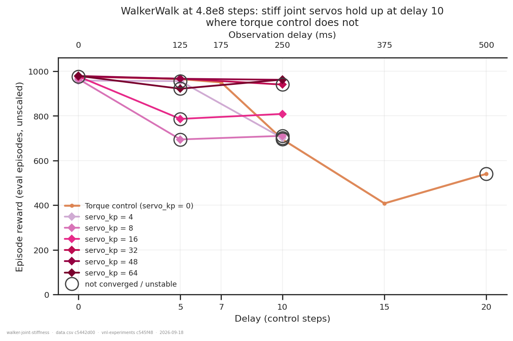
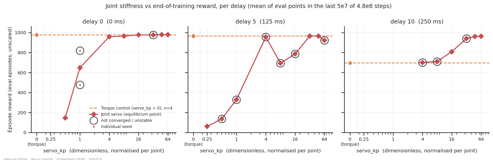
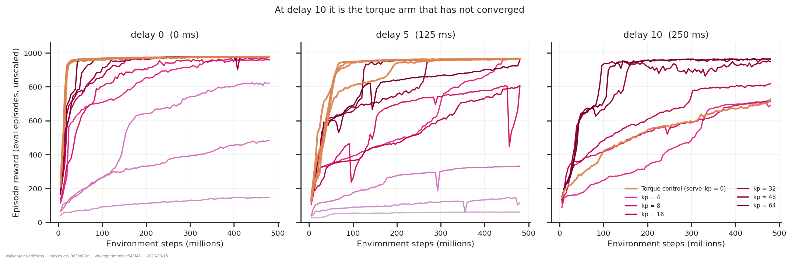
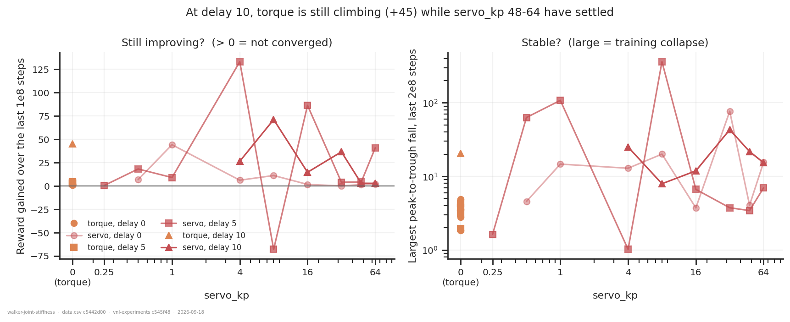
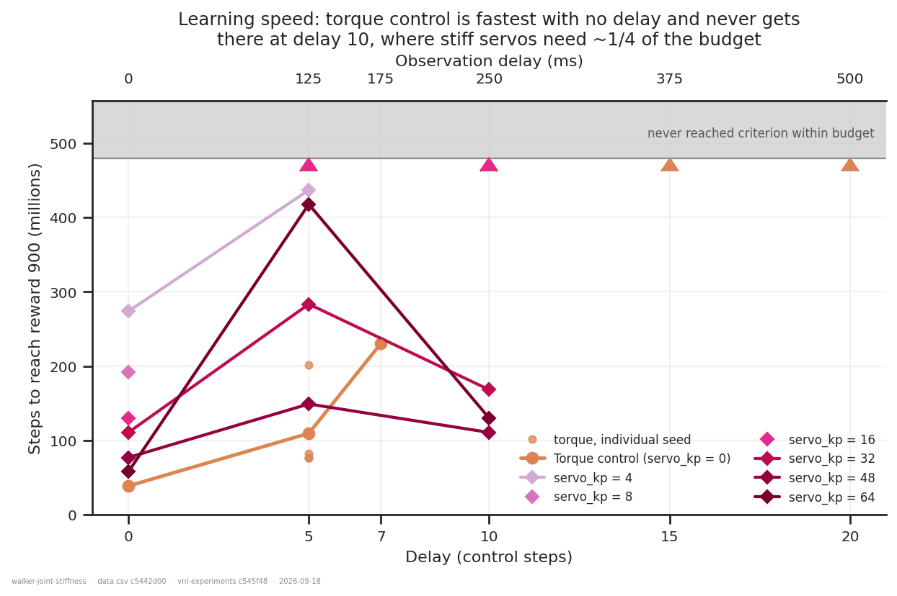
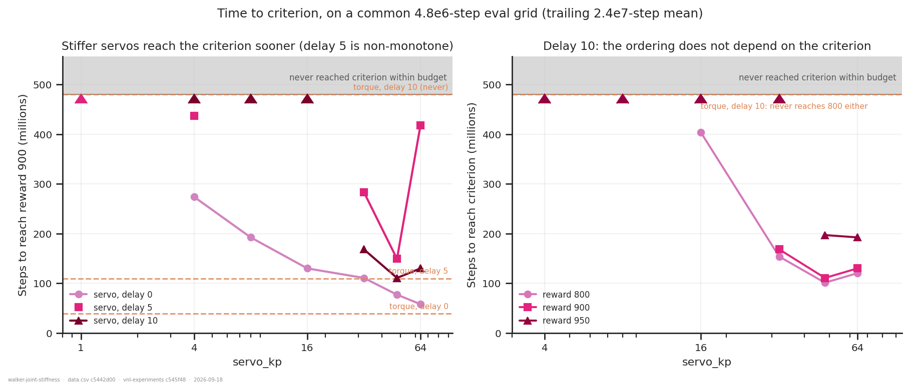

# WalkerWalk: does joint stiffness buy tolerance to sensorimotor delay?

## Question

`servo_kp` turns WalkerWalk's torque motors into equilibrium-point position servos
(`vnl_experiments/envs/servo_control.md`), making the actuator the only *undelayed*
feedback path in a system whose policy sees a `delay_k`-step-stale observation. The
equilibrium-point hypothesis predicts that this peripheral loop absorbs delay — and
specifically that it should help **once the servo is faster than the delayed central
loop**, and not before.

An answer is: a stiffness band where the servo is viable, and a delay at which stiff and
torque control measurably diverge.

**Headline: at delay 10 (250 ms) and a matched 4.8e8-step budget, `servo_kp` 48–64 reach
961–962 where torque control reaches 695 — and the benefit appears exactly at the stiffness
where the servo becomes faster than the delayed loop. The size of that gap is
budget-sensitive; see the caveat.**

## Dataset & comparability

- **Source:** WandB `emiwar-team/nnx-ppo-delays`, selected by `CONDITIONS` in `extract.py`
  and frozen in `runs.csv`. Selection is on the *configuration* — task, network, budget,
  `min_std`, post-eval-fix commit — never on the run name or the WandB note.
- **Conditions:** 36 runs, all WalkerWalk / DelayedMLP / 4.8e8 steps.

| condition | n | `servo_kp` | delays | seeds | launches |
|---|---|---|---|---|---|
| `torque` | 12 | 0 (model unpatched) | 0, 5, 7, 10, 15, 20 | 42, 50, 51, 52 | both |
| `servo` | 24 | 0.25 – 64 | 0, 5, 10 | 50 (52 at kp=1) | kp sweep |

- **Reward reported:** `eval/episode_reward/mean` — **unscaled and full-length**; every run
  is post-`971ab99`, so no run from the scaled/truncated eval era is present. Reduced to
  `reward_final`, the **mean of the eval points in the last 5e7 of 4.8e8 steps**, not the
  final point (README §6). All y-axes are raw reward; no normalised axis anywhere.
  This track has no held-out set — a dm_control "eval" is a fresh episode of the same task
  — so none of these numbers is a generalisation measure.
- **Tasks:** WalkerWalk only. No cross-task comparison.
- **Artifacts:** `REQUIRES = ["index", "history:hist2000-8b97281e"]`. **Coverage 36/36 in
  both conditions**; every `history` artifact reaches `max_step = 480215040`, so none is a
  mid-training snapshot.
- **Budget is pinned at 4.8e8, not faceted.** Torque runs exist at 1e9/2e9/4e9 and are
  tempting as extra baseline, but the servo arm was never run at those budgets and the two
  arms learn at visibly different rates — admitting them would make budget the confound.
  They appear below as a *ceiling*, never in a figure.

- **Programmatic comparability:** `comparability.txt` flags `git_commit`,
  `repos.nnx_ppo.commit` and `config.eval.every_steps` inside the `torque` condition, and
  nothing else. That is the two-launch pooling described next; every optimisation
  hyperparameter, `reward_scale`, `episode_length`, `ctrl_dt`/`sim_dt`, the network sizes,
  `servo_damping_ratio` and the eval *shape* (`n_envs` 256, horizon 1000) are single-valued
  throughout, and `summary._step` is 480215040 for all 36.

- **Two launches are pooled, and that is what gives delay 10 a baseline at all.** The
  stiffness sweep (`7bedb5cc`, 2026-09-16/17) carries the `servo_*` fields; the torque delay
  sweep (`971ab99e`, 2026-09-09) predates `servo_kp` entirely, so its env is the unpatched
  task — which is what `servo_kp = 0` means. Licensed three ways:
  1. the sibling `walker-forward-model-1b/nan_guard_inert.py` already read every diff
     between these commits and found only render-path, diagnostics-only and `servo_kp`
     changes (inert at 0), and proved no run in that cohort ever diverged;
  2. **measured directly** — the launches overlap at delays 0 and 5, and agree to
     **0.8 and 3.0 points**, against within-launch seed spreads of 0.5 and 3.3 at the same
     delays. The pooling costs no more than a seed (`comparability.txt`, CROSS-LAUNCH
     OVERLAP);
  3. the eval-cadence difference (6e5 vs 4.8e6) changes curve *resolution* only, which per
     the track README is poolable for values.

- **Manual comparability:**
  - Configs inspected directly from the index, not from tags. An early pass filtered on
    `env_params.servo_kp` alone and pulled in HopperHop and HumanoidWalk runs whose low
    reward looked like a WalkerWalk regression; `env` is the discriminating column.
  - Tags and notes read on all 36. The `kp{value}` variant tags are present and correct.
    Servo runs also carry `env-override`, expected here (the launch sets `env.servo_kp=`)
    and not a warning in this cohort.
  - `repos.vnl_experiments.dirty` is `True` on the stiffness-sweep runs. **Confirmed by the
    experimenter to be Slurm batch-script edits only — walltime and resource requests — so
    it does not touch training, env, network or reward code.** `servo_identity.py`
    independently corroborates that for the subsystem under test (below).
  - Environment uniform on the 2026-09-17 runs: one OS build, CUDA 13.3.

- **Caveats:**
  1. **The +267 gap at delay 10 is partly a learning-*rate* difference, not a ceiling
     difference.** At 4.8e8 the torque arm at delay 10 has *not* converged (ends at 695,
     still gaining +45 per 1e8), while `servo_kp` 48/64 have settled (+2.7, +2.6). Torque
     runs at 1e9 reach **~944** at delay 10 (`e9e1text` 946, `biin3y95` 943, `lrrbnmz9` 943;
     run-summary final points, not windowed). Against that ceiling the servo's advantage is
     **~+18 at half the budget**, not +267. Both numbers are real and they answer different
     questions; neither alone is the result.
  2. **Every servo cell is n=1** except `servo_kp = 1` at delay 0. The largest seed spread in
     the cohort is 343 (`kp = 1`, delay 0: 476 vs 819), but variance is regime-dependent — in
     the solved regime torque seeds span < 5 — so read each comparison against its own
     regime rather than against that maximum.
  3. **Torque is n=1 at delays 7, 10, 15 and 20**, and non-monotonic there (408 at delay 15,
     540 at delay 20). The delay-10 baseline that carries the headline is a **single run**.
     This is the single most valuable gap to close.
  4. **Design is not rectangular:** soft stiffnesses (0.25–1) at delays 0/5 only, stiff
     (32–64) at 0/5/10, torque alone at 15/20. No servo run exists past delay 10.
  5. **Two instabilities:** `kp = 8` at delay 5 has a 361-point drawdown (its 694 is a run
     caught mid-collapse, not a level), and `kp = 32` at delay 0 has a 77-point one. No
     divergence diagnostic was logged, so neither is attributed.
  6. Five GPU models across the cohort, scattered rather than confounded with `servo_kp`.
     A throughput confound only — `steps_to_900` is in environment steps, not wall clock,
     so it is unaffected; no wall-clock claim is made anywhere here.
  7. **`steps_to_900` is imprecise at the single-run level.** Torque's own four seeds at
     delay 5 span 76.9e6 to 201.8e6 — a factor of 2.6 — so a single-seed servo
     time-to-criterion should be read as an order of magnitude, not a measurement. The
     delay-10 claim survives this because it is qualitative (never, versus 110.6e6) rather
     than a ratio between two numbers.

- **Actuator identity:** `servo_identity.py` / `.txt` — the derived per-joint
  `kp_ref = kp/servo_kp` is identical to 6 decimals across all 24 servo runs
  (95.492966 / 38.197186 / 25.464791 N·m/rad for hip / knee / ankle), matching the
  documented `gear/half`; `dead_ctrl_fraction` is 0 on every joint (which is why this
  cohort used `servo_center = range`); and torque runs carry no servo parameters at all,
  confirming `servo_kp = 0` left the model genuinely unpatched. **PASS.**

## Figures

The headline. Torque holds up to delay 7 (950) and then falls off a cliff — 695 at delay 10,
408 at 15. `servo_kp` 32–64 are still at 940–962 at delay 10. **Look at where the lines
separate:** nothing distinguishes the arms at delays 0 and 5, and everything does at 10.
Rings mark runs that are not converged levels — including the torque point at delay 10.

The same data along the stiffness axis. Left and middle: above `servo_kp ≈ 4` the servo
simply matches torque, and below it fails (down to 60 at `kp = 0.25`). Right: at delay 10 the
servo curve *crosses* the torque reference line between `kp = 8` and `kp = 16` and keeps
climbing to 962. That crossing point is the prediction, not a fit — see below.

What may and may not be read as converged. At delays 0 and 5 the torque arm (orange) is the
fastest learner by a wide margin and the servo arm catches up slowly. **At delay 10 that
reverses:** the stiff servos plateau by ~150e6 steps while torque is still climbing at 480e6.

The two disqualifications as numbers. Left: at delay 10 torque sits at +45 (not converged)
while `kp` 48–64 sit at ~+2.6 (settled). Right: log-scale drawdown, where the `kp = 8`
delay-5 collapse (361) and the `kp = 32` delay-0 one (77) stand out against torque's 2–20.

## Learning speed

The level readout above conflates two things — how good an arm gets and how fast. This
section separates them: `steps_to_900` is the step at which the **trailing 2.4e7-step mean**
of eval reward first reaches 900. Trailing rather than centred (a centred window reads the
future) and a window rather than a point (a criterion on raw eval points fires on noise).
900 is this project's convention, shared with `walker-forward-model-1b/` — dm_control returns
are bounded in [0, 1000] and the literature reports curves rather than declaring a task
solved, so there is no number to inherit. It sits above where these runs plateau when they
fail (60–811) and below where they plateau when they succeed (940–979).

**A cadence correction was needed first.** The two launches logged eval every 6e5 and 4.8e6
steps — 800 points versus 100. A trailing mean defined in steps would therefore average 8×
more samples for the torque arm, making its criterion strictly harder to trigger, and since
torque is the baseline at every delay past 5 that bias would have flattered the servo. Every
run is therefore resampled onto a common 4.8e6-step grid (`extract.on_common_grid`), one
nearest sample per grid point, so each grid point is one 256-episode eval in both launches.
Measured cost of the regridding on `steps_to_900`: **±1.7e6 steps, mean −0.16e6** — 0.35 % of
the budget, i.e. negligible. It is reported rather than assumed because it could not have been
known in advance.

Steps to reward 900, in millions (`—` = never reached within the 480e6 budget):

| `servo_kp` | delay 0 | delay 5 | delay 7 | delay 10 |
|---|---|---|---|---|
| **0 (torque)** | **38.6** ×4 seeds | 76.9 / 76.9 / 81.8 / 201.8 | 230.5 | **—** |
| 4 | 273.8 | 437.0 | | — |
| 8 | 192.2 | — | | — |
| 16 | 129.8 | — | | — |
| 32 | 110.6 | 283.4 | | 168.1 |
| 48 | 76.9 | 148.9 | | **110.6** |
| 64 | 57.8 | 417.8 | | 129.8 |

**The clearest statement of the result.** Torque is the *fastest* learner of any arm at delay
0 (38.6e6, against the best servo's 57.8e6) and degrades steeply: 110e6 at delay 5, 230e6 at
delay 7, and then it never reaches 900 at all at delays 10, 15 or 20. `servo_kp` 48 reaches
the same criterion at delay 10 in 110.6e6 steps — **23 % of the budget torque cannot finish
in.** Carets on the ceiling are censored runs, not missing data.

Left: at delay 0 the speed-up with stiffness is clean and monotone — 273.8e6 at `kp = 4` down
to 57.8e6 at `kp = 64`, a 4.7× improvement — and the same ordering holds at delay 10. Delay 5
is not monotone (`kp` 8 and 16 censored, `kp = 64` slow at 417.8e6), which is why the panel
title says so. Right: the delay-10 conclusion does not depend on the criterion. Torque reaches
**none** of 800 / 900 / 950; `kp = 16` reaches only 800 (403e6); `kp = 32` reaches 900 (168e6)
but not 950; `kp` 48 and 64 reach 950 (197e6, 192e6).

## Tentative conclusion

**What the data shows:**

1. **Stiff joint servos are dramatically more delay-tolerant at a matched budget.** At delay
   10, advantage over torque at the same delay: `kp = 4` +5, `kp = 8` +15, `kp = 16` +114,
   `kp = 32` +245, `kp = 48` +266, `kp = 64` +267. Monotonic in stiffness.
2. **The benefit appears exactly where the mechanism predicts it.** The hypothesis is that
   stiffness helps once the peripheral servo is faster than the delayed loop. WalkerWalk's
   slowest joint settles in 195.7 ms at `kp = 16` and 276.7 ms at `kp = 8`, against a 250 ms
   delay — so the crossover is predicted between `kp = 8` and `16`. The measured reward
   advantage turns from negligible (+15) to large (+114) **across exactly that interval**.
   This prediction was made from the actuator geometry in the previous round of this
   analysis, before the delay-10 runs existed, which is the strongest thing in the report.
3. **Stiffness costs nothing when there is no delay to absorb.** At delay 0, `kp` 16–64 give
   976.7 / 975.9 / 978.7 / 978.9 against torque's 976.8 — indistinguishable. At delay 5,
   where torque loses only 1.2 %, `kp` 32/48 match it (966.4 / 966.1 vs 964.8). So the servo
   is not trading baseline competence for robustness.
4. **Below `servo_kp ≈ 4` the servo is not viable at any delay** — 648 at `kp = 1`, 145 at
   0.5, 60 at 0.25. The two softest are near-flat in their last 1e8 steps, so those are
   floors rather than slow learning.
5. **The benefit is a learning-speed effect as much as a level effect, and it reverses sign
   with delay.** With no delay, torque control is the fastest learner of any arm (38.6e6
   steps to reward 900, against 57.8e6 for the best servo) — so the servo is *worse* when
   there is no delay to absorb. At delay 10 torque never reaches 900 within the budget and
   `servo_kp = 48` does so in 110.6e6. That sign reversal between delay 0 and delay 10 is
   harder to explain away as a budget artefact than either endpoint alone, because a common
   budget cannot favour both arms at once.

**What it suggests but does not establish:** that the servo raises the *asymptote* under
delay and not merely the learning rate. Against torque's 1e9 ceiling of ~944 at delay 10, the
servo's converged 961 at 4.8e8 is only ~+18 — real, but a different and much smaller claim
than the +267 at matched budget. Deciding between "stiffness makes delay easier to learn
around" and "stiffness makes delay less costly at convergence" needs servo runs at 1e9.

**What would most easily overturn it:** the delay-10 torque baseline is one run. Its
neighbours are non-monotonic (408 at delay 15, 540 at delay 20, single seeds each), so the
cohort demonstrably has enough seed variance at high delay to matter.

## Follow-ups

- **Three seeds at delay 10, both arms.** This is the cheapest thing that would materially
  strengthen or kill the headline, since it currently rests on one torque run.
- **Extend the servo arm to delays 15 and 20.** Torque is at 408 and 540 there at 4.8e8
  (756 and ~580 at 1e9). If `kp` 48–64 hold near 950 at delay 15, the effect is much larger
  than the delay-10 number suggests; if they collapse, the mechanism story is wrong.
- **Run `servo_kp` 48 at 1e9** to separate rate from asymptote — the one measurement that
  turns caveat 1 into a result.
- **Test the crossover prediction where it is cheapest to falsify: delay 20.** There the
  predicted threshold is `servo_kp > 2.4`, far below anything tested so far, so `kp` 2 vs 4
  vs 8 at delay 20 is a sharp test of the settling-time account rather than a re-measurement
  of it.
- **Log `diagnostics/nonfinite_next_obs`** and revisit the `kp = 8` / delay 5 collapse (361)
  and `kp = 32` / delay 0 (77). `servo_control.md` §3.6 predicts divergence risk rises with
  stiffness; these are currently unattributed.
- **Worth one run:** the servo's slow learning at delays 0/5 may be an exploration-scale
  artefact — under the servo the action is a position setpoint, so `min_std = 0.001` means
  something quite different from what it means for a torque.

---

*Reproduce:* `../.venv/bin/python analysis/dm_control_suite/walker-joint-stiffness/extract.py && ../.venv/bin/python analysis/dm_control_suite/walker-joint-stiffness/plot.py`
(add `--sync --refresh` to the extract to pull in runs added since `runs.csv` was frozen;
`servo_identity.py` re-runs the actuator-identity and settling-time check.)
