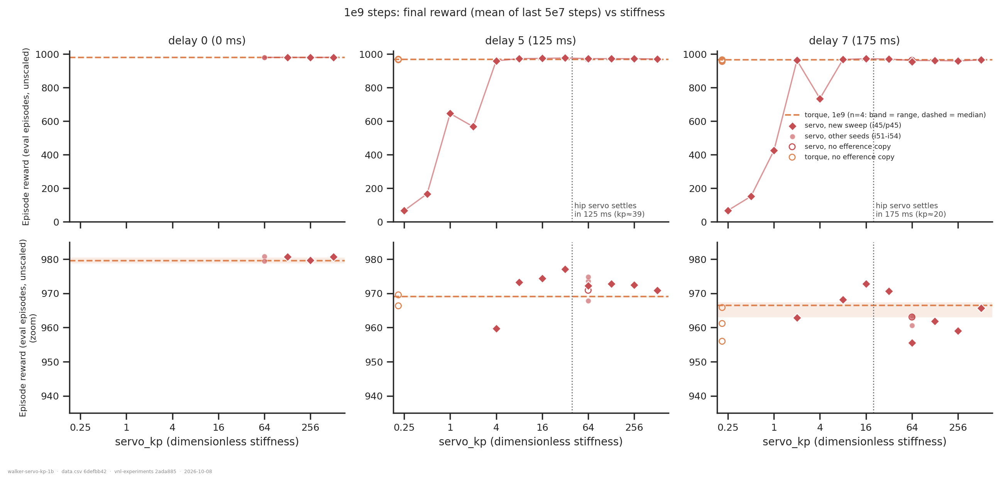
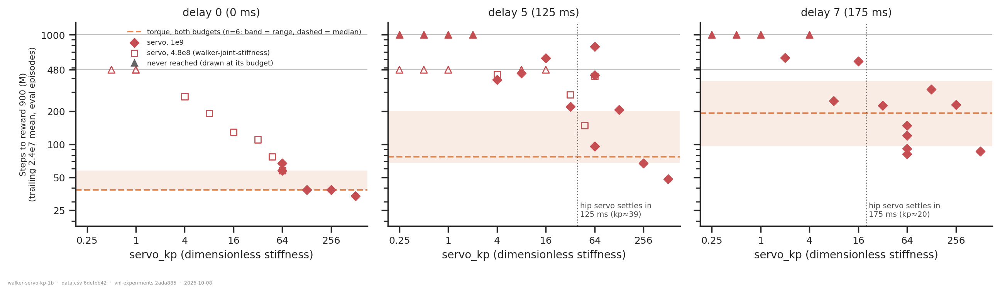
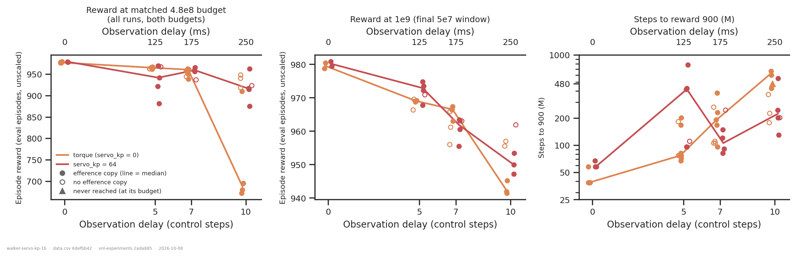
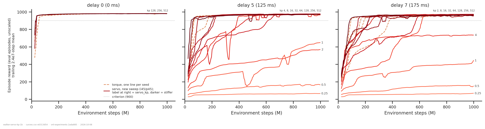

# WalkerWalk at 1e9 steps: how do final reward and time-to-solve depend on `servo_kp`?

## Question

[`../walker-joint-stiffness/`](../walker-joint-stiffness/) swept the joint-servo stiffness
`servo_kp` at 4.8e8 steps and left two questions open, both about budget. At delay 10 the
torque baseline had not converged, so it could not separate a higher ceiling from faster
learning. And at delay 0 the servo learned more slowly than torque, which a 4.8e8 window
could not tell apart from the servo simply being worse.

The new sweep re-runs the stiffness axis at **1e9 steps** over a wider range:
`servo_kp` 0.25 – 512, at delay 7 (175 ms, 12 values) and delay 0 (4 values), launched
2026-10-07. A second launch on 2026-10-08 added all 12 values at **delay 5** (125 ms). Both
use one seed pair, i45/p45. This folder reads it in two ways. **Final reward** is the mean of the
last 5e7 steps at the run's own budget. **Time to solve** is the number of steps until the
trailing 2.4e7-step mean of eval reward reaches 900. Both are read against every torque
baseline and every other servo run at delays 0/5/7/10.

An answer is: the stiffness range where the servo works, and, inside that range, whether
stiffness changes how good the policy gets or how fast it gets there.

**Headline.** At 1e9 steps, stiffness above the viability floor (`servo_kp` ≈ 4–8) makes
**no meaningful difference to final reward** at delays 0, 5 or 7. Every such run ends at
955–981, within ~8 points of torque. What stiffness changes is **learning speed**:

- **Stiffer servos learn faster, at every delay in the sweep.** Within the sweep seed,
  time to 900 falls with `servo_kp` at delay 5 (Spearman ρ = −0.92, p = 0.001) and
  delay 7 (ρ = −0.77, p = 0.02). The predecessor's 4.8e8 ladder shows the same at delay
  0. It is a steady trend, not a threshold at the settling-time crossover.
- **At the stiff end the servo is at least as fast as torque.** At delay 0, `servo_kp`
  ≥ 128 reaches 900 in 34–39M steps, the same as torque, so the predecessor's "the servo
  is slower with no delay" was a property of servos that were too soft. At delay 5,
  `kp` 256 and 512 take 67M and 48M, at or below torque's fastest seed.
- **`servo_kp` 64 against torque, the only stiffness with replicates:** slower at delays
  0 and 5 (p = 0.04, 0.02), faster at delays 7 and 10 (p ≈ 0.06 each).
- The delay 7/10 speed advantage only appears when both arms have an efference copy.
  Torque runs without one learn about as fast as the servo.

## Dataset & comparability

- **Source:** WandB `emiwar-team/nnx-ppo-delays`. Runs are selected by `CONDITIONS` in
  `extract.py` and frozen in `runs.csv`. The selection is on configuration only:
  WalkerWalk, `DelayedMLP`, `min_std` 0.001, post-`971ab99` eval, delay ∈ {0, 5, 7, 10},
  budget ∈ {4.8e8, 1e9}, and the run reached its budget. The predecessor showed that
  filtering on run names or notes pulls in other tasks.
- **Conditions:** 98 runs.

| condition | budget | efference | n | `servo_kp` | delays | seeds (init/ppo) | from |
|---|---|---|---|---|---|---|---|
| `servo` | 1e9 | copy | 38 | 0.25 – 512 | 0, 5, 7, 10 | i45 (new sweep, 27 runs); i51–i54 (kp 64) | new sweep + [`walker-servo-x-forward-model`](../walker-servo-x-forward-model/) |
| `servo` | 1e9 | none | 3 | 64 | 5, 7, 10 | i45 | 2026-09-25 |
| `servo` | 4.8e8 | copy | 26 | 0.25 – 128 | 0, 5, 10 | i50, i52 | [`walker-joint-stiffness`](../walker-joint-stiffness/) + 2 runs from 09-18 it predates |
| `torque` | 1e9 | copy | 12 | 0 | 0, 5, 7, 10 | i43, i46, i47, i51, i52 | sibling 1e9 folders |
| `torque` | 1e9 | none | 7 | 0 | 5, 7, 10 | i42/p1234, i45, i46 | 2026-09-25, 09-28, 10-06 |
| `torque` | 4.8e8 | copy / none | 10 / 2 | 0 | 0, 5, 7, 10 | i42, i50–i52 | 09-09, 09-16, 10-07 |

- **Why the budgets can be pooled.** Nothing in nnx-ppo or `train.py` reads `total_steps`
  except the loop bound. There is no learning-rate or entropy schedule; I grepped both
  repos on 2026-10-08 to check. So a 4.8e8 run is the first 4.8e8 steps of a 1e9 run, up
  to GPU nondeterminism, and two readouts can span budgets:
  - **Time to criterion.** A run that never reaches the criterion is censored at its own
    budget and drawn as a caret there.
  - **`reward_480`.** The eval-window mean ending at 4.8e8, read off the 1e9 curves as
    well, so every run can be compared at one matched budget.

  Where a cell exists at both budgets, `reward_480` agrees to within seed spread. The
  largest gap is torque at delay 10: 695 (n=1) at 4.8e8 against 754 (n=3) at 1e9
  (`comparability.txt`, BUDGET OVERLAP). `reward_final` is only compared within one
  budget.
- **Efference copy is kept separate, never pooled.** The new sweep, the predecessor and
  the sibling 1e9 arms all use `efference_length == delay_k`. A later batch used
  `efference_length = 0` at delays 5–10. Those runs are drawn hollow and excluded from
  every headline contrast. That turned out to matter; see caveat 1.
- **Reward:** `eval/episode_reward/mean`, unscaled, full-length 1000-step episodes. Every
  run is post-`971ab99`. A dm_control "eval" is a fresh episode of the same task, so none
  of this measures generalisation. All reward axes show raw reward.
- **Readouts:** the same definitions and code as the predecessor, so the numbers carry
  over directly.
  - `reward_final`: mean of the eval points in the last 5e7 steps.
  - `steps_to_900`: first step at which the trailing 2.4e7-step mean reaches 900.
  - Before either is computed, every curve is resampled onto a common 4.8e6-step grid.
    The cohort mixes 6e5 and 4.8e6 eval cadences, and without the resampling a trailing
    mean would average 8× more points for the older runs.
  - 900 is the project's WalkerWalk convention. 800 and 950 are also extracted, in
    `data.csv`.
- **Artifacts:** `REQUIRES = ["index", "history:hist2000-8b97281e"]`, **98/98**. This is
  the same spec as the sibling WalkerWalk folders. I produced 29 artifacts on 2026-10-08:
  the 10-07 sweep, `bz7rr0oo`/`yylyb6q4`, and the 12 delay-5 runs after the index was
  re-synced. All were produced after their runs had finished.
  `extract.py` refuses to run if an artifact stops more than one eval interval short of
  the run's `_step`, which would mean it was snapshotted mid-training.
- **Excluded, and why** (`comparability.txt`, EXCLUDED):
  - `of1onb2g` (`kp` 0.25, delay 0, new sweep) crashed at 240M with reward 55. It would
    have been censored anyway, and the cell has no other run.
  - `j1huu3d3` crashed at 480M.
  - `ujoqf3rj` failed at step 0.
  - Two exact duplicates (same parameters, same init and PPO seeds; `jyno30c4`,
    `sdacvrru`) were dropped. The earlier-launched run of each pair is kept, by the
    sibling's rule.
- **Programmatic comparability** (`comparability.txt`): single-valued throughout are
  - every PPO hyperparameter;
  - `reward_scale`, `episode_length`, `ctrl_dt`, `sim_dt`;
  - `servo_damping_ratio`, `servo_unlimited_half_range`;
  - the network sizes, `min_std`, `entropy_weight`;
  - eval `n_envs` and horizon;
  - the vnl-playground commit.

  Flagged as varying: budget (a design axis), eval cadence (handled by the resampling),
  `servo_center` (varies only inside `torque`, where it has no effect), and the commit /
  `nnx_ppo` / `dirty` spread.
- **Manual comparability:**
  - **Configs.** Read straight from the index for all 28 sweep runs (16 from 10-07, 12
    from 10-08). All have `servo_center = range`, `servo_damping_ratio = 1`,
    `efference_length = delay_k`, commit `b4012b3`, nnx-ppo `5314279`, playground
    `293156c` (both clean), CUDA 13.3, one OS build. The delay-5 runs at `kp` 64 do not
    duplicate any earlier run: the only other i45/p45 run there is `wql8i627`, which has
    no efference copy.
  - **Physics.** The per-joint stiffness and settling time recorded on each run follow the
    documented rule: `kp_ref` is unchanged, and `t_settle · √servo_kp` is constant.
  - **Notes and tags.** Note *"Sweeping kp again"* on both launches. Tags include
    `kp{value}` and `env-override` as expected. 15 of the 16 delay-0/7 runs and 4 of the
    12 delay-5 runs were requeued; the notes record the resume steps. A resume redraws episode phases and zeroes the
    actuator queue for `delay_k` steps (track README), which does not show in the curves.
  - **Git.** Five vnl-experiments commits. Every diff between them was read for
    [`walker-servo-x-forward-model`](../walker-servo-x-forward-model/report.md). The only
    change that could alter a trajectory is `NaNGuardWrapper`, and it acts only on an
    already-diverged step. `7bedb5c → b4012b3`, the new sweep's commit, touches no file on
    the training path.
  - **`dirty = True`** on the 10-07 runs and on 4 of the 12 delay-5 runs voids their
    commit hash, so the hash is not the
    argument for comparability. The argument is behavioural: **`divergence_check.py` →
    INERT**. Across all 67 servo runs, `kp` 0.25 to 512, no episode ever terminated at any
    logged iteration. So the guard never fired, and the stiff end of the sweep did not
    destabilise the physics, even at `kp` 512 where the ankle settles in 6.2 ms against
    a 2.5 ms `sim_dt`.
  - **Verdict: comparable**, subject to the caveats below.

## Figures

**Final reward at 1e9.** Top row: full range. Bottom row: zoomed on the solved band.

- **Below `kp` ≈ 2 the servo fails, even with twice the predecessor's budget.** At delay
  5: 66 / 167 / 646 / 567 at `kp` 0.25 / 0.5 / 1 / 2. At delay 7: 67 / 151 / 425 at
  0.25 / 0.5 / 1. These are mostly learning floors; only `kp` 1 at delay 5 is still
  climbing at the end (+42 over the last 1e8; see the curves figure).
- **From `kp` 8 up, every stiffness falls inside or beside torque's band.**
  - Delay 0: 979–980.
  - Delay 7: torque 963–967; the servo zoom spans 955–973 with no trend in `kp`.
  - Delay 5: every sweep-seed run from `kp` 8 to 512 ends at 971–977, 2–8 points *above*
    torque's tight 969 (three seeds within 0.4). The other `kp` 64 seeds end at 968–975,
    so i51 is just below torque. This is the one delay where the servo
    sits consistently above torque in final reward. It is a gap of a few points, comparable
    to `kp` 64's own 7-point seed spread there, and is reported rather than claimed.
- **`kp` 4 is a single run stuck on a plateau at 735,** while `kp` 2 next to it reaches
  963. That is one run's trajectory, not a feature of `kp` 4.

**Time to reward 900.** Squares are 4.8e8 runs from the predecessor; diamonds are 1e9
runs. Carets mark runs that never got there.

- **Delay 0:** time falls steadily with stiffness. 274M at `kp` 4, 58–67M at `kp` 64
  (three seeds), and **34–39M at `kp` 128–512**, which is inside torque's band
  (39–58M, n=6; `stats.txt`, p = 0.50 against torque). This settles the predecessor's
  open question: with no delay, the servo only costs learning speed when it is soft.
- **Delay 5:** the clearest ladder in the sweep.
  - `kp` ≤ 2 never reach 900.
  - `kp` 4 / 8 / 16 take 389 / 447 / 614M, slower than every torque seed (67–202M).
  - `kp` 32 / 64 / 128 take 221 / 96 / 206M, the top of torque's range.
  - `kp` 256 / 512 take 67 / 48M, as fast as torque's fastest seed or faster.
  - Within the sweep seed that is ρ = −0.92 (p = 0.001, `stats.txt`).
  - The predecessor's 4.8e8 delay-5 runs (open squares) agree where they overlap.
- **Delay 7:** the same direction, noisier: ρ = −0.77 (p = 0.02).
  - Torque's five seeds span 96–379M.
  - `kp` 2 and 16 are the slow outliers (619M, 576M). Both sit on a plateau and jump
    late.
  - `kp` 512 is the fastest sweep run (87M).
  - `kp` 64, the only cell with replicates, takes 82–149M (n=4), faster than torque
    (p = 0.063).
- **The settling-time crossover** (dotted lines: where the hip servo starts settling
  faster than the delay, `kp` ≈ 39 at delay 5 and ≈ 20 at delay 7) **is not the
  pattern.** At delay 5 the slow/fast split happens to fall at the crossover. But delay 0,
  which has no crossover, shows the same steady speed-up, and at delay 7 nothing changes
  at `kp` ≈ 20. The simplest reading that fits all three delays is "stiffer learns
  faster", with no delay-specific threshold. That is still one seed per stiffness.

**Torque against `kp` 64 across delay, in all three readouts.** Filled points have an
efference copy and are summarised by the median line; hollow points have none.

- **Left, reward at a matched 4.8e8 budget:** this is the predecessor's result, seen in
  more seeds. Torque collapses at delay 10 (672–695 in three of four seeds; i47 reaches
  910) and the servo does not (875–962).
- **Middle, reward at 1e9:** the collapse is gone. At delay 10 torque reaches 942–945 and
  `kp` 64 reaches 947–953, a gap of +7.
- **Right, time to 900:** `kp` 64 is slower at delays 0 and 5 and faster at delays 7
  and 10. At delay 5 its five runs split two fast (96M: i45, i54) and three slow
  (418–778M). The no-copy torque runs (hollow orange) sit with the servo at delays 7 and 10,
  not with copy-torque (caveat 1).

**Learning curves of the new sweep.** Trailing means, the same curves the criterion reads.
Torque seeds are dashed.

- At delay 0 every curve is solved by ~40M steps.
- At delay 5 the intermediate stiffnesses are unstable mid-training before they solve.
  On the smoothed curve `kp` 4 falls by 319 points, `kp` 8 by 218 and `kp` 1 by 169,
  then each recovers. Every run from `kp` 32 up falls by less than 80 points. Part of
  the slowness of `kp` 4–16 at delay 5 is time spent recovering from these collapses.
  None of them is a physics divergence (`divergence_check.txt`).
- At delay 7, learning is step-like. Several runs sit on a 700–800 plateau for hundreds of
  millions of steps and then jump: `kp` 2 at ~580M, `kp` 16 at ~550M. `kp` 4 never jumps.
  For a single seed, the time to solve mostly measures when that run happened to find the
  gait. This is why only the replicated `kp` 64 contrast is tested.

## Tentative conclusion

**What the data shows:**

1. **There is a hard viability floor at `servo_kp` ≈ 2.** Below it the servo fails at
   every delay and budget tested: 1e9 does not rescue `kp` ≤ 1. `kp` 2–4 is marginal:
   it solves late, plateaus or stays below 900, depending on the delay.
2. **Above the floor, stiffness barely changes final reward at 1e9** (delays 0, 5, 7).
   Servo and torque converge within a few points. The largest systematic gap is delay 5,
   where every sweep-seed run from `kp` 8 up sits 2–8 above torque (one other `kp` 64
   seed sits 1 point below).
3. **Stiffness changes learning speed, monotonically.** Within the sweep seed, time to
   900 falls with `servo_kp` at delay 5 (ρ = −0.92, p = 0.001) and delay 7 (ρ = −0.77,
   p = 0.02), as it did at delay 0 in the predecessor's ladder. At `kp` 256–512 the servo
   is as fast as or faster than torque's fastest seed at delays 0, 5 and 7: 34–39M,
   48–67M, 87M.
4. **Against torque, `kp` 64 is slower at delays 0 and 5 (p = 0.036, 0.024) and faster at
   delays 7 and 10 (p = 0.063, 0.057)** (exact rank tests, `stats.txt`). Given (3),
   `kp` 64 sits in the middle of the stiffness ladder, so its contrast with torque
   depends on which delay it is read at more than it says anything about servos in
   general.
5. **At 1e9 the predecessor's large delay-10 advantage (+267 at 4.8e8) shrinks to +7**
   (`kp` 64, n=3 each). This is the "rate, not asymptote" reading the predecessor flagged
   as its main caveat, now measured with the servo at 1e9 too. What survives at 1e9 is a
   learning-speed advantage: 130–552M against 427M to never.

**What it suggests but does not establish:**

- That the servo's benefit under delay is about **how easy the task is to learn, not
  where learning ends up**.
- That **the stiffness to use is the stiffest that stays numerically stable**, not 64.
  Nothing breaks up to 512, and `kp` 512 is at or near the fastest learner at every delay
  in the sweep. All of the > 64 data is one seed.
- That the predecessor's settling-time crossover was a reading of a monotone trend
  sampled at a few stiffnesses. At three delays, the speed-up with stiffness shows no
  break at the crossover.

**What would most easily overturn it** — caveats, in order of weight:

1. **The servo's speed advantage at delays 7–10 appears only against torque *with* an
   efference copy.** Without the copy, torque reaches 900 at delay 7 in 106/106/111/264M
   and at delay 10 in 178/226/365M. That is as fast as `kp` 64 with the copy, and as
   fast as `kp` 64 without it (245M, 202M; n=1 each).
   - So at least part of "the servo learns faster under delay" may be "the efference copy
     slows torque learning under delay". The servo's own copy/no-copy runs are too few to
     say whether the copy slows it as well.
   - [`../efference-copy-across-tasks/`](../efference-copy-across-tasks/) reported no
     WalkerWalk copy effect out to 125 ms (delay 5). Here, delays 7–10 look different.
     The seeds are not matched across the copy arms, so this is a lead, not a result.
2. **Every stiffness except 64 is a single seed in this sweep, and it is the same seed
   everywhere.** The Spearman tests ask whether stiffness orders the runs *for that
   seed*, and they say it does. They cannot say whether another seed's ladder looks the
   same. `kp` 64 at delay 5 shows how large the seed effect can be: 96M for i45 and i54,
   418–778M for i50–i52. Torque's own seed spread in time-to-900 is 3–4× at delays 5–7.
3. **The delay-5 slowness of `kp` 64 is now a seed effect more than a stiffness effect.**
   Three of its five runs are slow (i50 at 4.8e8, i51 and i52 at 1e9) and two are fast.
   In the sweep seed, delay 5 behaves like the other delays. What makes i50–i52 slow
   there is unexplained.
4. **Seed pairs differ between arms in most cells.** Torque and `kp` 64 share an
   init/PPO seed pair only for i52 (delays 0, 5, 7) and i51 (delays 0, 5), and at delay 5
   those pairs are at different budgets. The tests treat runs as independent
   within a delay, which is valid because within a delay every run has its own seed
   pair. No test pools across delays, since runs sharing a seed share most of their
   initial weights.
5. Six GPU models appear across the cohort. That affects throughput only; every number
   here is in environment steps.

## Follow-ups

- **Run torque and `kp` 64 at delays 7 and 10 with matched seeds, with and without an
  efference copy.** This is the cheapest experiment that decides caveat 1, and so whether
  the servo's delay benefit is real or a copy artefact.
- **Add two more seeds of the ladder at delays 5 and 7**, e.g. `kp` 8 / 32 / 128 / 512.
  That turns "stiffer learns faster" from one seed's ordering into a population claim.
  Prefer more seeds at fewer stiffnesses over more stiffnesses.
- **Look into the slow delay-5 `kp` 64 seeds** by comparing traces of `sueevgls` (778M)
  and `rzpjxoc0` (427M) with `c17tn6hg` / `7i80wqfw` (96M). Check whether the plateau is
  a gait trap, as `kp` 4 at delay 7 seems to be.
- **Run `kp` 256–512 at delay 10**, where torque is slowest (427M to never). This is the
  sharpest test of whether the stiff servo's speed advantage grows with delay.

---

*Reproduce:* `../.venv/bin/python analysis/dm_control_suite/walker-servo-kp-1b/extract.py && ../.venv/bin/python analysis/dm_control_suite/walker-servo-kp-1b/plot.py && ../.venv/bin/python analysis/dm_control_suite/walker-servo-kp-1b/stats.py`
(add `--sync --refresh` to the extract to pull in runs added since `runs.csv` was frozen;
`divergence_check.py` re-queries WandB for the termination check).
