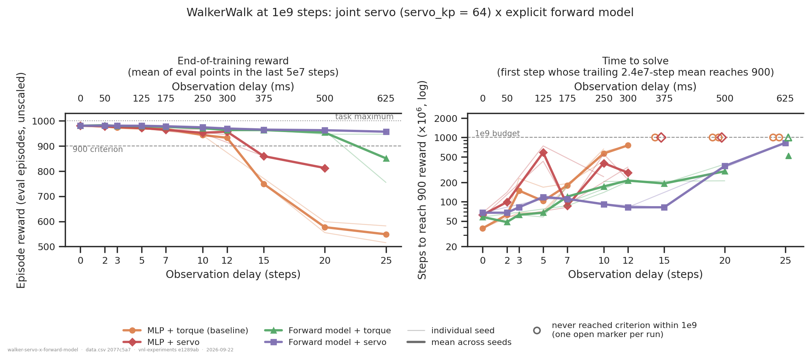
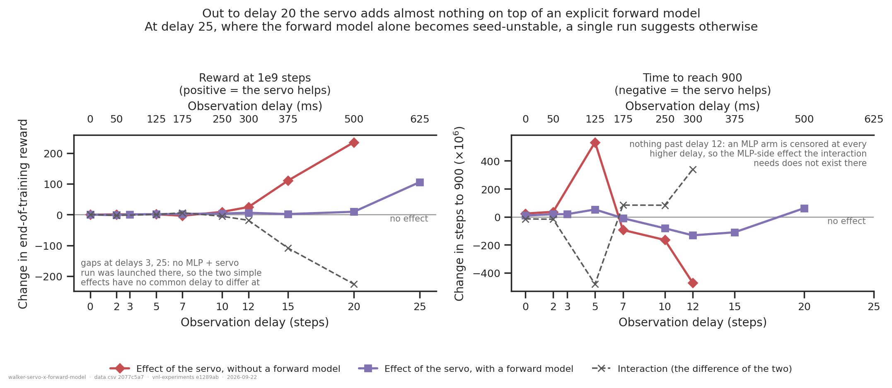
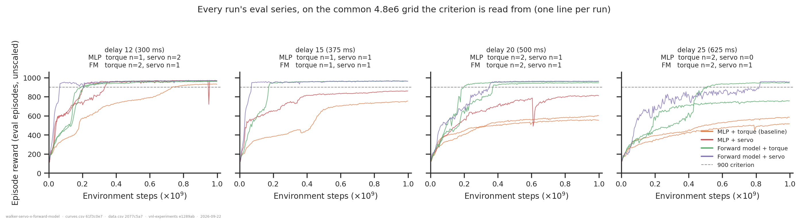
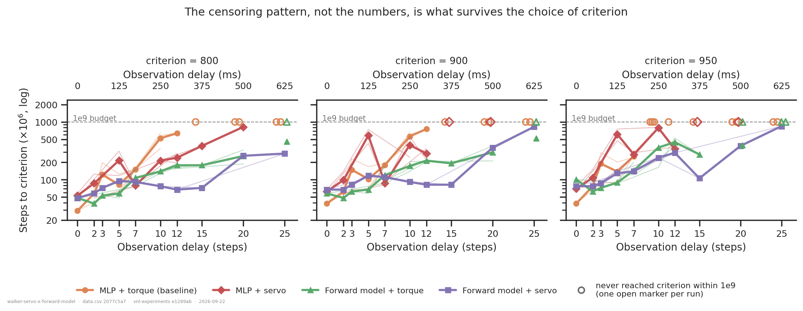

# Do a joint servo and an explicit forward model add up against delay?

## Question

Two manipulations each buy delay tolerance on WalkerWalk, for opposite reasons: the joint
servo ([`../walker-joint-stiffness/`](../walker-joint-stiffness/)) is peripheral and
mechanical — the actuator corrects position error inside every `sim_dt` substep, so it is
the only *undelayed* feedback path in the system — while the explicit forward model
([`../walker-forward-model-1b/`](../walker-forward-model-1b/)) is central and
computational, handing the actor a *prediction* of the current observation.

If both work by closing the same gap — not knowing the state at the moment of acting —
then the second one added should buy much less than the first. If they close different
gaps, the effects should stack. This folder crosses them: `servo_kp` ∈ {0, 64} ×
`network_class` ∈ {DelayedMLP, FlatForwardModel}, all at 1e9 steps, over delays
0/2/3/5/7/10/12/15/20/25.

An answer is the sign and size of
`(fm_servo − fm_torque) − (mlp_servo − mlp_torque)` at each delay, in both readouts, read
against the seed spread of the cells it is built from.

*Updated 2026-09-22* with 21 runs added to the original 43: delay 12 became complete in all
four arms, the delay-0 `fm_servo` hole was filled, a third servo seed (53) arrived, and
`fm_servo` reached delays 3, 25 and 30. The delay-25 cell changes what the conclusions can
say; see conclusion 4.

## Dataset & comparability

- **Source:** WandB `emiwar-team/nnx-ppo-delays` (index synced 2026-09-22, 356 runs),
  selected by the `CONDITIONS` in `extract.py` and frozen in `runs.csv`. 63 runs, all
  WalkerWalk, all `total_steps = 1e9`, all reaching 1 000 243 200 steps.
- **Conditions:**

| condition | `servo_kp` | network | n | delays | seeds (`init/ppo`) |
|---|---|---|---|---|---|
| `mlp_torque` | 0 | `DelayedMLP` | 18 | all ten | i43/p12345, i46/p46, i47/p47 |
| `mlp_servo` | 64 | `DelayedMLP` | 15 | all but **3, 25** | i51/p51, i52/p52, i53/p53 |
| `fm_torque` | 0 | `FlatForwardModel` | 18 | all ten | i43/p12345, i46/p46, i47/p47, i48/p48 |
| `fm_servo` | 64 | `FlatForwardModel` | 12 | all ten | i51/p51, i52/p52, i53/p53 |

  All four arms are present at delays 0, 2, 5, 7, 10, 12, 15 and 20 — eight of the ten.
  `efference_length == delay_k` in every run, so the two network arms get exactly the same
  information and differ only in whether the state estimate is built explicitly.
  `fm_loss_weight = 1` and `detach_prediction = True` throughout — asserted per arm by
  `assert_arm_signature`, not merely reported.

- **Reward reported:** `eval/*`, **post-`971ab99`** on every run — unscaled, full-length
  episodes. `reward_final` is the mean of the eval points in the last 5e7 steps, not the
  run's last point (README §6). A dm_control "eval" is a fresh episode of the *same* task;
  there is no held-out set in this track, so nothing below is a generalisation measure.
- **Tasks:** WalkerWalk only. No cross-task comparison.
- **Artifacts used:** `REQUIRES = ["index", "history:hist2000-8b97281e"]`, **63/63 on both**
  (`coverage.txt`). Same spec id as both sibling folders, so a curve here is literally the
  same bytes those analyses read. 36 of the 63 `history` artifacts were produced for this
  folder (25 on 2026-09-21, 11 on 2026-09-22); the rest already existed.
- **Programmatic comparability:** `comparability.txt`. Every entry in `INVARIANTS` holds
  across all four arms — PPO settings, `reward_scale`, `episode_length`, `ctrl_dt`,
  `sim_dt`, network sizes, `min_std`, `entropy_weight`, eval `n_envs` and horizon,
  `servo_damping_ratio`, and the vnl-playground commit. Nothing is flagged in that section.
  The things that do vary are listed separately under `DESIGN AXES` and are each discussed
  below.

### Manual comparability

- **Configs inspected directly**, not tags or notes: `env_params` and `net_params` were
  read out of `_runs/nnx-ppo-delays.jsonl` for one run of each arm at delay 10
  (`6a803fzx`, `e9e1text`, `r5ssslra`, `jkl1pbwo`). The servo runs carry
  `servo_kp = 64, servo_center = range, servo_damping_ratio = 1,
  servo_unlimited_half_range = 0`; the torque runs carry **no `servo_*` keys at all**,
  which is what `servo_kp = 0` means physically — `apply_servo` returns before writing any
  field or re-running `put_model`, so the plant is the shipped Playground task bit-for-bit.
- **Notes read.** Four launches: *"High stiffness 1B train."* (the servo arms),
  *"Walker walk with a longer budget and a new seed."*, *"More walker runs."*, and one
  *"Testing new eval frequency."* — which is the 2026-09-15 cadence change being made
  deliberately, and the reason the cadence correction below exists. Eighteen runs carry a
  requeue note recording the step they resumed from.
- **Git.** Four vnl-experiments commits and two nnx-ppo commits. `git diff --stat` across
  them was read: `f9c8960d → 9e216aee` adds `NaNGuardWrapper` to the *training* env stack
  (the only change that can alter a trajectory, and only on an already-diverged step) plus
  analysis and eval-path files; `b487eedf` adds requeue/`resume_reset`;
  `9e216aee → 7bedb5cc` adds the servo machinery (inert at `servo_kp = 0`) and lowers the
  eval/video cadences in `conf/train/dmc.yaml`, whose `ppo:` block is untouched. nnx-ppo
  `1725d200 → 53142793` adds non-finite counters and a `check_diagnostics` that raises;
  `optimizer.update` is called identically. The whole servo half is `7bedb5cc` alone.
- **`repos.vnl_experiments.dirty` is `True` on 34 runs**, which per README §6 voids those
  commit hashes outright — so the hashes cannot be the argument. Three behavioural checks
  replace them, below.
- **Verdict: comparable.** The only code difference that could change a trajectory is
  gated on a divergence, and no run diverged.

### The three committed checks

**`divergence_check.py` → `divergence_check.txt`: INERT.** `NaNGuardWrapper` turns a
diverged step into a *termination*, and WalkerWalk never terminates on its own, so
`done_rate > truncation_rate` at any iteration means a divergence. Over all 63 runs and
~2 000 logged iterations each, `max(done_rate − truncation_rate) = 0.000e+00` everywhere.
Two things follow: the guard never fired, so the commit and dirty spread is functionally
irrelevant *on these runs*; and `servo_kp = 64` did not destabilise the physics, which
discharges `envs/servo_control.md` §3.6's divergence caveat for this cohort — no arm's
reward is depressed by silent zero-reward terminations.

**`attrition.py` → `attrition.txt`: BENIGN.** Seven candidate runs fail the
reached-its-budget gate, and **all seven are `fm_servo`, seed 53** — exactly the
correlation README §6 says to check, and exactly what a destabilised stiff servo would
look like. It is not that. All seven ran at 5.3–5.4e4 `train_sps` against a cohort median
of 2.2e5 (a 4.1× slowdown), all stopped after the same 2.9 h at the same ~4.5e8 steps, and
they spread evenly across seven different delays rather than piling up at one end. The
decisive control is on the same nodes: `nhw49shh`, a **torque** run, managed 5.4e4 sps
there too and reached 1e9 only because it was requeued into 6.4 h. The slowdown is the
host; the seven servo runs simply ran out of wall clock. The cost is to `fm_servo`'s seed
count, not its delay coverage — every delay they would have added already has one
`fm_servo` run from an earlier launch.

**`assert_servo_identity` (raises, does not report).** `train.py` records the *derived*
per-joint physics read back off the built model, so if the servo code had changed between
the three servo launches the same `servo_kp` would have produced different numbers. It did
not: every one of the 27 servo runs has hip `kp = 6111.55`, knee `2444.62`, ankle
`1629.75`, `dead_ctrl_fraction = 0` on all six joints, and settling times 97.8 / 72.4 /
17.6 ms. Every torque run carries none of these.

### Caveats

1. **Seed is confounded with the actuator.** The servo arms are seeds 51/52/53 and the
   torque arms 43/46/47/48; no seed appears in both, because the servo runs are later
   launches. An arm difference smaller than the within-arm seed spread is therefore not
   readable, and the spread is strongly regime-dependent. Over the 20 multi-seed cells the
   median spread is **1.7 reward**, but the cells at the edge of failure are far worse:
   `mlp_servo` at 12 spans **24.9**, `mlp_torque` at 20 spans **43.4**, `mlp_torque` at 25
   spans **66.6**, and `fm_torque` at 25 spans **191.4**. Read every comparison against the
   spread in its own regime; conclusion 4 turns entirely on this.
2. **Most cells are n=1** — 18 of 38 non-empty cells. `fm_servo` is n=1 at every delay but 5.
3. **Two corners are missing:** no `mlp_servo` run at delays 3 or 25. The interaction is
   undefined there and drawn as a gap, not interpolated. **Delay 30 is excluded from the
   cohort entirely** — only `fm_servo` was run there — and quoted in conclusion 5 instead.
4. **Eval cadence is confounded with the manipulation** — every servo run logs eval every
   4.8e6 steps, most torque runs every 6e5 (8× denser). A trailing window defined in steps
   would average 8× more samples on the torque side, making its criterion strictly harder
   to trigger, which would flatter the servo. `on_common_grid` puts every run on the coarse
   grid (nearest single sample, so each grid point is one 256-episode eval either way).
   Measured cost against the un-regridded definition: fine-cadence runs shift **+11.0e6**
   steps and coarse ones **+7.0e6**, so the part that is actually confounded is the
   **+4.0e6 difference** — 0.4 % of the budget, against arm differences of 1e8–5e8. Small,
   but it points the wrong way if left out.
5. **The MLP arms are not converged at 1e9 at high delay.** `late_gain` (the last 5e7
   window minus the one two windows earlier) reaches +16.6 and +10.2 for `mlp_torque` at
   delay 25 and +13.8 at delay 20, against ≤ |2.4| for both forward-model arms everywhere.
   The sibling folder's 2e9/4e9 runs settle what that means: `mlp_torque` at delay 15
   reaches ~9.6e2 by 2e9, and one delay-20 seed crosses 900 at 2.27e9. So part of the
   servo's large reward benefit at delays 15/20 is a *rate* difference read at a shared
   budget — README §6's "common mid-training budget" trap. "+235 reward at delay 20" is a
   statement about 1e9 steps, not about the asymptote.
6. **One `mlp_servo` run collapsed inside its readout window.** `lqyrrczf` (delay 12)
   reached a smoothed 968.6 and ended at 944.0, `late_gain = −20.5`; it is the red
   downspike at ~0.95e9 in the delay-12 curve panel. That is why the `mlp_servo` delay-12
   cell reads 956.4 with a 24.9 spread. Not a divergence — that run is clean in
   `divergence_check.txt`.
7. **GPU varies** across five models including one Blackwell. It is a throughput confound
   (README §6), and no readout here is measured in seconds — `steps_to_900` is counted in
   environment steps. The one place throughput matters is the attrition check above, where
   it is the evidence rather than the confound.
8. **Eighteen runs were requeued** and resumed up to four times. A light checkpoint redraws
   episode phases and zeroes the network carry, both bounded by one episode (≤ 1000 steps)
   against a 1e9 budget; the divergence check covers a resume that had corrupted the
   population, and found nothing.

## Figures

The left panel is the result. Out to delay 10 all four arms sit within ~31 reward of each
other; from delay 12 the two MLP arms fall away and the two forward-model arms do not.
Look at the *gap between the orange and red lines* against the *gap between the green and
purple ones*: the servo rescues the MLP (+24 at delay 12, +110 at 15, +235 at 20) and does
almost nothing for the forward model (+5.9, +1.7, +9.2) — until delay 25, where the green
line finally breaks and the purple one does not. The right panel is the learning-speed view
of the same arms, and it is a different shape: the servo *costs* the MLP a great deal of
learning time at delays 2–5 and saves it from delay 7 on. Open markers are runs that never
reached 900 within 1e9.

The two coloured lines are the same manipulation measured in two contexts. On reward they
sit on top of each other out to delay 10, separate from 12 to 20 — so the interaction
(grey, dashed) is flat at zero and then dives to −18, −109 and −226 — and then the purple
line jumps to +106 at delay 25, where there is no red counterpart to difference it against.
On time-to-900 the interaction changes sign: at delays 0–5 the servo hurts the MLP much
more than the forward model, from delay 7 it helps the MLP much more. Nothing past delay 12
on that panel, because an MLP arm is censored at every higher delay.

What the two readouts are made of, at the four delays that matter. Delay 12 is the onset —
`mlp_torque` is still climbing at 1e9 while everything else has plateaued, and the red
downspike at ~0.95e9 is caveat 6. At 15 and 20 the two forward-model curves are flat at
~960 from ~3e8 while `mlp_servo` grinds upward and `mlp_torque` has stalled. **Delay 25 is
the panel to study**: the two green `fm_torque` seeds separate completely, one reaching 944
and the other stalling at 750, while the single purple `fm_servo` run climbs noisily to 956.
That is a regime where one run tells you very little.

What survives the arbitrary criterion. Not the numbers — at 950 the arms reorder at low
delay — but the censoring pattern does: `mlp_torque` reaches nothing past delay 12 at any
criterion, `mlp_servo` reaches 800 at every delay it was run at, and `fm_servo` is the only
arm that reaches all three criteria at every delay including 25. The 950 panel is also where
the servo's clearest *forward-model-side* benefit sits: at delay 15, `fm_servo` reaches 950 in
106e6 steps against `fm_torque`'s 274e6, a 2.6x speed-up at a delay where the reward levels
differ by only +1.7 (n=1 each).

## The 2x2, in numbers

End-of-training reward (mean of eval points in the last 5e7 steps; cell means over seeds):

| delay | MLP+torque | MLP+servo | FM+torque | FM+servo | servo effect, no FM | servo effect, with FM | interaction |
|---:|---:|---:|---:|---:|---:|---:|---:|
| 0 | 980.4 | 980.1 | 979.9 | 979.7 | −0.3 | −0.1 | +0.2 |
| 2 | 976.7 | 977.4 | 981.8 | 980.1 | +0.7 | −1.7 | −2.4 |
| 3 | 972.4 | — | 979.1 | 979.7 | — | +0.7 | — |
| 5 | 969.0 | 970.0 | 978.0 | 979.3 | +1.0 | +1.3 | +0.3 |
| 7 | 966.9 | 963.3 | 975.3 | 977.6 | −3.6 | +2.3 | +5.9 |
| 10 | 942.9 | 951.7 | 970.0 | 973.5 | +8.8 | +3.5 | −5.3 |
| 12 | 932.0 | 956.4 | 962.8 | 968.8 | **+24.5** | +5.9 | −18.5 |
| 15 | 748.7 | **859.1** | 962.6 | 964.3 | **+110.4** | +1.7 | **−108.7** |
| 20 | 577.1 | **812.0** | 952.7 | 961.9 | **+234.9** | +9.2 | **−225.7** |
| 25 | 548.8 | — | 850.5 | **956.1** | — | **+105.7** | — |

Steps to reach 900 (millions, common 4.8e6 grid, trailing 2.4e7 window; `—` = some run in
the cell never reached it within 1e9):

| delay | MLP+torque | MLP+servo | FM+torque | FM+servo |
|---:|---:|---:|---:|---:|
| 0 | 38.6 | 62.5 | 57.8 | 67.3 |
| 2 | 62.4 | 98.5 | 48.2 | 67.3 |
| 3 | 148.9 | — | 62.5 | 81.8 |
| 5 | 102.5 | 635.4 | 67.3 | 120.1 |
| 7 | 180.1 | 86.6 | 120.1 | 110.6 |
| 10 | 563.4 | 398.6 | 172.9 | 91.4 |
| 12 | 753.7 | 283.4 | 213.7 | 81.8 |
| 15 | — | — | 192.2 | 81.8 |
| 20 | — | — | 297.7 | 360.0 |
| 25 | — | — | — | 825.8 |

## Tentative conclusion

1. **Out to delay 20 the two manipulations are strongly sub-additive on reward.** The
   servo's benefit without a forward model rises smoothly — +8.8, +24.5, +110.4, +234.9 at
   delays 10, 12, 15, 20 — while with one it stays at +5.9, +1.7, +9.2. The +9.2 at delay 20
   is *inside* the seed spread of the cell it is compared against (`fm_torque` at delay 20
   is 946.0 and 959.4), so over that range the honest reading is that **the servo adds
   nothing measurable on top of an explicit forward model**. That is what two mechanisms
   closing the same gap would look like.
2. **The forward model is much the stronger of the two, alone.** At delay 20 it reaches
   952.7 against the servo's 812.0 and the double baseline's 577.1; at delay 25, 850.5
   against 548.8. Whatever the servo does mechanically, the central prediction does more
   of it.
3. **On learning speed the story is different and the crossover is now well resolved.** The
   servo is a *cost* at low delay — +24e6 steps at delay 0, and at delay 5 a 3-seed
   `mlp_servo` cell takes 635e6 steps against `mlp_torque`'s 102e6, with all three seeds at
   427–778e6 — and a *saving* from delay 7 on: −94e6 at 7, −165e6 at 10, −470e6 at 12. The
   same cost-then-saving shape appears in the forward-model arm, smaller (+9.6e6 and +52.8e6
   at delays 0 and 5; −81.5e6 and −131.9e6 at 10 and 12). Consistent in both arms, so it
   looks like a property of the servo rather than of the MLP. The servo's own settling time
   is 97.8 ms at the slowest joint, i.e. ≈ delay 4, against an observed crossover between 5
   and 7 — close enough to be worth saying, not close enough to be a quantitative match.
4. **Delay 25 is the test conclusion 1 needed, and it does not settle it.** This is the
   important change from the added runs. Delay 25 is the first delay where the forward model
   alone breaks, so it is where a ceiling effect and genuine redundancy finally make
   different predictions — and the cell mean says the servo adds **+105.7** there, which
   would mean the two are complementary and the earlier sub-additivity was a ceiling. But
   the `fm_torque` cell at delay 25 is **bimodal**: its two seeds are 754.8 and 946.1, a
   spread of 191.4, and the single `fm_servo` run's 956.1 is only **+10 above the better of
   the two**. It is also the *slower* of the two to criterion (825.8e6 against 518.6e6).
   The training curves make the situation plain — at delay 25 every arm is still in
   transition and the seeds separate. So: suggestive, in the direction of complementarity,
   and not evidence. The cell needs several seeds on both sides.
5. **The `fm_servo` arm shows no sign of a ceiling out to delay 30 (750 ms), which is its
   own puzzle.** Outside the cohort (single run, no counterpart at that delay, not pooled):
   `ramm2noq` at delay 30 ends at **956.0** and crosses 900 in **192e6** steps — a *higher*
   level and four times faster than the same arm's delay-25 run at the same seed. A
   non-monotonicity that large within one arm and one seed is not a delay effect; it is a
   direct measure of how little a single run means in this regime, and it is the strongest
   argument for conclusion 4's hedge.
6. **Neither manipulation costs more than a few reward at low delay.** All four arms lie in
   977–982 at delays 0–3 and within ~14 of each other at delay 7. The servo's cost at low
   delay is essentially all in learning *time*, not in the final policy.

## Follow-ups

- **Seeds at delays 25 and 30, in all four arms.** This is now the single most valuable
  experiment and conclusions 4 and 5 both point at it. Three seeds per cell at delay 25
  would turn the +105.7 into a measurement or dissolve it; `mlp_servo` at 25 is missing
  entirely, so the interaction cannot even be formed. Delay 30 needs the other three arms
  before its one striking number can be read at all.
- **Extend `mlp_torque` and `mlp_servo` at delays 15/20 to 2e9.** Caveat 5's
  rate-versus-level ambiguity is the only thing standing between "the servo rescues the MLP"
  and "the servo makes the MLP faster". The sibling already has `mlp_torque` at 2e9/4e9 for
  exactly this; the servo arm has nothing past 1e9.
- **Re-run the seven lost `fm_servo` seed-53 runs with a longer wall clock.** They would
  take every `fm_servo` cell from n=1 to n=2 across delays 2–20, which is what most of the
  hedging above is really about. `attrition.txt` shows nothing is wrong with them.
- **Sweep `servo_kp` inside the forward-model arm.** This folder fixes it at 64 because that
  is where the stiffness sweep had the most runs. If the servo's learning-speed cost at low
  delay scales with stiffness — it should, since a stiffer servo is a bigger change of plant
  — a softer servo might keep the delay-10/12 speed-up without the delay-5 cost.
- **Check whether the servo makes the plant more predictable.** The two hypotheses in
  conclusion 1 are distinguishable by a mechanism, not only by an outcome: if the servo helps
  by smoothing the dynamics the predictor has to learn, the predictor's MSE should fall in
  `fm_servo` relative to `fm_torque`. `fm_pred_mse` (`delays/forward_model.py:182`) is not
  logged on its own, but it enters `losses/regularization` as `fm_loss_weight * fm_pred_mse`
  plus decoder/predictor terms that the MLP arms show to be ≤ 0.006 — so that key is a usable
  proxy and needs no new runs, only a `history` spec that fetches it. Worth doing rather than
  assuming: the two delay-10 run *summaries* read 0.095 (`fm_torque`) against 0.129
  (`fm_servo`), which points the *opposite* way, but each is a single iteration of a single
  run.

---

*Reproduce:* `../.venv/bin/python analysis/dm_control_suite/walker-servo-x-forward-model/extract.py && ../.venv/bin/python analysis/dm_control_suite/walker-servo-x-forward-model/plot.py`
(add `--sync --refresh` to the extract to pull in runs added since `runs.csv` was frozen;
`--check` to verify the committed CSVs rebuild bit-for-bit).
`attrition.py` (index only) and `divergence_check.py` (needs WandB) are not part of the
rebuild; their verdicts are committed as `attrition.txt` and `divergence_check.txt`.
