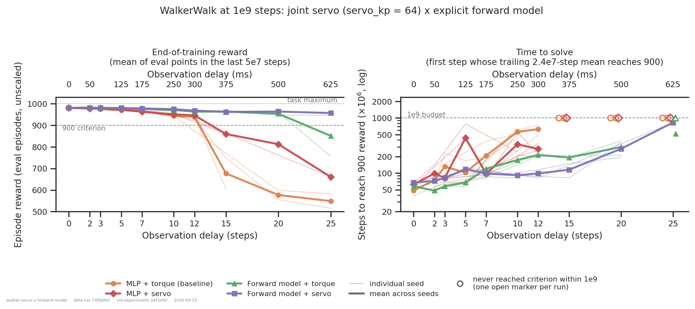
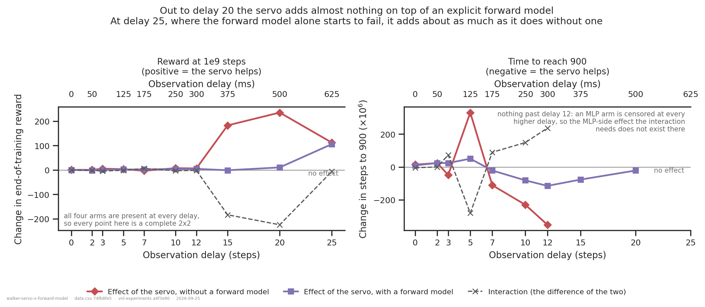
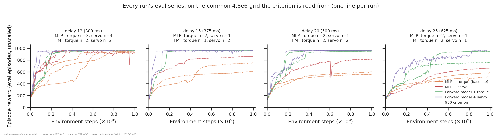
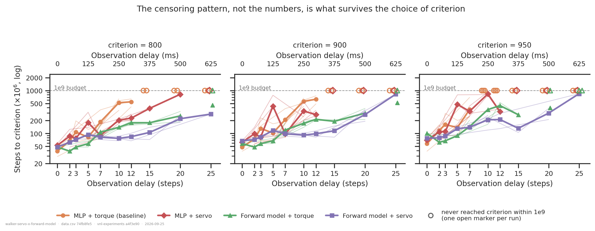

# Do a joint servo and an explicit forward model add up against delay?

## Question

Two manipulations each buy delay tolerance on WalkerWalk, for opposite reasons: the joint
servo ([`../walker-joint-stiffness/`](../walker-joint-stiffness/)) is peripheral and
mechanical — the actuator corrects position error inside every `sim_dt` substep, so it is
the only *undelayed* feedback path in the system — while the explicit forward model
([`../walker-forward-model-1b/`](../walker-forward-model-1b/)) is central and
computational, handing the actor a *prediction* of the current observation.

If both work by closing the same gap — not knowing the state at the moment of acting —
then the second one added should buy much less than the first. If they close different
gaps, the effects should stack. This folder crosses them: `servo_kp` ∈ {0, 64} ×
`network_class` ∈ {DelayedMLP, FlatForwardModel}, all at 1e9 steps, over delays
0/2/3/5/7/10/12/15/20/25.

An answer is the sign and size of
`(fm_servo − fm_torque) − (mlp_servo − mlp_torque)` at each delay, in both readouts, read
against the seed spread of the cells it is built from.

*Updated 2026-09-25* (82 runs, after de-duplication; from a candidate pool of 86). **The
design is now complete: all four arms at all ten delays, no empty cells.** That changes the
headline.

**De-duplication (new this update).** Four pairs of runs agreed on every experimental
parameter *and* on both seeds — one experiment launched twice, differing only in
MuJoCo/XLA nondeterminism. They are not two seeds, and counting both weighted that seed
double in every cell mean and spread. `extract._first_of_duplicates` now keeps the
earlier-launched run of each pair, and `duplicates.py` records what was dropped and turns
it into a measurement: see caveat 10, which is the most useful by-product of this change.
Delay 25 — the regime the previous two updates kept pointing at, where the forward model
alone starts to fail — now has all four corners, and there the servo buys **about as much
with a forward model as without it** (+105.7 against +112.0, interaction −6.3). The
sub-additivity at delays 12–20 therefore looks like the forward model saturating the task
rather than the two mechanisms being substitutes. See conclusion 4, which is the one that
moved.

The 11 `FlatRecurrent` WalkerWalk runs added in the same batch are for a different question
and are excluded by the `network_class` gate in `CONDITIONS`; no code change was needed.

## Dataset & comparability

- **Source:** WandB `emiwar-team/nnx-ppo-delays` (index synced 2026-09-25, 387 runs),
  selected by the `CONDITIONS` in `extract.py` and frozen in `runs.csv`. 82 runs, all
  WalkerWalk, all `total_steps = 1e9`, all reaching 1 000 243 200 steps. Four further runs
  pass every gate and are excluded as duplicates (caveat 10).
- **Conditions:**

| condition | `servo_kp` | network | n | delays | seeds (`init/ppo`) |
|---|---|---|---|---|---|
| `mlp_torque` | 0 | `DelayedMLP` | 27 | all ten | i43/p12345, i46/p46, i47/p47, i51/p51, i52/p52 |
| `mlp_servo` | 64 | `DelayedMLP` | 20 | all ten | i51/p51, i52/p52, i53/p53, i54/p54 |
| `fm_torque` | 0 | `FlatForwardModel` | 17 | all ten | i43/p12345, i46/p46, i47/p47, i48/p48 |
| `fm_servo` | 64 | `FlatForwardModel` | 18 | all ten | i51/p51, i52/p52, i53/p53, i54/p54 |

  `efference_length == delay_k` in every run, so the two network arms get exactly the same
  information and differ only in whether the state estimate is built explicitly.
  `fm_loss_weight = 1` and `detach_prediction = True` throughout — asserted per arm by
  `assert_arm_signature`, not merely reported.

- **Reward reported:** `eval/*`, **post-`971ab99`** on every run — unscaled, full-length
  episodes. `reward_final` is the mean of the eval points in the last 5e7 steps, not the
  run's last point (README §6). A dm_control "eval" is a fresh episode of the *same* task;
  there is no held-out set in this track, so nothing below is a generalisation measure.
- **Tasks:** WalkerWalk only. No cross-task comparison.
- **Artifacts used:** `REQUIRES = ["index", "history:hist2000-8b97281e"]`, **82/82 on both**
  (`coverage.txt`; the four de-duplicated runs keep their artifacts, which is how
  `duplicates.py` can recompute their readouts). Same spec id as both sibling folders, so a
  curve here is literally the
  same bytes those analyses read — and it did **not** drift when `producers.py` changed at
  `b4012b30`, which only added a new `TraceProducer` kind (asserted in `extract.main`).
  59 of the 86 candidate `history` artifacts were produced for this folder (25 on 09-21,
  11 on 09-22, 12 on 09-24, 11 on 09-25); the rest already existed.
- **Programmatic comparability:** `comparability.txt`. Every entry in `INVARIANTS` holds
  across all four arms — PPO settings, `reward_scale`, `episode_length`, `ctrl_dt`,
  `sim_dt`, network sizes, `min_std`, `entropy_weight`, eval `n_envs` and horizon,
  `servo_damping_ratio`, and the vnl-playground commit. Nothing is flagged in that section.
  The things that do vary are listed separately under `DESIGN AXES` and are each discussed
  below.

### Manual comparability

- **Configs inspected directly**, not tags or notes: `env_params` and `net_params` were
  read out of `_runs/nnx-ppo-delays.jsonl` for one run of each arm at delay 10, and again
  for every run added on 09-24 and 09-25. The servo runs carry `servo_kp = 64,
  servo_center = range, servo_damping_ratio = 1, servo_unlimited_half_range = 0`; the
  torque runs carry **no `servo_*` keys at all**, which is what `servo_kp = 0` means
  physically — `apply_servo` returns before writing any field or re-running `put_model`, so
  the plant is the shipped Playground task bit-for-bit. The new runs match on every
  invariant: `nnx_ppo` `53142793`, playground `293156c8`, `min_std = 0.001`,
  `efference_length == delay_k`, eval cadence 4.8e6.
- **Notes read.** Five launches: *"High stiffness 1B train."* (the servo arms), *"More
  baseline 1B train."* (the 09-24/25 `mlp_torque` seeds), *"Walker walk with a longer
  budget and a new seed."*, *"More walker runs."*, and one *"Testing new eval frequency."*
  — the 2026-09-15 cadence change made deliberately, and the reason the cadence correction
  below exists. Thirty-one runs carry a requeue note recording the step they resumed from.
- **Git.** Five vnl-experiments commits and two nnx-ppo commits. `git diff --stat` across
  them was read. Only one can alter a trajectory: `f9c8960d → 9e216aee` adds
  `NaNGuardWrapper` to the *training* env stack, and only on an already-diverged step.
  `b487eedf` adds requeue/`resume_reset`; `9e216aee → 7bedb5cc` adds the servo machinery
  (inert at `servo_kp = 0`) and lowers the eval/video cadences in `conf/train/dmc.yaml`,
  whose `ppo:` block is untouched; nnx-ppo `1725d200 → 53142793` adds non-finite counters
  and a `check_diagnostics` that raises, with `optimizer.update` called identically.
- **The `7bedb5cc → b4012b30` boundary is worth naming separately**, because five
  `fm_servo` runs *span* it — they resumed from a ~4.5e8 checkpoint and finished under the
  later commit, and everything launched on 09-24/25 is `b4012b30` outright.
  `git diff --name-only` over `vnl_experiments/` returns exactly seven files:
  `artifacts/producers.py`, `artifacts/store.py`, `delays/eval_runs.py`,
  `delays/evaluation.py`, `delays/evaluation_test.py`, `wandb_utils/__init__.py`,
  `wandb_utils/style.py`. **Nothing on the training path** — not `train.py`, not `envs/`,
  not `conf/`, not the network builders. The two commits are training-identical, so a run
  resumed across the boundary is not spliced from two different trainers, and the newest
  seeds are not a different experiment from the oldest.
- **`repos.vnl_experiments.dirty` is `True` on 56 of 82 runs**, which per README §6 voids
  those commit hashes outright — so the hashes cannot be the argument on either side. Four
  behavioural checks replace them, below.
- **Verdict: comparable.** The only code difference that could change a trajectory is
  gated on a divergence, and no run diverged.

### The four committed checks

**`divergence_check.py` → `divergence_check.txt`: INERT.** `NaNGuardWrapper` turns a
diverged step into a *termination*, and WalkerWalk never terminates on its own, so
`done_rate > truncation_rate` at any iteration means a divergence. Over all 82 runs and
~2 000 logged iterations each, `max(done_rate − truncation_rate) = 0.000e+00` everywhere.
Three things follow: the guard never fired, so the commit and dirty spread is functionally
irrelevant *on these runs*; `servo_kp = 64` did not destabilise the *physics*, which
discharges `envs/servo_control.md` §3.6's divergence caveat for this cohort; and the 34
requeued runs did not have their populations corrupted by a resume, which would have shown
here as a termination. Note what this does **not** cover: caveat 6's late policy collapses
are not divergences, and this check is what establishes that.

**`attrition.py` → `attrition.txt`: BENIGN.** Runs failing the reached-its-budget gate are
all `fm_servo`, seed 53 — exactly the correlation README §6 says to check, and exactly what
a destabilised stiff servo would look like. It is not that, on two independent grounds.
(i) Throughput: they ran at ~5.4e4 `train_sps` against a cohort median of 2.4e5, all
stopping after 2.9 h at ~4.5e8 steps — and `nhw49shh`, a **torque** run, was equally slow
on the same nodes and reached 1e9 only because a requeue gave it 6.4 h. The slowdown is the
host. (ii) Directly: six runs of that same batch have since been requeued with more wall
clock and reached 1e9 without incident. Two remain short (delays 5 and 7); both delays now
have two other `fm_servo` runs, so nothing is missing from the design.

**`duplicates.py` → `duplicates.txt`: four pairs, all consistent.** Every run excluded by
the de-duplication rule is listed there beside the run kept in its place, with readouts
recomputed exactly as `extract.py` computes them. The pairs agree to 0.1–3.6 reward and
take the same learning mode in all four cases. See caveat 10 — this is the folder's noise
floor, and it is the most quotable number the de-duplication produced.

**`assert_servo_identity` (raises, does not report).** `train.py` records the *derived*
per-joint physics read back off the built model, so if the servo code had changed between
the servo launches the same `servo_kp` would have produced different numbers. It did not:
every one of the 38 servo runs has hip `kp = 6111.55`, knee `2444.62`, ankle `1629.75`,
`dead_ctrl_fraction = 0` on all six joints, and settling times 97.8 / 72.4 / 17.6 ms. Every
torque run carries none of these.

### Caveats

1. **Seed is mostly, but not entirely, confounded with the actuator.** The servo arms are
   seeds 51–54 and the torque arms 43/46/47/48 plus 51/52 on the MLP side, so most arm
   differences below are *between* seeds. Three genuinely paired comparisons now exist —
   see conclusion 7 and the `SEED-MATCHED PAIRS` section of `comparability.txt`. Three
   pairs is not a paired test; they are worth having because a paired sign *disagreeing*
   with the cell-mean sign would expose that cell's effect as seed noise, and nothing else
   here could detect that. **There is still not a single seed-matched pair on the
   forward-model side.**

   The noise floor otherwise comes from within-cell spread, which is strongly
   regime-dependent. Over the 29 multi-seed cells the median spread is **3.2 reward**, but
   the cells at the edge of failure are far worse: `mlp_servo` at 12 spans **46.2**,
   `mlp_torque` at 20 spans **43.4**, at 25 spans **66.6**, at 15 spans **144.3**, and
   `fm_torque` at 25 spans **191.4**. Conclusions 1 and 4 both have to be read against
   those numbers, not against the median.
2. **Eleven of the 40 cells are n=1**, down from 18 two updates ago. The thin ones now sit
   where it matters most: `mlp_servo` and `fm_servo` are both n=1 at delay 25, and
   `fm_torque` and `mlp_servo` are n=1 at delay 15.
3. **The design is complete** — all four arms at all ten delays, no interpolated gaps.
   **Delay 30 remains excluded** — only `fm_servo` was ever run there — and is quoted in
   conclusion 5 instead.
4. **Eval cadence is confounded with the manipulation** — every servo run logs eval every
   4.8e6 steps, and the older torque runs every 6e5 (8× denser). A trailing window defined
   in steps would average 8× more samples on those runs, making their criterion strictly
   harder to trigger, which would flatter the servo. `on_common_grid` puts every run on the
   coarse grid (nearest single sample, so each grid point is one 256-episode eval either
   way). Measured cost against the un-regridded definition: fine-cadence runs shift
   **+11.0e6** steps and coarse ones **+7.1e6**, so the part that is actually confounded is
   the **+3.9e6 difference** — 0.4 % of the budget, against arm differences of 1e8–5e8.
   Small, but it points the wrong way if left out.
5. **The MLP arms are not converged at 1e9 at high delay.** `late_gain` (the last 5e7
   window minus the one two windows earlier) reaches +16.6 and +10.2 for `mlp_torque` at
   delay 25, +13.8 at 20, +10.5 at 15, and +9.8 for `mlp_servo` at 25 — against ≤ +4.8 for
   both forward-model arms everywhere. The sibling folder's 2e9/4e9 runs settle what that
   means: `mlp_torque` at delay 15 reaches ~9.6e2 by 2e9, and one delay-20 seed crosses 900
   at 2.27e9. So part of every MLP-side effect past delay 12 is a *rate* difference read at
   a shared budget — README §6's "common mid-training budget" trap. Every MLP number past
   delay 12 below is a statement about 1e9 steps, not about the asymptote.
6. **The `mlp_servo` arm collapses late in training at delay 12, in two of three seeds.**
   `lqyrrczf` falls from a smoothed 968.6 to 944.0 (`late_gain = −20.5`) and `dg6yjchz`
   from 956.0 to 922.6 (−5.9). These are **the only two runs in the whole cohort** whose
   `smooth_max − reward_final` exceeds 10 (the per-arm medians are 0.3–1.1), so this is a
   property of that cell and not general noise. It is not a divergence — both are clean in
   `divergence_check.txt`. The consequence is that the delay-12 servo effect is
   readout-dependent: **+6.2 reward on `reward_final`, +25.0 on `smooth_max`.** Both are
   defensible; the first says "the servo arm ends lower because it falls over at the end",
   the second says "the servo arm gets higher and then falls over". Do not quote one
   without knowing which question is being asked.
7. **GPU varies** across five models including one Blackwell. It is a throughput confound
   (README §6), and no readout here is measured in seconds — `steps_to_900` is counted in
   environment steps. The one place throughput matters is the attrition check above, where
   it is the evidence rather than the confound.
8. **Learning on this task is bimodal, and the 900 criterion sits in the gap.** A run
   reaches a ~8.6e2 solution and then either steps up to ~9.7e2 promptly or sits at
   ~8.6e2 for hundreds of millions of steps first; the step, when it comes, is abrupt (one
   run goes 895 → 965 in a single 4.8e6 grid interval). `band_dwell` measures time in
   [800, 900). Of the runs that eventually exceeded 900, **6 of 72 stalled there for more
   than 1e8 steps**, and they are concentrated in the servo arms: 3/17 `mlp_servo` and
   2/18 `fm_servo` against 1/21 `mlp_torque` and 0/16 `fm_torque`. The non-stalled runs
   cross the band in ≤ 6e7 steps, so the two populations are an order of magnitude apart
   and this is a real mode, not a tail.

   **Consequence for reading `steps_to_900`:** a cell's value is dominated by how many of
   its seeds stalled, which is close to a coin flip. Compare any suspicious cell against
   its own `steps_to_800` before calling it slow. Delay 5 in `mlp_servo` is the worst case
   — see conclusion 3.
9. **Thirty-one runs were requeued**, five of them resuming across the `b4012b30`
   boundary. A light checkpoint redraws episode phases and zeroes the network carry, both
   bounded by one episode (≤ 1000 steps) against a 1e9 budget; the divergence check covers
   a resume that had corrupted the population, and found nothing.
10. **Four runs are excluded as duplicates, and they gave us a noise floor.** Each agreed
    with a kept run on every experimental parameter *and* on both seeds, so it was the same
    experiment launched twice rather than a second seed. `duplicates.py` recomputes their
    readouts and compares: **|Δ reward_final| is 0.1 / 0.2 / 0.9 / 3.6 across the four
    pairs — median 0.6, worst 0.37 % — and |Δ steps_to_900| is 0.0 / 9.6 / 9.6 / 76.9e6.**

    That reward figure is a hard floor for everything in this report: no arm difference
    smaller than ~1 reward means anything, however many seeds are averaged, and it is
    measured on this task, budget, code and hardware pool rather than borrowed. It is also
    reassuringly small — README §6's eval nondeterminism is ~1 % on this laptop, and a
    whole 1e9-step *training* run repeated at fixed seed lands inside 0.4 %.

    The steps figure is looser, for the reason caveat 8 gives: `steps_to_900` sits inside a
    bimodal gap. But **all four pairs took the same mode as each other**, which says the
    stall is a property of the seed rather than a coin flip at runtime — with the honest
    qualification that only one of the four pairs stalled at all, so that is one
    informative observation, not four.

## Figures

The left panel is the result, and it now runs to delay 25 in every arm. Out to delay 10 all
four arms sit within ~31 reward of each other; from delay 12 the two MLP arms fall away and
the two forward-model arms do not. The thing to look at is the *pair* of vertical gaps at
the right edge: at delay 20 the orange→red gap is +235 and the green→purple gap is +10,
while at delay 25 they are +112 and +106. The servo's benefit does not shrink when a
forward model is present — it only *looked* that way while the forward model still had the
task solved. The right panel is the learning-speed view of the same arms, and it is a
different shape: the servo appears to cost the MLP a great deal of learning time at
delay 5 and to save it from delay 7 on. The delay-5 spike is mostly two stalled seeds
rather than slower learning (caveat 8, conclusion 3) — the thin seed lines show one
`mlp_servo` run at 96e6 and two at 427e6 and 778e6 in the same cell. Open markers are runs that
never reached 900 within 1e9.

The two coloured lines are the same manipulation measured in two contexts. On reward they
sit on top of each other out to delay 12, separate at 15 and 20 — the interaction (grey,
dashed) dives to −184 and −225 — and then **converge again at delay 25**, where the
interaction returns to −6. That reconvergence is the new result and the reason conclusion 4
changed. On time-to-900 the interaction changes sign at delay 7 and nothing is plotted past
delay 12, because an MLP arm is censored at every higher delay.

What the two readouts are made of, at the four delays that matter. Delay 12 is the onset,
and it is also where caveat 6 lives — the red curves that reach ~965 and then drop in the
final 5e7 steps. At 15 and 20 the forward-model curves are flat at ~960 from ~3e8 while
`mlp_servo` grinds upward and `mlp_torque` has stalled. **Delay 25 is the panel to study**:
the two green `fm_torque` seeds separate completely, one reaching 944 and the other stalling
at 750, while the purple `fm_servo` run climbs noisily to 956 — that separation is caveat
1's 191-point spread, and it is what conclusion 4's magnitude rests on.

What survives the arbitrary criterion. Not the numbers — at 950 the arms reorder at low
delay — but the censoring pattern does: `mlp_torque` reaches nothing past delay 12 at any
criterion; `mlp_servo` reaches 800 at every delay up to 20 and fails at 25; `fm_servo` is
the only arm that reaches all three criteria at every delay, 25 included. That is the same
story as the reward panel in a different currency: at delay 25 the servo lifts the MLP by
+112 without lifting it over any bar, and lifts the forward model by +106 over all three.
The 950 panel is also where the servo's clearest forward-model-side benefit sits: at delay
15, `fm_servo` reaches 950 in 132e6 steps against `fm_torque`'s 274e6, a 2.1× speed-up at a
delay where the reward levels differ by −1.2.

## The 2x2, in numbers

End-of-training reward (mean of eval points in the last 5e7 steps; cell means over seeds):

| delay | MLP+torque | MLP+servo | FM+torque | FM+servo | servo effect, no FM | servo effect, with FM | interaction |
|---:|---:|---:|---:|---:|---:|---:|---:|
| 0 | 979.6 | 980.1 | 979.9 | 979.7 | +0.6 | −0.1 | −0.7 |
| 2 | 977.2 | 977.4 | 981.8 | 980.3 | +0.2 | −1.5 | −1.7 |
| 3 | 973.8 | 979.0 | 979.1 | 979.7 | +5.2 | +0.6 | −4.6 |
| 5 | 969.0 | 972.0 | 978.0 | 979.6 | +3.0 | +1.6 | −1.4 |
| 7 | 965.8 | 962.4 | 975.3 | 977.5 | −3.5 | +2.1 | +5.6 |
| 10 | 942.9 | 950.2 | 970.0 | 974.1 | +7.3 | +4.1 | −3.2 |
| 12 | 939.0 | 945.2 | 962.8 | 967.2 | +6.2 *(+25.0)* | +4.4 | −1.8 |
| 15 | 676.6 | **859.1** | 962.6 | 961.4 | **+182.5** | −1.2 | **−183.8** |
| 20 | 577.1 | **812.0** | 952.7 | 963.0 | **+234.9** | +10.3 | **−224.7** |
| 25 | 548.8 | 660.7 | 850.5 | **956.1** | **+112.0** | **+105.7** | **−6.3** |

*(the parenthesised delay-12 figure is the same effect computed on `smooth_max` — see
caveat 6)*

Steps to reach 900 (millions, common 4.8e6 grid, trailing 2.4e7 window; `—` = some run in
the cell never reached it within 1e9):

| delay | MLP+torque | MLP+servo | FM+torque | FM+servo |
|---:|---:|---:|---:|---:|
| 0 | 48.2 | 62.5 | 57.8 | 67.3 |
| 2 | 74.5 | 98.5 | 48.2 | 72.1 |
| 3 | 130.9 | 81.8 | 57.8 | 81.8 |
| 5 | 102.5 | 433.8 | 67.3 | 117.7 |
| 7 | 208.9 | 97.8 | 120.1 | 98.5 |
| 10 | 563.4 | 333.0 | 172.9 | 91.4 |
| 12 | 627.3 | 275.3 | 213.7 | 98.5 |
| 15 | — | — | 192.2 | 115.4 |
| 20 | — | — | 297.7 | 276.1 |
| 25 | — | — | — | 825.8 |

## Tentative conclusion

1. **From delay 12 to 20 the two manipulations are strongly sub-additive on reward.** The
   servo's benefit without a forward model rises steeply — +6.2, +182.5, +234.9 at delays
   12, 15, 20 — while with one it stays at +4.4, −1.2, +10.3. Every one of those
   forward-model-side numbers is at or near the fixed-seed noise floor of ~1 reward
   (caveat 10), and the +10.3 at delay 20 is inside its comparison cell's own 13.3 spread. Both forward-model cells at
   delays 15 and 20 are n=2 with spreads of 5.9 and 2.2, and the +10.3 at delay 20 is still
   *inside* the spread of the cell it is compared against (`fm_torque` at 20 is 946.0 and
   959.4, a spread of 13.3). Over that range the servo adds nothing measurable on top of an
   explicit forward model.
2. **The forward model is much the stronger of the two, alone.** At delay 20 it reaches
   952.7 against the servo's 812.0 and the double baseline's 577.1; at delay 25, 850.5
   against 660.7. Whatever the servo does mechanically, the central prediction does more
   of it, at every delay where they can be compared.
3. **On learning speed the servo costs at low delay and saves from delay 7 on — but the
   delay-5 cost is mostly a stall, not slower learning.** The headline numbers are
   `mlp_servo` 434e6 steps to 900 at delay 5 against `mlp_torque`'s 102e6, then a saving
   of −111e6 at 7, −230e6 at 10 and −352e6 at 12. The delay-5 figure needs unpacking
   (caveat 8). Two of its three runs stall in the lower mode (778e6 and 427e6 against
   96e6), and one of those two seeds — i52 — reaches 900 in 91e6 at delay 7, so it is not
   a slow seed. On `steps_to_800`, which is below the bimodality gap, the same cell reads
   **179e6 against its neighbours' 77e6 (delay 3) and 90e6 (delay 7)** — elevated by ~2×,
   not 4×. And within the one seed present at all three delays (i54) the progression is
   82 → 96 → 120e6, perfectly smooth. So there is **no delay-5-specific effect**; there is
   a servo-wide tendency to stall in the lower mode, and the delay-5 cell drew it twice.
   The saving from delay 7 on is not affected: no run in those cells stalled. The same cost-then-saving shape appears in the forward-model arm,
   smaller (+52.8e6 at delay 5; −81.5e6 and −115.1e6 at 10 and 12). Consistent in both
   arms, so it looks like a property of the servo rather than of the MLP. The servo's own
   settling time is 97.8 ms at the slowest joint, i.e. ≈ delay 4, against an observed
   crossover between 5 and 7 — close enough to be worth saying, not close enough to be a
   quantitative match.
4. **Delay 25 completes the 2x2 and reverses the reading of conclusion 1: the two
   manipulations look additive once the forward model stops carrying the task.** This is
   the change from this update. At delay 25 the servo adds **+112.0** without a forward
   model and **+105.7** with one — an interaction of **−6.3**, against −184 and −225 at
   delays 15 and 20. So the sub-additivity at 12–20 is most simply read as a **ceiling
   effect**: the forward-model arms sat at 95–98 % of the task maximum there, leaving
   nothing for a second manipulation to add. At delay 25 the forward model alone falls to
   850.5, headroom reappears, and the servo takes it.

   Three reasons not to treat this as settled. Both servo cells at delay 25 are **n=1**.
   `fm_torque` at delay 25 is **bimodal** (754.8 and 946.1, spread 191.4), so the +105.7 is
   +10 against that cell's better seed and +201 against its worse one — the mean is not a
   summary of anything. And `mlp_servo` at 25 is still climbing at 1e9 (`late_gain` +9.8),
   so its +112.0 is a partly a rate effect (caveat 5). The *sign* now rests on a complete
   design; the *magnitude* rests on two single runs.
5. **The `fm_servo` arm shows no sign of a ceiling out to delay 30 (750 ms), which remains
   its own puzzle.** Outside the cohort (single run, no counterpart at that delay, not
   pooled): `ramm2noq` at delay 30 ends at **956.0** and crosses 900 in **192e6** steps — a
   *higher* level and four times faster than the same arm's delay-25 run at the same seed.
   A non-monotonicity that large within one arm and one seed is not a delay effect; it is a
   direct measure of how little a single run means in this regime, and it is the standing
   argument for conclusion 4's hedge.
6. **Neither manipulation costs more than a few reward at low delay.** All four arms lie in
   969–982 at delays 0–5, within 6 of each other at delays 0–2 and within ~15 at delay 7. The servo's cost at low
   delay is essentially all in learning *time*, not in the final policy.
7. **The three seed-matched pairs agree in sign with the unpaired cell means**, which is
   the only direct evidence here that these effects are not seed noise. All are MLP, seed
   i52/p52, torque → servo:

   | delay | reward | steps to 900 | cell-mean effect at that delay |
   |---:|---|---|---|
   | 0 | 978.7 → 979.5 (**+0.7**) | 57.8e6 → 57.8e6 (**0**) | reward +0.6, steps +14e6 |
   | 7 | 966.6 → 963.4 (**−3.3**) | 96.1e6 → 91.4e6 (**−4.7e6**) | reward −3.5, steps −111e6 |
   | 12 | 937.3 → 968.9 (**+31.5**) | 489.8e6 → 345.8e6 (**−144e6**) | reward +6.2, steps −352e6 |

   Every sign matches on reward, including the flip between delays 7 and 12, which is the
   part most likely to have been an artefact of comparing different seeds. Magnitudes do
   not match — the delay-12 pair is +31.5 against a cell mean of +6.2, because the paired
   servo run is the one that did *not* collapse (caveat 6). So this supports the direction
   of the effects and says nothing about their size.

## Follow-ups

- **Seeds at delay 25, in all four arms.** Conclusion 4 is the headline and rests on two
  n=1 cells and one bimodal cell. Three seeds per arm at delay 25 is now the single most
  valuable experiment in this folder; it would either confirm the additivity or show that
  the +105.7 was one lucky `fm_servo` run against one unlucky `fm_torque` one.
- **Delay 30 in the other three arms.** Conclusion 5's anomaly cannot be read at all until
  `mlp_torque`, `mlp_servo` and `fm_torque` exist there, and delay 30 would also extend the
  additivity test into a regime where the forward model should be failing outright.
- **Seed-matched pairs on the forward-model side.** Conclusion 7 rests on three pairs, all
  MLP. `fm_torque` at seeds 51–54 would make the other half pairable — and the
  forward-model half is where the interaction's small numbers live, so it is the half where
  seed noise is hardest to rule out.
- **Extend `mlp_torque` and `mlp_servo` at delays 15–25 to 2e9.** Caveat 5's
  rate-versus-level ambiguity now touches conclusion 4 directly, since `mlp_servo` at
  delay 25 is still climbing. The sibling already has `mlp_torque` at 2e9/4e9; the servo
  arm has nothing past 1e9.
- **Understand the delay-12 `mlp_servo` late collapse** (caveat 6). Two of three seeds lose
  25–33 reward in the last 5e7 steps, and they are the only such runs in 86. A stiff servo
  plus a policy that has learned to exploit it is a plausible instability, and it is the
  one place in this folder where the servo appears actively harmful rather than merely
  unhelpful. `trace` artifacts (new at `b4012b30`) would show whether the collapse is a
  posture change or an exploration collapse.
- **Sweep `servo_kp` inside the forward-model arm.** This folder fixes it at 64 because that
  is where the stiffness sweep had the most runs. If the servo's learning-speed cost at low
  delay scales with stiffness — it should, since a stiffer servo is a bigger change of plant
  — a softer servo might keep the delay-10/12 speed-up without the delay-5 cost, and might
  also avoid caveat 6.
- **Check whether the servo makes the plant more predictable.** The two hypotheses in
  conclusion 1 are distinguishable by a mechanism, not only by an outcome: if the servo helps
  by smoothing the dynamics the predictor has to learn, the predictor's MSE should fall in
  `fm_servo` relative to `fm_torque`. `fm_pred_mse` (`delays/forward_model.py:182`) is not
  logged on its own, but it enters `losses/regularization` as `fm_loss_weight * fm_pred_mse`
  plus decoder/predictor terms that the MLP arms show to be ≤ 0.006 — so that key is a usable
  proxy and needs no new runs, only a `history` spec that fetches it. Worth doing rather than
  assuming: the two delay-10 run *summaries* read 0.095 (`fm_torque`) against 0.129
  (`fm_servo`), which points the *opposite* way, but each is a single iteration of a single
  run.

---

*Reproduce:* `../.venv/bin/python analysis/dm_control_suite/walker-servo-x-forward-model/extract.py && ../.venv/bin/python analysis/dm_control_suite/walker-servo-x-forward-model/plot.py`
(add `--sync --refresh` to the extract to pull in runs added since `runs.csv` was frozen;
`--check` to verify the committed CSVs rebuild bit-for-bit).
`attrition.py` and `duplicates.py` (index + artifact store, no network) and
`divergence_check.py` (needs WandB) are not part of the rebuild; their verdicts are
committed as `attrition.txt`, `duplicates.txt` and `divergence_check.txt`.
