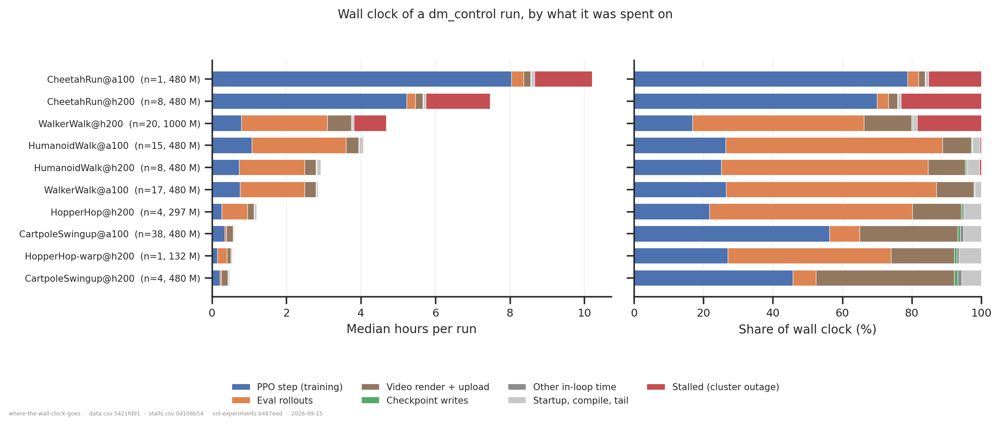
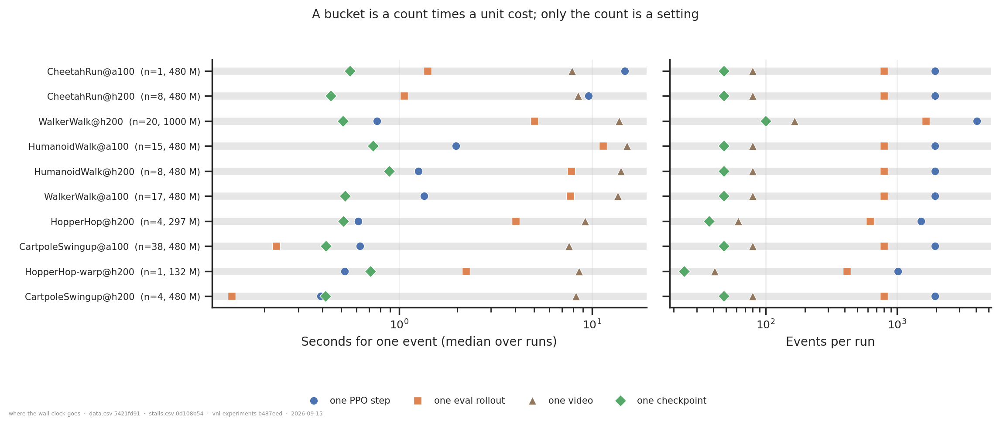
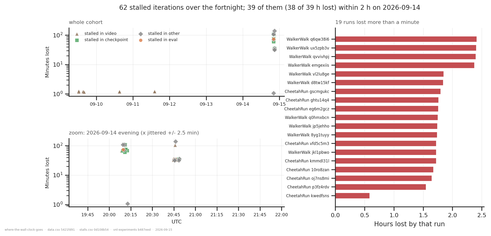
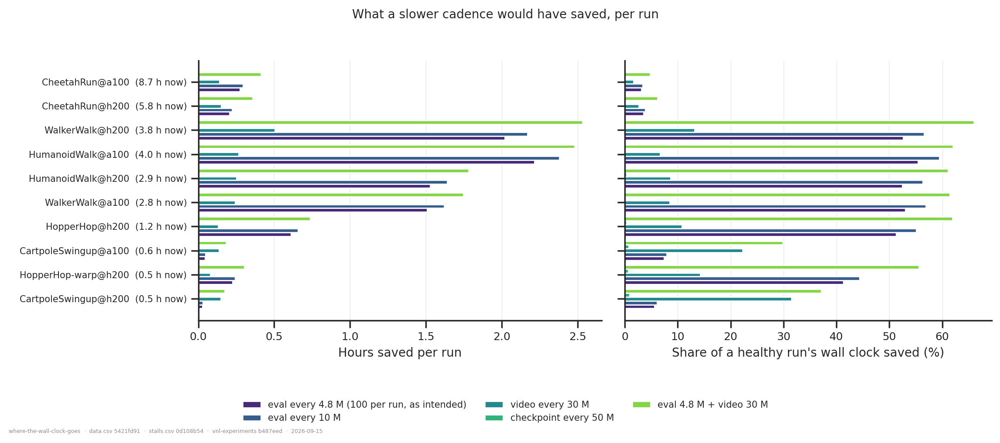

# Where the wall clock goes in a dm_control run

## Question

The dm_control tasks are meant to be the cheap, fast-turnaround version of the rodent's
question, and they have not felt cheap: a 480 M-step CheetahRun takes ten hours and a
1 G-step WalkerWalk six. Two things could be going on, and they have different answers.
A cluster filesystem outage on 2026-09-14 froze checkpointing for a couple of hours — how
much of the recent slowness is that? And beyond it, how is the wall clock of a *healthy*
run divided between training, eval, video rendering and checkpointing, i.e. are the
periodic cadences worth what they cost?

An answer is a per-run budget in hours that adds up to the measured wall clock, plus the
unit cost of one eval, one video and one checkpoint, so the cadences can be priced.

## Method

Nothing logs a time budget, but enough is logged to reconstruct one exactly.
`train_ppo` emits three throughput gauges, each a known config constant divided by the
seconds one thing took, each timed around exactly one thing: `throughput/train_sps` (the
PPO step alone, excluding eval, video and checkpoint), `throughput/eval_sps` (one eval
rollout, with `block_until_ready`) and `throughput/video_sps` (one video: render rollout,
render, and upload). Multiplying each back out by its constant gives seconds. Subtracting
all three from an iteration's wall clock — differenced from the wandb `_runtime` stamp —
leaves everything else, and on the iterations where `_should_run` says a checkpoint was
written that remainder *is* the checkpoint, because checkpointing is synchronous
(`StandardCheckpointer.close()` blocks) and nothing else in the loop takes measurable
time.

The reconstruction lives in `vnl_experiments/wandb_utils/timing.py` (12 tests, against a
simulated loop with known costs); the per-run series is a new `timing` artifact kind, a
sibling of `history`. It is a separate kind because `history` issues one
`run.history(keys=[...])` call and WandB drops rows where any requested key is missing —
asking for the three gauges together returns only their intersection, the ~80 rows where
a video happened to be rendered, i.e. 4 % of the iterations and none of the wall clock.

Two things were checked before believing any of it:

- **Alignment.** A history row's `_runtime` is stamped when wandb *commits* the row, not
  when it is logged, so the wall-clock series lags the metric series by a fixed number of
  rows. The lag is measured per run rather than assumed. It is `+1` for all 116 runs,
  and at that lag the median unexplained time is **4.1 ms per iteration** (worst run
  22 ms) against iterations of 0.4–15 s. The checkpoint bucket is a residual of a
  residual, and this is what makes it readable at all.
- **Event counts.** The number of evals and videos is counted from the gauges, and the
  number of checkpoints from a replay of `_should_run`; none of it is fitted. All three
  match `floor(steps / every_steps)` **exactly for all 116 runs**.

Time lost to hangs is separated from steady-state cost throughout: an iteration counts as
stalled if it took both > 60 s and > 5x that run's median iteration, and its excess is
charged back out of whichever bucket it landed in. Without that, the one CheetahRun whose
checkpoint hung for an hour reads as "checkpointing is 12 % of a CheetahRun", when
checkpointing is 0.1 % of it.

## Dataset & comparability

- **Source:** WandB `emiwar-team/nnx-ppo-delays`, selected by the `CONDITIONS` in
  `extract.py` and frozen in `runs.csv`. 116 runs created 2026-09-01 → 2026-09-15 (the
  whole Hydra era in this project; the pre-Hydra runs log no `config.eval.*`,
  `config.video.*` or `config.checkpoint_every_steps`, so no budget can be built for
  them).
- **Excluded:** the twelve `d168093` runs of 2026-09-09, which evaluated on the *wrapped
  training* env and rendered no video — a different eval configuration costing a different
  amount. Gated on the commit, not the date, since both sides of that fix were created on
  2026-09-09. Also two `failed` runs that never reached an iteration.
- **Conditions** are `task@gpu`. GPU cannot be pooled (measured below at 1.61x on the PPO
  step, matching `../README.md` §6), and task changes every bucket.

| condition | n | state | steps reached | networks | delays | seeds | commits |
|---|---|---|---|---|---|---|---|
| `CartpoleSwingup@a100` | 38 | 38 finished | 480 M | MLP, FM, Recurrent | 0–30 | 1234 | 971ab99, f9c8960 |
| `CartpoleSwingup@h200` | 4 | 4 finished | 480 M | MLP, FM | 0–20 | 1234 | 971ab99 |
| `WalkerWalk@a100` | 17 | 17 finished | 480 M–1 G | MLP, FM | 0–25 | 1234, 12345 | 971ab99, 9e216ae, f9c8960 |
| `WalkerWalk@h200` | 20 | 15 finished, 5 running | 262 M–1 G | MLP, FM | 0–25 | 46, 1234, 12345 | 971ab99, 9e216ae |
| `HumanoidWalk@a100` | 15 | 13 finished, 2 crashed | 84 M–2 G | MLP, FM | 0–20 | 1234, 123456 | 971ab99, 9e216ae |
| `HumanoidWalk@h200` | 8 | 6 finished, 2 crashed | 78 M–1 G | MLP, FM | 0–12 | 1234, 12345 | 971ab99, f9c8960 |
| `CheetahRun@a100` | 1 | 1 finished | 480 M | FM | 10 | 1234 | 9e216ae |
| `CheetahRun@h200` | 8 | 8 finished | 480 M | MLP, FM | 0–10 | 1234 | 9e216ae |
| `HopperHop@h200` | 4 | 4 running | 292–305 M of 480 M | MLP | 0–15 | 1234 | 540e356 |
| `HopperHop-warp@h200` | 1 | 1 running | 132 M of 480 M | MLP | 0 | 43 | 540e356 |

MLP = `DelayedMLP`, FM = `FlatForwardModel`, Recurrent = `FlatRecurrent`. Four runs
(two HumanoidWalk crashed, and the earliest of them at 78–84 M) contribute a partial but
perfectly valid budget: the reconstruction is per iteration, so a run that died early is
simply a shorter run, and every figure here is a share or a per-event cost.

- **What is measured:** seconds, not reward. No reward number appears in this analysis,
  so the 2026-09-10 eval-wrapper fix does not bear on the figures beyond the exclusion
  above, and the raw-reward conventions of `../README.md` §7 do not apply. Absolute hours
  are the primary axis everywhere; the share panels sit beside them, never instead.
- **Artifacts:** `REQUIRES = ["index", "timing:timing20000-3089bf7d"]`. Coverage is
  **116/116 in every condition** (`coverage.txt`); no run contributes a blank budget, and
  `plot.py` refuses to draw if one did.
- **Programmatic comparability** (`comparability.txt`): every quantity that enters the
  reconstruction is constant across the whole cohort — `n_envs` 8192, `rollout_length` 30,
  `eval.every_steps` 600 k, `eval.n_envs` 256, `eval.max_episode_length` 1000,
  `video.every_steps` 6 M, `video.episode_length` 1000, render 640x480,
  `checkpoint_every_steps` 10 M — as are `cuda_version` 13.3, the OS, Python 3.12.11 and
  `repos.vnl_playground.commit`. No `repos.*.dirty` is True anywhere, so the commits do
  identify the code. Four things are flagged and dealt with below.
- **Manual comparability.** Configs were read directly from the index rather than from
  the scripts at each commit, and all notes and tags were read (they are experiment
  descriptions — "Trying cheetah", "Experimenting with min_std" — and name no timing
  knob). The four flagged invariants:
  - **`git_commit` and `repos.nnx_ppo.commit` vary.** `git diff 971ab99 540e356` touches
    ~2 200 lines, of which two could plausibly cost time: the `NaNGuardWrapper` added to
    every env at `9e216ae`, and `53142793` in nnx-ppo, which puts `check_diagnostics` and
    a per-minibatch `count_nonfinite(grads)` **inside the timed region** of the PPO step.
    Rather than read the diff and declare it benign, both were measured on cells matched
    on task, GPU, network and delay: across 8 such cells the PPO step moves by **< 1 %**
    (e.g. WalkerWalk/A100/DelayedMLP/delay 5: 1.109 s before, 1.112 s after). Neither is
    a confound at the resolution of this analysis.
  - **`config.video.render_kwargs.camera` varies** (absent before `f9c8960`, then `side`,
    and `cam0` for HopperHop). It is a render-cost knob, so it was measured too: one
    WalkerWalk video is 13.5 s before and 14.9 s after, ~10 %, inside the spread of the
    video bucket and far too small to move any conclusion.
  - **`net_params.network_class` varies within conditions.** Deliberate: splitting on it
    as well would leave most cells at n = 1. Across 28 cells matched on task, GPU and
    delay, network class moves the PPO step by **1.24x median** (1.46x worst) but one eval
    by only **1.02x** (1.14x worst) — so it is a real but bounded confound on the `train`
    bucket and essentially none on the periodic buckets the question is about.
  - **`env_params.impl` varies** only because one deliberate `HopperHop` run uses MuJoCo
    Warp. It has its own condition, `HopperHop-warp@h200`, rather than being averaged into
    the jax HopperHop median or dropped.
- **Caveats.**
  - `CheetahRun@a100` is n = 1 and `HopperHop-warp@h200` is n = 1. Read as single runs.
  - The five `HopperHop` runs and five `WalkerWalk` runs were **still training** when this
    was built; their budget is of the part that has run so far, which is the right thing
    for a share but not a whole-run total. Their wall clock is taken from the artifact
    rather than the index, which was synced minutes earlier.
  - `startup_tail` is a mixture (process start, imports, env build, XLA compilation, the
    step-0 eval/video/checkpoint, and anything after the last logged row), not one thing.
    It is 1–6 % everywhere; do not read it as any single cost.
  - The stall threshold is a choice. It is far from any boundary here — the healthy
    checkpoint is 0.4–0.9 s, the hangs are 30–140 minutes — but a future outage of tens of
    seconds would not be caught.

## Figures

The whole answer is in the orange band. On WalkerWalk, HumanoidWalk and HopperHop, **eval
rollouts are 58–62 % of the wall clock and the PPO step is 22–27 %** — the runs spend more
than twice as long evaluating as training. Video is another 8–16 %. Checkpointing is the
thin green sliver: **0.1–0.9 %** everywhere, under a second per run-hour. CartpoleSwingup
and CheetahRun invert differently: Cartpole is dominated by video (28–40 %, because the
task itself is so cheap), and CheetahRun is 91 % training (see the conclusions — that is
its own problem).

Why eval costs what it does. On the left, the inversion: on Walker and Humanoid one eval
rollout (orange square) costs **5–11 s** against **0.8–2.0 s** for one PPO step (blue
circle), even though the eval does no gradient work. An eval is 1 000 *sequential*
environment steps over only 256 environments — latency-bound, poor occupancy — while a
training step is 30 steps over 8 192. On the right, the counts: a 480 M-step run does
1 954 PPO steps, **800 evals**, 80 videos and 48 checkpoints. 800 evals x 1 000 steps x 256
envs is 205 M environment steps of evaluation against 480 M of training.

The outage, located rather than inferred. Sixty-two iterations across the fortnight took
more than a minute; **39 of them, and 34.5 of the 34.8 hours lost, fall between 20:10 and
20:47 UTC on 2026-09-14** — two waves, 37 minutes apart. They span 20 runs on both GPU
models across different nodes and two tasks, which is not something a task or a network
can do. Every kind of I/O hung: 10 stalled in a checkpoint write, 19 in a video upload,
9 elsewhere, 1 in an eval. The rest of the fortnight contributes 0.3 h in total, all
minute-scale video uploads.

What slowing each cadence down would buy, priced at each run's own median event cost, so
a run that lost an hour to the outage is not credited with saving it again. Evaluating at
4.8 M instead of 600 k saves **1.5–2.5 h per Walker/Humanoid run, 52–55 % of its wall
clock** (51 % for HopperHop); adding video every 30 M takes it to **61–66 %**. Checkpointing every 50 M instead
of 10 M saves **0.01 h** — the bar is invisible, which is the finding.

## Conclusions

1. **The outage is real, and it is not the main story.** It cost 34.8 h across 19 runs,
   all created 2026-09-14 (19 of the 20 launched that day; one escaped). Those runs lost a
   median of 1.75 h each, ~30 % of their wall clock, so for them it roughly explains the
   surprise. But it is 9.7 % of the cohort's 360 h, and it touched nothing before
   2026-09-14, so it cannot explain why WalkerWalk and HumanoidWalk runs from 09-09 to
   09-11 also felt slow.

2. **Eval frequency is the actual cause, and it is a transcription accident.**
   `conf/train/dmc.yaml` says so in its own comment: `eval.every_steps: 600_000` is brax's
   60 M budget divided by the old script's `num_evals = 100`, and it was **not** rescaled
   when `total_steps` was multiplied by 8. So a run gets **800 evals where the number was
   chosen to give 100**, and an eval on these tasks is more expensive than a training
   step. Across the cohort, 150 h went to eval against 128 h to training.

3. **Checkpointing costs nothing and should be left alone.** 0.4–0.9 s per checkpoint,
   1.0 h across 360 h of cohort wall clock. Checkpointing *less* often would save
   milliseconds and cost real time on `gpu_requeue`, where a preemption replays back to
   the last checkpoint. The hour-long checkpoint on 09-14 was the filesystem, not the
   checkpoint.

4. **Suggested change, if the eval curve stays usable.** Set `eval.every_steps: 4_800_000`
   and `video.every_steps: 30_000_000`. That is 100 eval points and 16 videos per 480 M
   run, and it returns **61–66 % of the wall clock** on the locomotion tasks, 30–37 % on
   Cartpole, and 5–6 % on CheetahRun. The cost is resolution: eval points go from every
   0.6 M steps to every 4.8 M. Since the existing analyses read `history` artifacts
   sampled to ~2 000 rows and quote the mean over the last 50 M steps, 100 points looks
   ample — but the 90-run legacy cohort was also evaluated at 600 k, so a curve-shape
   comparison against it would be at different resolutions. Worth one deliberate decision
   rather than a silent change.

5. **Separately: CheetahRun's PPO step is ~10x slower than every other task's, and this
   is not explained.** 9.6 s per iteration on H200 (14.8 s on A100) against 0.77 s for
   WalkerWalk on the same GPU with the same network and the same 8 192 x 30 steps — and
   WalkerWalk does *ten* physics substeps per control step to CheetahRun's one. It is not
   the network (identical across DelayedMLP and FlatForwardModel), not the delay, and not
   compilation (the per-iteration time is flat to ±1 % from iteration 3 to the end). It is
   also not the physics as such: in *eval*, at 256 envs, CheetahRun is ~5x **faster** than
   WalkerWalk, in the direction the substep count predicts. Something about CheetahRun at 8 192
   envs specifically. `env_params.nconmax = 100000` with `njmax = 100` is an odd pairing
   next to WalkerWalk's 50000/100 and HumanoidWalk's 200000/250, and is the first thing
   to check. This is worth more than the cadence change for Cheetah: 91 % of a ten-hour
   run is the PPO step.

## Follow-ups

- Benchmark CheetahRun locally across `nconmax`, `njmax` and `n_envs`, in the style of
  `rodent/collision-model-xml/benchmark_xml.py`. If it is the contact buffer, a 10x
  speed-up on that task is on the table and every cadence argument above is noise
  beside it.
- Decide the eval cadence deliberately, and if it changes, note in
  `dm_control_suite/README.md` that eval-curve *resolution* now differs across eras, the
  way the reward-scale and eval-wrapper eras are already recorded.
- The eval itself is latency-bound, not throughput-bound: 256 envs x 1 000 sequential
  steps. Raising `eval.n_envs` would cost almost nothing per eval and would shrink the
  eval's own variance — which the track README notes is large. Worth measuring before
  choosing a cadence, since it changes the trade.
- Run this on the rodent track (`nnx-ppo-rodent-delays`). The `timing` producer defaults
  to that project already; nothing here is dm_control-specific except the cadences.

---

*Reproduce:* `../.venv/bin/python analysis/dm_control_suite/where-the-wall-clock-goes/extract.py && ../.venv/bin/python analysis/dm_control_suite/where-the-wall-clock-goes/plot.py`
(add `--sync --refresh` to the extract to pull in runs added since `runs.csv` was frozen;
new runs need their `timing` artifacts produced first — see the command in `coverage.txt`).
