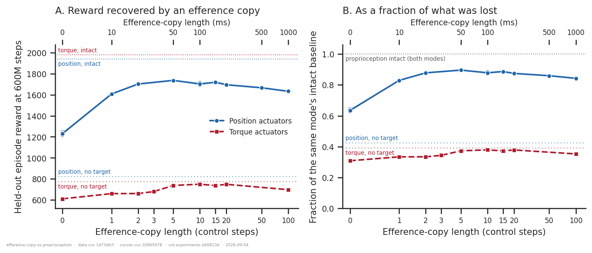
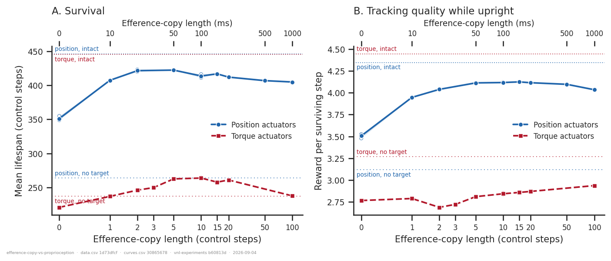
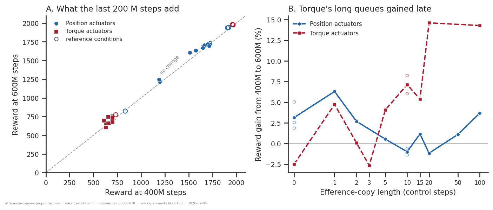
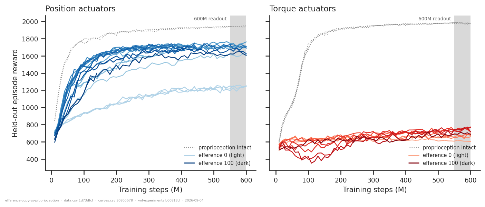

# Can an efference copy replace ablated proprioception? Position vs torque control

> **Updated 2026-09-04** with the 2026-09-03 relaunch, which took every arm to the full
> 600 M steps and added the two runs this analysis previously had to reason around: torque at
> `efference_length` 0 and 1. Both changes matter. The earlier version read everything at
> 400 M and concluded that the efference copy "recovers nothing" under torque; with a
> measured torque eff-0 anchor that is **wrong** — it recovers about a tenth of the gap. See
> [What changed](#what-changed-from-the-400-m-version).

## Question

With the decoder's proprioception stream ablated (`net_params.dec_use_proprioception=False`)
the policy has no sensory feedback about its own body configuration. Its remaining inputs
are the intention latent — the imitation target, encoded — and optionally an **efference
copy**, a queue of its own `efference_length` most recent actions.

1. How much of the ablation's cost does an efference copy buy back?
2. Does the **length** of the queue matter, and where does it saturate?
3. Does the answer differ between **position** and **torque** actuators?

An answer is a reward-vs-`efference_length` curve per control mode, read against two
measured levels: the same mode's proprioception-intact baseline (what was lost) and its
`efference_length = 0` floor (what an efference copy has to improve on).

**Why the modes could differ.** Once proprioception is gone the decoder has
`latent_size + efference_length × action_size` inputs — 32 + 38 L. Under position control
the action *is* a target joint angle (`force = kp·(offset + scale·ctrl − qpos)`), so the
queue is a proxy for recent *commanded posture*, and with a 40 ms `dyntype=FILTER` lag
dominating the plant, commanded posture is a serviceable estimate of actual posture. Under
torque control the action is a generalised force, and recovering configuration from a torque
history means integrating twice through unknown contact. The efference copy should therefore
substitute for proprioception far better under position control. This is the test of that.

## Dataset & comparability

- **Source:** WandB `emiwar-team/nnx-ppo-rodent-delays`, selected by the `CONDITIONS` in
  [`extract.py`](extract.py) and frozen in [`runs.csv`](runs.csv). 42 runs, of which **30
  are usable** at the 600 M readout (`usable_600M` in [`data.csv`](data.csv)) and 35 at
  400 M; the rest are in caveat 1.
- **Selection rule.** A run qualifies if **every parameter matches** — the walker XML, the
  env, all network sizes and regularisation settings, and all twelve PPO hyperparameters —
  and it is **not tagged `BUG`**. Runs are *not* filtered on the nnx-ppo or vnl-playground
  commit: the owner has confirmed no compatibility-breaking change landed across the span
  this cohort covers. `total_steps` is not filtered either, because
  `nnx_ppo.algorithms.ppo` passes `learning_rate` to optax as a constant with no schedule,
  so a run budgeted for 2 G steps learns identically to one budgeted for 600 M. Two gates
  that are *not* about code versions are kept: the architecture must be recorded as
  `RodentEncDecDelays` (accepting an absent field would admit `RodentForwardModel` runs,
  which also never recorded it — only the run *name* separates them, and names are not
  evidence), and the run must postdate the 2026-08-20 `eval_env = train_env` fix, without
  which `eval/*` is the train split and means something different.
- **Conditions** — all `AbsoluteImitation`, `rodent_no_tail_collisions.xml`,
  `body_target_frame=reference_root`, `RodentEncDecDelays` (enc/dec `[512]×4`, critic
  `[1024,1024]`), `latent_size=32`, `kl_weight=0.001`, `n_envs=4096`, `seed=42`:

| condition | n (usable @600M) | efference lengths @600M | decoder inputs | role |
|---|---|---|---|---|
| `pos_noproprio` | 21 (13) | 0, 1, 2, **·**, 5, 10, 15, 20, 50, 100 | intention + efference | the sweep |
| `torque_noproprio` | 12 (10) | 0, 1, 2, 3, 5, 10, 15, 20, **·**, 100 | intention + efference | the sweep |
| `pos_intact` | 2 (2) | 0 | all three streams | what was lost |
| `torque_intact` | 4 (3) | 0 | all three streams | what was lost |
| `pos_nointent` | 1 (1) | 10 | proprioception + efference | task-blind reference |
| `torque_nointent` | 2 (1) | 10 | proprioception + efference | task-blind reference |

  **·** marks a length that was launched but has no run reaching 600 M: position 3 and
  torque 50. Both are interior points; every anchor is measured.

- **Metric.** Held-out episode reward, as the mean of the eval points in (550 M, 600 M] —
  five points, since a single one is noisy and the last is not a measurement. Every run
  postdates the 2026-08-20 fix, so `eval/*` is a genuine held-out split throughout
  (`eval_split` is `held_out` for all 42). `reward_400M` is kept for every run, and does two
  jobs now that it is no longer the headline: it is the only budget the crashed runs reach,
  which makes them a cross-check on the relaunch, and the difference between the columns is
  itself a result (figure 3). Episode length is capped at ~500 control steps (250 mocap
  frames at 50 Hz, `ctrl_dt = 0.01`), which is the scale for the lifespan panel.

- **Artifacts:** `REQUIRES = ["index", "history:hist2000-09fea177"]`, **42/42 coverage, no
  gaps** — see [`coverage.txt`](coverage.txt).

- **Programmatic comparability:** [`comparability.txt`](comparability.txt). All twelve PPO
  hyperparameters, every network size and regularisation setting, and every `env_params`
  entry other than the manipulated `torque_actuators` are **single-valued across all 42
  runs**. Three environment invariants vary, all expected: `git_commit` (six values),
  `cuda_version`/`os` (a cluster upgrade), and `gpu` (seven models, which affects throughput
  and not what a fixed number of steps buys). `repos.nnx_ppo.*` and
  `repos.vnl_playground.*` are not listed as invariants, per the selection rule above; the
  evidence about them is kept rather than discarded, since two of the groups in
  `pooling_check.txt` still straddle the nnx-ppo commit and the CUDA upgrade.

- **Manual comparability.** Configs were read from `env_params`/`net_params` directly, never
  from tags, the run name, or the training script at the recorded commit — the cluster
  working copy drifts from what is committed (README §6). Three mechanical checks stand in
  for reading six large diffs:

  - [`code_identity.txt`](code_identity.txt) hashes the code that actually builds and runs
    these networks at each of the six commits: `build_delay_network`, `efference_copy.py`,
    `absolute_imitation.py`, and `_parse_net_params`. **All four are identical in executable
    code at all six commits.** Two differ in raw bytes at `2ae4a5dd`, and both differences
    are a script renamed inside a docstring, which is why the verdict is read from a
    docstring-stripped hash.
  - [`pooling_check.txt`](pooling_check.txt) measures what the figures pool over, the
    replicate noise floor, and the relaunch. **All groups hold**, and the sharpest test
    passes: the one run differing only in `delay_k` (position eff 0, `delay_k = 5`) scores
    1229.4, *inside* the [1215.8, 1246.7] band its two `delay_k = 0` replicates span — so
    the knob claimed to be inert moves reward less than rerunning does, which needs no
    tolerance to interpret.

    | group | n | what varies inside it | spread |
    |---|---|---|---|
    | position, efference 0 | 3 | `delay_k` (5, 0, 0) — nothing else | 2.51 % |
    | position, efference 2 | 2 | nothing at all | 0.61 % |
    | position, intact | 2 | `git_commit` — nothing else | 0.25 % |
    | position, efference 10 | 2 | `delay_k` + `git_commit` | 1.36 % |
    | torque, efference 10 | 2 | `delay_k` + git + nnx-ppo + CUDA | 0.99 % |
    | torque, intact | 3 | git + nnx-ppo + CUDA, config identical | 0.20 % |

    **The replicate noise floor is 2.51 %** — the position eff-0 triple, one commit, one
    stack. Every effect below is stated against it. It was 1.06 % at the 400 M readout: late
    training is noisier than the middle of it, which is the price of the fuller budget.
  - **The relaunch agrees with what crashed.** Four of the five crashed position runs were
    repeated on 2026-09-03. Read at 400 M, the only budget both reach, the repeats differ
    from the originals by −0.65 %, +0.14 %, +1.20 % and +2.12 % — all inside the noise
    floor. So the relaunched runs, which carry the entire 600 M result at efference 15, 20,
    50 and 100, are not measuring something different from the sweep they replaced.

- **Runs with different `delay_k` are pooled.** `build_delay_network` puts the `Delay` layer
  inside the proprioception branch, which `dec_use_proprioception=False` does not construct,
  so `delay_k` reaches nothing —
  [`../position-control-open-loop/check_delay_inert.py`](../position-control-open-loop/check_delay_inert.py)
  asserts the two networks are bit-identical, and the containment test above confirms it on
  trained reward. A `delay10_eff10_noproprio` run is a **length-10 efference** experiment,
  not a delay-10 one.

- **The manipulation is not "open loop."** Ablating proprioception removes body
  *configuration*, not all feedback: `task_obs` reaches the actor undelayed, and under
  `reference_root` its `root` and `quat` sub-keys are the reference root pose relative to
  the **current** root — an undelayed root position and orientation error (35 of 640
  numbers), measured in
  [`../position-control-open-loop/frame_leak.py`](../position-control-open-loop/frame_leak.py).
  Nothing here turns on the difference, but it is the wrong word for these runs, and
  `reference_root_open_loop` is the setting that would remove it.

### Caveats

1. **12 of 42 runs have no 600 M number.** Four never reached a first eval (`d3dh5qj3`,
   `wp9ka5kp`, `6atm5ygj`, `1ayy9bfj`); three died at 90–150 M (`gmmez2k1`, `vbd3cpe4`,
   `jiovpvgr`); five are the 2026-09-02 position runs that crashed at 384–441 M
   (`erzsvdom`, `ecapg0mv`, `rmvhu8le`, `6p10mb7v`, `29azonig`). The last five are not dead
   weight — they are the relaunch cross-check above. All are kept in `runs.csv` and
   `data.csv` with `usable_600M = False` rather than dropped.
2. **Two interior gaps.** Position has no eff-3 run at 600 M and torque none at eff 50.
   Position eff 3 has a 400 M value (1697.1) that sits correctly between eff 2 (1657.3) and
   eff 5 (1727.1) at that budget, so it is very unlikely to be hiding anything. Torque eff 50
   is bracketed by eff 20 (749.1) and eff 100 (698.0). Neither is an anchor, and
   [`selection_audit.txt`](selection_audit.txt) confirms no older run can fill them: it takes
   **every** run in the project tagged `noproprio` or `nointent` (34), places 32 in a
   condition and attributes the other two to the `BUG` tag, then drops each selection gate in
   turn — no gate, dropped alone, admits a single additional ablated run.
3. **Most cells are n = 1**, and both `nointent` references are n = 1. Against a 2.51 %
   noise floor the mode difference (a factor of 7 in gap recovery) is not in question, but
   the 3.1 % margin by which torque's peak sits *below* its blind floor rests on one run per
   side, and the small non-monotonicities within each plateau (position eff 10 vs 15, torque
   eff 15 vs 20) are inside the noise and should not be read as structure.
4. **The noise floor rose with the budget.** At 400 M every pooled group came in under
   1.06 %; at 600 M the position eff-0 triple spreads 2.51 %. The 6 % decline past the peak
   is therefore ~2.4× the floor rather than ~6×. It is supported by the monotone run of
   position points over eff 20 → 50 → 100, not by any single pair.
5. **`repos.*.dirty` is `True` for every run that recorded it** (41 of 42; only `ame77mw2`,
   which predates the field, recorded nothing), which per README §4 *voids* the commit
   hashes — the working copy had uncommitted edits, so `code_identity.txt` bounds only the
   committed code and cannot bound what actually ran. It is downgraded on two grounds: the
   owner has confirmed no compatibility-breaking change landed in nnx-ppo or vnl-playground
   over this span, and independently the `position, intact` (0.25 %) and `torque, intact`
   (0.20 %) groups hold the config identical while varying the working copy and the stack.
   It is kept in the list because the *measurement* is what makes it safe.
6. **`nointent` is a reference, not a point on the x-axis.** Those runs have proprioception
   *present* (delayed by 10) and no imitation target — the complementary ablation. They
   bound what reward a policy scores when it cannot know *what* to imitate; they are not
   "efference length 10 with no proprioception."
7. **One seed.** Every run is `seed = 42`, so the 2.51 % floor bounds run-to-run
   nondeterminism, not seed-to-seed variation.

## Figures

**Figure 1 — the answer.** Both arms now start from a measured `efference_length = 0`
anchor, and both rise: this is the panel that overturns the earlier "torque recovers
nothing." Position climbs steeply and plateaus — 63 % of intact with no queue, 83 % at
length 1, 88 % at length 2, peaking at 90 % at length 5 — then declines gently to 84 % at
length 100. Torque climbs too, but only from 31 % to 38 %, and its plateau sits just *below*
its own task-blind reference. Panel B removes the 2 % difference between the two modes'
intact baselines, which is the only reason panel A is not already a fair comparison.

**Figure 2 — what torque's small recovery actually buys.** Episode reward is survival ×
tracking quality, and the two panels disagree, which is the most informative thing in this
folder. Under position control both recover: lifespan 351 → 422 of ~500 possible (446
intact) and reward per step 3.51 → 4.12 (4.35 intact). Under torque, **survival recovers and
tracking does not**: lifespan climbs 221 → 264, crossing its task-blind floor of 237 from
below, while reward per surviving step barely moves (2.77 → 2.94) and stays far under its
blind floor of 3.27 at every length. So the torque efference copy teaches the policy to stay
upright a bit longer; it does not teach it to imitate.

**Figure 3 — why the relaunch was worth waiting for.** Panel A: the last 200 M steps move
everything a little and nothing much. Panel B is the point. The gains scatter, but torque's
two longest queues gained ~14 % over the last 200 M while its short ones gained nothing —
which is what a 3 832-input decoder layer against a 108-input one should look like. That is
enough to have made the shape of torque's curve past its peak unreadable at 400 M, and it is
why the earlier version of this analysis had to state the decline as an artefact candidate
rather than a result.

**Figure 4 — the curves the readout is taken from.** The window is flat for every arm, so
each number is a plateau rather than a snapshot of a rising curve. The torque panel remains
the striking one: every ablated run sits between 600 and 770 while the intact runs reach
~1980, and the darkest (longest-queue) curves dip for the first 150 M before recovering.

## Tentative conclusion

**An efference copy substitutes for proprioception under position control, and only
marginally under torque control — a factor of 7 in how much of the loss it recovers.**

- **Position.** With proprioception ablated and no efference copy, reward is 1231 — already
  63 % of the 1939 intact baseline. Adding the queue recovers **71 % of the remaining gap**,
  peaking at 1736 (90 % of intact) at length 5.
- **Torque.** The same ablation costs far more: 611, or 31 % of the 1979 intact baseline.
  The queue recovers **10 % of the gap**, peaking at 750 (38 %) at length 10. So the
  efference copy is not useless under torque — the earlier version of this analysis, which
  lacked the eff-0 anchor and saw only a flat line from length 2 upward, got this wrong —
  but it buys about a seventh as much of what was lost.
- **Length matters only at the very short end.** Position is within the 2.51 % noise floor
  of its peak by **length 2** (20 ms of action history), and a single-step queue already
  gets 83 % of intact. Torque needs a little longer, reaching its plateau at length 5–10.
- **Longer is mildly worse, and this is now a result rather than a suspicion.** Position
  falls 6.0 % from its peak to length 100, monotonically across lengths 20, 50 and 100;
  torque falls 7.0 % to length 100. Both exceed the noise floor. With every arm at the same
  600 M budget this can no longer be attributed to long-queue runs training more slowly,
  which was the objection that made the earlier version unable to say so.
- **What the modes have in common:** neither reaches its intact baseline, and the shape is
  the same — a steep rise over the first few steps, a plateau, then a shallow decline. What
  differs is only the height of the plateau.
- **Suggestive, not shown:** torque's peak (750) remains 3.1 % *below* its task-blind
  `nointent` reference (774). Read literally, a torque policy given the imitation target and
  an efference copy but no body feedback still does no better than one given body feedback
  but no target. Figure 2 says why that is consistent — it survives longer but imitates
  worse. Both references are n = 1, so this is the weakest claim here.

The pattern fits the mechanism proposed above: under position control the action queue *is*
an estimate of posture, because the actuator's job is to drive `qpos` towards the action,
so a short queue substitutes for proprioception well; under torque control it carries almost
no configuration information, and what little the policy extracts from it goes into staying
upright rather than tracking. The analysis tests the prediction, not the mechanism: nothing
here measures what the decoder does with the queue.

## What changed from the 400 M version

Worth recording, because one conclusion reversed and the reason is instructive.

| | 400 M version | this version |
|---|---|---|
| torque eff-0 anchor | not launched | **measured: 611** |
| torque conclusion | "recovers nothing; flat 31–36 %" | recovers **10 % of the gap**, 31 → 38 % |
| position gap recovered | 74 % | 71 % |
| decline past the peak | "not established" (early-readout bias) | **established**: −6.0 % (position) |
| noise floor | 1.06 % | 2.51 % |
| usable runs | 27 of 38 | 30 of 42 |

The reversal was exactly the failure mode the earlier caveat 2 named: *"if torque eff-0 came
in at ~700 it would confirm the flat line, and if it came in far lower the efference copy
**is** doing something under torque after all."* It came in at 611. A sweep with no measured
floor cannot distinguish "flat because nothing helps" from "flat because it has already
helped as much as it will by the shortest length tested" — and the second was true.

## Follow-ups

1. **A second seed.** Now the largest gap. Every cell is `seed = 42`, so the 2.51 % floor
   bounds run-to-run noise only, and the two claims that live nearest that floor — the 6 %
   decline and torque's 3.1 % shortfall against its blind floor — are the ones a second seed
   would confirm or kill.
2. **A second `nointent` run per mode**, for the same reason: the "below the task-blind
   floor" claim rests on one run per side.
3. **Decouple queue length from decoder width.** At length 100 the decoder's input layer is
   3 832 wide, so "longer queue" and "much bigger first layer" are one knob, and figure 3B
   shows the width has its own effect on learning speed. Projecting the queue through a
   fixed-width linear layer first would separate the information in the queue from the cost
   of reading it — and would test whether the shallow decline is about the queue at all.
4. **Fill the two interior gaps** (position eff 3, torque eff 50) — cheap, and would make
   both curves complete.
5. **The intermediate condition:** delayed proprioception *plus* a long efference copy, at
   matched decoder width, would place these fully-ablated points on the delay sweep in
   [`../position-control-open-loop/`](../position-control-open-loop/) rather than beside it.
6. **Probe what the queue carries.** The mechanistic claim is that the position-control
   queue encodes posture. A linear decode of `qpos` from the efference queue alone, position
   vs torque, would test it directly — `probes/linear_decoding.py` already does this kind of
   thing.

---

*Reproduce:* `../.venv/bin/python analysis/efference-copy-vs-proprioception/extract.py && ../.venv/bin/python analysis/efference-copy-vs-proprioception/plot.py`
(add `--sync --refresh` to the extract to pull in runs added since `runs.csv` was frozen).
Verification scripts: `code_identity.py`, `pooling_check.py`, `selection_audit.py` — all
take `--check`.

**If you re-run after new runs finish:** `history` artifacts are snapshots. Four runs in
this cohort were still training when their artifact was first made, and `artifacts ensure`
will not replace an artifact that exists — so re-produce with `--override` for any run whose
`summary._step` now exceeds the artifact's `resolved.max_step`, or `extract.py` will
silently treat a finished 600 M run as unusable.
