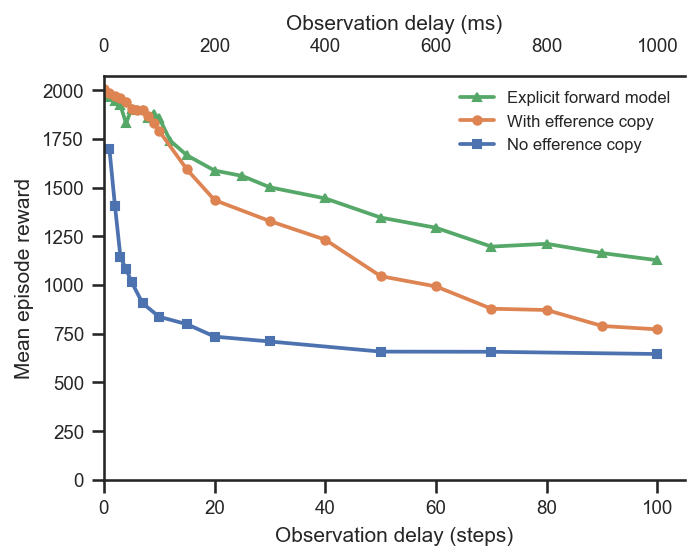

# Does an explicit forward model improve performance?

## Question
A plain **efference copy** hands the policy a buffer of its recent actions and lets it
work out the consequences implicitly. An **explicit forward model** instead uses that
action buffer plus the delayed proprioception to *predict the current proprioception*
(via a learned predictor trained with a self-supervised L2 loss and stop-gradient), and
feeds the prediction to the decoder. Does adding this explicit predictor improve control
performance under proprioceptive delay, relative to the plain efference copy?

## Dataset & comparability
- Source: WandB project `emiwar-team/nnx-ppo-rodent-delays`, tag `TrainEvalSplit`,
  env `AbsoluteImitation`.
- Conditions (one line each):
  - **forward_model** — `ForwardModel` tag (n=33, delays 0–100).
  - **efference** — plain efference copy, `efference_length == delay_k` (n=22, delays 0–100).
  - **no_efference** — `efference_length == 0`, `delay_k > 0` (n=13, delays 1–100), shown
    as the floor for reference.
- Comparability: **comparable, with one documented difference.** Within every condition all
  invariants are single-valued and identical across conditions — `latent_size=32`,
  `kl_weight=0.001`, `body_target_frame=reference_root`, standard architecture
  (enc/dec `[512]×4`, critic `[1024,1024]`), `n_envs=4096`, `total_steps=600M`, actual step
  `600,064,000` (see [comparability.txt](comparability.txt)).
- Caveats:
  - **Git commit differs by design**: forward-model runs are git `5464376`; the
    efference/no_efference baselines are git `1cd5838`. The only shared-code change between
    those commits is the **backward-compatible `inject_key` parameter** on `EfferenceCopy`
    (`git diff 1cd5838 5464376` over the package is otherwise only *new* files —
    `forward_model.py`, `train_rodent_forward_model.py`). The env, encoder/decoder/critic,
    PPO, and reward code are byte-identical, so the comparison is fair.
  - The forward model adds an extra learned component (the predictor MLP, `fm_hidden_sizes`)
    and its L2 loss; a difference therefore reflects the predictor mechanism, not just added
    capacity in the shared encoder/decoder (those are held fixed).
  - For each delay we keep the highest-reward run (`plot.py` dedups by `delay_k`).

## Figures

## Tentative conclusion
**Yes, at non-trivial delays.** The two mechanisms are interchangeable when the delay is
small: from 0–8 steps (0–80 ms) the explicit forward model and the plain efference copy are
within noise of each other, and the predictor is marginally *worse* at the very shortest
delays (e.g. −20 reward at delay 0), consistent with it adding nothing useful — and a little
overhead — when proprioception is barely stale.

Beyond ~10 steps (100 ms) the explicit forward model pulls clearly ahead and the gap widens
monotonically with delay: roughly +70 reward at 15 steps, +170 at 30, and +300–375 at
50–100 steps (0.5–1 s) — recovering a large fraction of the performance the plain efference
copy loses. In short, explicitly predicting the current state is what pays off precisely when
the observation is most stale, while both approaches dominate the no-efference floor
throughout.
