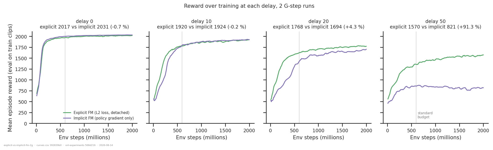
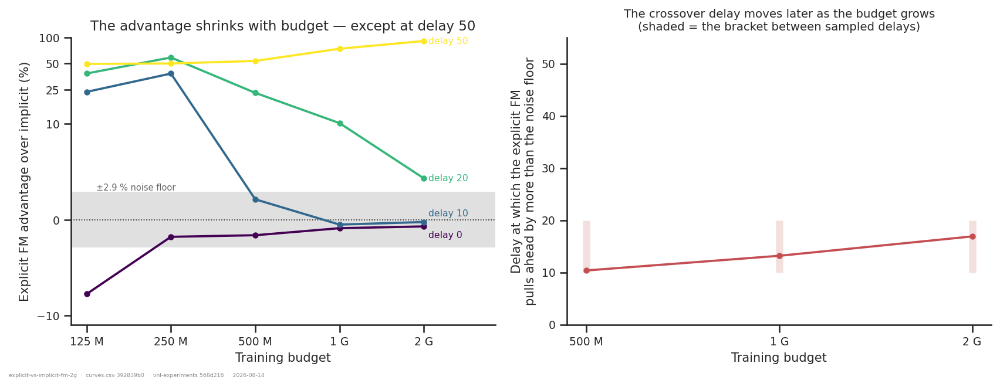
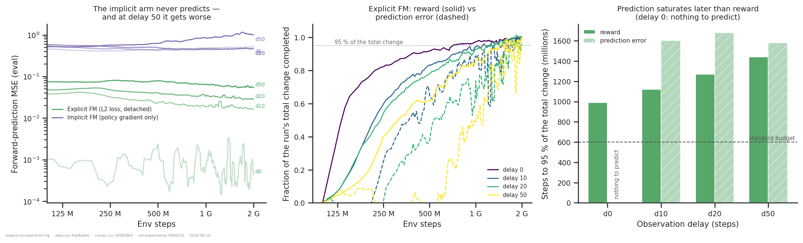
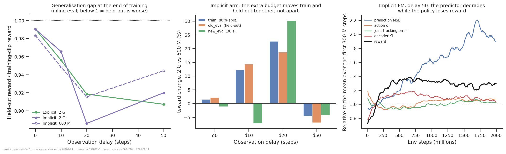
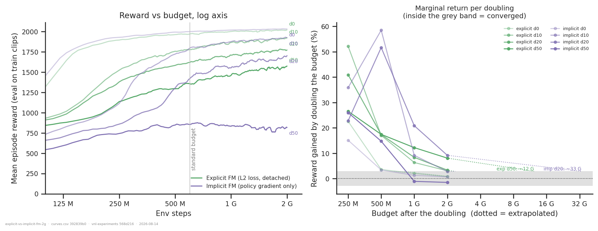

# Explicit vs implicit forward model at 2 G steps

## Question

[`forward-loss-vs-architecture/`](../forward-loss-vs-architecture/) concluded from 600 M-
step runs that the **explicit** forward model (predictor trained by a self-supervised L2
loss) and the **implicit** one (same architecture, `fm_loss_weight = 0` and
`detach_prediction = False`, so the predictor is shaped only by the policy gradient) are
indistinguishable up to delay ~10–15, after which the explicit one pulls away.
[`xml-ceiling-vs-convergence/`](../xml-ceiling-vs-convergence/) then showed 600 M is well
short of convergence at these delays. So:

1. How large is the explicit-vs-implicit reward difference **at 2 G**?
2. Was the 600 M crossover a **budget artefact**?
3. Does the **forward-model prediction error** saturate earlier or later than reward?
4. Any sign of **overfitting**?
5. **For how many steps should ceiling comparisons be trained?**

## Answers, in one line each

1. At delay 0/10 the two are **tied** (within ±1 %). At delay 20 the explicit arm leads by
   **+4.3 %**, at delay 50 by **+91 %**.
2. **Partly.** The crossover delay moves from ~10 (at 500 M) to ~13 (1 G) to **~17 (2 G)**,
   and is still moving. But it moves, it does not disappear: at delay 50 the gap *grows*
   with budget.
3. **Later.** In the explicit arm reward reaches 95 % of its 2 G level at 1.1–1.4 G steps
   while the prediction error needs 1.6–1.7 G. Only at delay 0 (nothing to predict) does
   the error settle first.
4. **No.** Held-out reward moves with training reward at every delay; the one run that
   loses reward loses it on held-out clips too. The train/held-out ratio does widen
   slightly at delays 20 and 50, but from 0.92 to 0.89 — a change, not a divergence.
5. **~1 G to rank the networks at delay ≤ 10, ~3 G at delay 20, and no practical budget
   at delay 50** — see *How long to train* below.

## Dataset & comparability

**Source:** WandB `emiwar-team/nnx-ppo-rodent-delays`, selected by the `CONDITIONS` in
`extract.py` and frozen in `runs.csv`. Exactly the **eight 2 G-step runs**, nothing else.

| condition | n | delays | `fm_loss_weight` | `detach_prediction` | commit | launched |
|---|---|---|---|---|---|---|
| `expfm_2g` (explicit) | 4 | 0/10/20/50 | 1 | True | `25732c42` | 2026-08-13 |
| `pgfm_2g` (implicit) | 4 | 0/10/20/50 | 0 | False | `25732c42` | 2026-08-13 |

All: new XML, `reference_root`, torque, seed 42, `min_std = 0.1`, standard architecture,
`delay_k == efference_length`, `state = finished`, `summary._step = 2_000_076_800`.
Wall-clock 12.5–23 h each (H200 / A100).

**Reading the budget axis within each run.** `total_steps` only bounds PPO's training loop
and the learning rate is constant (`nnx_ppo/algorithms/ppo.py` — no schedule, no
annealing), so a 2 G run's state at step *s* **is** an *s*-step run.
`xml-ceiling-vs-convergence` verified this against the separately launched 600 M twins:
eight matched pairs agree to **±2.9 %**, which is used here as the noise floor and drawn
on every difference plot. This is a better design than comparing separate cohorts — at
every point on the x-axis the two arms differ *only* in the forward-model knobs, with no
commit, GPU, or launch-date confound riding along.

**Programmatic comparability** (`comparability.txt`): **zero** invariants flagged, not
only within each condition but across the whole cohort — all 35 checked columns
(every PPO hyper-parameter, all eleven env knobs, `git_commit`, `logging_level`,
`summary._step`) are single-valued. The two arms differ in `fm_loss_weight` and
`detach_prediction` and in nothing else.

**Manual comparability.** Configs read from the index rather than tags. `fm_loss_weight` /
`detach_prediction` checked per run in `data.csv` rather than inferred from the `nodetach`
name suffix. One commit throughout, so no `git diff` is needed. `nnx-ppo`'s version is not
recorded per run but cannot vary within a single launch batch.

**Artifacts** (`coverage.txt`): `history:hist2000-fc46b078` 8/8 — a non-default history
spec that also carries `eval/net/3/action/1/fm_pred_mse/mean`, the policy σ, the encoder
KL and the tracking error. Produce it with the `artifacts ensure --set keys=...` command
in `extract.py`'s docstring. No `eval` artifacts exist for these runs.

**Caveats.**

1. **One run per cell** (seed 42). The ±2.9 % noise floor is the only handle on that, and
   it is an estimate from a different set of pairs.
2. **Four delays.** Every "crossover delay" here is a linear interpolation inside a
   10- or 30-step bracket, and the figure draws the bracket.
3. **New XML + `reference_root`.** `forward-loss-vs-architecture`'s 600 M conclusion was
   measured on the *old* XML with `current_root`. The 600 M slice of these runs
   reproduces its shape, but this is a re-measurement on a different body, not the same
   runs re-read.
4. **The extrapolated budgets are extrapolations** of three or four points on a
   geometric-decay assumption. Read the order of magnitude, not the digits.

## Reward over training

The raw picture every number below is a reduction of: the two arms at each delay, on a
shared y-axis, with the standard 600 M budget marked. Delays 0 and 10 end on top of each
other — at delay 10 the explicit arm is visibly ahead through the first ~600 M and the
implicit one catches it exactly. Delay 20 shows the same catch-up, slower and not quite
complete by 2 G. Delay 50 is a different shape altogether: the implicit arm flattens
around 660 M and drifts down while the explicit arm is still climbing at 2 G.

## The advantage, as a function of budget

| delay | 125 M | 250 M | 500 M | 1 G | 2 G |
|---:|---:|---:|---:|---:|---:|
| 0 | −7.7 % | −1.8 % | −1.6 % | −0.9 % | −0.7 % |
| 10 | +23.5 % | +38.3 % | +2.1 % | −0.5 % | **−0.2 %** |
| 20 | +38.4 % | +58.8 % | +22.9 % | +10.2 % | **+4.3 %** |
| 50 | +49.5 % | +50.1 % | +53.7 % | +74.3 % | **+91.3 %** |

Three regimes, and they answer question 2 differently.

**Delays 0–10: entirely a budget artefact.** At 500 M the explicit arm looks +2.1 % ahead
at delay 10; by 1 G the two are tied and they stay tied. Whatever advantage the 600 M
experiments saw at delay 10 was the explicit arm converging faster, not converging higher.

**Delay 20: mostly a budget artefact, not entirely.** +22.9 % at 500 M, +10.2 % at 1 G,
+4.3 % at 2 G — the gap roughly halves per doubling (decay factor 0.43). It is still above
the ±2.9 % noise floor at 2 G, and extrapolating the same decay it would enter the noise
band at **~3 G**. So the honest statement is: at delay 20 the explicit FM is faster, and
*may* also be very slightly better, but a 2 G measurement cannot separate those.

**Delay 50: not a budget artefact at all — the opposite.** The gap *grows* with budget,
+53.7 % → +74.3 % → +91.3 %, because the implicit arm peaks near 660 M and then declines
while the explicit arm keeps climbing. More compute makes the explicit forward model look
*better*, not worse.

**The crossover delay is budget-dependent.** Taking "the explicit arm leads by more than
the noise floor" as the criterion, it sits at delay ≈ 10 at 500 M, ≈ 13 at 1 G, ≈ 17 at
2 G, and is still drifting. The "explicit wins from delay ~12" rule of thumb is therefore
a statement about a 600 M budget, not about the networks. Below 500 M the notion breaks
down entirely — both arms are still in the initial transient and at 125 M the explicit arm
is 8 % *behind* at delay 0 and 24 % ahead at delay 10.

## The forward-model prediction itself

**Does prediction saturate earlier than reward? No — later.** In the explicit arm, steps
to complete 95 % of the run's total change:

| delay | reward | prediction error |
|---:|---:|---:|
| 0 | 990 M | — (nothing to predict; MSE sits at ~1e-3) |
| 10 | 1120 M | 1600 M |
| 20 | 1270 M | 1680 M |
| 50 | 1440 M | 1580 M |

The predictor is still measurably improving after the policy has stopped being paid much
for it. Between 600 M and 2 G the eval MSE falls **−30 % / −25 % / −26 %** at delays
10/20/50 while reward gains only **+8.2 % / +9.3 % / +15.5 %**; over the last 500 M alone
the MSE drops 16 % / 16 % / 6 % against reward gains of 2.5 % / 1.4 % / 1.9 %. So the L2
objective has not converged at 2 G anywhere except delay 0 — and it is buying steadily
less reward per unit of prediction improvement, which is the more interesting half of the
observation.

**The implicit arm confirms and extends the earlier result.** Its prediction MSE is
0.47–1.00 across delays, an order of magnitude above the explicit arm, and it **rises**
over training in three of four cells (delay 0: 0.46 at 600 M → 0.52 at 2 G; delay 50: ~0.50
early in training → 0.71 at 600 M → 1.00 at 2 G, peaking at 1.16 near 1.7 G). The policy
gradient does not merely fail to learn a forward model —
given more steps it actively moves the predictor further from predicting. This closes the
`xml-ceiling-vs-convergence` follow-up "why does the implicit arm at delay 50 decline?":
the predictor degrades.

## Overfitting

**What these runs can and cannot say.** `eval_env == train_env`, so the logged `eval/*`
curve is a *deterministic evaluation on the training clips*. There is **no held-out curve
over training**. The only held-out numbers are the single end-of-training `final_eval/*`
points — which all eight runs have, and which the implicit arm also has at 600 M from the
separate runs, giving one before/after comparison.

| arm | budget | d0 | d10 | d20 | d50 |
|---|---|---:|---:|---:|---:|
| implicit | 600 M | 0.983 | 0.949 | 0.915 | 0.944 |
| implicit | 2 G | 0.990 | 0.966 | **0.886** | **0.920** |
| explicit | 2 G | 0.990 | 0.956 | 0.918 | 0.907 |

(held-out reward ÷ training-clip reward)

**No overfitting in the sense asked.** Going from 600 M to 2 G in the implicit arm, train
and held-out move *together*: +12.3 % / +14.3 % at delay 10, +22.6 % / +18.7 % at delay
20, −4.5 % / −7.0 % at delay 50. Nowhere does training reward rise while held-out reward
flattens or falls. The one cell that declines (delay 50) declines on both.

What does happen is a **modest widening of the gap at the longer delays** — 0.915 → 0.886
at delay 20 and 0.944 → 0.920 at delay 50 — i.e. the extra budget buys slightly more on
the clips it trains on than on unseen ones. That is a 2–3 pp effect against a 32-clip
held-out set, and it does not change any ranking. The two arms have similar gaps at 2 G,
so this is not a property of the forward loss.

The third panel shows what the delay-50 implicit run does instead of overfitting: its
prediction error more than doubles, its action σ *rises* (0.477 → 0.529 between 600 M and
2 G — the only cell of eight where σ does not fall), its encoder KL falls (8.3 → 7.4), and
its joint tracking error rises (2.34 → 2.50) — progressive
degradation of the predictor and the policy together, on training and held-out clips
alike.

## How long to train

Reward gained by each doubling of the budget, and — extrapolating the observed geometric
decay — the budget at which that gain would fall inside the ±2.9 % noise floor:

| arm | delay | →1 G | →2 G | decay/doubling | extrapolated "converged" budget |
|---|---:|---:|---:|---:|---:|
| explicit | 0 | 2.0 % | 0.9 % | 0.36 | 0.8 G ✓ already |
| explicit | 10 | 6.3 % | 3.1 % | 0.39 | ~1.9 G ✓ just about |
| explicit | 20 | 8.4 % | 3.3 % | 0.44 | ~2.3 G |
| explicit | 50 | 12.2 % | **8.1 %** | 0.68 | **~12 G** |
| implicit | 0 | 1.3 % | 0.7 % | 0.36 | 0.7 G ✓ already |
| implicit | 10 | 9.2 % | 2.8 % | 0.39 | ~2.4 G |
| implicit | 20 | 20.8 % | **9.2 %** | 0.70 | **~33 G** |
| implicit | 50 | −1.1 % | −1.5 % | — | declining |

**Recommendation, separating the two things a budget can buy.**

- **To rank the networks** (which is usually the actual question), the contrast converges
  much faster than either arm: **1 G at delays ≤ 10** (the arms are tied and stay tied),
  **~3 G at delay 20**, and at delay 50 the ranking is unambiguous at *any* budget from
  600 M up and only gets clearer. So **2 G is a defensible default and 3 G would close the
  one open cell.**
- **To measure absolute ceilings**, 2 G is not enough anywhere at delay ≥ 20, and at delay
  50 the honest number is ~12 G for the explicit arm — six days per run at the observed
  12.5–23 h per 2 G run. That is not worth it. Report long-delay rewards as **lower
  bounds** instead, or compare arms at matched budget and say so.
- Practically: if you plan one more sweep, spend it on **seeds at 2 G** rather than steps.
  Every conclusion here rests on one run per cell against a ±2.9 % noise floor, and the
  delay-20 residual (+4.3 %) is only 1.5× that floor.

## Follow-ups

> **The first two are done, in
> [`explicit-vs-implicit-fm-budgets/`](../explicit-vs-implicit-fm-budgets/)** (2026-08-20),
> using the 2026-08-18/19 batch of 4 G-step runs at delays 20/30/40/50 (seed 43). Headline
> corrections to this report: the crossover drift **halts** — 2 G, 2.9 G and 4 G all put it
> at delay ~22, so the converged answer is ~20 rather than "still receding". And the
> delay-50 advantage keeps *growing* with budget (+91 % here at 2 G, +110 % at 4 G). The
> second seed also shows the implicit arm is seed-sensitive at ±7.6 % while the explicit arm
> is within ±1.9 %, which puts the +4.3 % delay-20 result below resolution.

- ~~**Delays 30 and 40 at 2 G.** The crossover has drifted into the 20–50 bracket and there
  is nothing sampled inside it; two runs per arm would locate it directly instead of by
  interpolation across a 30-step gap.~~ Done (at 4 G): the advantage is +17 % at delay 30
  and +71 % at delay 40.
- ~~**A second seed at delay 20**, the one cell whose result (+4.3 %) is close enough to the
  noise floor that it turns on a single run.~~ Done: seed 43 gives +5.2 % at 2 G, but the
  seed spread in the implicit arm is ±7.6 %, so delay 20 stays unresolved.
- **A checkpoint-sweep offline eval** — `eval` artifacts at 200 M-step intervals along the
  eight runs — which is the only thing that would turn the overfitting question into a
  curve rather than two endpoints. The producer pins `checkpoint: "last"`, so this needs a
  spec that accepts a step.
- **Why does the implicit predictor get *worse* with training?** Rising prediction MSE
  under a pure policy gradient is a strong hint that the sub-network is being repurposed;
  the [`implicit-forward-model/`](../implicit-forward-model/) decoding probes run at 2 G
  would say what it encodes instead.
- **Does the explicit arm's still-falling prediction error buy anything past 2 G?** The
  MSE at delay 50 is still dropping 7 % per 500 M with reward nearly flat, which either
  means the reward is bounded by something else or that a later payoff is coming.

---

*Reproduce:* `../.venv/bin/python analysis/explicit-vs-implicit-fm-2g/extract.py && ../.venv/bin/python analysis/explicit-vs-implicit-fm-2g/plot.py`
(add `--sync --refresh` to the extract to pull in runs added since `runs.csv` was frozen).
