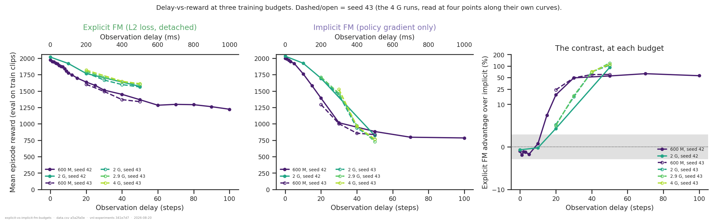
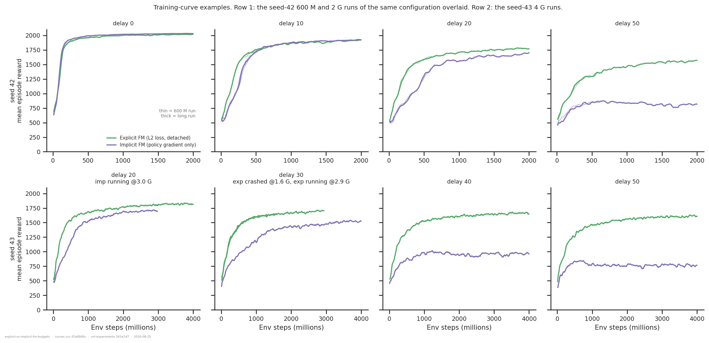
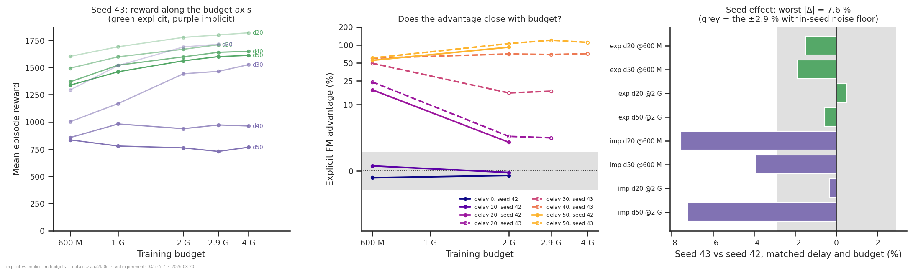
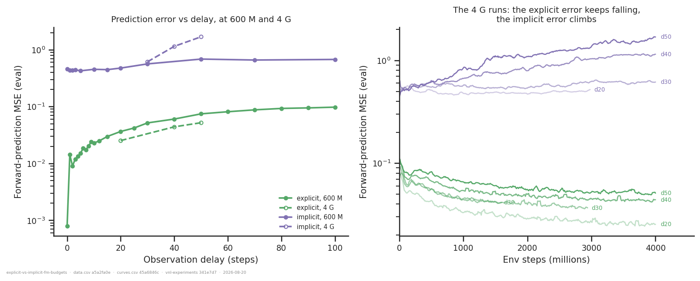

# Explicit vs implicit forward model across 600 M, 2 G and 4 G steps

## Question

Same contrast as [`explicit-vs-implicit-fm-2g/`](../explicit-vs-implicit-fm-2g/): the
**explicit** forward model (predictor trained by a self-supervised L2 loss) against the
**implicit** one (same architecture, `fm_loss_weight = 0`, `detach_prediction = False`, so
the predictor is shaped only by the policy gradient). That analysis found the crossover
delay drifting later with budget — ~10 at 500 M, ~13 at 1 G, ~17 at 2 G — and had nothing
between delay 20 and 50 to say where it settles. The 2026-08-18/19 batch of **4 G-step**
runs samples delays 20/30/40/50 in both arms and lands in exactly that gap.

1. Where is the crossover, and does it keep moving with budget?
2. What does the delay–reward curve look like at each budget?
3. Does the long-delay advantage grow or shrink with more compute?

## Answers, in one line each

1. **It stops moving.** The crossover goes from delay ~12 (600 M) to ~17 (2 G) and then
   sits at ~22 from 2 G through 2.9 G. Two more doublings do not move it further.
2. **The two arms' curves separate at delay ~20 and then diverge**, and more budget makes
   the separation *sharper*, not milder — the explicit curve lifts uniformly with budget
   while the implicit one lifts only at delays ≤ 30.
3. **It grows.** At delay 40 the advantage goes +60 % → +71 %, at delay 50 +60 % → +110 %
   between 600 M and 4 G. Only at delays 20–30 does budget close anything.

## Dataset & comparability

**Source:** WandB `emiwar-team/nnx-ppo-rodent-delays`, selected by the `CONDITIONS` in
`extract.py` and frozen in `runs.csv` — **57 runs**. All: new XML, `reference_root`,
torque, standard architecture, `min_std = 0.1`, `delay_k == efference_length`.

| condition | n | delays | budget | seed | commits |
|---|---|---|---|---|---|
| `expfm_600m` | 23 | 0–100 (23 values) | 600 M | 42 | `ef060b73` |
| `pgfm_600m` | 16 | 0–100 (13 usable) | 600 M | 42 | `25732c42` |
| `expfm_2g` | 4 | 0/10/20/50 | 2 G | 42 | `25732c42` |
| `pgfm_2g` | 4 | 0/10/20/50 | 2 G | 42 | `25732c42` |
| `expfm_4g` | 5 | 20/30/30/40/50 | 4 G | **43** | `13637960`, `afbeea09` |
| `pgfm_4g` | 5 | 20/20/30/40/50 | 4 G | **43** | `13637960`, `afbeea09` |

**Budget is read within-run.** `total_steps` only bounds PPO's training loop and the
learning rate is constant (`nnx_ppo/algorithms/ppo.py` — no schedule, no annealing), so a
run's state at step *s* is an *s*-step run and every run contributes to every tier it
reached. `xml-ceiling-vs-convergence` verified this against separately launched twins:
matched pairs agree to **±2.9 %**, the within-seed noise floor used throughout. The
consequence worth stating: at a given tier the two arms differ *only* in the forward-model
knobs — no commit, GPU or launch date rides along with the x-axis.

**Where this is deliberately loose** (as requested):

- **The 4 G runs are seed 43; everything else is seed 42.** They were launched as a second
  seed, not as a budget extension. Rather than ignore that, the seed effect is measured:
  the 4 G runs pass through 600 M and 2 G, so seed 42 and seed 43 can be compared at
  matched arm, delay and budget (8 such cells). The explicit arm agrees to **±1.9 %**; the
  implicit arm to **±7.6 %**. Every threshold below is therefore quoted twice, against the
  2.9 % within-seed floor and against the 7.6 % seed spread.
- **Crashed and still-running runs are included**, contributing to the tiers they reached
  and no further; `max_step` comes from each run's own curve, not `summary._step` (a
  running run's artifact is fresher than the index). This is why there is a **2.9 G**
  tier: it is the largest budget at which all four seed-43 delay pairs are complete, while
  4 G has complete pairs only at delays 40 and 50.
- **Delays with only one arm are drawn as examples and never differenced.** At 4 G that is
  delay 20 (explicit only — its partner `2pk2qbb4` was at 2.98 G) and delay 30 (implicit
  only — `vvcvtmzl` at 2.94 G). At 600 M the explicit sweep has 11 delays the implicit one
  does not.
- **Four runs logged nothing and drop out of every figure**: `jhghg9vt` (4 G implicit
  delay 20) and `8ghybcam` / `jr2fxeil` / `jbok6wg3` (600 M implicit duplicates at delays
  15/70/100). They stay in `runs.csv` so the selection remains a faithful record of the
  query.

**Programmatic comparability** (`comparability.txt`): within every condition, the only
flagged invariant is `git_commit` in the two 4 G conditions. Across conditions only the
designed axes vary: `seed`, `total_steps`, `fm_loss_weight`, `detach_prediction`,
`git_commit`.

**Manual comparability.**

- All 90 `env_params.*` / `net_params.*` / `config.*` columns diffed pairwise: within each
  4 G condition, **zero** differences. Between a 2 G run and its 4 G counterpart at matched
  arm and delay, exactly two: `config.ppo.total_steps` and `config.seed`. Nothing else.
- `13637960` → `afbeea09` (the two 4 G commits) touches only eval and artifact tooling
  (`audit_env.py`, `evaluation.py`, `envs/config_io.py`, `cli.py`) — no training, env,
  network or reward code.
- `25732c42` → `afbeea09` (2 G commit → 4 G commit): the only change on the training path
  is `0b4de48`, which stopped saving an extra final checkpoint. `forward_model.py`,
  `network_builders.py` and `train_delays.py` are byte-identical.
- `expfm_600m`'s runs are all `state = failed`: they died in the *post-training* eval after
  completing every training step (documented in `xml-ceiling-vs-convergence`). They are
  not truncated, and the figures annotate truncation from `max_step`, not from `state`.
- **No `eval`, `activations` or `video` artifacts are used here**, only `history`. The
  2026-08-18 walker-XML fix (README §2) bumped those three producers to `VERSION = 2`
  because they rebuilt the env on the wrong body; `history` reads WandB and was untouched,
  so nothing in this folder is exposed to that bug.

**Caveats.** One run per cell everywhere. The 4 G tier is a single seed distinct from the
rest. The delay grid thins out badly above 20 in the implicit 600 M sweep (0/1/2/3/5/10/
15/20/30/50/70/100). Wall clock: 4–7 h at 600 M, 13–23 h at 2 G, 10–31 h at 4 G.

## Delay vs reward, at each budget

The left two panels are the requested view: each arm's delay–reward curve at every budget
we have. They behave completely differently.

**The explicit arm lifts uniformly with budget.** Its curve keeps the same shape and slides
up: at delay 50, 1338 → 1561 → 1600 → 1611 across 600 M / 2 G / 2.9 G / 4 G (seed 43). The
delay dependence is gentle throughout — even at delay 100 (600 M) it is still at 1222,
62 % of its delay-0 value.

**The implicit arm lifts only at short delay.** From 600 M to the longest budget it
reached, it gains +32 % at delay 20 (to 2.9 G) and +52 % at delay 30, but +12 % at delay 40
and **−8 %** at delay 50. Beyond delay ~30 more compute buys it nothing, and at delay 50 it
loses ground: 835 → 767.

The right panel is the contrast. Reading it by delay band:

| delay | 600 M (s42) | 2 G (s42) | 600 M (s43) | 2 G (s43) | 2.9 G (s43) | 4 G (s43) |
|---:|---:|---:|---:|---:|---:|---:|
| 0 | −1.0 % | −0.7 % | | | | |
| 10 | +0.8 % | −0.2 % | | | | |
| 15 | +7.4 % | | | | | |
| 20 | +17.6 % | +4.3 % | +23.9 % | +5.2 % | +5.0 % | — |
| 30 | +49.0 % | | +49.2 % | +15.6 % | +16.7 % | — |
| 40 | | | +59.8 % | +70.3 % | +68.7 % | **+71.2 %** |
| 50 | +55.0 % | +91.3 % | +60.2 % | +105.0 % | +119.5 % | **+109.9 %** |
| 70 | +63.0 % | | | | | |
| 100 | +55.8 % | | | | | |

Three regimes:

- **Delay ≤ 10: no difference at any budget.** −1.0 % to +0.8 %, inside the noise floor.
- **Delay 20–30: budget closes most of the gap, and then stops.** At delay 20 the advantage
  falls +23.9 % → +5.2 % between 600 M and 2 G and then holds (+5.0 % at 2.9 G). At delay
  30, +49.2 % → +15.6 % → +16.7 %. So most of the 600 M-era gap here was convergence
  speed — but a residual survives, and at delay 30 (+16.7 %) it is twice the seed spread.
- **Delay ≥ 40: budget widens the gap.** +59.8 % → +71.2 % at delay 40; +60.2 % → +110 % at
  delay 50. This is the same mechanism as the delay-50 decline found before: the implicit
  arm plateaus early while the explicit one keeps climbing.

**The crossover stops moving.** Where the advantage first clears a threshold:

| threshold | 600 M (s42) | 2 G (s42) | 2 G (s43) | 2.9 G (s43) |
|---|---:|---:|---:|---:|
| within-seed noise, 2.9 % | delay ≈ 12 | delay ≈ 17 | — (above at 20) | — (above at 20) |
| seed spread, 7.6 % | delay ≈ 15 | delay ≈ 21 | delay ≈ 22 | delay ≈ 22 |

The drift `explicit-vs-implicit-fm-2g` reported (10 → 13 → 17) continues to ~21–22 at 2 G
and then **halts**: 2 G, 2.9 G and 4 G all put it at ~22. So the "explicit wins from delay
~12" rule was indeed budget-dependent, but the dependence saturates — the converged answer
is **delay ~20**, not "keeps receding".

## Training-curve examples

Row 1 overlays, for seed 42, the 600 M run and the 2 G run of the same configuration (thin
and thick). They lie on top of each other for the first 600 M, which is the within-run
budget reading made visible. Row 2 is the seed-43 long runs; panel titles mark the two that
stopped short.

What to look at:

- **delay 0 / delay 10**: the arms are superimposed for the whole run. Nothing to explain.
- **delay 20**: the explicit arm converges faster and the implicit one closes most of the
  distance by ~1.5 G — visible in both seeds, and the clearest picture of "the 600 M gap
  was largely convergence speed".
- **delay 30** (seed 43): the implicit arm is still climbing at 4 G and still ~200 reward
  short. The gap narrows but does not close.
- **delay 40 / delay 50** (seed 43): the implicit arm flattens at ~600–800 M and then goes
  sideways or drifts down for the remaining 3 G of training, while the explicit arm climbs
  throughout. Three runs, same shape.

## Budget and seed

Panel (a) is the same data as a scaling curve: every explicit line rises monotonically;
the implicit lines at delays 40 and 50 are flat or falling from 600 M on. Panel (b) is the
advantage against budget — the delay 20/30 lines fall and level off, the delay 40/50 lines
rise.

Panel (c) is the seed check, and it is the reason the numbers above carry two thresholds:
across eight matched cells the **explicit arm is seed-stable (−1.9 % to +0.5 %) while the
implicit arm is not (−7.6 % to −0.3 %)**. That asymmetry is itself a result — the arm
without a prediction objective is the one whose outcome depends on the draw — but it also
means every implicit number here has a ~±8 % error bar, and the delay-20 residual (+5 %)
sits inside it. The delay-30 residual (+17 %) and everything above delay 40 do not.

## The forward-model prediction

The left panel extends the earlier finding to the full delay sweep: the explicit arm's
prediction MSE grows gently and smoothly with delay (0.0008 at delay 0, 0.037 at 20,
0.075 at 50, 0.098 at 100) while the implicit arm sits at 0.43–0.48 out to delay 20 and
then steps up to 0.56–0.69 — one to two orders of magnitude above the explicit arm
everywhere, and with its own break at exactly the delay where the reward curves separate.

The right panel is the four-billion-step version of the same story, and it is unambiguous:

| delay | explicit, 600 M → 4 G | implicit, 600 M → 4 G |
|---:|---:|---:|
| 20 | 0.038 → 0.025 (−34 %) | 0.484 → 0.498 (+3 %, at 2.9 G) |
| 30 | 0.050 → 0.036 (−29 %, at 2.9 G) | 0.562 → 0.615 (+9 %) |
| 40 | 0.066 → 0.044 (−33 %) | 0.586 → 1.148 (+96 %) |
| 50 | 0.075 → 0.052 (−31 %) | 0.641 → 1.691 (**+164 %**) |

More training makes the explicit predictor better by about a third and the implicit
predictor *worse* — dramatically so where the delay is long. Whatever the policy gradient
is doing with that sub-network, it moves further from prediction the longer it runs, and the
reward curves at delays 40–50 track it.

## Tentative conclusion

- **Delay ≤ 10: the arms are equal**, at every budget from 600 M to 2 G. The forward loss
  buys nothing there. Settled.
- **Delay ~20 is the crossover, and it is now stable.** The apparent drift with budget
  (12 → 17 → 22) stops between 2 G and 2.9 G. At delay 20 itself the residual advantage
  (+5 %) is inside the implicit arm's seed spread, so treat delay 20 as "the boundary",
  not as "the explicit arm wins".
- **Delay ≥ 30: a real, large and budget-growing advantage.** +17 % at delay 30, +71 % at
  40, +110 % at 50 — far outside both noise and seed spread, replicated in two seeds and
  three budgets, and *increasing* with compute rather than closing.
- **The mechanism is visible in the predictor.** The explicit MSE falls ~30 % from 600 M to
  4 G; the implicit MSE rises up to +164 %. The arm with no prediction objective drifts
  away from prediction as it trains, and its reward stalls exactly where prediction is
  what the task requires.
- **Practical reading:** if delays beyond ~20 steps (200 ms) matter, the explicit forward
  loss is not optional and more compute will not substitute for it. Below that, it is free
  to drop.
- **Hedges:** one run per cell; the 4 G tier is a single seed different from the rest; the
  implicit arm is seed-sensitive at the ±8 % level; delays 40 and 30 have only one arm at
  4 G until the two running jobs finish.

## Follow-ups

- **Finish the two running 4 G jobs** (`2pk2qbb4`, implicit delay 20; `vvcvtmzl`, explicit
  delay 30). That completes the 4 G tier at all four delays and is a `--refresh` away.
- **A seed-42 4 G run at delay 40 or 50**, which would turn the budget axis into a
  within-seed one at the delays where the advantage is largest.
- **A second seed for the implicit arm at delay 20**, the only cell whose verdict currently
  turns on the seed spread.
- **Delays 60–100 at 2 G+.** At 600 M the explicit arm is *flat* from delay 60 to 100
  (1283/1296/1291/1261/1222) while the implicit arm is flat at ~785. Whether that plateau
  is real or another convergence artefact is unknown, and it is where the biological
  question (long-latency control) actually lives.

---

*Reproduce:* `../.venv/bin/python analysis/explicit-vs-implicit-fm-budgets/extract.py && ../.venv/bin/python analysis/explicit-vs-implicit-fm-budgets/plot.py`
(add `--sync --refresh` to the extract to pull in runs added since `runs.csv` was frozen —
the two running 4 G jobs will move.)
