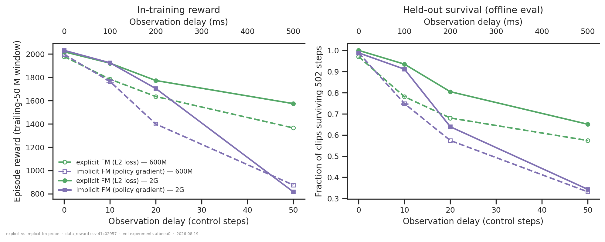
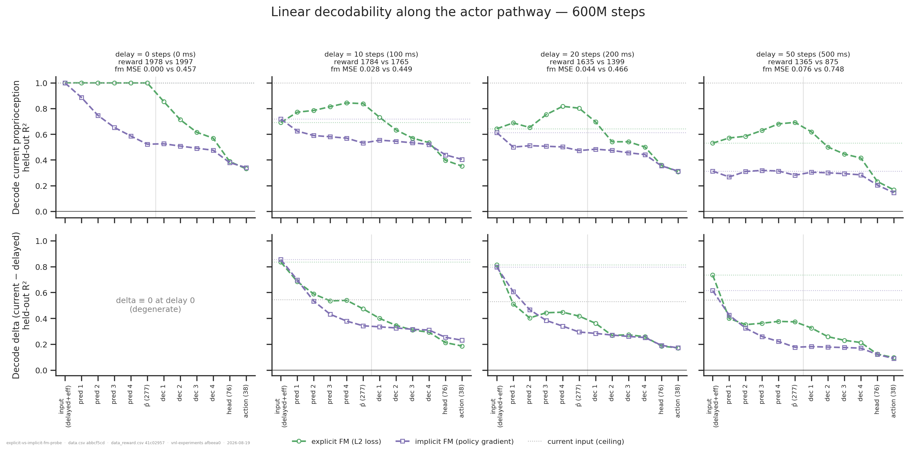
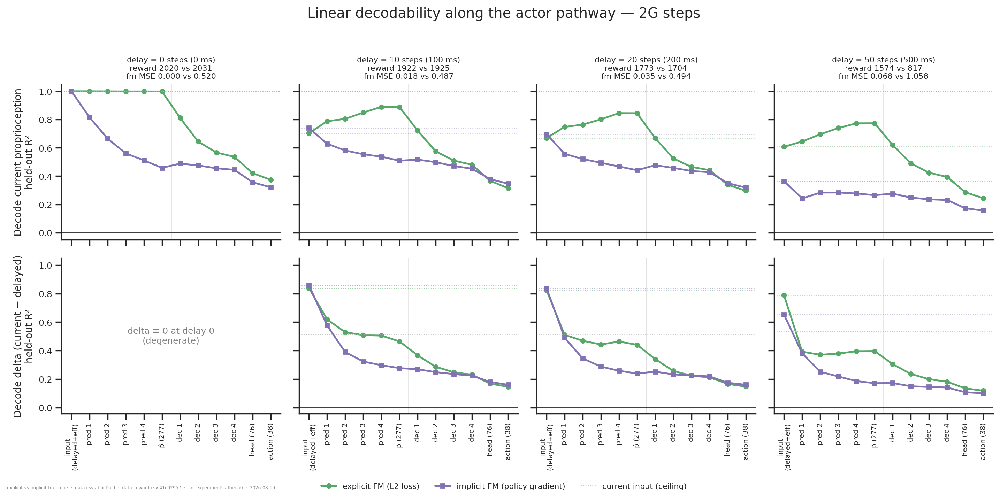
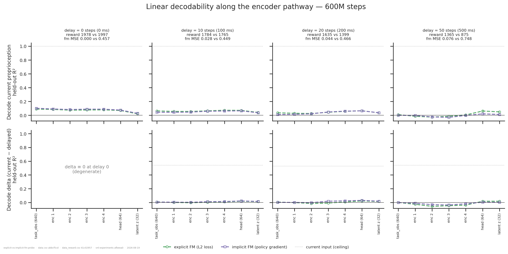
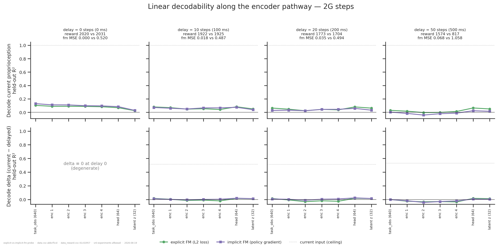
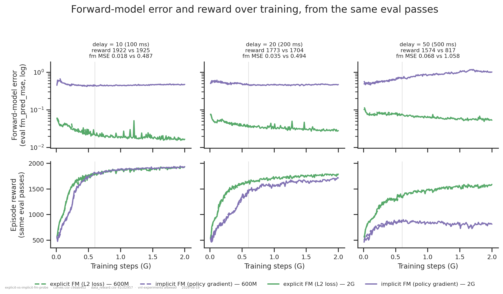
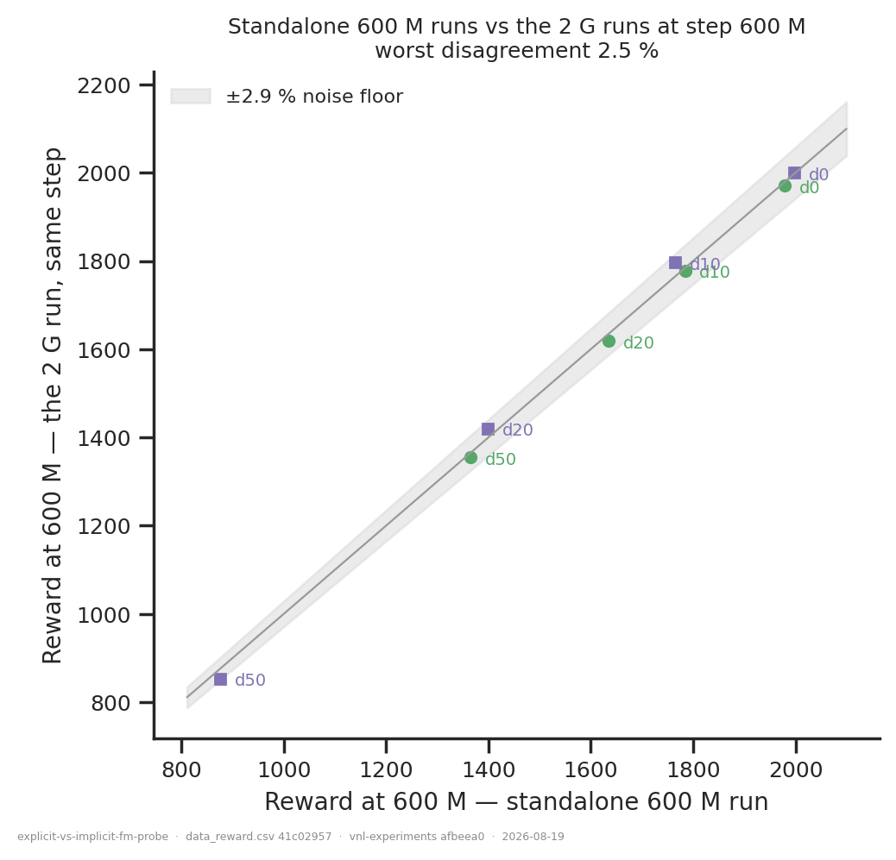

# Explicit vs implicit forward model: does the policy gradient build one on its own?

## Question

Both arms are the same network, `RodentForwardModel`: a predictor mapping [delayed
proprioception + efference copy] to a prediction `p̂`, and a decoder acting on
[task latent + `p̂`]. They differ only in how the predictor is trained — explicitly by a
self-supervised L2 against the true current state, or implicitly by the policy gradient alone.

**Does the implicit predictor come to represent the current state anyway?** An answer means:
along a shared depth axis, does either arm's `p̂` linearly encode the current
(non-delayed) proprioception *better than the network's own inputs already do*? Beating that
baseline is the minimum evidence of learned computation rather than a projection of the input.

This re-asks [`implicit-forward-model/`](../implicit-forward-model/) on the current setting —
new walker XML, `reference_root` targets — and narrows it to the same-architecture contrast,
so what varies is the *loss*, not the wiring.

## Answers, in one line each

1. **The explicit forward model builds one.** `p̂` beats the linear input baseline by
   **+0.15 to +0.19 R²** at every delay and both budgets.
2. **The implicit one does not.** Its `p̂` sits **below** its own input baseline (−0.03 to
   −0.26): the policy gradient shapes the predictor into a lossy projection, not a model.
3. **More training does not change the verdict**, only sharpens it — the explicit margin
   grows slightly from 600 M to 2 G, the implicit deficit grows more negative.
4. **The encoder carries no current-state information at all** (R² −0.04 to 0.13), so nothing
   here leaks from the reference target.
5. **Reward follows the representation** where the delay is long enough to matter: the arms
   tie at delay 0–10 and diverge at 20 and 50.

## Dataset & comparability

- **Source:** WandB `emiwar-team/nnx-ppo-rodent-delays`, selected by the `CONDITIONS` in
  `extract.py` and frozen in `runs.csv`. Probed on the held-out `old_eval` split
  (169 clips × 502 control steps), one latched episode per clip from frame 0.
- **Conditions:**

| condition | n | delays | `fm_loss_weight` | `detach_prediction` | commit | state |
|---|---|---|---|---|---|---|
| `expfm_600m` (explicit) | 4 | 0/10/20/50 | 1 | True | `ef060b73` | failed |
| `pgfm_600m` (implicit) | 5 | 0/10/**10**/20/50 | 0 | False | `25732c42` | finished |
| `expfm_2g` (explicit) | 4 | 0/10/20/50 | 1 | True | `25732c42` | finished |
| `pgfm_2g` (implicit) | 4 | 0/10/20/50 | 0 | False | `25732c42` | finished |

  All new XML, `reference_root`, torque actuators, seed 42, `min_std = 0.1`, latent 32,
  enc/dec/fm `[512]×4`, critic `[1024, 1024]`, `delay_k == efference_length`. `min_std` is what
  excludes the `d02b854a` `min_std = 0.25` sweep, which otherwise matches these delays exactly.

- **Every artifact is post-fix.** Until 2026-08-18 every offline eval and activation recording
  of these runs was made on the **wrong body**: `parse_env_config` replaced the run's
  `rodent_no_tail_collisions.xml` with the local default `rodent.xml`. The symptom was an
  offline-vs-inline reward gap that grew with delay (−2 % at delay 0 to −44 % at delay 50).
  After the fix that gap is +0.25 % on average, worst |2.4 %|, **with no delay trend** —
  which is what validates the fix rather than merely asserting it. `extract.py` asserts
  `resolved.walker_xml_path` on every artifact it reads, so a pre-fix file cannot enter this
  analysis even by accident. See the walker-XML entry in [`../README.md`](../README.md).
- **Artifacts:** `REQUIRES` in `extract.py`; see `coverage.txt`. **17/17 on every
  requirement** — activations, both history specs, and the offline eval. No cell is imputed and
  no figure bridges a gap.
- **Programmatic comparability:** `comparability.txt`. Of 40 invariants, exactly four vary —
  `config.ppo.total_steps`, `summary._step`, `git_commit`, `gpu` — and the first three are
  single-valued *within* every condition. That shape is the argument, not a blemish.
- **Manual comparability — the commit split.** `expfm_600m` is at `ef060b73`, everything else
  at `25732c42`:

  ```
  git diff ef060b73 25732c42 -- vnl_experiments/ pyproject.toml   # empty
  ```

  The diff between those commits is 15 files, +6498/−0, **entirely under `analysis/`**. The two
  600 M arms are therefore trained by identical code; the differing hash is a labelling
  artefact. `reference_root` is confirmed for all 17 runs from the logged `env_params`, never
  from the training script at the run's commit (the trap that invalidated
  [`imitation-target-representation/`](../imitation-target-representation/)).
- **Manual comparability — is 600 M-vs-2 G fair?** It is an across-runs comparison, so
  `budget_crosscheck.png` checks it: the 2 G runs' own curves at step 600 M reproduce the
  standalone 600 M runs to within **−2.5 % to +1.9 %** across all eight pairs, inside the
  ±2.9 % floor. Both axes are deliberately the *same* measurement (trailing-50 M window of the
  training-curve reward); putting an offline eval on one axis would prove nothing.
- **The `failed` state.** All four `expfm_600m` runs are WandB `state = failed`. They reached
  `summary._step = 600 064 000` — the full budget — with normal metrics and runtime, and died
  in the *post-training* inline eval, which is why they alone lack `final_eval/*`. The
  inclusion criterion is the completed step count, not the exit state; a run that died during
  training cannot reach the step count. Precedent:
  [`collision-model-xml/`](../collision-model-xml/),
  [`xml-ceiling-vs-convergence/`](../xml-ceiling-vs-convergence/). Consequence: the explicit
  600 M arm has no inline eval, so every cross-arm held-out number here comes from the batch
  eval artifacts, and inline numbers are never mixed into a figure with them.

### Caveats

- **Single seed (42) everywhere**, with one exception that turns out to be useful:
  `cgs8q5gj` and `kwk401pl` are the same config, seed and commit at implicit/600 M/delay-10.
  They differ by **1.1 % in reward and 0.0035 in `p̂` R²** — an in-cohort noise estimate that
  corroborates the ±2.9 % floor borrowed from `xml-ceiling-vs-convergence`. The
  explicit-vs-implicit `p̂` gap is ≈0.30 R², about 85× that spread, so the headline result is
  far outside noise; smaller reward differences (delay 0 and 10) are not.
- **Usable rows vary 2× across cells** (38.5 k to 82.8 k; `frac_valid` 0.45–0.98), because
  survival falls with delay. R² is scale-free but its estimation noise is not, so `n_train`
  and `n_test` are in `data.csv` per row. This is much better than the pre-fix recordings,
  where the worst cell had 13.8 k rows — evaluating on the wrong body killed episodes early.
- **`delta` at delay 0 is degenerate** by construction (current − delayed ≡ 0, so
  `ss_tot = 0`): 132 rows carry `target_degenerate` and NaN R², and those panels are labelled
  rather than left empty.
- **Linear decodability only.** A nonlinear internal model no more linearly separable than its
  inputs would be invisible to this method.
- **No efference-only arm.** This tests the *loss* on one architecture. The original question —
  does an architecture with *no* predictor build one anyway? — stays open, and needs the
  new-XML EncDec runs recorded.
- The actor axis has **12 stages, not 11** as in the older figure: the 76-d decoder head is
  included, so the x-axis is not pixel-identical to `implicit-forward-model`'s.

## Figures



The opener, and the frame for everything else: the arms are indistinguishable at delay 0 and
10, then separate. At delay 20 explicit leads by 236 reward at 600 M (1635 vs 1399); at delay
50 by 490 (1365 vs 875), and at 2 G by 757 (1574 vs 817) — the implicit arm barely improves
with the extra budget at delay 50 while the explicit one gains 209.




The result. Read each panel against its own **dotted horizontal line**, which is that arm's
linear input baseline (stage 0 extended across the panel): the question is not "is R² high"
but "does any layer beat its own inputs". The explicit predictor climbs steadily above its
baseline and peaks at `p̂`; the implicit predictor starts below its baseline and stays there.
Both arms then shed current-state information through the decoder toward the 38-d action,
which is expected — the decoder's job is to produce torques, not to preserve state.

| | delay 10 | delay 20 | delay 50 |
|---|---|---|---|
| explicit `p̂` − input, 600 M | **+0.147** | **+0.160** | **+0.162** |
| implicit `p̂` − input, 600 M | −0.187 | −0.140 | −0.032 |
| explicit `p̂` − input, 2 G | **+0.185** | **+0.175** | **+0.166** |
| implicit `p̂` − input, 2 G | −0.231 | −0.256 | −0.099 |

At delay 0 the explicit predictor holds R² = 1.00 through `p̂` — with no delay the prediction
task is the identity, which is a useful capacity check: the module can carry the state
perfectly when it only has to copy it. The implicit arm drops to 0.52 even there, i.e. it
discards information it is handed for free.




The leakage control, and the answer to "what does the encoder look like?": **nothing is
there.** Current proprioception decodes at R² −0.04 to 0.13 from every encoder stage, at both
budgets, with the two arms on top of each other. Deliberately plotted on the same 0–1 scale as
the actor figures so the comparison is visual rather than arithmetic. This matters twice: it
confirms the high actor numbers are not the current pose leaking in via the reference target,
and it shows the forward model is built in the actor's predictor, not upstream.



The mechanism behind the probe result, and the one place to look for whether the prediction
buys anything. **Both rows are columns of the same eval passes** (the same
`hist2000-fc46b078` rows at the same steps), so a step-by-step reading is exact — no
difference in clip population, episode start or checkpoint can separate them. Delay 0 is
omitted: with no delay the prediction task is the identity, so the explicit error sits at
~1e-4 and compresses the axis for every other cell.

The error panels: explicit falls to 0.017–0.068, implicit sits at 0.45–1.06 — more than an
order of magnitude worse — and at delay 50 the implicit error *rises* over training, from 0.45
to 1.06, i.e. its predictor gets steadily worse at the thing a forward model is for.

Reading the two rows together answers a question the probe alone cannot:

- **delay 10:** the explicit error keeps falling all the way to 2 G, while both arms' reward
  plateaus near 1930 from ~1 G. Better prediction stops buying reward — and the implicit arm
  reaches the same reward with a 25× worse predictor. At this delay the forward model is
  simply not load-bearing.
- **delay 20:** explicit leads throughout, and both arms' reward is still climbing at 2 G.
- **delay 50:** the divergence. Explicit reward climbs steadily to 1574 while its error is
  nearly flat after ~1 G — so the reward gain there is *not* coming from a better prediction.
  The implicit arm's reward peaks near 880 around 0.6–1.0 G and then drifts **down** as its
  prediction error rises: the one cell where more training makes things worse.

Note also that the 600 M (dashed) and 2 G (solid) curves lie on top of each other over their
shared range, which is the budget cross-check visible directly rather than inferred.

The offline held-out error at the probed checkpoint is deliberately *not* drawn here: it is a
related but different measurement (held-out clips, frame-0 latched), running 0.98–1.27× the
in-training endpoint for delay > 0. That agreement is recorded in `checks.txt` instead, so
this figure compares series within one measurement.



Comparability evidence, not a result: all eight pairs sit inside the ±2.9 % band, so treating
the 600 M and 2 G cohorts as the same training process at two budgets is justified.

## Tentative conclusion

On this body and target frame, **the self-supervised L2 is what creates the forward model**;
the policy gradient does not discover one on its own, at either budget. The evidence is
consistent across three independent measurements — the layer-wise probe, the network's own
`fm_pred_mse`, and reward at long delays — and the probe margin is ~85× the run-to-run spread
we can measure.

What the data shows: the explicit predictor's `p̂` is more linearly informative about the
current state than the inputs it was computed from, and the implicit one's is less. What it
suggests but does not establish: that this is *why* the explicit arm survives long delays. The
reward gap and the representation gap co-occur at delays 20 and 50, but with one seed per cell
and no intervention we cannot separate cause from correlate.

Note also what is *not* claimed: at delay 0 and 10 the arms are indistinguishable in reward
(within ~1 %) even though their representations differ sharply. Whatever the forward model
buys, it only shows up in behaviour once the delay is long enough to make the current state
genuinely unavailable.

## Follow-ups

- **Record the new-XML EncDec/efference arm.** 23 runs already exist at 600 M with no
  recordings; four (delays 0/10/20/50) would restore the original three-way comparison and
  answer the architecture question this folder cannot.
- **An untrained control** (a `step_0` checkpoint through the same producer) would separate
  learned structure from what the architecture provides for free — the follow-up the earlier
  report asked for and never got. Expect `p̂` to sit exactly on the input baseline.
- **A second seed at delays 20 and 50**, the two cells carrying the reward claim.
- **Why does the implicit predictor get *worse* with training at delay 50** while its reward
  slowly declines? The probe says its `p̂` is below its own inputs; the curves say it is
  drifting further below. Something is actively pushing the predictor away from the current
  state, which the policy gradient has no reason to preserve.
- **Delays 30 and 40**, to locate where the implicit arm collapses; the grid brackets it 30
  steps wide.
- **Intermediate-checkpoint activations** would make 600 M-vs-2 G within-run and give R²
  over training; needs `ActivationsProducer` to honour a checkpoint step (its `checkpoint`
  spec field is currently never read).

---

*Reproduce:* `../.venv/bin/python analysis/explicit-vs-implicit-fm-probe/extract.py && ../.venv/bin/python analysis/explicit-vs-implicit-fm-probe/plot.py`
(add `--sync --refresh` to pick up runs added since `runs.csv` was frozen, `--redecode` to
refit from the HDF5s rather than the cache — that is the real reproduction test, ~2 min per
recording with `--jobs 1`; do not raise `--jobs` without capping `OMP_NUM_THREADS`.)
