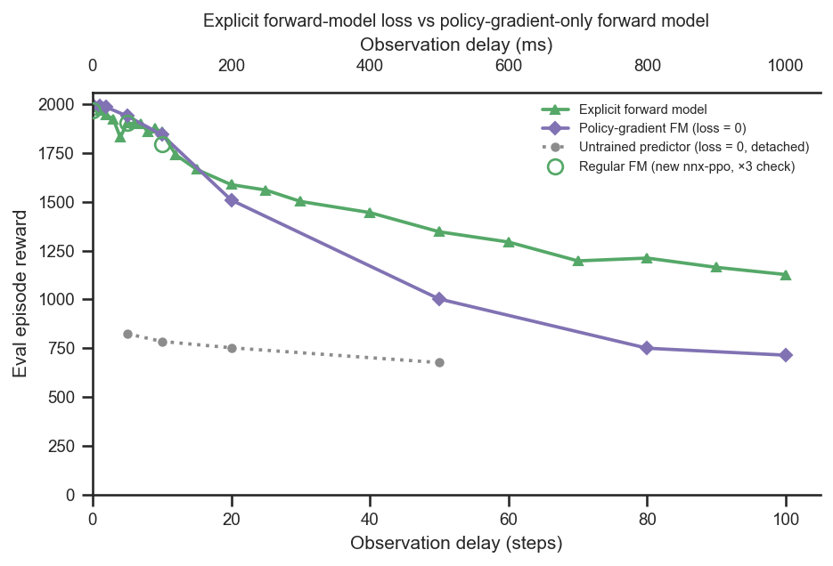
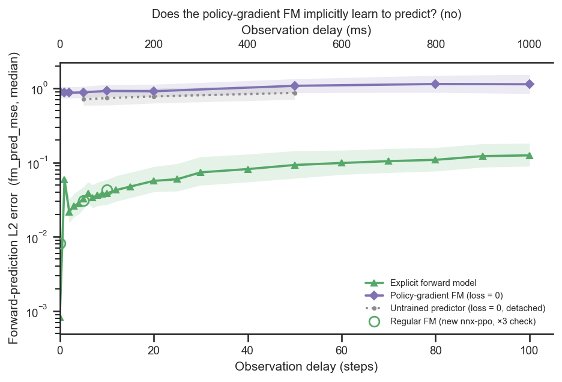

# Forward-model loss vs architecture: can the policy gradient learn the forward model on its own?

## Question
The explicit forward model adds two things: a **predictor sub-network** and a **self-supervised
L2 loss** (`fm_loss_weight`, logged as `fm_pred_mse`) that trains it to predict the current
proprioception. A new baseline keeps the architecture but turns the loss **off**
(`fm_loss_weight = 0`) while removing the stop-gradient (`detach_prediction = False`), so the
**policy gradient** is allowed to train the predictor.

1. How does this policy-gradient forward model compare to the regular (explicit-loss) one?
2. Does it **implicitly** learn a forward model — i.e. does the policy gradient alone also drive
   down the same forward-prediction L2 error?

## Dataset & comparability
- Source: WandB `emiwar-team/nnx-ppo-rodent-delays`, tags `ForwardModel`+`TrainEvalSplit`. All
  runs standard-arch (`enc/dec [512]×4`, critic `[1024,1024]`, latent 32, `kl=0.001`,
  `body_target_frame=reference_root`, AbsoluteImitation, `efference_length == delay_k`, 600 M
  steps, seed 42). Conditions:
  - `forward_model` — canonical explicit FM, `fm_loss_weight = 1`, detached predictor (git
    `54643764`, full sweep delays 0–100).
  - `pg_forward_model` — the new baseline: `fm_loss_weight = 0` **and** `detach_prediction =
    False` (git `d4bd4dc0`; delays 0,1,2,5,10,20,50,80,100).
  - `fm0_untrained` — reference: `fm_loss_weight = 0` with the predictor **detached** (old
    behaviour, git `54643764`; delays 5,10,20,50). The "no forward learning at all" level.
  - `forward_model_nnxupdate` — bridge check: `fm_loss_weight = 1`, detached, at the **same
    commit as the new baseline** (git `d4bd4dc0`, delays 0,5,10).
- **Comparability: comparable, with documented differences** (see [comparability.txt](comparability.txt)).
  All network/env invariants single-valued within every condition. Caveats:
  - **Git differs between the two main conditions** (`54643764` explicit vs `d4bd4dc0` pg): the
    new commit added the `--detach-prediction` flag and uses the updated nnx-ppo. The **bridge**
    condition shows this is benign — regular FM re-run at `d4bd4dc0` matches the canonical
    `54643764` sweep at delays 0/5/10 in both reward (1968/1903/1796 vs 1986/1903/1856) and L2
    (0.008/0.030/0.043 vs 0.001/0.033/0.038); it is drawn as hollow check markers on both figures.
    (The separate [nnx-ppo-update-reproducibility](../nnx-ppo-update-reproducibility/report.md)
    analysis independently found the update preserves the delay curve.)
  - **Reward key differs by code version** (`episode_reward/mean` vs `eval/episode_reward/mean`)
    — coalesced in `extract.py`. The **L2** compared across conditions is the training-time median
    `net/3/action/1/fm_pred_mse/p50` (present for every run; p25–p75 shown as a band); the new
    runs' cleaner `eval/.../mean` is lower in absolute value but tells the same story.
  - `fm_pred_mse` is the L2 between the predictor output and the true proprioception target even
    when that target is not used in the loss — i.e. the "would-be" forward-prediction error, which
    is exactly what we want to read for the implicit-learning question.
  - Single seed per cell; `pg_forward_model` is sparse at long delay (20/50/80/100). Indicative,
    not significance.

## Figures
Performance vs delay: the explicit forward model, the policy-gradient forward model (loss = 0),
and the untrained-detached predictor floor. Hollow circles = regular FM at the new commit (check).

Forward-prediction L2 error (`fm_pred_mse`, median; log axis) for the same conditions — does the
policy-gradient model implicitly learn to predict?

## Tentative conclusions

> **Revisited at a 3.3× budget in [`explicit-vs-implicit-fm-2g/`](../explicit-vs-implicit-fm-2g/)**
> (2026-08-14). Both conclusions survive, with one important qualification: the *delay at
> which the explicit model pulls ahead is a property of the 600 M budget, not of the
> networks*. It sits at ~10 with a 500 M budget, ~13 at 1 G and ~17 at 2 G, and is still
> drifting — at delay 10 the two arms are exactly tied once both converge. The long-delay
> conclusion strengthens instead: at delay 50 the gap **grows** from +54 % to +91 % as the
> budget goes 500 M → 2 G, because the policy-gradient arm peaks near 660 M and then
> declines. The L2 result also strengthens — the policy-gradient predictor's error does
> not merely stay high, it *rises* over training (delay 50: ~0.50 → 1.00).

**The policy-gradient forward model recovers the explicit model's performance only at short delay,
and it does so WITHOUT implicitly learning a forward model.**

- **Performance: matched at short delay, collapses at long delay.** Up to delay ~15 the
  policy-gradient FM tracks (or very slightly exceeds) the explicit FM — e.g. delay 0: 1994 vs
  1986, delay 5: 1938 vs 1903, delay 10: 1843 vs 1856 — and both sit far above the untrained
  floor (~785 at delay 10). Beyond ~delay 20 the two diverge sharply: the policy-gradient model
  falls off toward the floor while the explicit model degrades gracefully (delay 50: **1002 vs
  1346**; delay 80: **750 vs 1211**; delay 100: **714 vs 1127**). So the explicit loss buys almost
  nothing at short delay but becomes essential as the delay — and thus the amount of prediction
  actually required — grows.

- **L2: the policy gradient does NOT reduce the forward-prediction error.** The explicit model's
  `fm_pred_mse` is tiny and grows only slowly with delay (~0.001 at delay 0 to ~0.13 at delay
  100). The policy-gradient model's L2 stays **flat and high at ~0.9–1.1 (median)** across all
  delays — **an order of magnitude or two above the explicit model, and essentially on top of the
  untrained-detached predictor** (~0.7–0.9). In other words, letting the policy gradient into the
  predictor does **not** turn it into a forward model: it never learns to predict proprioception.
  (The cleaner eval-time mean tells the same story: ~0.45–0.6 for the policy-gradient model vs
  ~0.04 for the explicit one at matched delays.)

- **Interpretation — the loss makes the forward model; the architecture alone does not.** At short
  delay, next-step proprioception is almost the current proprioception, so the policy can exploit
  the extra capacity/efference routing without any genuine prediction, matching the explicit model.
  At long delay, real multi-step prediction is what pays off, and only the self-supervised loss
  produces it — the policy-gradient model, having learned some other (non-predictive) use of the
  sub-network, has nothing to fall back on and collapses. So the earlier
  [loss-weight result](../forward-model-loss-weight/report.md) ("the loss does the work, not the
  architecture") holds even when the architecture is trained by the policy gradient: the benefit
  at long delay is specifically the *predictive* representation the L2 loss creates.

### Follow-ups
- Fill in `pg_forward_model` at intermediate long delays (30/40/60/70/90) and add seeds, to pin
  down exactly where it departs from the explicit model.
- Probe *what* the policy-gradient predictor sub-network encodes instead (it clearly carries
  short-delay-useful information without predicting proprioception).
- Run the offline batch eval (`eval_runs.py`) on the new `d4bd4dc0` runs so this can also be read
  on the held-out / long-clip datasets.
