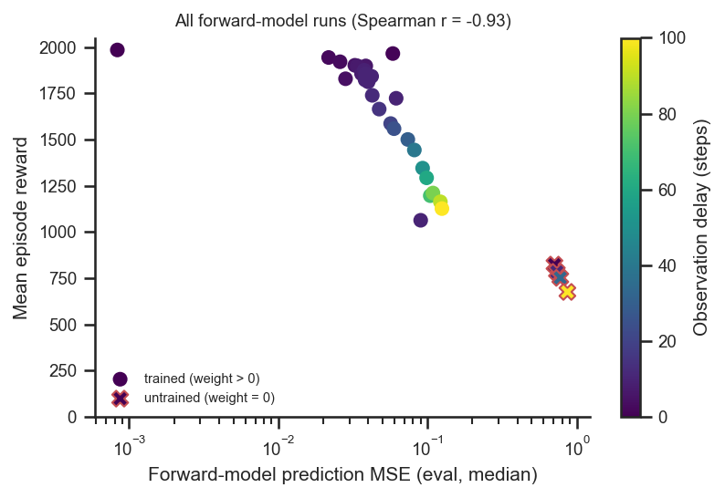
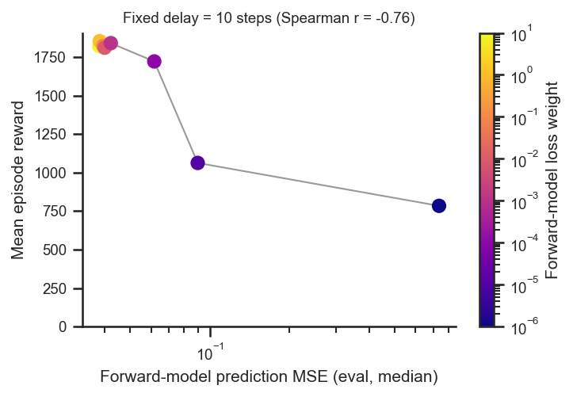

# Forward-model prediction accuracy vs imitation performance

## Question
The forward model is trained, via a self-supervised L2 loss, to predict the current
proprioception from delayed proprioception + the action buffer. How related is this
**feedforward prediction accuracy** (the prediction MSE) to the **eventual imitation
performance** (episode reward)? Does predicting better translate into imitating better?

## Dataset & comparability
- Source: WandB project `emiwar-team/nnx-ppo-rodent-delays`, tags `TrainEvalSplit` +
  `ForwardModel`, env `AbsoluteImitation`. n=33 forward-model runs (the canonical delay
  sweep at `fm_loss_weight = 1`, delays 0–100, plus the delay-10 loss-weight sweep and the
  `weight = 0` runs at delays 5/20/50).
- Metrics: `fm_pred_mse` = `net/3/action/1/fm_pred_mse` p50 (median prediction MSE);
  imitation performance = `episode_reward/mean`. Variables: `delay_k`, `fm_loss_weight`.
- Comparability: **single comparable set.** All 33 runs are git `5464376`, standard
  architecture (enc/dec/fm `[512]×4`, critic `[1024,1024]`), `latent_size=32`,
  `kl_weight=0.001`, `body_target_frame=reference_root`, `n_envs=4096`, `total_steps=600M`,
  actual step `600,064,000` — every invariant single-valued (see
  [comparability.txt](comparability.txt)).
- Caveats:
  - **Metric provenance**: `fm_pred_mse` is the only forward-model MSE logged; it is recorded
    on the same cadence as the eval-rollout metrics (`env/*`, `episode_reward`), so it is
    treated here as the eval-time prediction error. I could not find a separately-labelled
    train/eval split for it, so do not over-read the train-vs-eval distinction.
  - This is an **observational correlation across runs**, not an intervention: `delay_k` drives
    both worse prediction *and* lower reward, so the all-runs correlation partly reflects that
    shared cause. The fixed-delay panel isolates the within-delay relationship.
  - Single seed per (delay, weight) cell.

## Figures
All forward-model runs — reward vs prediction MSE (log x), coloured by delay:

Holding delay fixed at 10 steps (the loss-weight sweep), coloured by loss weight:

## Tentative conclusion
**Prediction accuracy and imitation performance are strongly, monotonically related — better
feedforward prediction goes with better imitation (Spearman r ≈ −0.93 over all runs).**

- Across the canonical delay sweep the points trace a tight arc: as delay grows (dark → yellow)
  the prediction MSE rises and the reward falls together (Spearman r = −0.89). Part of this is a
  **shared cause** — longer delays make both prediction and control harder.
- The relationship is **not merely the delay confound**, though: at a *fixed* delay of 10 steps,
  varying only the loss weight still yields a clear negative relationship (Spearman r = −0.76).
  Runs whose predictor is trained to lower MSE achieve higher reward, and the `weight = 0`
  (untrained) runs sit far out at high MSE (~0.7–0.9) and low reward (~700–820) in both panels —
  exactly where the trend predicts.
- The mapping is monotonic but **saturating**: once the median MSE is below ~0.05 (the
  well-trained, short-delay and high-loss-weight runs) reward is near its ceiling and further MSE
  reductions buy little, consistent with the loss-weight plateau seen in the
  [`forward-model-loss-weight`](../forward-model-loss-weight/report.md) analysis.

So feedforward prediction quality is a good proxy for — and plausibly a driver of — imitation
performance in this model. A cleaner causal test would sweep the loss weight at several delays
with multiple seeds, and confirm the `fm_pred_mse` is measured on held-out clips.
