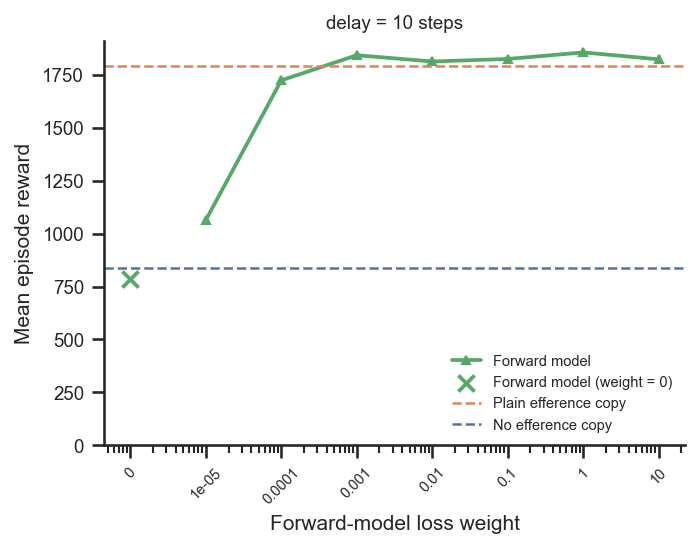
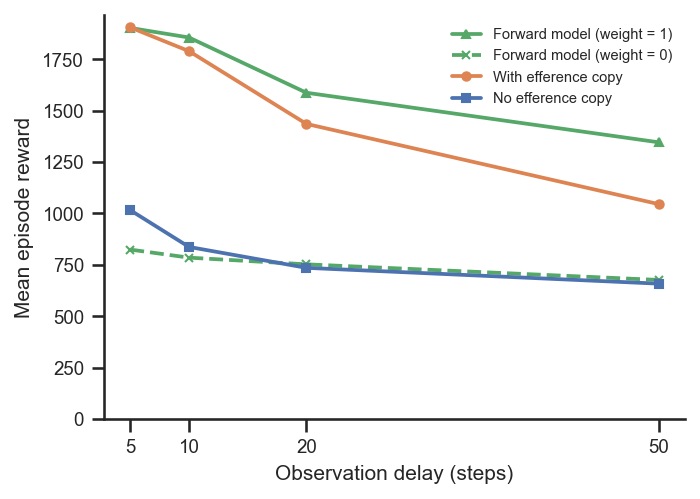

# How important is the forward-model loss, and its weight?

## Question
The explicit forward model adds both a **predictor architecture** and a **self-supervised
loss** that trains it to predict the current proprioception. Which drives the benefit?
1. If the predictor architecture is present but **not trained** (`fm_loss_weight = 0`), does
   it still help?
2. How does the **weight** of the forward-model loss influence performance?

## Dataset & comparability
- Source: WandB project `emiwar-team/nnx-ppo-rodent-delays`, tag `TrainEvalSplit`,
  env `AbsoluteImitation`. All runs: `efference_length == delay_k`, standard architecture
  (enc/dec/fm `[512]×4`, critic `[1024,1024]`), `latent_size=32`, `kl_weight=0.001`,
  `body_target_frame=reference_root`, `n_envs=4096`, `total_steps=600M`, actual step
  `600,064,000`. The forward-model **loss weight** (top-level `fm_loss_weight`) is the variable.
- Conditions:
  - `forward_model` (n=33): every forward-model run, with `fm_loss_weight` ∈ {0, 1e-5, 1e-4,
    1e-3, 1e-2, 1e-1, 1, 10}. The canonical sweep is `weight = 1` across delays 0–100; the
    loss-weight sweep covers weights 0–10 at delay 10, plus `weight = 0` at delays 5/20/50.
  - `efference` (n=22) and `no_efference` (n=13): plain-efference and no-efference references.
- Comparability: **comparable, with documented differences** (see [comparability.txt](comparability.txt)).
  All invariants single-valued within each condition. Caveats:
  - **Git differs by design**: forward-model runs are git `5464376`, references git
    `1cd5838`; the only shared-code change is the backward-compatible `inject_key` on
    `EfferenceCopy` (env/network/PPO/reward identical).
  - The loss-weight sweep is **single-seed and almost entirely at delay 10**; `weight = 0` is
    additionally available only at delays 5/20/50. Treat the exact numbers as indicative.
  - Highest-reward run kept per cell.

## Figures
Loss-weight sweep at delay 10 (note: x-axis is log; the `0` point is plotted at the far left):

Untrained (`weight = 0`) vs trained (`weight = 1`) forward model across delays, against the
two references:

## Tentative conclusion
**The loss does the work, not the architecture; and the exact weight barely matters once it
is non-trivial.**

- **Architecture without training is worthless — it actually removes the efference benefit.**
  With `fm_loss_weight = 0` the predictor is untrained, and because the forward-model
  architecture routes the action buffer *through* the predictor (rather than concatenating it
  raw, as plain efference does), an untrained predictor passes on no usable information. The
  result sits right on the **no-efference floor** at every delay (e.g. delay 10: 785 vs 837
  for no-efference, vs 1790 for plain efference and 1856 for the trained forward model). So
  the predictor architecture alone is *worse* than plain efference — the self-supervised loss
  is what creates the benefit.

- **Performance is robust to the loss weight over a broad range.** At delay 10, reward climbs
  steeply from the floor as the weight increases (1e-5 → ~1064, 1e-4 → ~1724) and then
  **plateaus across 1e-3 to 10** (≈1810–1856), all at or above the plain-efference reference.
  In other words, the loss must be turned on and not vanishingly small, but anywhere from
  ~1e-3 upward gives essentially the same (best) performance — the default `weight = 1` is
  comfortably on this plateau.

A useful follow-up would be to repeat the weight sweep at a longer delay (e.g. 50) where the
forward-model advantage is largest, and with multiple seeds, to confirm the plateau location.
