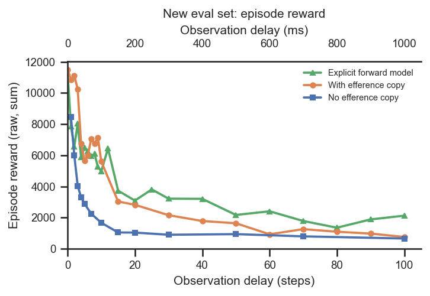
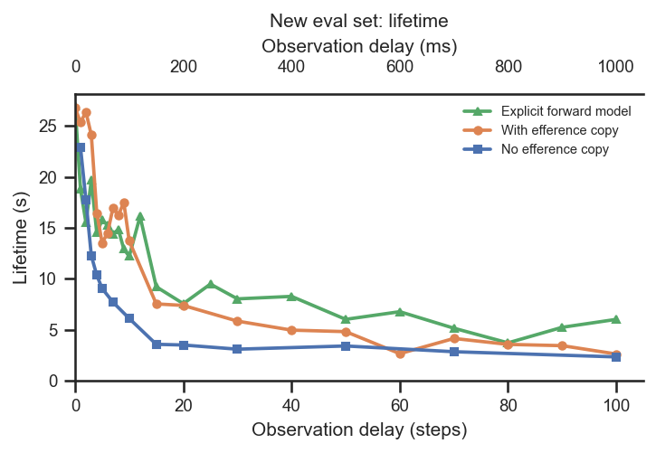
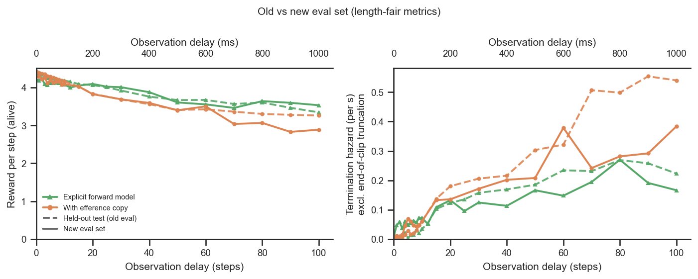

# Explicit forward model vs efference decoder, on the new eval set

## Question
Repeat of the original "does an explicit forward model improve performance?" comparison, but
scored on the new batch evaluation (`vnl_experiments/delays/eval_runs.py`, results in
`eval_results/`) — i.e. on the **train**, held-out **old_eval**, and fresh **new_eval** (30 s)
datasets — rather than on the training-time WandB reward. Does the explicit forward model still
beat the **standard with-efference decoder**, and does any benefit transfer to the new, longer,
held-out clips?

## Dataset & comparability
- Source: the three-dataset eval JSONs joined with the committed `condition` labels and WandB
  invariants (see `extract.py`). Conditions:
  - `forward_model` — RodentForwardModel, **canonical `fm_loss_weight = 1`** delay sweep
    (n=23, delays 0–100). The loss-weight sweep and weight-0 runs are excluded (they belong to
    the [`forward-model-loss-weight`](../forward-model-loss-weight/report.md) question).
  - `efference` — the standard with-efference EncDec decoder (n=22), the reference.
  - `no_efference` — no efference copy (n=13), floor.
- **Comparability: comparable, with documented differences** (see [comparability.txt](comparability.txt)).
  Every invariant is single-valued *within* condition: `body_target_frame=reference_root`,
  `latent_size=32`, `kl_weight=0.001`, enc `[512]×4`, critic `[1024,1024]`, decoder `[512]×4`
  (the forward model adds a predictor `[512]×4` but the encoder/decoder path is identical),
  restored `checkpoint_step = 600,064,000`, train/old clip 250 frames. Caveats:
  - **Git differs by design**: `forward_model` is git `5464376`; `efference`/`no_efference` are
    `1cd5838`. The only shared-code change is the backward-compatible `inject_key` on
    `EfferenceCopy`; the concat-efference path is identical, so the comparison is fair.
  - **Within the new set, raw is fine; across sets, use length-fair metrics.** Clips are 5 s
    (502-step rollout, train/old) and 30 s (3002-step, new); cumulative reward is ~6× larger on
    new purely by length. The new-set figures keep reward/lifetime raw (clip length is fixed
    there); the cross-dataset figure uses **reward_per_step** = reward / lifespan and the
    per-second **hazard_rate** = `(1 − survived) / mean-alive-time` (failures per unit
    alive-time, truncations censored), both invariant to clip length.
  - **new_eval is noisy**: only 32 clips, single seed per (condition, delay) — the new_eval
    curves are jagged at short delay; read them for trend, not point values.

## Figures
On the **new eval set**, raw (non-normalised) episode reward vs delay — forward model /
efference / no-efference. Within one dataset the clip length is fixed, so raw reward is directly
comparable across conditions.

On the new eval set, raw lifetime (seconds) vs delay, same conditions.

Cross-dataset summary (the only cross-dataset figure): length-**fair** metrics — reward-per-step
(left) and the per-second **termination hazard** (right) for FM vs efference, comparing the
held-out old eval set (dashed) with the new eval set (solid). The hazard is the constant-hazard
MLE `(1 − survived) / mean-alive-time`, counting only failure terminations (truncations at the
clip end are censored, not events), so unlike the raw survival fraction it does not penalise the
longer new clips for merely having more chances to fail.

## Tentative conclusions

**On the new eval set the explicit forward model matches the standard efference decoder at short
delay and increasingly beats it as delay grows — both far above the no-efference floor.** This is
the original "does the forward model help?" result, reproduced on the new dataset.

- **Short delay (≲ 10–15 steps): FM ≈ efference.** The raw reward and lifetime curves overlap
  (efference is even marginally ahead at the very shortest delays), and both sit above
  no-efference. With little delay to compensate, the forward model neither helps nor hurts.
- **Long delay: FM clearly wins.** On the new set the forward model holds a markedly higher raw
  reward and lifetime than efference from delay ~20 onward — e.g. by delays 70–100 the forward
  model sustains ~5–6 s lifetimes and ~2000 reward where efference has collapsed toward the
  no-efference floor (~2–3 s, ~700–1300 reward).
- **Both efference variants dominate no-efference** at all delays; the forward model extends that
  margin rather than replacing it.
- **The advantage is genuine generalization, not train-set overfitting** (final figure): on the
  length-fair metrics the forward model stays above efference on *both* the held-out old eval set
  and the new eval set. In the **termination hazard** panel the forward model carries roughly
  **half the per-second failure risk** of efference at long delay (e.g. new set, delay 100:
  ~0.17 vs ~0.38 /s).
- **Most of the apparent old→new "robustness gap" was a clip-length artifact.** Per the hazard
  rate, the two eval sets sit close together for a given condition (e.g. ~0.002 vs ~0.008 /s at
  delay 0), whereas the raw survival fraction looked far worse on the new set simply because its
  30 s clips give ~6× more opportunities to fail than the 5 s clips. The per-step *risk* is
  similar across eval sets; the forward model lowers that risk at long delay on both.

In short: on the new dataset the explicit forward model is **at least as good as the standard
efference decoder everywhere and meaningfully better at long delay**, consistent with it helping
most precisely when delay-compensation matters most.

### Follow-ups
- Multiple seeds per (condition, delay), especially for new_eval (32 clips, single seed) to
  pin down the short-delay noise and the size of the long-delay advantage.
- Tie this to prediction accuracy: relate the forward-model edge to `fm_pred_mse` on the new
  clips (the column is in `data.csv`) — does better forward prediction track the larger margin?
