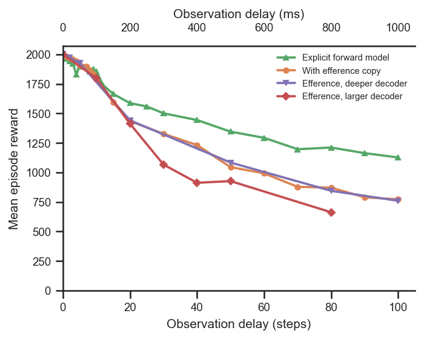
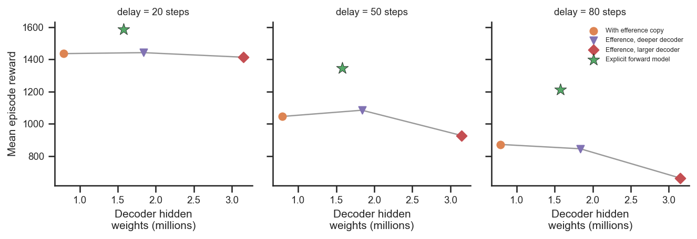

# Is the forward-model benefit just extra trainable weights?

## Question
The explicit forward model beats the plain efference copy at long proprioceptive delays
(see [`explicit-forward-model`](../explicit-forward-model/report.md)). But the forward model
also *adds parameters* (the predictor MLP). Is the benefit simply a result of having more
trainable weights? Specifically:
1. Does giving the plain efference-copy decoder **more weights** (wider) or **more layers**
   (deeper) close the gap to the forward model?
2. Is it the **total number of parameters** or the **depth** of the network that matters?

## Dataset & comparability
- Source: WandB project `emiwar-team/nnx-ppo-rodent-delays`, tag `TrainEvalSplit`,
  env `AbsoluteImitation`. All runs: `efference_length == delay_k`, standard encoder
  (`[512]×4`) and critic (`[1024,1024]`), `latent_size=32`, `kl_weight=0.001`,
  `body_target_frame=reference_root`, `n_envs=4096`, `total_steps=600M`, actual step
  `600,064,000`. The **decoder architecture is the only variable** (see
  [comparability.txt](comparability.txt)).
- Conditions:

  | condition | decoder | decoder hidden weights | n | delays |
  |---|---|---|---|---|
  | `efference` (baseline) | `[512]×4` | 0.79 M | 22 | 0–100 |
  | `efference_deeper` | `[512]×8` | 1.84 M | 7 | 0,2,5,20,50,80,100 |
  | `efference_larger` | `[1024]×4` | 3.15 M | 7 | 0,10,20,30,40,50,80 |
  | `forward_model` | `[512]×4` + predictor `[512]×4` | 1.58 M | 23 | 0–100 |

  "Decoder hidden weights" = `extra_hidden_params`, the weights+biases between consecutive
  hidden layers (delay-independent; excludes the delay-scaled input layer and the small
  output layer). Note both efference variants add **more** weights than the forward model.
- Comparability: **comparable, with documented differences.** All invariants are
  single-valued within each condition. Caveats:
  - **Git commit differs by design**: the larger/deeper-decoder and forward-model runs are
    git `5464376`; the standard-decoder baseline is git `1cd5838`. The only shared-code
    change between the commits is the backward-compatible `inject_key` parameter on
    `EfferenceCopy` (everything else is *new* files); env/network/PPO/reward code is
    identical, so the comparison is fair.
  - **Sparse delay coverage**: the larger/deeper sweeps have only 7 delays each. The
    parameter figure uses delays 20/50/80, where all four conditions have a run.
  - Canonical forward model only (the separate "loss-weight sweep" FM runs are excluded).
  - Highest-reward run kept per delay (`plot.py` dedups by `delay_k`).

## Figures
Reward vs delay for all four conditions:

Reward vs decoder size at three long delays (grey line = efference variants ordered by
parameter count; star = forward model):

## Tentative conclusion
**No — the benefit is not about parameter count, and neither width nor depth closes the gap.**

- **More weights doesn't help; it hurts.** The larger decoder (`[1024]×4`, 3.15 M weights —
  the most of any condition) is the *worst* at long delays: at 80 steps it scores ~663 vs
  ~872 for the standard decoder. Adding width actively degrades performance, plausibly
  through harder optimisation / overfitting.
- **More depth is roughly neutral.** The deeper decoder (`[512]×8`) tracks the standard
  decoder almost exactly across delays (e.g. 845 vs 872 at 80 steps), so doubling depth buys
  essentially nothing.
- **The forward model wins with fewer added weights than either variant.** It sits clearly
  above the entire efference family at every delay ≥ ~15 steps, despite having fewer decoder
  hidden weights (1.58 M) than the deeper (1.84 M) or larger (3.15 M) decoders. In the
  reward-vs-parameters panels the efference variants form a flat-to-decreasing trend while
  the forward model sits well above it.

So within this family, reward does not increase with parameter count (and depth alone does
not matter); the forward model's advantage comes from its **predictive structure** — using
the action buffer to explicitly estimate the current proprioceptive state, trained with the
self-supervised loss — not from simply having more capacity. The cleanest follow-up would be
to confirm this with multiple seeds per architecture (current n=1 per delay for the variants).
