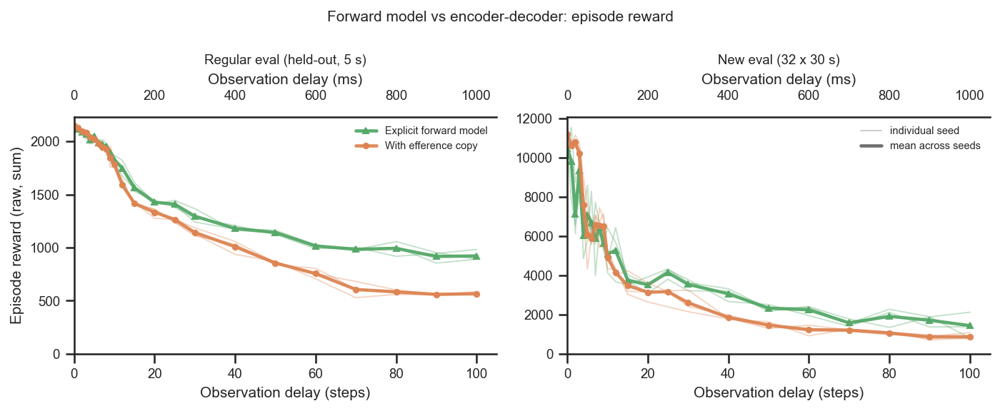
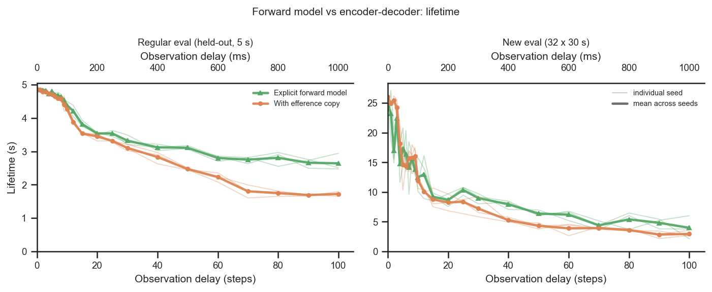
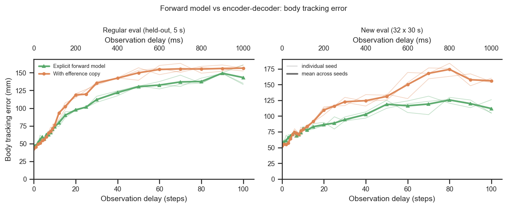
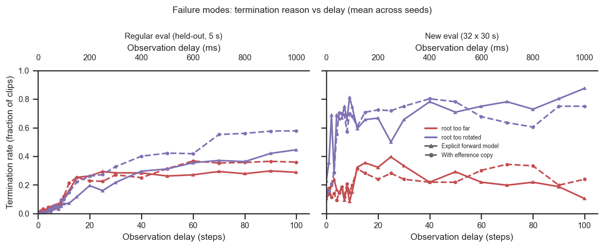
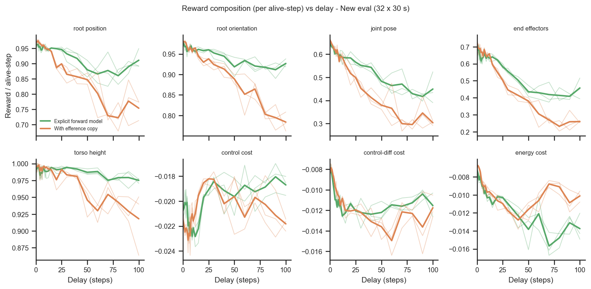

# Forward model vs regular encoder-decoder (multi-seed)

## Question
Does the explicit **forward model** (RodentForwardModel) outperform the **regular
with-efference encoder-decoder** (RodentEncDecDelays) across the observation-delay
sweep, and is the difference robust across training seeds? **Bonus:** is the forward
model *qualitatively* different — earning different reward terms / failing for
different reasons — or is it simply somewhat better across the board?

This repeats the earlier single-seed [`forward-model-new-eval`](../forward-model-new-eval/report.md)
comparison but with **≥3 training seeds per (condition, delay)**, so each seed is drawn
as a thin transparent line and the seed-mean as a solid line, and it drops the
"no efference copy" floor to focus on forward-model-vs-not.

## Dataset & comparability
- **Source:** the batch-eval JSONs under `eval_results/eval_results/` (the current,
  most complete re-evaluation set; `eval_results/old_eval_results/` is the previous
  one). Each run is scored on three datasets — `train` (80% split), `old_eval`
  (held-out 20%, 250-frame / 5 s clips) and `new_eval` (32 fresh 1500-frame / 30 s
  clips). Figures use **`old_eval`** ("regular") and **`new_eval`** ("new"); `train`
  is in `data.csv` for reference.
- **Conditions** (efference-matched, `efference_length == delay_k`):
  - `forward_model` — RodentForwardModel, canonical `fm_loss_weight = 1`, **n = 72**
    (seeds 42/43/44: 26/23/23), delays 0–100. Prediction is detached (`detach_prediction`
    ∈ {True, None}; `None` = older runs predating the flag, whose default is detach —
    the `_nodetach` variants are **not** in this eval set).
  - `efference` — regular RodentEncDecDelays, standard `4×512` decoder, **n = 83**
    (seeds 42/43/44: 38/23/22), delays 0–100. Seed 42 has extra replicate runs; the
    plots average replicates *within* a seed first, then average across seeds, so each
    seed is weighted equally.
- **Comparability: comparable, with documented git spread** (see [comparability.txt](comparability.txt)).
  Every invariant is single-valued *within and across* conditions:
  `body_target_frame = current_root` (authoritative `env_params` value — see the
  README bug note; both conditions share it, so it does not confound), `latent_size = 32`,
  `kl_weight = 0.001`, enc `[512]×4`, decoder `[512]×4`, critic `[1024,1024]`, restored
  `checkpoint_step = 600,064,000`, train/old clip = 250 frames. The **network class is the
  intended axis**: the forward model adds a predictor head + `fm_loss` on top of an
  **identical** encoder-decoder path.
  - **Excluded confound:** the bigger-/deeper-decoder efference variants (from
    [`forward-model-vs-bigger-decoder`](../forward-model-vs-bigger-decoder/report.md))
    are also efference-matched; `extract.py` drops them (`dec_hidden_sizes` must be the
    standard `[512]×4`), so 14 non-standard-decoder runs were removed.
  - **Git differs by design.** Runs span months (commits `1cd5838`, `5464376`, `5ae9fa4`,
    `714cc73`, `f315e33` for efference; `5464376`, `d4bd4dc`, `fe98f56` for FM; `5464376`
    is shared). A `git diff` over the span confirms the only shared-code changes to
    trained behaviour are **additive**: the optional `inject_key` on `EfferenceCopy`
    (default `None` = the original concat path, byte-identical) and a logging-label rename
    in `train_rodent_delays.py`. The trained architecture is config-pinned and verified
    identical. Same verdict as the sibling `forward-model-new-eval` analysis.
  - **Within a dataset, raw metrics are comparable; across datasets they are not.**
    Cumulative reward/lifetime scale with clip length (30 s vs 5 s), so each figure keeps
    the two datasets in **separate panels** and never overlays raw values across them.
  - **`new_eval` is noisy** (32 clips, one clip-set): its curves are jagged at short
    delay — read them for trend.

## Figures

Episode reward vs delay — seeds thin, mean solid, FM (green) vs efference (orange), on
the regular and new eval sets. FM and efference coincide at short delay (efference is
marginally ahead at delay 0); FM pulls clearly ahead from delay ≈ 15–20 onward.

Lifetime (s) vs delay — same layout. FM survives longer at long delay on both sets
(e.g. old_eval delay 100: 2.64 s vs 1.72 s).

Body tracking error (mm) vs delay. Equal at delay 0 (FM ~5 mm *worse*), but FM tracks
**more accurately** from delay ≈ 15 onward — most clearly on new_eval (delay 100:
112 mm vs 156 mm).

**Bonus — failure modes.** Per-reason termination rate vs delay (mean across seeds),
FM solid vs efference dashed. Failures are dominated by **root over-rotation**
(`root_too_rotated`, purple), which grows with delay for *both* models;
`root_too_far` (red) is secondary and `pose_error`/`nan` are ~0 (omitted).

**Bonus — reward composition.** Per-**alive-step** reward for each term vs delay (on
new_eval); dividing by lifetime removes the "survives longer → earns more of
everything" confound, so a gap here is a genuinely different reward *mix*.

## Tentative conclusions

**The forward model is at least as good as the regular encoder-decoder everywhere and
meaningfully better at long delay — the seed spread is small enough that the mean gap
is real, not seed noise.** At delay 0 the two are indistinguishable (efference is a hair
better: reward −29 old / −744 new, tracking ~5 mm better), consistent with the earlier
single-seed result. From delay ≈ 15–20 the forward model holds higher reward, longer
lifetime and lower tracking error on both eval sets, and the gap widens with delay (e.g.
old_eval delay 100: reward 921 vs 566, lifetime 2.64 s vs 1.72 s; new_eval delay 100:
tracking 112 mm vs 156 mm).

### Bonus: targeted, not "uniformly a bit better"
The advantage is **qualitatively concentrated**, not a flat across-the-board scaling:

- **Reward mix.** *Per alive-step* (survival removed), the forward model's extra reward
  sits almost entirely in the **task-tracking terms** — at new_eval delay 100 the
  per-step gaps are root position +0.16, root orientation +0.14, joint pose +0.15,
  end-effectors +0.20, torso height +0.06 — while the **effort/cost terms are unchanged**
  (control +0.003, control-diff +0.000, energy −0.004). So the forward model *tracks the
  reference more accurately per step*; it does not simply move more cheaply or merely
  stay alive longer to accumulate more of everything.
- **Failure profile.** Both models fail for the **same dominant reason** — the root
  drifting out of orientation tolerance (`root_too_rotated`), rising with delay — so the
  *type* of failure is not different in kind. What the forward model changes is *how
  often / how late* it hits that wall. On the regular set at delay 100 it fails **less on
  both** reasons and survives far more often (survived 0.28 vs 0.08; root_too_far 0.29 vs
  0.36; root_too_rotated 0.45 vs 0.58). On the 30 s new clips at delay 100 both eventually
  fail (survived ≈ 0), but the forward model staves off `root_too_far` (0.10 vs 0.24) and
  lasts ~1 s longer before over-rotating.

**In short:** the forward model is not a uniform lift — it buys **more accurate
reference tracking** (concentrated in the pose/root/end-effector reward terms, at equal
control cost), which in turn **delays and reduces the same root-orientation failure** that
limits both models, increasingly so as delay grows.

### Caveats & follow-ups
- `new_eval` is a single 32-clip set; short-delay wiggle is sampling noise.
- Seeds share the same three values (42/43/44) across conditions but replicate counts are
  uneven (seed 42 over-represented for efference); handled by seed-first averaging.
- Relate the per-step tracking edge to `fm_pred_mse` (in `data.csv`): does better forward
  prediction quantitatively track the larger reward-term gap?
- Add seeds at the extremes (delay 0 reversal; delay 100 on new_eval) to tighten the
  estimates.
