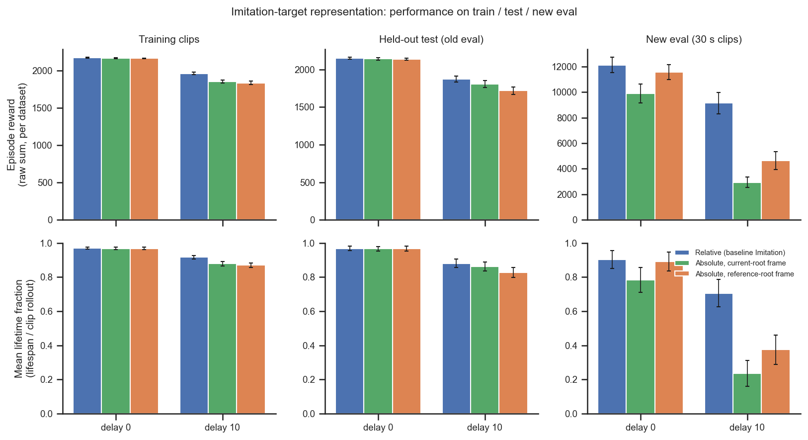
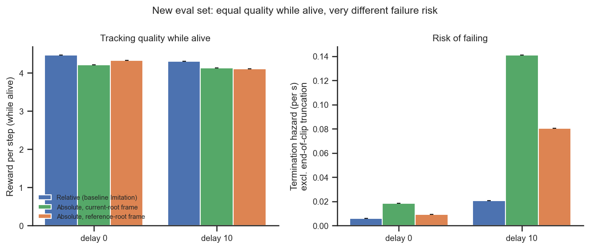
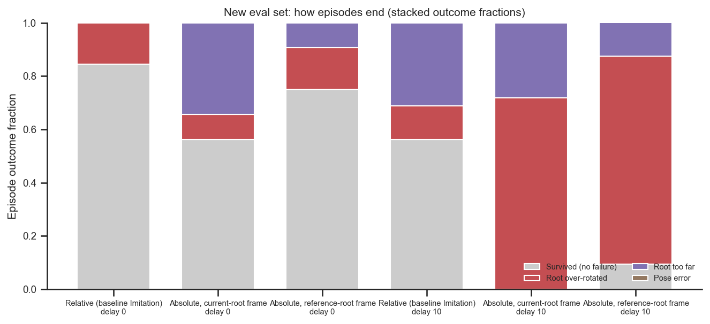

# Imitation-target representation: absolute vs relative, reference- vs current-root frame

> **⚠️ UPDATE 2026-07-06 — Q2 is INVALID (data bug); do not trust the reference-root vs
> current-root conclusion below.**
>
> `body_target_frame` is read only by the *environment* (`AbsoluteImitation`), i.e. from
> `env_params`. But `train_rodent_delays.py` set it on `net_config`, where it is **inert** —
> only logged to `net_params`, never used. WandB confirms **all six cohort runs (and in fact
> every AbsoluteImitation run in the project) trained with `env_params.body_target_frame =
> current_root`.** The `reference_root` shown for two runs is the inert `net_params` field.
>
> `extract.py` derives the condition from that inert `net_params` field
> ([`extract.py`](extract.py) `condition_for` / `wandb_invariants`), so the two runs labelled
> **`absolute_reference` (`2f08y5is`, `u5ery6jx`) were actually `current_root`** — identical
> representation to `absolute_current`. The delay-0 "reference" and "current" runs even share
> **seed 42** and have **matched training curves** and **identical `train`/`old_eval` metrics**
> (survival agrees to 10 significant figures on the 673-clip train split). The apparent Q2 gap
> lives entirely on `new_eval` (32 clips) and is small-sample **evaluation** noise between two
> near-identical policies — a 6-of-32 (delay 0) and 3-of-32 (delay 10) survival swing — **not a
> frame effect.** `reference_root` was never actually trained.
>
> **What still holds:** **Q1 (relative vs absolute)** is unaffected in substance — but note its
> "absolute" side is really *two* `current_root` seeds, not one each of two frames. There was
> **no train/eval frame mismatch**: train and eval both used `current_root` consistently.
>
> The training scripts were fixed on 2026-07-06 (frame now set on `env_config`). Answering Q2
> for real requires new runs with `env_config.body_target_frame = "reference_root"`. Per the
> static-analysis policy, the figures/CSV below are left as originally computed; read Q2 as void.

## Question
Two ablations of how the imitation target is given to the policy, on the standard
with-efference decoder:

1. **Absolute vs relative target.** The baseline `Imitation` env builds the joint/body target
   *relative* to the agent's current state (it subtracts current joint angles and body
   positions); `AbsoluteImitation` makes those targets absolute. **How much does going absolute
   deteriorate performance?**
2. **Reference-root vs current-root frame.** Within `AbsoluteImitation`, `body_target_frame`
   expresses the absolute body target either in the *reference* root frame (`reference_root`, the
   standard config) or in the agent's *current* / simulation root frame (`current_root`). **Does
   referencing the reference root rather than the simulation root lead to worse performance?**

Scored on the three batch-eval datasets (`vnl_experiments/delays/eval_runs.py`): the **train**
split, the held-out **old_eval** split (same 5 s clips), and the fresh **new_eval** set (32 × 30 s
clips).

## Dataset & comparability
- Six runs (git `f315e336`, "Comparing different reference representations"), three conditions ×
  two delays (0 and 10, efference_length == delay), single seed each:
  - `relative` — base `Imitation` env (proprio-relative target): `o49pypx0` (delay 0),
    `xyktrkun` (delay 10).
  - `absolute_current` — `AbsoluteImitation`, `body_target_frame=current_root`: `cwuwoywj`,
    `vxltbpnq`.
  - `absolute_reference` — `AbsoluteImitation`, `body_target_frame=reference_root` (**the standard
    training config used in every other analysis here**): `2f08y5is`, `u5ery6jx`.
  - (A seventh run, `3bihf4s6`, crashed and has no eval JSON — excluded.)
- Sources joined in `extract.py` (the only data-touching stage): WandB
  `emiwar-team/nnx-ppo-rodent-delays` (invariants + `body_target_frame`) and local
  `eval_results/*.json` (metrics).
- **Comparability: comparable, all invariants single-valued within every condition** (see
  [comparability.txt](comparability.txt)): git `f315e336`, `latent_size=32`, `kl_weight=0.001`,
  enc `[512]×4`, decoder `[512]×4`, critic `[1024,1024]`, restored `checkpoint_step =
  600,064,000`, train/old clip 250 frames. The experimental axes (`env_class`,
  `body_target_frame`, `delay_k`) are the only things that vary. Caveats:
  - **The two `relative` runs have a wrong `env` config string** (it says `AbsoluteImitation`),
    exactly as flagged in their WandB notes. This is harmless here: `eval_runs.py` takes the env
    class from its own run-list, and the **eval JSONs record `env_class = "Imitation"`** for these
    two runs (and `AbsoluteImitation` for the other four) — so each checkpoint was re-evaluated
    under the env it was actually trained on. Condition is assigned from that authoritative
    `env_class`, not from the bad config string.
  - **The delay-10 relative-vs-absolute comparison is confounded by a proprioception leak.** The
    relative target subtracts the *current* joint angles / body positions, which are themselves
    proprioceptive. When only the proprioception stream is delayed, the (un-delayed) relative
    target leaks near-current proprioceptive information back into the network — which is precisely
    the confound `AbsoluteImitation` was written to remove (see
    `vnl_experiments/envs/absolute_imitation.py`). So at delay 10 the relative condition has access
    to information the absolute conditions (by design) do not. **The clean, leak-free comparison is
    at delay 0**, where the proprioception is not delayed and the relative target carries no extra
    information.
  - **Single seed per (condition, delay); only two delays (0, 10).** Error bars are clip-level SEM
    (across-clip spread), **not** seed variance — read all differences as indicative. `new_eval` is
    only 32 clips.
  - Raw `episode_reward` is comparable *within* a dataset (fixed clip length) but not across them
    (new clips are 6× longer); the figures facet by dataset, and `reward_per_step` / `hazard_rate`
    are used where a length-fair view is wanted.

## Figures
Headline performance on all three datasets: raw episode reward (top) and mean lifetime fraction
(bottom; lifespan / full-clip rollout), grouped by delay, one bar per condition.

On the discriminating new eval set: per-step tracking quality (left) is essentially identical
across conditions, while the per-second termination hazard (right) differs enormously — i.e. the
representations differ in how long the policy *stays upright*, not in how well it tracks while
alive.

How episodes end on the new eval set (stacked outcome fractions). At delay 10 both absolute
conditions fail overwhelmingly by **root over-rotation**.

## Tentative conclusions

**Per-step tracking quality is the same for all three representations; the entire story is about
staying alive.** `reward_per_step` sits at ~4.1–4.5 for every condition, delay and dataset
(quality_vs_risk, left). What differs is longevity / termination hazard, and only markedly so on
the long new_eval clips under delay.

**Q1 — Going absolute costs essentially nothing without delay; its apparent cost under delay is
the proprioception leak it was designed to remove.**
- **At delay 0 (clean comparison):** on train and old_eval the three conditions are within noise
  (reward ~2.14–2.18 k, lifetime fraction ~0.97). On new_eval the absolute-reference config ties
  the relative baseline (lifetime fraction 0.89 vs 0.90; reward 11.6 k vs 12.1 k); only
  absolute-*current* trails (0.78). So **absolute targets, in the reference-root frame, are as
  good as relative targets when there is no delay.**
- **At delay 10:** relative looks much better (new_eval lifetime fraction 0.71 vs 0.38 / 0.24;
  reward 9.1 k vs 4.6 k / 2.9 k; hazard 0.021 vs 0.080 / 0.141 /s). **But this is exactly the
  leak**: the relative target smuggles in the near-current proprioception that the delay is meant
  to withhold, so it is not fair evidence that relative targets are intrinsically better. Read
  together with the delay-0 result, the honest conclusion is that **the absolute target's "penalty"
  is the confound being removed, and the genuine cost of going absolute (delay 0) is small.**

**Q2 — Referencing the reference root does *not* hurt; it is equal-to-better than the
current/simulation root, especially on long clips.**
- Delay 0: tied on train/old_eval; on new_eval `reference_root` clearly beats `current_root`
  (lifetime fraction 0.89 vs 0.78, reward 11.6 k vs 9.9 k). `current_root` already fails by
  drifting too far (root_too_far 0.34) on the long clips.
- Delay 10: train tied; old_eval marginally favours `current_root` (0.86 vs 0.83, single-seed
  noise); but new_eval again favours `reference_root` (lifetime fraction 0.38 vs 0.24, hazard
  0.080 vs 0.141 /s). **So the standard choice (`reference_root`) is justified** — it is never
  meaningfully worse and is clearly more robust on the long held-out clips.

**How they fail (failure_modes).** Consistent with the delay-tolerance study, at delay 10 on
new_eval both absolute conditions fail overwhelmingly by **root over-rotation** (root_too_rotated
0.72 for current-root, 0.78 for reference-root), with root-too-far secondary; root angular error
ranks the same way (new_eval delay 10: relative 3.67, reference 5.31, current 6.21 rad-scale). The
limbs keep tracking (joint L2 error barely moves, ~1.3 across all); what diverges is global root
pose. The relative baseline fails far less under delay — again, mostly because of the proprio leak.

**Bottom line.** All three target representations track equally well while alive. Among the
*absolute* variants — the principled, leak-free family — the **reference-root frame (the current
standard) is the right default**: equal to current-root on short clips and clearly more robust on
long ones. Switching from the relative baseline to an absolute target costs little when there is no
delay; the large delay-10 gap is the proprioception confound that motivated `AbsoluteImitation` in
the first place, not a true regression.

### Follow-ups
- Multiple seeds per cell (currently single seed) to firm up the new_eval gaps, which carry the
  whole result.
- More delays between 0 and 10 (and beyond) to trace where the absolute/relative gap opens up as
  the proprio leak grows.
- A leak-controlled relative variant (e.g. relative target built from *delayed* proprioception)
  would let the absolute-vs-relative comparison be made fairly even under delay.
