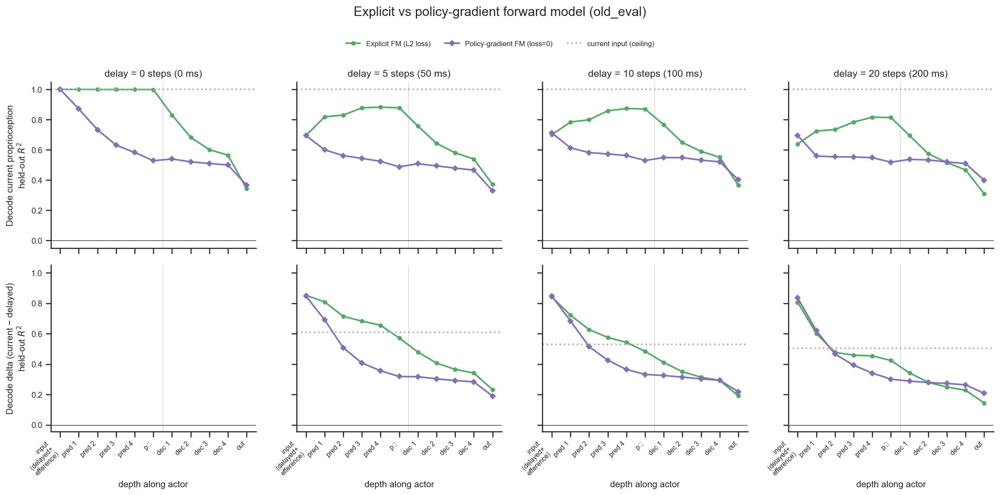

# Do enc-dec networks implicitly learn a forward model?

## Question

The standard enc-dec policy is fed *delayed* proprioception plus an efference
copy of its recent actions, but has no module explicitly trained to predict the
current state. Does it nonetheless build an **implicit forward model** — i.e. do
its internal activations linearly encode the *current, non-delayed*
proprioception, reconstructed from the delayed input + efference copy? We compare
it against a network with an **explicit** forward model (a predictor trained to
output the current proprioception) and a delayed-input baseline.

## Method

The delay is applied *inside* the network (a `Delay` layer after the
`Normalizer`), so the environment's `obs["state"]["proprioception"]` is the
ground-truth **current** proprioception — our decoding target. For each
checkpoint we make the network recordable
(`nnx_ppo.networks.recording.with_recording`) and roll out the deterministic
policy, one latched episode per clip (reset at frame 0), stacking every layer's
activations plus the current proprioception (`record_activations.py`).

From each layer's activations we fit a **ridge linear decoder** to two targets
and report **held-out** R² (`decode.py`, `extract.py`):

- **proprio** — the current proprioception.
- **delta** — current minus delayed proprioception. The delayed input cannot, by
  construction, explain the delta, so decoding it well is the cleanest signature
  of internal state reconstruction.

Splits are **by clip** (whole clips to train/test) so within-clip temporal
autocorrelation can't leak; the ridge penalty is chosen per layer by an inner
validation split. Reference probes bound the result:

- **`input` = [delayed proprioception + efference copy]** — the *actual input* to
  the actor's decoder/predictor (the efference queue is reconstructed by shifting
  the recorded action leaf). Decoding the target from this linearly is the
  principled **"layer-0" baseline**: the best a *linear* readout of the raw
  forward-model inputs can do. Any deeper layer that beats it has added genuine
  (nonlinear / learned) computation, not just a re-projection of its inputs. This
  replaces the earlier delayed-proprioception-*only* baseline, which was
  misleadingly low because it ignored the efference copy the network receives.
- **`current input`** — decode from the true current proprioception (ceiling /
  pipeline sanity, R²≈1).

Two methodological checks (see "Method validity" below) rule out the obvious
artefacts: the k-shift delayed signal matches the network's own internal `Delay`
leaf to 3 decimals (delay computed correctly), and the task/encoder pathway
decodes current proprioception at only R²≈0.02–0.11 (no leakage of current state
from the imitation target).

## Dataset & comparability

- Source: local checkpoints in `downloaded_checkpoints/`, re-rolled out offline
  (no WandB). Probed on the held-out RL split `old_eval` (169 clips × 502 steps).
- Conditions: matched `efference` (RodentEncDecDelays), `forward_model`
  (RodentForwardModel, explicit L2 loss), and `pg_forward_model` (same FM
  architecture, `fm_loss_weight = 0` / `detach_prediction = False` — predictor
  trained by the policy gradient) across a **delay sweep — delay_k = 0, 5, 10,
  20** (efference_length = delay_k), all `current_root`, latent 32, identical
  hidden sizes, ~600 M training steps (all invariants single-valued except the
  intended sweep; see `comparability.txt`). delay-0 is the matched floor.
- The `pg_forward_model` runs are the same checkpoints as the `pg_forward_model`
  condition in [`forward-loss-vs-architecture`](../forward-loss-vs-architecture/report.md);
  `detach_prediction`/`fm_loss_weight` affect only gradients, so the forward pass
  we record is unaffected.
- The figure facets by delay; within each delay the baseline is the `input`
  ([delayed proprioception + efference copy]) probe, drawn as the leftmost
  ("layer-0") point of each line.

## Figures

Held-out R² for decoding the **current proprioception** across the delay sweep.
The `input` column is the fair baseline (linear readout of [delayed proprio +
efference]); `dec-1` is the first decoder hidden layer; `p̂` is the explicit
predictor's output:

| delay | delayed-only (old, unfair) | **input = delayed+efference** | efference dec-1 | FM dec-1 | FM p̂ |
|---|---|---|---|---|---|
| 0  | 1.00 | 1.00 | 0.79 | 0.83 | 1.00 |
| 5  | 0.16 | **0.71** | 0.58 | 0.76 | 0.88 |
| 10 | 0.09 | **0.73** | 0.59 | 0.77 | 0.87 |
| 20 | 0.06 | **0.66** | 0.51 | 0.69 | 0.82 |

## Tentative conclusion

**With the fair baseline, the earlier "implicit forward model" claim does not
hold up — but the explicit one does.** The decisive correction: most of the
current proprioception is *already linearly* recoverable from the network's raw
inputs (delayed proprioception + efference copy), at R² ≈ 0.66–0.73 across delays
5–20. The rodent's dynamics are close enough to locally linear over 50–200 ms
that a *linear* forward model — delayed state plus recent actions — captures most
of the current state. The delayed-proprioception-*only* baseline (0.06–0.16) was
misleadingly low precisely because it discarded the efference copy.

Against that fair bar:

- **The implicit efference network shows no evidence of a learned forward
  model.** No layer exceeds the linear-input baseline; its first decoder layer
  sits *below* it (0.51–0.59 vs 0.66–0.73) and decodability only declines from
  there. By linear decodability it builds no better estimate of the current state
  than its own inputs already afford — if anything it sheds current-state
  information as it computes the action.
- **The explicit forward model does build one.** Its `predictor` rises *above*
  the linear-input baseline — p̂ at R² ≈ 0.81–0.88 vs input 0.64–0.70 (and a
  near-perfect 1.00 identity at delay 0) — a genuinely better-than-linear,
  learned reconstruction of the current state, as it is supervised to be. In the
  figure the green line rises through the predictor above its input point; the
  orange efference line only falls.

So the honest answer to the original question is **no for the implicit network
(at least not beyond the linearly-trivial), yes for the explicit one** — and the
reason the first analysis looked positive was an unfair baseline.

Important caveats on scope:

- **Metric = *linear* decodability.** The implicit network could compute a
  nonlinear forward model whose result is no more *linearly* separable than the
  linear-input baseline; this probe would miss it. The claim is specifically that
  the implicit net adds no *linearly readable* current-state information beyond
  its inputs, whereas the explicit predictor does.
- The decoder's decline toward the output is expected — its objective is the
  action, not state reconstruction — so "decoder < input" is not itself damning;
  the diagnostic is whether *any* layer beats the linear-input baseline.
- One matched run per cell (single seed), one dataset (`old_eval`).

A newly-initialised (untrained) network would sharpen the "learned vs
architectural" point, but the linear-input baseline already largely settles it:
the implicit net does not beat a *linear* function of its inputs, so there is
little learned forward-model computation for an untrained control to fall short
of. The untrained control remains worthwhile mainly to confirm the explicit
predictor's >baseline performance is learned (untrained predictor should sit at
the input baseline).

## Policy-gradient forward model — and consistency with `forward-loss-vs-architecture`

The sibling analysis
[`forward-loss-vs-architecture`](../forward-loss-vs-architecture/report.md) adds a
condition (`pg_forward_model`) that keeps the forward-model *architecture* but
turns the self-supervised L2 loss **off** (`fm_loss_weight = 0`,
`detach_prediction = False`), so the predictor is trained only by the policy
gradient. That analysis concludes, from the training-time `fm_pred_mse`, that the
policy gradient does **not** implicitly learn to predict proprioception (its L2
stays high, at the untrained-detached floor). Here we test the same runs
layer-wise (delays 0/5/10/20, same `old_eval`).

**The activation analysis agrees, and sharpens the picture.** Decoding the current
proprioception from the predictor output `p̂`:

| delay | input (delayed+eff) | explicit FM p̂ | **pg FM p̂** |
|---|---|---|---|
| 0  | 1.00 | 1.00 | 0.53 |
| 5  | 0.70 | 0.88 | 0.49 |
| 10 | 0.70 | 0.87 | 0.53 |
| 20 | 0.64 | 0.81 | 0.52 |

The explicit predictor rises *above* the linear-input baseline (learned forward
model); the **policy-gradient predictor falls *below* it** (R² ≈ 0.5 vs input
≈ 0.7) — it does not merely fail to improve on its inputs, it transforms them into
a representation that is *less* proprioception-decodable, i.e. it repurposes the
sub-network for something non-predictive.

**Direct bridge to `fm_pred_mse`.** `fm_pred_mse` is exactly the L2 between `p̂`
and the (normalised) current proprioception, so it is recomputable from our
recorded `p̂` and `Normalizer` leaves (`fm_mse_crosscheck.py`) — a no-decoder,
identity readout:

| condition | delay | recomputed mse | R² (p̂ as-is) | R² (p̂ linearly decoded) |
|---|---|---|---|---|
| explicit FM | 5 / 10 / 20 | 0.013 / 0.017 / 0.028 | 0.96 / 0.95 / 0.91 | 0.88 / 0.87 / 0.81 |
| pg FM | 5 / 10 / 20 | 0.44 / 0.42 / 0.38 | −0.39 / −0.45 / −0.53 | 0.49 / 0.53 / 0.52 |

Our recomputed `fm_pred_mse` reproduces the WandB values (explicit ≈ 0.01–0.03,
pg ≈ 0.4–0.47 — the same order-of-magnitude gap and close to their eval-time
means of ≈0.04 vs ≈0.45–0.6), which independently validates both the recording
pipeline and the sibling analysis. The `p̂-as-is` R² is strongly negative for the
pg model — its output is a *worse* estimate of the current state than the mean.

**One nuance the activation view adds:** a *linear decode* of the pg predictor's
`p̂` still recovers R² ≈ 0.5 of the current state, even though `p̂` as-is is
anti-informative (negative R²). So the pg predictor isn't pure noise — it retains
a rotated fraction of the state — but that fraction (≈0.5) is still **below** the
raw-input baseline (≈0.7), so by the decodability criterion it adds nothing: only
the explicit L2 loss yields a representation that beats a linear readout of the
inputs. This matches, and gives a mechanistic reading of, the sibling report's
observation that the pg sub-network "carries short-delay-useful information
without predicting proprioception" — at short delay the current state is anyway
~linearly present in the inputs, so the decoder can exploit it directly regardless
of the predictor. (Our sweep stops at delay 20, where the linear-input baseline is
still ≈0.7; the sibling analysis' long-delay collapse of `pg_forward_model` — past
delay ~20 — is beyond the delays recorded here.)

## Method validity

Two checks rule out the obvious artefacts (both from the committed `data.csv`):

- **Delayed input computed correctly.** The k-shift used for the baseline/delta
  matches the network's *own* internal `Delay`-layer activation to 3 decimals
  (R² 0.159 / 0.088 / 0.062 at delay 5 / 10 / 20 for both) — we decode from the
  exact signal the network buffers.
- **No leakage from the imitation target.** The entire encoder/task pathway
  decodes current proprioception at only R² ≈ 0.02–0.11 (encoder latent ≈ 0.04),
  so the high decoder decodability is not the current pose leaking in via the
  reference target.

The rollout is **one latched episode per clip** (reset once at frame 0, `done`
latched monotonically, no mid-rollout reset); post-termination steps are masked,
so the per-clip time-shift used to reconstruct the delayed proprioception and the
efference queue exactly mirrors the network's own (never-reset) buffers.

## Recording-API notes (first real use of `with_recording`)

- **Silent metric-dropping breaks recording for custom containers.** Recording
  rides the `metrics` channel, which is transparent only if every module merges
  *all* its children's metrics. As first written, `ForwardModel` forwarded only
  the decoder's (`metrics={"fm_pred_mse": ..., "decoder": dec_out.metrics}`), so
  the predictor and internal `Delay` activations were silently lost — exactly the
  most interesting probe here. Fixed additively in `forward_model.py` by also
  propagating `"predictor": pred_out.metrics` and `"delay": delay_out.metrics`
  (empty in normal use; carries activations under recording). **Suggestion:**
  `with_recording` could warn when a wrapped leaf's activation never reaches the
  top-level output, so this fails loudly instead of silently.
- **The `Normalizer` leaf leaks the target.** Normalization happens *before* the
  in-network `Delay`, so the recorded `Normalizer` activation contains the
  un-delayed proprioception (decodes at R²≈1). The meaningful input baseline is
  the `Delay` leaf / a k-shift of the target, not the "input layer".
- **Layer keys are positional and architecture-specific** (`3/action/1/0` vs
  `3/action/1/decoder/0`), so cross-architecture alignment must be done by hand
  (see `plot.py:STAGES`). Otherwise the path-keyed nested structure mapped cleanly
  onto nested HDF5 groups and was pleasant to consume.
