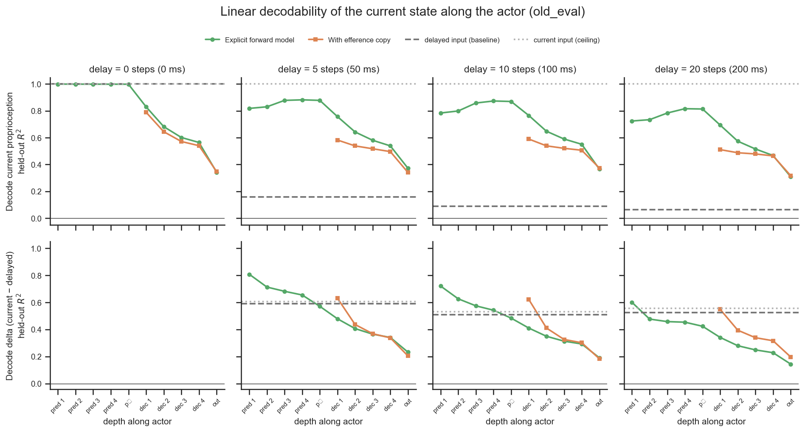

# Do enc-dec networks implicitly learn a forward model?

## Question

The standard enc-dec policy is fed *delayed* proprioception plus an efference
copy of its recent actions, but has no module explicitly trained to predict the
current state. Does it nonetheless build an **implicit forward model** — i.e. do
its internal activations linearly encode the *current, non-delayed*
proprioception, reconstructed from the delayed input + efference copy? We compare
it against a network with an **explicit** forward model (a predictor trained to
output the current proprioception) and a delayed-input baseline.

## Method

The delay is applied *inside* the network (a `Delay` layer after the
`Normalizer`), so the environment's `obs["state"]["proprioception"]` is the
ground-truth **current** proprioception — our decoding target. For each
checkpoint we make the network recordable
(`nnx_ppo.networks.recording.with_recording`) and roll out the deterministic
policy, one latched episode per clip (reset at frame 0), stacking every layer's
activations plus the current proprioception (`record_activations.py`).

From each layer's activations we fit a **ridge linear decoder** to two targets
and report **held-out** R² (`decode.py`, `extract.py`):

- **proprio** — the current proprioception.
- **delta** — current minus delayed proprioception. The delayed input cannot, by
  construction, explain the delta, so decoding it well is the cleanest signature
  of internal state reconstruction.

Splits are **by clip** (whole clips to train/test) so within-clip temporal
autocorrelation can't leak; the ridge penalty is chosen per layer by an inner
validation split. Two reference probes bound the result: `delayed input`
(decode from the delayed proprioception alone — the `obs_(t-k) → obs_t`
baseline) and `current input` (decode from the true current proprioception — a
ceiling / sanity check).

## Dataset & comparability

- Source: local checkpoints in `downloaded_checkpoints/`, re-rolled out offline
  (no WandB). Probed on the held-out RL split `old_eval` (169 clips × 502 steps).
- Conditions: matched `efference` (RodentEncDecDelays) vs `forward_model`
  (RodentForwardModel) pairs across a **delay sweep — delay_k = 0, 5, 10, 20**
  (efference_length = delay_k), all `current_root`, latent 32, identical hidden
  sizes, ~600 M training steps (see `comparability.txt`). delay-0 is the matched
  floor (no delay → the input already contains the current state).
- The figure facets by delay; the principled baseline within each delay is the
  `delayed input` probe (decode the current state from the k-step-old
  proprioception), not a separate network.

## Figures

Held-out R² for decoding the **current proprioception**, first decoder hidden
layer, across the delay sweep (efference_length = delay_k):

| delay (steps / ms) | delayed-input baseline | efference dec-1 | forward-model dec-1 | forward-model p̂ |
|---|---|---|---|---|
| 0 / 0   | 1.00 | 0.79 | 0.83 | 1.00 |
| 5 / 50  | 0.16 | 0.58 | 0.76 | 0.88 |
| 10 / 100 | 0.09 | 0.59 | 0.77 | 0.87 |
| 20 / 200 | 0.06 | 0.51 | 0.69 | 0.82 |

## Tentative conclusion

**Yes — the standard efference-copy enc-dec network behaves as if it has learned
an implicit forward model, and the effect strengthens with delay.** As the delay
grows the *raw* input degrades sharply — the current proprioception is linearly
recoverable from the k-step-old input at R² = 1.00 → 0.16 → 0.09 → 0.06 for
delay 0/5/10/20. Yet the implicit network's first decoder hidden layer — which
sees only the delayed proprioception, the efference copy, and the task latent —
holds the current state at R² ≈ 0.58–0.59 through delay 5–10 and still 0.51 at
delay 20. So the **gap over the delayed-input baseline widens with delay** (≈0.4
→ 0.5 → 0.45 at delay 5/10/20): the harder the delay, the more current-state
information the network manufactures internally. The only source for it is
integrating the delayed state with the action history — a forward model.

As hypothesised, the **explicit** forward model does it better at every delay:
its decoder hidden 1 reaches R² ≈ 0.69–0.77 and its dedicated `predictor` is the
cleanest reconstruction in either network (R² ≈ 0.82–0.88 at delay 5–20, and a
near-perfect 1.00 identity at delay 0). In the figure the forward-model line
(green) runs *through the predictor first* and is visibly longer than the
efference line — the explicit extra computation made literal. Along the decoder,
decodability then falls toward the action output: the current-state estimate is
an intermediate, not the policy's output.

The `delta` panel (current − delayed) reinforces the mechanism. The efference
decoder decodes the delta as well as or better than the FM decoder at hidden 1,
because it carries the delayed proprioception explicitly in its input and can
form the difference directly, whereas the FM decoder receives p̂ ≈ current and
must re-derive the delayed term; the FM `predictor` decodes the delta best of
all. (The delta is undefined at delay 0, and its baseline is relatively high
because proprioception includes velocities that linearly anticipate the
displacement — so the current-proprioception target is the cleaner readout.)

Caveats: one matched run per cell (single seed), one held-out dataset
(`old_eval`); delay-20 has no FM-vs-efference seed replication yet. Decodability
shows the current state is *linearly present*, not that the policy *uses* it.
Worth repeating across seeds and on `new_eval`.

## Recording-API notes (first real use of `with_recording`)

- **Silent metric-dropping breaks recording for custom containers.** Recording
  rides the `metrics` channel, which is transparent only if every module merges
  *all* its children's metrics. As first written, `ForwardModel` forwarded only
  the decoder's (`metrics={"fm_pred_mse": ..., "decoder": dec_out.metrics}`), so
  the predictor and internal `Delay` activations were silently lost — exactly the
  most interesting probe here. Fixed additively in `forward_model.py` by also
  propagating `"predictor": pred_out.metrics` and `"delay": delay_out.metrics`
  (empty in normal use; carries activations under recording). **Suggestion:**
  `with_recording` could warn when a wrapped leaf's activation never reaches the
  top-level output, so this fails loudly instead of silently.
- **The `Normalizer` leaf leaks the target.** Normalization happens *before* the
  in-network `Delay`, so the recorded `Normalizer` activation contains the
  un-delayed proprioception (decodes at R²≈1). The meaningful input baseline is
  the `Delay` leaf / a k-shift of the target, not the "input layer".
- **Layer keys are positional and architecture-specific** (`3/action/1/0` vs
  `3/action/1/decoder/0`), so cross-architecture alignment must be done by hand
  (see `plot.py:STAGES`). Otherwise the path-keyed nested structure mapped cleanly
  onto nested HDF5 groups and was pleasant to consume.
