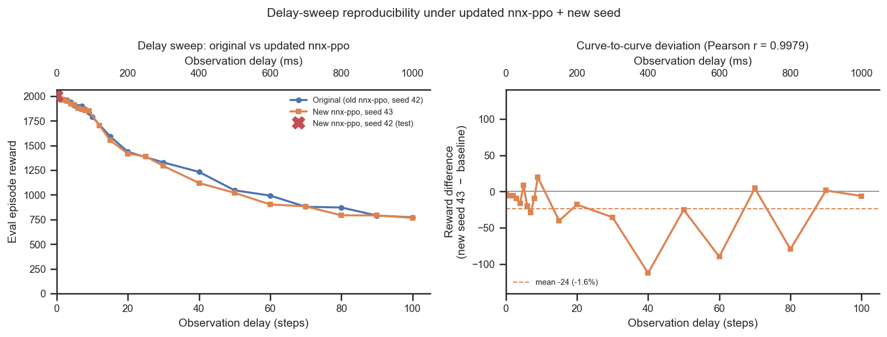

# Delay-sweep reproducibility under the updated nnx-ppo + a new seed

## Question
The standard with-efference delay sweep was re-run on the cluster with the **updated nnx-ppo**
(vnl-experiments commit `714cc735`, "new version of nnx-ppo [git 4ed1f36]") and a **changed
seed**. Did the *shape of the delay-tolerance curve* change as a result?

## Dataset & comparability
- All runs are standard-architecture efference runs (`efference_length == delay_k`,
  `AbsoluteImitation`, `body_target_frame=reference_root`, latent 32, enc/dec `[512]×4`, critic
  `[1024,1024]`, `n_envs=4096`, 600 M steps, restored `actual_step = 600,064,000`). Three
  conditions:
  - `baseline` — the original committed sweep, **old code (git `1cd5838`), seed 42**, 22 delays
    (0–100; logs reward as `episode_reward/mean`).
  - `new_seed` — the full re-run sweep, **updated nnx-ppo (git `714cc735`), seed 43**, 22 delays
    (0–100; logs reward as `eval/episode_reward/mean`).
  - `new_code_old_seed` — a single **delay-0** test run, updated nnx-ppo but **seed 42** — i.e.
    the same seed as baseline. This isolates the *code* change from the *seed* change.
- **Comparability: exactly as intended.** Every network/env/PPO/step invariant is single-valued
  and identical across all three conditions (see [comparability.txt](comparability.txt)); the only
  things that vary are `git_commit` and `seed`, which is the whole point of the test. The two
  reward keys (`episode_reward/mean` vs the new `eval/episode_reward/mean`) are the same quantity
  (eval episode reward) — confirmed by the matched delay-0 values below — and are coalesced into
  `episode_reward_mean` in `extract.py`.
- Caveats: single seed per delay in each sweep, so per-point differences are run-to-run noise, not
  significance. The delay grids differ slightly (baseline has 10; new has 12 and 25) — the
  quantitative comparison uses the 20 shared delays. Reward is the WandB **training-time eval**
  metric (not the offline batch eval), matching the original sweep.

## Figures
Left: the two full sweeps overlaid, with the single new-code/old-seed delay-0 test point (red ✕).
Right: the per-delay difference (new seed 43 − baseline) at the 20 shared delays, read against
zero, with the mean offset and the curve-to-curve Pearson correlation.

## Tentative conclusion

**The curve shape is reproduced. The nnx-ppo update did not change it, and the new seed only
adds the expected small run-to-run jitter.**

- **The code change is neutral (seed held fixed).** At delay 0 with the *same* seed 42, the
  updated code gives 2001.7 vs the baseline 2005.1 — a difference of **−3.4 reward (−0.17%)**,
  i.e. essentially bit-level reproducible up to nondeterministic GPU/library differences.
- **The full curve tracks the baseline tightly.** Across the 20 shared delays the new sweep
  correlates with the baseline at **Pearson r = 0.9979**, with a mean offset of only **−24 reward
  (−1.6%)** and a mean absolute deviation of **27 reward (2.2%)**. The monotonic decline, the
  shoulder out to ~delay 10, and the long-delay floor (~770 at delay 100, identical in both) are
  all preserved.
- **The few larger gaps are isolated single-seed points, not a shape change.** The biggest
  deviations (delays 40, 60, 80, each ≈ −9%) are flanked by delays (50, 70, 90, 100) that match
  the baseline to within ~1%, so they are point noise from the single-seed runs, not a systematic
  shift or a change in the curve's form. The small overall ~1–2% negative offset is consistent
  with ordinary seed-to-seed variation.

**Verdict: the updated nnx-ppo + new seed reproduce the delay-tolerance curve.** It is safe to
treat new runs on commit `714cc735` as comparable to the earlier `1cd5838` results for the shape
of the delay response. (When pooling them for *absolute* numbers, keep in mind the ~1–2% seed-level
spread and that the new code logs reward under `eval/episode_reward/mean`.)

### Follow-ups
- A couple more seeds per code version would convert the "within seed noise" argument from
  qualitative to quantitative (a proper seed-variance band).
- If desired, re-run the offline batch eval (`eval_runs.py`) on the new sweep to confirm the
  agreement also holds on the held-out / long-clip datasets, not just the training-time eval.
