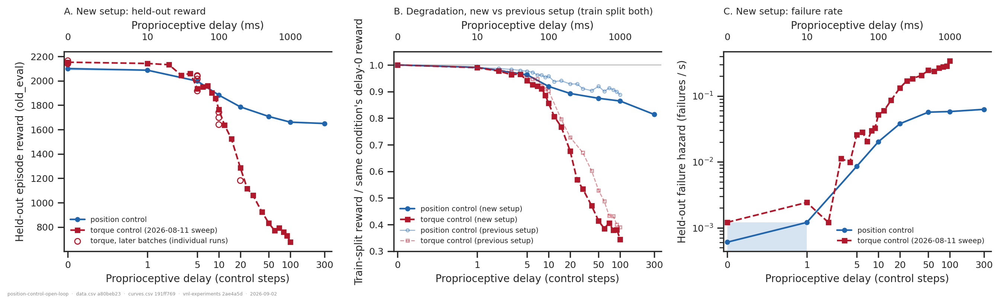
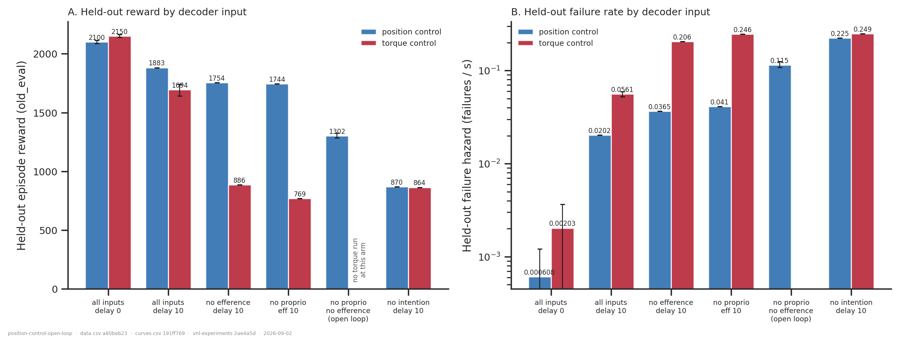
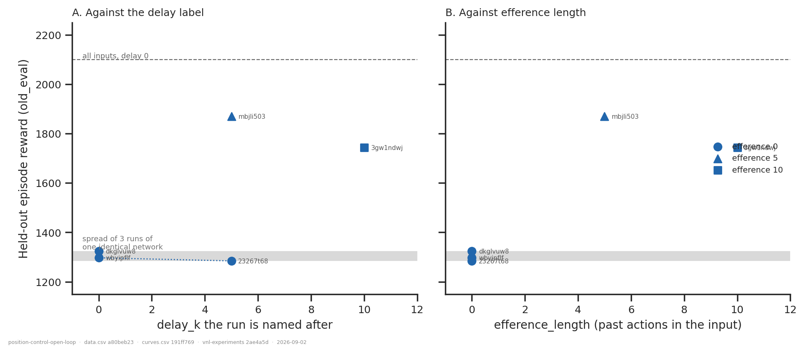
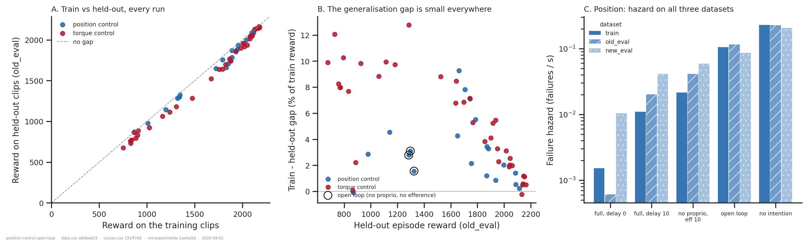
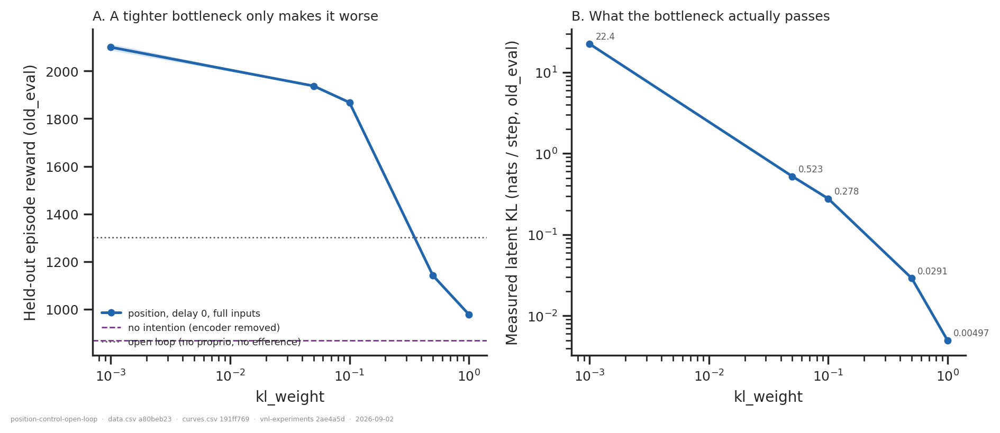
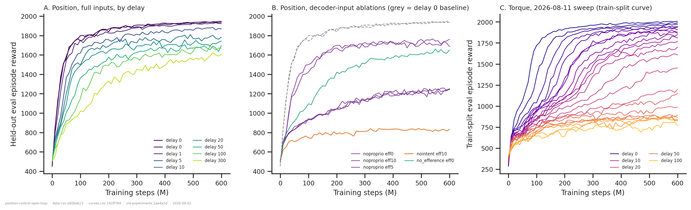

# Position control on the new body and frame — and is it running open loop?

## Question

[`position-vs-torque-control/`](../position-vs-torque-control/) concluded that position
control is *"nearly delay-invariant out to 100 steps (1 s) where torque control has long
since collapsed"*. A second of dead time is a lot for a 100 Hz imitation task, so the
2026-08-31/09-01 batch re-runs the contrast on the configuration we now use everywhere —
`rodent_no_tail_collisions.xml` and `body_target_frame=reference_root` — and adds the
ablations that ask what the delay-tolerance is made of.

1. **Q1** — does position control's delay tolerance survive the new XML and the new
   reference frame?
2. **Q2** — WandB suggests position control also works with **no proprioception at all**,
   i.e. open loop. Is that real?
   * **Q2a** — is that open-loop performance specific to the training clips?
   * **Q2b** — does the *delay length* matter when there is no proprioceptive input?
   * **Q2c** — is it an artefact of `kl_weight` being too small (a wide-open latent)?

**What would count as an answer.** Q1: the position/torque ordering, and the size of the
position arm's degradation, measured on the new setup at matched delays. Q2: how much
held-out reward and survival a policy keeps when each input stream is removed, and whether
what is left is genuinely feedback-free.

## Answers up front

| | answer |
|---|---|
| **Q1** | **Yes, and more strongly than before — but position control is *not* delay-invariant either.** Position loses 10 % / 15 % / 19 % / 21 % of its held-out reward at delays 10 / 20 / 50 / 100; matched torque loses 18 % / 40 % / 61 % / 69 %. At delay 100 position scores 2.5× torque (1661 vs 676) and fails 5.9× less often per second. The position advantage is *larger* on the new setup than on the previous one at every delay past 10 (ratio-of-ratios 1.42 vs 1.27 at delay 20, 2.52 vs 2.28 at delay 100), so the previous report's ordering is confirmed rather than weakened. What does not survive is "nearly delay-invariant": position control degrades smoothly and keeps only 79 % out to delay 100–300. |
| **Q2** | **Substantially true, and mostly explained by the actuators.** With no proprioception the policy keeps **83 %** of the delay-0 reward if it still gets a 10-step efference copy, and **62 %** with no efference copy either (1302 vs 2100, survival 0.56). Under torque control the same ablation keeps only **36 %**. But "no feedback" overstates it, and `reference_root` does not change that: it gates only the `body` sub-key of `task_obs`, while `root`/`quat` remain the reference root pose relative to the **current** root in both settings — an undelayed root tracking error, measured in [frame_leak.txt](frame_leak.txt). |
| **Q2a** | **No.** The train → held-out gap is ≤ 9.3 % across the 20 position runs (≤ 12.8 % over all 57 new-setup runs, the largest being torque at delay 20) and **1.6–3.1 % for the open-loop arm** — among the smallest in the cohort. The open-loop failure *hazard* is flat-to-lower on unseen clips (0.105 /s train, 0.115 /s held-out, 0.086 /s on the 30 s clips). The collapse of `new_eval` survival to 3–6 % is the arithmetic of a constant hazard over 6× the exposure, not memorisation. |
| **Q2b** | **Correct — it cannot matter, by construction.** `delay_k` reaches the network only through the `Delay` layer inside the proprioception branch, and that branch is not built when `dec_use_proprioception=False`. [`check_delay_inert.py`](check_delay_inert.py) shows the two networks are bit-identical. `delay0_eff0_noproprio` and `delay5_eff0_noproprio` are literally the same architecture. **What the run names attribute to delay in that arm is `efference_length`.** |
| **Q2c** | **No — and the sweep cannot test the hypothesis.** Raising `kl_weight` from 0.001 to 0.05/0.1/0.5/1.0 lowers held-out reward monotonically (2100 → 1937 → 1868 → 1142 → 979) and closes the latent from 22.4 to 0.005 nats/step. It cannot isolate the open-loop question because the latent is the *only* path from `task_obs` to the policy: at `kl_weight=1` the policy no longer knows what to imitate, and its reward (979) is near the no-intention floor (870). The premise is right — 22 nats/step is a very loose bottleneck — but a tighter one starves the task, not the feedback. |

## Dataset & comparability

- **Source:** WandB `emiwar-team/nnx-ppo-rodent-delays`, selected by `CONDITIONS` in
  [extract.py](extract.py) and frozen in [runs.csv](runs.csv) (101 runs). Index synced
  2026-09-02.
- **Which runs count as usable.** The gate is `completed_training` in [extract.py](extract.py)
  — `state == "finished"` **or** `summary._step >= config.ppo.total_steps` — not `finished`
  alone. The 2026-08-11 torque sweep (46 runs, commit `ef060b73`, note *"New XML +
  reference_root."*) trained all 600 M steps and then died in its end-of-training eval, so
  WandB records it as `failed`. It is the only complete torque delay sweep on this body and
  frame, and the first version of this analysis excluded all of it, which is what left the
  torque arm stopping at delay 20. The gate is exactly discriminating here: of the 126
  non-finished runs on this XML + frame, those 46 are the only ones that reach
  `total_steps`, and none of them has a `final_eval/*` key — the signature of dying in that
  eval. Everything that stopped mid-training is still excluded, including the crashed
  delay-200 position run `nzaltgrr` (426 M of 600 M). 23 of the 46 are enc-dec and join this
  folder; the other 23 are the companion forward-model sweep, which the `EncDec` tag test
  excludes.
- **Held fixed across every cell:** `AbsoluteImitation`, seed 42, enc `[512]×4`,
  dec `[512]×4`, critic `[1024,1024]`, `latent_size=32`, `min_std=0.1`,
  `latent_min_std=0.01`, `entropy_weight=0.01`, `clip_length=250`, `ctrl_dt=0.01`,
  `rescale_factor=0.9`, `n_envs=4096`, `total_steps=600 M`, all reward weights and
  termination criteria, `state=finished`, and regularised commits only.
- **Conditions** (new setup = `rodent_no_tail_collisions.xml` + `reference_root`):

| condition | n | control | delays (eff) | what it is |
|---|---|---|---|---|
| `pos_efference` | 9 | position | 0(×2),1,5,10,20,50,100,300 | all three decoder streams, `eff == delay` |
| `torque_efference_aug11` | 23 | torque | 0,1,…,10,12,15,20,25,30,40,50,60,70,80,90,100 | **the complete torque sweep**: one commit, one launch, one eval source |
| `torque_efference` | 11 | torque | 0(×3),5(×4),10(×3),20 | the later, same-week-as-position torque batches |
| `pos_noproprio` | 5 | position | 0(×2),5,5,10 → eff 0,0,0,5,10 | `dec_use_proprioception=False` |
| `torque_noproprio` | 1 | torque | 10 (eff 10) | same ablation, torque |
| `pos_nointent` / `torque_nointent` | 1 / 1 | both | 10 (eff 10) | `dec_use_intention=False` (no encoder) |
| `pos_no_efference` / `torque_no_efference` | 1 / 1 | both | 10 (eff 0) | delayed proprioception, no efference copy |
| `pos_kl_sweep` | 4 | position | 0 | `kl_weight` 0.05 / 0.1 / 0.5 / 1.0 |
| `prev_pos_efference` | 22 | position | 0–100 dense | the previous analysis' own runs (`rodent.xml`, `current_root`, commits `891cd0d3`/`b18513ae`) |
| `prev_torque_efference` | 22 | torque | 0–100 dense | ditto (`1cd5838f`) |

- **Artifacts used:** `REQUIRES = ["index", "history:hist2000-533d4b5c", "eval:eval3ds-347333e3"]`
  ([coverage.txt](coverage.txt)). `index` and `history` are 101/101. The `eval` requirement
  is 45/101 and that is expected rather than a gap to close: it is needed only by
  `torque_efference_aug11`, which has **23/23**, because those runs have no inline eval of
  their own. Every other new-setup run reports its own `final_eval/*` on all three datasets;
  the previous-setup runs predate `final_eval` entirely and are used only through their
  training curve. (`prev_torque_efference` happens to hold 22/22 eval artifacts, and
  deliberately does not use them — see caveat 9.) The `history` spec is non-default (enc-dec
  metric names plus both sides of the mid-project logging rename); the `artifacts ensure`
  command that makes it is in [extract.py](extract.py)'s docstring.
- **Two eval sources, and the price of mixing them.** `reward_source` on every row of
  `data.csv` says whether its three-dataset numbers came from the run's own inline
  `final_eval` (78 rows) or from the pinned offline artifact (23 rows, the 2026-08-11
  sweep). analysis/README.md §6 says these "must not be mixed in one figure"; figure 1 mixes
  them, because the alternative is having no torque arm past delay 20. The cost is measured
  rather than assumed by [eval_calibration.py](eval_calibration.py) →
  [eval_calibration.txt](eval_calibration.txt), over every run in the project that holds more
  than one of the three measurements: **median under 0.5 %, largest single discrepancy 3.6 %
  (2.4 % excluding unregularised-commit runs), 0 checkpoint mismatches**. Both of the two
  largest V3-vs-V2 gaps are unregularised runs, which is the case the VERSION 3 bump exists
  for. Against a 3.1 % replicate noise floor and delay effects of 20–70 %, this is not what
  any conclusion turns on. Two independent checks agree: the 2026-08-11 sweep and the later
  torque batches overlap at delays 0/5/10, where they differ by +0.1 % / −4.7 % / +2.6 %
  (against the `rollout_length = 20` runs); and the held-out and train-split ratio-of-ratios
  in the Q1 table below agree to within 0.1 despite coming from different sources.
- **Why the 2026-08-11 sweep is its own condition** rather than folded into
  `torque_efference`: kept separate, it is the only condition in the folder with **zero**
  flagged invariants — one commit, one `rollout_length`, one eval source, one cluster stack,
  every run at exactly 600,064,000 steps. Folded in, it would have inherited that cell's
  `rollout_length` and OS/CUDA spread and stopped being readable as a single curve.
  `torque_efference` stays as the same-week comparator for the position batch.
- **Pinned to VERSION 2, not the current default.** `eval3ds-347333e3` (V2) covers all 46
  runs of the sweep; the producer's current default `eval3ds-382e9e69` (V3) covers 4. A
  uniform source within one series matters more than being on the newest version. On the 4
  runs holding both, V3 is +0.22 % from V2 on average (worst 0.86 %). Producing V3 for the
  whole cohort is follow-up 1.
- **Programmatic comparability** ([comparability.txt](comparability.txt)): every invariant
  is single-valued within every condition except three, each deliberate. Note in particular
  that `torque_efference_aug11`, the condition the Q1 curve is drawn from, has **nothing**
  flagged.
  - `net_params.kl_weight` in `pos_kl_sweep` — that is the sweep axis.
  - `git_commit` in `pos_efference` / `pos_noproprio` (`f4992e2` + `b7c4b32`) and in
    `prev_pos_efference` (`891cd0d3` + `b18513ae`) — diffs checked by hand, below.
  - `config.ppo.rollout_length` **20 vs 60**, `summary._step`, `os`, `cuda_version` and
    `git_commit` in `torque_efference`. This is the one substantive mismatch; priced in
    caveat 2. It is confined to that condition, which is now a comparator rather than the
    curve.
- **Manual comparability.** Configs were read from `env_params` directly, not from the
  training script at each commit (the cluster working copy drifts — analysis/README.md §6);
  `torque_actuators` and `body_target_frame` in particular come from `env_params` in every
  figure and table. `git diff` verdicts:
  - `2c147a6 → f4992e2 → b7c4b32` (all the new-setup runs): adds `--env-config` overrides,
    the requeue machinery and one help string. Touches
    `delays/train_rodent.py`, `train_rodent_requeue.py`, `requeue.py` and their tests, and a
    slurm script. **No env, network, reward or PPO code.**
  - `a3450a91 → 2c147a6` (the 08-24 torque delay-0/5 baselines vs the 08-31 batch): the only
    non-analysis change to a training path is the addition of `repos` provenance logging to
    the WandB config. `4245ae42 → 2c147a6` (the rollout-60 runs) touches only
    `probes/`, `video_editing/` and `wandb_utils/style.py`.
  - nnx-ppo `64a7dd1 → 1725d20` (torque 08-31 batch vs everything at `f4992e2`/`b7c4b32`):
    adds `stop_fn` / `initial_eval` for preemption, checkpointing docs and tests, and a
    MuJoCo pin in the **dev** extras. The PPO update itself is untouched; `initial_eval`
    changes only when eval/video/checkpoint fire on a resumed attempt.
  - `891cd0d3 → b18513ae`: analysis artifacts and `eval_runs.txt` only — already certified
    by the previous analysis, re-checked here.
  - `ef060b73` (the 2026-08-11 sweep) is the commit that first set `reference_root` in both
    training scripts, which is why that sweep is the earliest cohort on this frame. Its 46
    runs share one commit and one launch batch, so there is no intra-condition diff to check;
    the cross-condition one that matters is against the later torque batches, and the two
    agree at every overlapping delay to within the replicate noise (above). All 46 carry the
    note *"New XML + reference_root."*, and `env_params` confirms both independently.
  - Every eval artifact used was checked against the run two ways —
    `resolved.walker_xml_path` vs `env_params.walker_xml_path`, and
    `resolved.checkpoint_step` vs `summary._step` — by `load_eval` in
    [extract.py](extract.py), which raises rather than warns. This is the
    `assert_artifact_body` pattern analysis/README.md §6 mandates for a folder spanning two
    bodies, and it is load-bearing here: these runs have no inline eval to cross-check
    against, so "the artifact evaluated the weights the run finished with" rests entirely on
    the checkpoint the producer restored. All 46 pass; all were produced on cluster hosts
    (not the laptop, whose evals are only reproducible to ~1 %).
  - Notes and tags were read for every run; the `env-override` tag on the position runs is
    `torque_actuators=false`, which is the manipulation, and `env_config_overrides` records
    it.
- **Replicate noise floor**, measured from matched configurations in this cohort:
  1.2–1.4 % (position delay 0, torque delay 0, torque delay 5), 2.6 % (torque delay 10),
  **3.1 %** (the three architecturally identical open-loop runs). Consistent with the
  ±2.9 % bound in [`xml-ceiling-vs-convergence/`](../xml-ceiling-vs-convergence/). Nothing
  below is read as signal under ~3 %.

### Caveats

1. **Two eval sources in figure 1.** The position arm's held-out numbers are its own inline
   `final_eval`; the torque curve's are offline V2 `eval` artifacts. Measured cost: median
   under 0.5 %, worst 3.6 % anywhere in the project, 2.4 % excluding unregularised runs
   ([eval_calibration.txt](eval_calibration.txt)). Below the 3.1 % replicate noise floor.
   Producing V3 evals for all 92 runs that lack them (follow-up 1) removes this entirely.
2. **The torque arm crosses a cluster stack and a code epoch from the position arm.** The
   2026-08-11 sweep ran on CUDA 12.9 / kernel 553.44 at commit `ef060b73`; the position runs
   on CUDA 13.3 / 553.155 at `f4992e2`/`b7c4b32`, three weeks later. The later torque
   batches sit on the position runs' stack and overlap the sweep at delays 0/5/10, agreeing
   to +0.1 % / −4.7 % / +2.6 % — so the stack difference is bounded by the replicate noise at
   the delays where it can be measured. It is *not* measured beyond delay 20, which is where
   the headline lives.
3. **`rollout_length = 60` on three of the later torque runs** (`sgad6k6w` d5, `ph7zg573`
   d10, `hziohlkp` d20, all commit `4245ae4`). Delays 5 and 10 have runs at both settings, so
   the cost is measurable: −5.7 % at delay 5, −4.6 % at delay 10. This no longer touches the
   Q1 curve (the 2026-08-11 sweep is uniformly `rollout_length = 20`); it only shifts three of
   the open comparator markers in figure 1A downward by ~5 %.
4. **Not converged, unequally — and the torque arm is the worse one.** Over the last 100 M
   steps the position arm gained 0.0–1.2 % at delays 0–20 and 2.7–3.0 % at delays 100–300;
   the 2026-08-11 torque arm gained 0.7–2.9 % at delays 0–7, **3.6–10.3 % at delays 10–40**,
   and 0.1–5.7 % at delays 50–100. So the torque disadvantage at delays 10–40 is partly a
   learning-speed effect and would narrow with a larger budget. At delays 50–100, where the
   gap is 2.1–2.5×, both arms are gaining only a few percent, so the conclusion there does
   not rest on it. The open-loop runs were also still climbing (0.7–2.3 %).
5. **Position vs torque is not a pure feedback-loop contrast.** The XML's `forcerange` —
   which is what the torque conversion turns into the gain — was not chosen to match
   `kp × range`, so per-joint peak commandable torque changes by 0.18× to 7.2× (median
   0.41×) when the mode flips ([actuator_map.txt](actuator_map.txt)). Both modes do share the
   same 40 ms first-order actuator filter.
6. **One run per delay in the torque sweep, one per delay past 1 in the position sweep.**
   Replicates exist only at delays 0–20 (and only in the later torque batches). Single-delay
   wiggles — the position arm's flat stretch from 50 to 300, the torque arm's non-monotonic
   60/70 pair — are inside the noise floor and should not be read as structure.
7. **Single seed** (42) everywhere; replicates are re-launches of the same seed, so they
   bound run-to-run nondeterminism, not seed variance.
8. **`repos.*.dirty = True` on every new-setup run** (all three repos), and unrecorded before
   2026-08-24, which is the whole 2026-08-11 sweep. Per analysis/README.md §4 that voids the
   commit as an identifier of the code that ran, so the diffs above bound what *could* have
   differed rather than proving what did.
9. **The previous-setup curves use a different metric, and the difference is not negligible.**
   They predate `final_eval/*` and the 2026-08-20 `eval_env = train_env` fix, so their only
   available number is a **train-split** curve (`window_reward`, mean of the eval points in
   the last 50 M steps), while the new runs' curves are held out. Train-split ratios degrade
   *less* than held-out ratios — by up to 7.4 pp (position, delay 100) in the new cohort — so
   putting the previous cohort's train-split curve against a held-out one would flatter it.
   Figure 1B therefore compares **train-split against train-split**, normalised within each
   condition; the held-out numbers are quoted separately and are the primary ones.
   `prev_torque_efference` does hold 22/22 eval artifacts and deliberately does not use them:
   `prev_pos_efference` holds none, and giving one arm of a paired comparison a better metric
   than the other is worse than giving both the same worse one. `load_eval` enforces that by
   refusing to read artifacts for any `prev_*` row.
10. **Most position runs were preempted and requeued** (0 to 24 restarts; weights and
    optimizer state restored, env states redrawn). This appears benign: the three
    architecturally identical open-loop runs have 2, 7 and 2 restarts and land within 3.1 % of
    each other, and the `kl_weight` trend is not ordered by restart count (the two worst runs
    have 0 and 4 restarts). The 2026-08-11 sweep predates requeue support entirely.
11. **MuJoCo version is unrecorded** for a training run (only artifact sidecars carry it), and
    a minor bump moves reward ~3 %.
12. **`new_eval` is 32 clips, single seed.** Read its survival for trend, not point values.

## How the network is wired, since it settles two of the questions

`delays.network_builders.build_delay_network` builds

```
actor = Concat({ task_obs:       encoder -> VariationalBottleneck(latent),
                 proprioception: Delay(k_steps=delay_k) })  -> EfferenceCopy(queue=eff)
critic = MLP(task_obs + proprioception)              # undelayed, privileged, in every arm
```

Three facts follow, and they are what the Q2 answers rest on:

- **`task_obs` is never delayed.** The delay sits in the proprioception branch alone. So the
  imitation target reaches the policy fresh, always, through the latent.
- **`delay_k` is dead code without proprioception.** No proprioception branch, no `Delay`.
  [`delay_inert.txt`](delay_inert.txt) confirms it: identical parameter counts, identical
  weight *and* carry trees, and `max|Δ output| = 0` between `delay_k = 0` and `10`; the
  same comparison *with* proprioception differs, so the test is not vacuous. Every
  parameter count it builds matches the runs' own `final_eval/params/total` exactly, which
  is what shows the check is running the real architecture.
- **"Open loop" is an overstatement, and `reference_root` does not fix it.** This is the
  natural objection — `body_target_frame="reference_root"` exists to take current state out
  of the imitation target, and its config docstring calls it *"the pure target pose shape,
  independent of all current state"*. But it gates exactly **one** of the four `task_obs`
  sub-keys. `root` and `quat` are computed above the branch, identically in both settings,
  from the *current* root pose; the class docstring says so (*"The root position/quaternion
  targets remain relative to the current root frame, which is unavoidable for an egocentric
  representation"*), and the config sentence above is true of the `body` targets it is
  describing.

  [`frame_leak.py`](frame_leak.py) measures it on the real env rather than reading it
  ([frame_leak.txt](frame_leak.txt)). Displacing the walker's root by 1 cm moves `root` by
  1.4e-2 under **both** frame settings, and moves `body` by 1.4e-2 under `current_root` and
  by **exactly 0** under `reference_root` — so the switch works, on the 270 numbers it
  covers, and leaves the 35 in `root`/`quat` untouched. Rotating the root moves `quat`
  identically in both. Perturbing the joint angles moves nothing in `task_obs` at all, which
  is what `absolute` buys and what makes the delay experiment meaningful in the first place.

  The signal is not incidental: `root`'s first reference frame is *identically*
  `rotate(ref_root_pos − root_pos, root_quat)`, checked to 1e-6 — the root tracking error in
  the walker's own frame. At a 5 cm drift its norm reads 0.0505 m against the `root_too_far`
  termination threshold of 0.1 m. So a no-proprioception run reads, fresh every step, how far
  and how wrongly-oriented its root is, in the units of the two criteria that end the
  episode. It has lost joint-level proprioception, not all feedback.

  (The same run also confirms the observation widths — `task_obs` 640, proprioception 277 —
  that [`check_delay_inert.py`](check_delay_inert.py) had solved backwards out of the runs'
  recorded parameter counts. Two independent derivations, same numbers.)

And what position control *is* here ([actuator_map.txt](actuator_map.txt)): affine-bias
servos, `force = kp · (offset + scale · ctrl − qpos)`, where for **29 of 38** actuators
`scale`/`offset` are exactly the joint's half-range and midpoint. The action is a **target
joint angle in normalised joint coordinates** — the same quantity, up to a per-joint affine
map, as the reference joint angles in `task_obs`. Under `torque_actuators=True` the law
becomes `force = gain · ctrl` with no state term, and no static map from a target pose to a
torque exists. That asymmetry is the mechanism every Q2 number below is consistent with.

## Figures



**Q1.** Panel A: the torque curve is the 2026-08-11 sweep (filled squares, delays 0–100);
the later torque batches are the open markers, and their agreement with it at delays 0–20 is
what licenses reading two eval sources on one axis. The two modes are within 2.4 % at delay
0 (torque marginally ahead, as in the previous report), cross by delay 5–10, and then
diverge without bound: at delay 100 position holds 1661 against torque's 676. Panel B puts
both cohorts on their train-split reward, each divided by its own delay-0 value — the only
footing on which they compare (caveat 9). Both modes degrade *more* on the new setup than on
the previous one, and the torque arm more than the position arm, so the gap widens. Panel C:
the failure hazard, where the separation is largest — 2.6× at delay 10, 3.5× at 20, 4.3× at
50, 5.9× at 100.

| delay | position (held-out) | torque (held-out) | position ÷ torque | previous setup, ÷ (train split) |
|---|---|---|---|---|
| 0 | 1.000 | 1.000 | 1.00 | 1.00 |
| 5 | 0.951 | 0.900 | 1.06 | 1.02 |
| 10 | 0.897 | 0.820 | 1.09 | 1.06 |
| 20 | 0.851 | 0.597 | **1.42** | 1.27 |
| 50 | 0.813 | 0.386 | **2.10** | 1.74 |
| 100 | 0.791 | 0.314 | **2.52** | 2.28 |
| 300 | 0.786 | — | — | — |

Each column is normalised to its own condition's delay-0 value. The same table computed on
train-split reward instead gives ratio-of-ratios 1.07 / 1.32 / 2.11 / 2.51 at delays
10 / 20 / 50 / 100 — within 0.1 of the held-out column at every delay, despite the two
columns coming from different eval sources. That agreement is the strongest evidence that
the source mix in caveat 1 is not carrying the result.



**Q2, the central figure.** Read each arm against `all inputs / delay 0` on the left. Removing
*proprioception* costs position control 7 % (1883 → 1744 at matched efference 10) and torque
control 55 % (1694 → 769). Removing the *efference copy* instead costs position control 7 %
(1883 → 1754) and torque control 48 % (1694 → 886). Removing **both** leaves position control
at 1302 — 62 % of its delay-0 reward, with 56 % survival on held-out clips — and there is no
torque run at that arm. The rightmost pair, `no intention`, is the control: with the encoder
gone the two modes are indistinguishable (870 vs 864), so the entire mode difference lives in
what the intention stream makes possible.



**Q2b.** Same five runs in both panels. In A the vertical spread at `delay_k = 5` is 1284
against 1870 — a gap the run names attribute to the delay. In B it lines up exactly with
`efference_length`. The dotted line joins the three `eff 0` runs, whose networks are provably
one and the same; they sit inside a 3.1 % band whether labelled delay 0 or delay 5.



**Q2a.** Panel A: every run sits on the diagonal. Panel B: the gap never exceeds 12.8 %
(9.3 % among the position runs). It is broadly larger for weaker policies — but the
comparison that matters is at *matched* strength: the open-loop runs (ringed, ~1300 held-out
reward) sit at 1.6–3.1 %, while the delayed torque runs at the same reward (delay 20 at 1286,
delay 25 at 1115) sit at 12.8 % and 9.9 %. So the gap tracks the delay, not the score, and
the open-loop arm is on the good side of it — the opposite of what memorisation would look
like. Panel C is the length-fair version: the
open-loop arm's hazard is 0.105 /s on the training clips, 0.115 /s on unseen same-length clips
and 0.086 /s on unseen 30 s clips. A constant hazard of 0.086 /s over a 30 s clip predicts
7.6 % survival; 5.2 % is observed. The `new_eval` collapse is exposure, not novelty.



**Q2c.** Panel B shows the premise is correct: at `kl_weight = 0.001` the bottleneck passes
**22.4 nats/step** — at 100 Hz that is ~2.2 knats/s, about 3.2 kbit/s, which is not a
bottleneck in any useful sense.
Panel A shows why that cannot be tested by tightening it: reward falls monotonically, and by
`kl_weight = 1` (0.005 nats/step, a closed latent) it has reached 979, just above the
no-intention floor of 870. Squeezing the latent removes the *task*, not the feedback. Note
also that the measured KL *falls* with delay in the full-input arm (22.4 at delay 0 → 11.4 at
delay 300) while staying high in the no-proprioception arm (17.0–22.2).



**Convergence.** Panel A: the position delay 0–20 curves are essentially flat by 600 M
(≤ 1.2 % gain over the last 100 M); delay 100 and 300 are still rising (+2.7 % and +3.0 %).
Panel B: the three open-loop runs (lower purple group, ~1250) are still climbing slowly
(+0.7 % to +2.3 %), and the `no intention` run (orange) has plateaued at ~830. Panel C is
caveat 4 made visible: the torque sweep's mid-delay runs (pink, delays 10–40) are still
climbing steeply at 600 M — +3.6 % to +10.3 % over their last 100 M against the position
arm's ≤ 1.2 % at the same delays — while the longest-delay ones (orange/yellow, 50–100) have
flattened at +0.1 % to +5.7 %. So the torque disadvantage at 10–40 is partly learning speed;
at 50–100, where the gap is 2.1–2.5×, it is not. Panel C is on its own axis because that
sweep's curve is train-split (it predates the 2026-08-20 fix) — read the slopes, not the
levels.

## Tentative conclusions

**Q1 — the ordering is confirmed and is stronger than before; the "delay-invariant"
framing is not.** With the 2026-08-11 sweep in, the new setup has a complete torque delay
sweep (0–100, one commit, one launch, nothing flagged in its comparability report), and the
contrast is unambiguous: position control holds 79 % of its delay-0 held-out reward out to
delay 100–300, torque control holds 31 % at delay 100, and the position/torque degradation
ratio grows from 1.09 at delay 10 to 2.52 at delay 100 — *larger* than the previous setup's
1.06 → 2.28 at every delay past 10. Survival at delay 100 is 0.75 against 0.14, and the
failure hazard 0.058 against 0.343 /s.

So the previous report's ordering, and its claim that torque control collapses under
long delay, both hold on the new body and frame. What does not hold is "nearly
delay-invariant" for position control: it degrades smoothly and monotonically — 10 % by
delay 10, 15 % by delay 20, 21 % by delay 100 — where the previous setup showed 4 % / 7 % /
11 %. Part of that is `current_root` body targets leaking undelayed root pose into the target,
which `reference_root` removes; part is the metric, since the previous numbers are
train-split and train-split ratios degrade 5–7 pp less. Two things still qualify it: the
torque arm is the less converged of the two at delays 10–40 (caveat 4), so the gap there is
partly learning speed; and the torque arm sits on a three-week-older cluster stack, bounded
by replicate noise at delays 0–20 but unmeasured beyond (caveat 2).

**Q2 — position control really does work with no proprioception, and the actuator semantics
are the likely reason.** 83 % of delay-0 reward with a 10-step efference copy and no
proprioception; 62 % with neither. The matched torque ablation keeps 36 %. Under position
control the action is a normalised target joint configuration and `task_obs` supplies the
reference joint angles undelayed, so a large part of the imitation task is a static map the
policy can compute feedforward; under torque control the map from a target pose to a torque
depends on the state, and the same ablation is near-fatal. Two supporting observations point
the same way: the efference copy is worth +7 % under position control and +91 % under torque
at delay 10 (under position control the commanded action *is* approximately the joint
configuration the servo will reach, so the action history is itself a proprioceptive
estimate); and with the intention stream removed the two modes score identically.

Three qualifications matter. **It is not feedback-free** — the `root`/`quat` part of
`task_obs` is an undelayed root-pose error in every arm here, and root drift is exactly what
the dominant termination (`root_too_far`, 0.36–0.39 in the open-loop arm) is about.
**It is not free** — 62 % of the reward and 56 % held-out survival is a much worse controller,
and its per-second failure rate (0.115 /s) is two orders of magnitude above the closed-loop
delay-0 arm's, which is near zero because that arm almost never fails. **And it does not hold
over long horizons**: 5 % survival on 30 s clips, which is what a 0.09 /s hazard gives you.

There is also a striking non-monotonicity worth chasing: the full-input network at delay 300
(1650) scores *below* the no-proprioception network with a 10-step efference copy (1744), and
below the one with a 5-step copy (1870). Those configurations differ in efference length as
well as in the proprioception stream, so this is a comparison of configurations rather than a
clean ablation — but it suggests that once proprioception is stale enough it is a *liability*,
and the network would be better off without it.

**Q2a — no, it is not fitted to the training clips.** ≤ 9.3 % train-to-held-out gap over the
20 position runs (12.8 % worst anywhere, a torque delay-20 run), 1.6–3.1 % for the open-loop arm, and a failure hazard that is flat to slightly
*lower* on unseen clips. The `new_eval` survival collapse to 3–6 % is what a constant hazard
predicts over 6× the exposure. What the open-loop policy lacks is not generalisation across
clips but the ability to keep going: it fails at a constant, high rate everywhere.

**Q2b — right, it cannot matter, and it is proven rather than measured.** `delay_k` never
enters the graph when the proprioception branch is absent. The corollary is a warning:
`RodentEncDec_delay10_eff10_noproprio` is not a delay-10 experiment, and any figure that puts
those runs on a delay axis is plotting `efference_length` with the wrong label.

**Q2c — no, and the sweep is the wrong instrument.** The bottleneck *is* wide open
(22.4 nats/step), so the concern is well-founded, but the latent carries the reference, not a
state estimate: tightening it degrades the policy monotonically and by `kl_weight = 1` has
reduced it to roughly the no-encoder floor. If the worry is specifically "the latent is
passing so much that the policy can replay the reference open loop", the test is not a
tighter bottleneck — it is removing the one genuinely state-dependent part of `task_obs`.

One more thing this settles about the previous report. Part of why the position curve was
flatter there was attributed to `current_root` leaking undelayed root pose into the *body*
targets — and [frame_leak.txt](frame_leak.txt) confirms that mechanism exists and is worth
1.4e-2 per centimetre of drift across 270 numbers. But it also shows the switch to
`reference_root` did not remove root-level feedback, only relocated the question: both
cohorts had it, so it cannot be the whole explanation for the difference between them.

**Bottom line.** Position control's delay tolerance is real, survives the new body and
frame, and is *more* pronounced there than in the previous report — 2.5× the torque arm's
held-out reward at 1 s of delay, against 2.3× before. What does not survive is the word
"invariant": position control degrades smoothly to 79 % of its delay-0 reward and stays
there out to 3 s, and the previously reported flatness was part frame (`current_root`
leaking undelayed root pose) and part metric (train-split rather than held-out). The reason
it tolerates delay at all is that under position control most of the imitation task is a
feedforward kinematic map: the policy can throw away joint proprioception entirely and keep
62–83 % of its reward, where torque control keeps 36 %. What it cannot throw away is the
undelayed root-pose signal that `reference_root` still leaks through `task_obs`, and that is
the next thing to remove.

## Follow-ups

Roughly in order of how much they would change the picture:

1. **One batch V3 offline eval over the whole cohort** — 92 of the 101 runs lack it. That
   retires caveat 1 (two eval sources) and caveat 9's protocol mismatch in one pass, and
   would give the previous-setup arms held-out numbers for the first time. Needs the cluster:
   `artifacts plan --kind eval --runs analysis/position-control-open-loop/runs.csv --out todo.txt`,
   then `sbatch slurm_eval.sh todo.txt eval`, then `artifacts pull`.
2. **A torque run at delay 300**, `rollout_length = 20`, on the current stack. The torque
   sweep stops at 100 while the position arm reaches 300, so the widest point of the contrast
   is one-sided. One run. A delay-200 position run would also close the hole left by the
   crashed `nzaltgrr`.
3. **A genuinely open-loop `task_obs`**, crossed with `dec_use_proprioception=False`. Note
   that this is *not* a `body_target_frame` setting: `reference_root` already does everything
   it can, and the residual leak is in the `root`/`quat` terms, which are computed above that
   branch. It needs a new option — reference root pose and orientation in world or first-frame
   coordinates, or the current-root terms simply dropped — which is a small change to
   `AbsoluteImitation._get_imitation_target` plus a `Delay` on that branch if a delayed
   version is wanted. That is the decisive test of "open loop": those 35 numbers are the only
   remaining undelayed state-dependent input, and Q2c cannot substitute for it. It would also
   give the testable version of the `kl_weight` hypothesis, since the latent would then be
   throttling a channel that carries *only* the reference.
4. **A longer budget for the torque arm at delay 10–20** (2 G steps, matching
   [`explicit-vs-implicit-fm-budgets/`](../explicit-vs-implicit-fm-budgets/)), to separate
   "torque control cannot do delayed imitation" from "torque control learns it slowly".
   Caveat 4 currently blocks that distinction at delays 10–40, where the torque arm was
   still gaining up to 10 % over its last 100 M steps.
5. **`efference_length` as its own sweep under position control with no proprioception**
   (eff 0, 1, 2, 5, 10, 20 at fixed delay 0). The 0 → 5 step is worth +44 % and 5 → 10 is
   −7 %, on one run each; this is the axis the `noproprio` runs actually varied, and nobody
   has swept it deliberately.
6. **A second seed** for the open-loop arm and for position delay 20–300. Everything here is
   seed 42, and the replicate band bounds nondeterminism only.
7. **Force-matched control modes** — set the torque gain to `kp × half_range` per joint — so
   that position-vs-torque is a feedback-loop contrast and not partly an authority contrast
   (caveat 5).
8. **A hand-coded feedforward controller**: drive the position targets straight from the
   reference joint angles through the affine map in [actuator_map.txt](actuator_map.txt), with
   no network at all. That measures the ceiling of pure feedforward position control directly,
   and would say how much of the 62 % is learned at all.

---

*Reproduce:*
`../.venv/bin/python analysis/position-control-open-loop/extract.py && ../.venv/bin/python analysis/position-control-open-loop/plot.py`
(add `--sync --refresh` to the extract to pull in runs added since `runs.csv` was frozen).
`frame_leak.py --check` rebuilds the env and re-measures the target's state dependence — it
needs a GPU and the reference clips, ~3 min. The three cheap standalone checks are
`check_delay_inert.py --check` (no GPU, no run data), `actuator_map.py --check` (no GPU, no
run data) and `eval_calibration.py --check` (needs the run index and the artifact store),
all under `analysis/position-control-open-loop/`.
