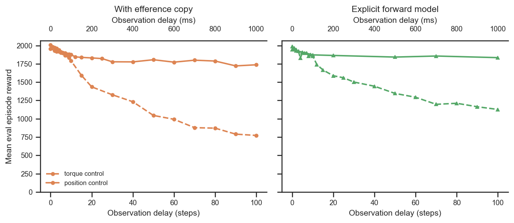
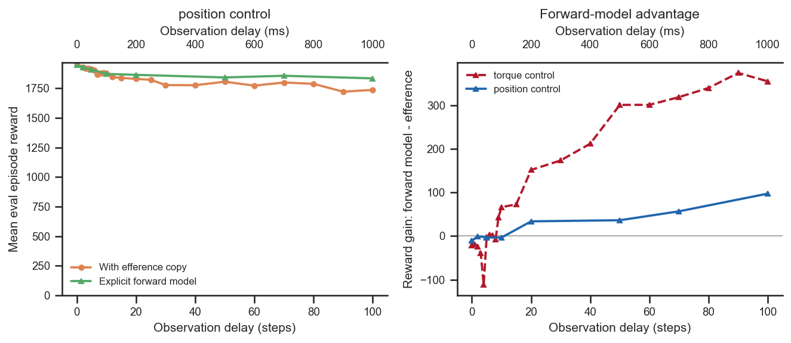
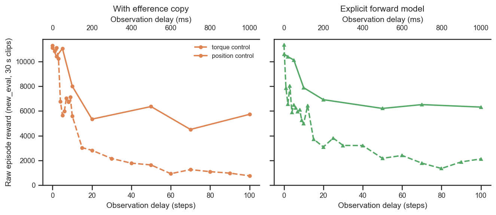
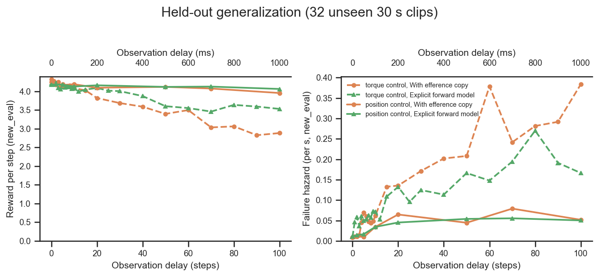
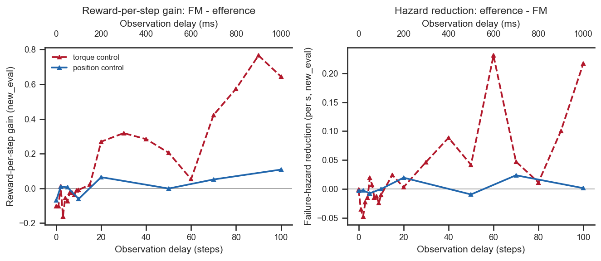

# Position vs torque control — is imitation easier, and does the forward model still win?

## Question
The rodent's actuators can be driven in two modes (`env_params.torque_actuators`):
**torque control** (`True`, the project default — motors converted to torque-mode actuators)
or **position control** (`False` — MuJoCo position/PD actuators, where the network commands a
target joint configuration and a built-in PD loop supplies the torque). Position control is
presumably *easier* — the PD loop does part of the stabilisation. Two questions:

1. **Is position control easier / more robust to observation delay than torque control?**
2. **Is an explicit forward model still advantageous under position control?**

## Dataset & comparability
A 2×2 (control-mode × network) design over an efference-matched delay sweep
(`efference_length == delay_k`), seed 42, standard architecture (enc `[512]×4`, dec `[512]×4`,
critic `[1024,1024]`, `latent_size=32`, `kl_weight=0.001`), **frame held at `current_root`**,
all restored at `actual_step = 600,064,000`, train clip 250 frames. Each condition includes
**all** its comparable runs at every available delay (0–100), so the curves are shown at their
natural density rather than on a fixed grid (75 runs total).

| condition | control mode | network | delays | commit |
|---|---|---|---|---|
| `pos_efference` | position (`torque_actuators=False`) | efference EncDec | dense: 0,2,3,4,5,6,7,8,9,10,12,15,20,25,30,40,50,60,70,80,90,100 | `891cd0d3` (coarse) + `b18513ae` (fine fill-in) |
| `pos_forward_model` | position (`torque_actuators=False`) | explicit FM (`fm_loss_weight=1`, detached) | 0,2,5,10,20,50,70,100 (coarse only — no fine FM runs) | `891cd0d3` |
| `torque_efference` | torque (`torque_actuators=True`) | efference EncDec | dense: 0,1,…,10,15,20,30,40,50,60,70,80,90,100 | `1cd5838f` (canonical eff sweep) |
| `torque_forward_model` | torque (`torque_actuators=True`) | explicit FM (`fm_loss_weight=1`) | dense: 0,1,…,10,12,15,20,25,30,40,50,60,70,80,90,100 | `54643764` (canonical FM sweep) |

- **Authoritative control mode** is read from `env_params.torque_actuators`; network type from
  run **tags** (`ForwardModel`/`EncDec`). Selection and columns are in [extract.py](extract.py).
- **Baseline selection out of the full torque population.** WandB has **225** finished
  `torque_actuators=True` runs (vs 16 position); **56** pass every comparability gate
  (seed 42, standard architecture, `current_root`, `efference_length == delay_k`, canonical FM).
  The excluded ~170 differ on an axis we hold fixed — ~91 are *other seeds* (the multi-seed
  cohorts), ~28 have `eff ≠ delay`, ~24 are non-canonical FM ablations (no-detach / other loss
  weights), ~14 non-standard architecture, ~12 `reference_root` — i.e. excluded for
  comparability, not because they are technically incompatible. The torque baselines here are
  the full seed-42 `1cd5838f` (efference) and `54643764` (FM) sweeps, both dense out to delay
  100 (0,1,…,10,15,20,30,…,100). The position-efference sweep is now comparably dense after the
  `b18513ae` fine-delay fill-in; the position-FM sweep remains coarse (no fine FM runs exist).
- **Frame is held constant** — every condition (position *and* torque) is `current_root`, read
  from `env_params.body_target_frame`, so the frame is *not* a confound here (it is a verified
  single-valued invariant in [comparability.txt](comparability.txt)).
- **Comparability: all invariants single-valued within every condition** (frame, latent/kl/
  enc/dec/critic sizes, seed, clip_length, and the trained step `actual_step` — see
  [comparability.txt](comparability.txt)). The only things that vary are the experimental axes
  (`control_mode`, `network`, `delay_k`) and, by design, `git_commit`.
- **The control mode is confounded with the code commit** (position runs at `891cd0d3`; torque
  baselines at `1cd5838f`/`54643764`). This was checked by hand and is **behaviourally inert**:
  - `891cd0d3` differs from `909e774d` (the reference-root cohort) **only by
    `eval_runs.txt`** — no training/env/network/reward code — so its training code is identical
    to that cohort's.
  - The reference-root analysis already certified `909e774d`'s efference and FM training as
    behaviourally identical to these baselines except for the added, default-inert options
    (`inject_key=None` in `efference_copy.py`; `detach_prediction=True` in `forward_model.py`,
    which reproduces the original hardcoded `stop_gradient`). Everything else in the diff is
    eval/analysis/video tooling, not used during training.
  - The position runs record HEAD `891cd0d3` but were launched from a working tree with the
    experimental edits applied — `env_params` confirms `torque_actuators=False` **and**
    `body_target_frame=current_root` (both differ from that commit's script defaults). The
    recorded value that matters — the actuator mode — is read authoritatively from `env_params`.
  - The fine-delay position-efference fill-in runs are at `b18513ae`, whose diff from
    `891cd0d3` is **only analysis artifacts + `eval_runs.txt`** (no training/env/network/reward
    code), so the coarse and fine position-efference points form one coherent sweep. All 75
    runs share `actual_step = 600,064,000` (verified invariant), so the two commits also trained
    for the same number of steps.

  So within each network the *only* training-relevant difference between the position and
  torque runs is the actuator mode itself.
- **Metric.** End-of-training **eval-on-train-clips** episode reward (the training script sets
  `eval_env = train_env`); the "new logging api" rename `episode_reward/mean` →
  `eval/episode_reward/mean` is coalesced in `extract.py`. `torque_actuators` changes the
  *actuators*, not the imitation reward shaping — the tracking terms (joints, root position/
  orientation, end-effector, torso-height) are control-mode-agnostic and dominate. The only
  mode-sensitive reward terms are the small penalties `energy_cost`, `control_cost` and
  `control_diff_cost`, which together are **~3 % of the per-step reward** (energy_cost ≈
  −0.012, control_cost ≈ −0.12, control_diff_cost ≈ −0.006, vs a total ≈ 4.4 /step). So the
  reward is a fair overall-performance measure across modes, with a small caveat that a few-%
  slice of any cross-mode difference is the differently-scaled cost terms rather than tracking.
- **Offline batch eval (second data source).** The runs with an offline eval (61 of the 75 —
  the 14 fine-delay position-efference fill-in runs are not yet eval'd) were re-evaluated with
  `eval_runs.py` on the three datasets — `train` (250-frame train clips), `old_eval` (held-out
  250-frame clips) and `new_eval` (32 unseen 1500-frame / 30 s clips) — joined by `wandb_id` in
  [extract_eval.py](extract_eval.py) → [data_eval.csv](data_eval.csv) (183 rows, same invariants
  single-valued, see [comparability_eval.txt](comparability_eval.txt)). The eval figures below
  therefore show the position-efference curve at its 8 already-eval'd delays (solid) while the
  torque curves are dense; the 14 new runs are queued in `eval_runs.txt` for a later eval pass.
  Cumulative reward is not comparable *across* clip lengths, but is directly interpretable
  *within* `new_eval` (shown first as raw reward). The remaining eval figures use length-fair
  metrics: `reward_per_step` and the per-second failure `hazard_rate` = `(1 − survived) /
  mean-alive-time` (failure terminations only; end-of-clip truncations censored).
- **Caveats.** Single seed per cell (differences are indicative, not seed-significant; a
  seed-42 slice is used even where multi-seed torque runs exist). `new_eval` is noisy (32 clips)
  — read its curves for trend, not point values. The duplicate delay-0 `torque_efference` run
  is collapsed by keeping the higher-reward row in `plot.py`.

## Figures
Q1 — within each network, position control (solid) barely degrades across the whole delay
sweep, while torque control (dashed) collapses. At zero delay the two modes are essentially
tied (torque marginally higher). The fine-delay fill-in confirms the position curve stays flat
and the torque curve collapses smoothly and monotonically — no structure was hidden between the
original coarse points.

Q2 — under position control the explicit forward model (green) tracks the efference decoder
(orange) closely and edges ahead only at long delay (left). The forward-model *advantage*
(FM − efference, right) is **far smaller under position control (blue) than under torque
control (red)**: torque climbs to +300 by delay 50 and +355 by delay 100, while position
reaches only ~+35 at delay 50 and ~+100 by delay 100.

**Held-out raw reward (offline eval, 32 unseen 30 s clips).** The most directly interpretable
view: raw cumulative episode reward on `new_eval`. This is *not* comparable to the 5 s
training-clip reward above (the rollout is 6× longer) and it folds in survival — a clip that
fails stops accruing reward — so it drops with delay faster than the length-normalised metrics
below. Even so the split is obvious: position control (solid) settles around 5–6.5 k across the
delay range, while torque control (dashed) falls from ~11 k to **≈750** (efference) / **≈2.1 k**
(forward model) at delay 100.

**Held-out generalization, length-fair (offline eval, 32 unseen 30 s clips).** The training-clip
story holds out-of-sample, and more starkly. On `new_eval`, position control (solid) stays nearly flat in
both reward-per-step (~4.0–4.25) and per-second failure hazard (~0.01 → 0.05) across the whole
delay range, while torque control (dashed) degrades hard — torque efference reward-per-step
falls 4.3 → 2.9 and its hazard climbs to **0.38 failures/s** at delay 100.

The forward-model advantage also survives out-of-sample with the same asymmetry: under torque
control the FM buys a large reward-per-step gain (up to +0.64 at delay 100) and roughly halves
the failure hazard at long delay, whereas under position control the gain hovers near zero
(≤ +0.11) — the PD loop has already removed most of what the predictor could recover.

## Tentative conclusions

**Q1 — position control is dramatically more robust to observation delay; at zero delay it is
marginally *worse* than torque control.** Reward Δ(position − torque):
- *At delay 0:* −48 (efference), −38 (forward model) — torque is ~2 % higher when there is no
  delay (the extra authority of direct torque control buys a little peak tracking).
- *As delay grows this flips hard:* +86/+395/+761/+965 (efference at delay 10/20/50/100) and
  +16/+277/+496/+707 (forward model at delay 10/20/50/100). Position-control efference loses
  only ~220 reward (1958 → 1737) from delay 0 → 100, whereas torque-control efference loses
  ~1230 (2006 → 772).

The PD loop absorbs most of the delay penalty: with position targets, a stale observation
still commands a sensible set-point that the local controller drives toward, whereas a stale
*torque* is applied open-loop for the whole delay. So "position control is easier" is really
"position control is far more **delay-tolerant**", not uniformly higher reward.

**Q2 — yes, the explicit forward model is still advantageous under position control, but the
benefit is much smaller and appears later than under torque control.** FM − efference:
- *position:* −11 (0), −3 (5), −3 (10), **+34 (20), +36 (50), +57 (70), +97 (100)**.
- *torque:* −21 (0), −2 (5), **+66 (10), +152 (20), +301 (50), +355 (100)**.

Both curves share the same shape — a small penalty at short delay, a crossover, then a growing
gain — but position control shifts the crossover later (~delay 10–20 vs ~5–10) and flattens
the gain by roughly 3–4× at every long delay (e.g. +97 vs +355 at delay 100). This is the
expected consequence of Q1: the PD loop already handles most of the delay, so there is much
less residual delay for an internal forward model to compensate, and the explicit predictor
adds only a modest edge (which nonetheless keeps growing out to the longest delays tested). The FM's own prediction error
rises with delay and plateaus (`fm_pred_mse` ≈ 0.0005 → 0.034 → 0.057 → 0.061 at delays
0/2/20/100).

**Held-out check.** Both conclusions hold on the offline batch eval, including the 32 unseen
30 s clips: position control stays nearly delay-invariant in reward-per-step *and* failure
hazard, while torque control degrades even more sharply out-of-sample (hazard to ~0.38 /s at
delay 100). The forward model's benefit remains large under torque (up to +0.64 reward/step and
~halved hazard at delay 100) and negligible under position — so neither result is a
training-clip artefact.

**Bottom line.** Position control makes delayed imitation far easier — it is nearly
delay-invariant out to 100 steps (1 s) where torque control has long since collapsed — at the
cost of a slight peak-performance dip with no delay. The explicit forward model is still the
better choice at longer delays, but under position control its advantage is small (tens of
reward) rather than the hundreds it buys under torque control.

### Follow-ups
- **Multiple seeds** for position control to turn the indicative long-delay position FM edge
  into a real signal or noise, and to confirm the small zero-delay torque advantage. Note the
  torque side *already* has multi-seed cohorts on WandB (≈91 non-seed-42 torque runs), so the
  seed variance is currently only missing on the position side.
- The `new_eval` hazard curves are jagged at short delay (32-clip noise); more eval clips (or
  seeds) would firm up the small-delay crossover and the near-zero position FM effect.
