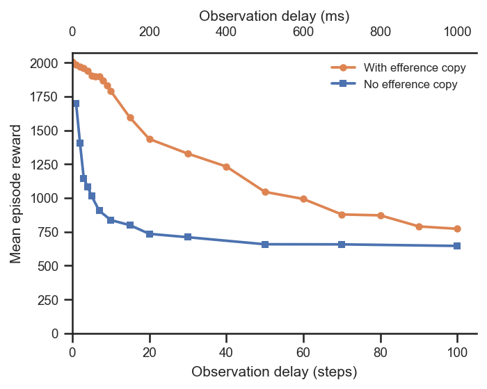

# Proprioceptive delay: efference copy vs none

## Question
When proprioceptive observations reach the policy with a delay, does giving the policy
an **efference copy** (a buffer of its own recent actions) mitigate the resulting loss
of control performance, compared with no efference copy at all?

## Dataset & comparability
- Source: WandB project `emiwar-team/nnx-ppo-rodent-delays`, tag `TrainEvalSplit`,
  env `AbsoluteImitation`.
- Conditions (one line each):
  - **efference** — `efference_length == delay_k` (n=22, delays 0–100).
  - **no_efference** — `efference_length == 0`, `delay_k > 0` (n=13, delays 1–100).
    `delay_k == 0` is excluded as it is identical to the efference baseline.
- Comparability: **fully comparable.** All runs are git
  `1cd5838f`, env `AbsoluteImitation`, `latent_size=32`, `kl_weight=0.001`,
  `body_target_frame=reference_root`, standard architecture
  (enc/dec `[512]×4`, critic `[1024,1024]`), `n_envs=4096`, `total_steps=600M`, and all
  reached the same actual step count `600,064,000`. Every invariant is single-valued
  within and across conditions — see [comparability.txt](comparability.txt).
- Caveats:
  - The project also contains later (`5464376`) **"Larger decoder"** (`dec=[1024]×4`) and
    **"Deeper decoder"** (`dec=[512]×8`) efference runs. They share the `TrainEvalSplit`
    tag and `efference_length == delay_k`, so a tag-only filter would wrongly pull them
    in; `extract.py` excludes them by requiring the standard architecture. They belong to
    a separate decoder-size question.
  - For each delay we keep the highest-reward run (`plot.py` dedups by `delay_k`).

## Figures

## Tentative conclusion
The efference copy helps substantially and consistently. Without it, performance collapses
almost immediately — within ~5 steps (50 ms) reward has already dropped to roughly half the
zero-delay level and it keeps falling. With the efference copy the decline is far more
gradual, staying well above the no-efference curve at every delay and retaining usable
performance out to 100 steps (1 s). This is consistent with the policy using its own action
history to compensate for stale proprioception.
