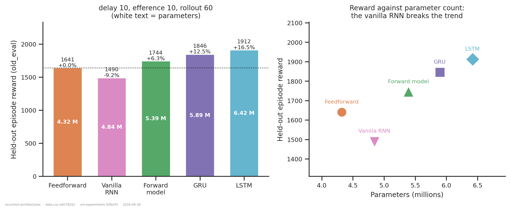
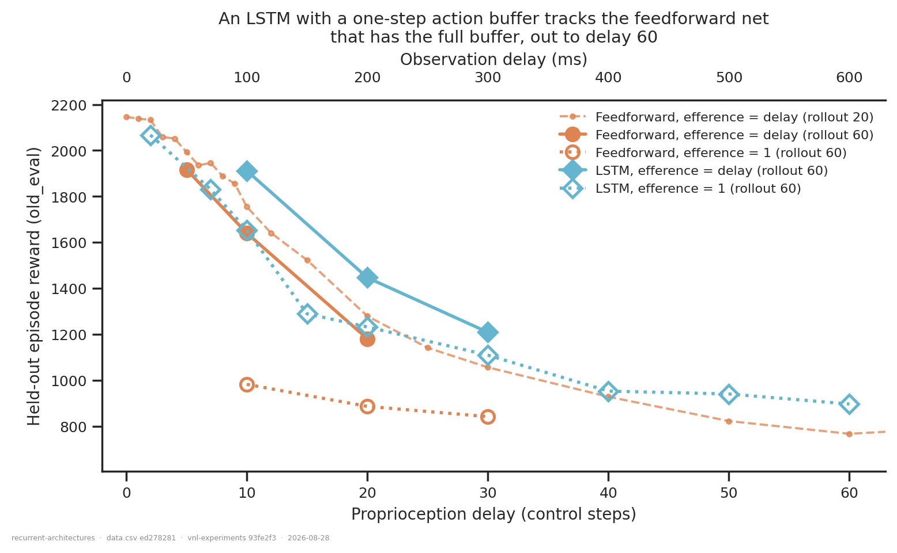
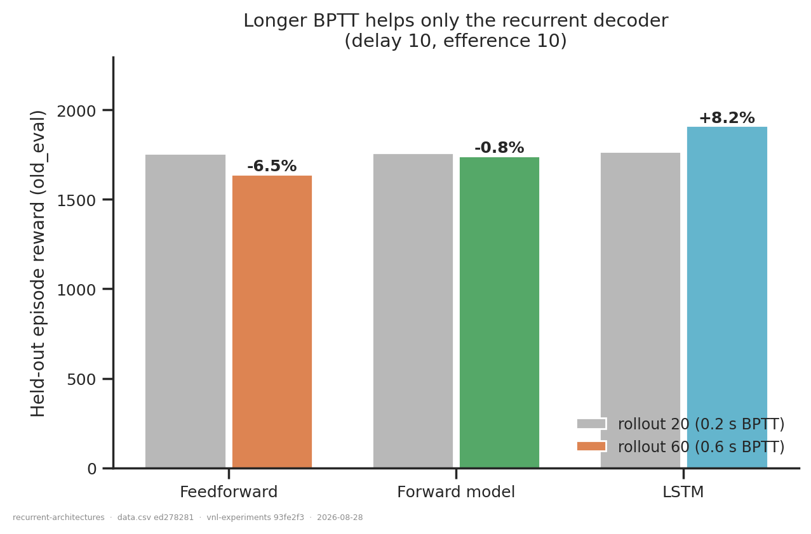

# Recurrent decoders: architecture, delay tolerance, action buffer, BPTT horizon

## Question

Five questions on one cohort: is a recurrent decoder better than feedforward (with or
without an explicit forward model) *given its extra parameters*; how much delay it
tolerates; whether a longer BPTT horizon helps everyone; whether it can run on a one-step
action buffer and compensate internally, and out to what delay; and whether the cell type
matters.

## Dataset & comparability

One cohort: **4096 envs, seed 42, new XML, `reference_root`, full decoder inputs,
regularisation intact, ≥590 M steps.** 56 runs.

| condition | n | delays covered | params |
|---|---|---|---|
| `feedforward` | 33 | 0–100 | 4.13–4.51 M |
| `forward_model` (canonical: `fm_loss_weight = 1`, detached) | 2 | 10 | 5.39 M |
| `lstm` | 17 | 0–60 | 6.24–6.81 M |
| `gru` | 1 | 10 | 5.89 M |
| `rnn` | 3 | 5, 10, 20 | 4.67–4.84 M |

**Comparability: no invariant varies** — `env`, `n_envs`, `seed`, `total_steps`,
`learning_rate`, `n_minibatches`, `latent_size`, encoder and critic sizes,
`body_target_frame`, `ctrl_dt`, `walker_xml_path`
([comparability.txt](comparability.txt)). `delay_k`, `efference_length` and
`rollout_length` are the axes and are carried as columns.

**Requeued jobs are handled, not hoped about.** The cluster terminated and requeued most
of these, leaving a `crashed` partial and a `finished` twin per config. `MIN_STEPS`
(590 M) drops every partial, and `extract.py` then *asserts* that no experimental cell
contains two runs from the same commit — so a partial that slipped through would fail
loudly rather than be averaged silently. The only surviving multi-run cells are the
feedforward delay-0 and delay-5 pairs, which are genuine cross-epoch replicates
(pre-refactor and post-fix, shown to agree to +0.06 % in
[`refactor-regression`](../refactor-regression/report.md)); `plot.py` averages them.

**Older forward-model runs are excluded.** They predate `fm_loss_weight` /
`detach_prediction` and span 1130–1998 reward at delay 10 across variants; only the two
canonical runs are used.

**Preliminary.** `metric_source` records artifact vs inline `final_eval` (+0.35 % ± 1.53 %
calibration). **Every cell is n = 1**, against a replicate spread of ~2 % at delay 0 rising
to ~8.5 % at delay 10 — differences below that are not resolved.

## Figures

Architecture at the one cell every arm shares, with parameter counts on the bars and the
reward-vs-parameters view beside it.

Delay tolerance, and whether a one-step action buffer suffices.

BPTT horizon at delay 10.

## Conclusions

**1. Recurrent beats feedforward and the explicit forward model — but the ranking tracks
parameter count, so this is not yet settled.** At delay 10, efference 10, rollout 60:

| architecture | reward | vs feedforward | params |
|---|---|---|---|
| Vanilla RNN | 1490 | −9.2 % | 4.84 M |
| Feedforward | 1641 | — | 4.32 M |
| Explicit forward model | 1744 | +6.3 % | 5.39 M |
| GRU | 1846 | +12.5 % | 5.89 M |
| LSTM | 1912 | +16.5 % | 6.42 M |

Reward rises monotonically with parameters across four of the five arms, which is exactly
the confound the question anticipates. **The vanilla RNN is the one point that breaks it**:
it carries 12 % *more* parameters than the feedforward net and scores 9.2 % *less*. So
capacity alone cannot be the whole story — but with four points on the trend line and one
off it, a parameter-matched feedforward control is required before claiming the LSTM's
+16.5 % is architectural. That control is the top follow-up.

**2. Delay tolerance degrades gracefully to at least 60 steps (0.6 s).** The LSTM with a
one-step buffer runs 2167 → 2067 → 1831 → 1654 → 1290 → 1233 → 1110 → 954 → 941 → 897
across delays 0, 2, 7, 10, 15, 20, 30, 40, 50, 60. There is no cliff and no failure point
inside the tested range; the curve is still falling smoothly at 60.

**3. A longer BPTT horizon helps only the recurrent decoder.** Rollout 20 → 60 at delay 10:
LSTM **+8.2 %**, forward model **−0.8 %**, feedforward **−6.5 %**. So this is not a generic
PPO improvement that happened to favour the LSTM — it is specific to having a hidden state
to propagate gradients through, and it mildly *hurts* the feedforward net. That also makes
conclusion 1 conservative: the feedforward arm is measured at the rollout length that
suits it *worse*, yet the comparison is run at rollout 60 for all arms.

**4. Yes — a recurrent net can run on a one-step buffer, across the whole tested range.**
Truncating the buffer from `delay` to 1 costs the LSTM **−13.5 %** at delay 10, **−14.8 %**
at 20 and **−8.2 %** at 30. The same truncation costs the feedforward net **−40.1 %** at
delay 10 and **−24.9 %** at 20. Put in absolute terms, the LSTM with a *one-step* buffer
matches the feedforward net holding the *full* buffer at delay 10 (1654 vs 1641), beats it
at delay 20 (1233 vs 1181), and pulls further ahead at 40/50/60 (954/941/897 against
929/823/768). The penalty does not grow with delay — if anything it shrinks, because all
arms converge as the task gets hard. **Caveat:** the feedforward long-delay reference
(delays 40–60) is at rollout 20, since no rollout-60 feedforward runs exist past delay 30.
Given conclusion 3 that is conservative — feedforward does worse at rollout 60 — but it is
a real gap in the comparison.

**5. Gating matters; LSTM vs GRU does not.** The ungated vanilla RNN is the worst arm
tested, below even the feedforward baseline despite more parameters. The LSTM leads the GRU
by 3.5 % (1912 vs 1846), which is inside replicate spread — treat them as equivalent, and
note the GRU gets there with 8 % fewer parameters (5.89 vs 6.42 M). On current evidence the
GRU is the better default, but it rests on a single run.

## Key runs to add

Ordered by how much they change what can be claimed.

1. **Parameter-matched feedforward at delay 10, eff 10, rollout 60** (~6.4 M — e.g.
   `dec_hidden_sizes = [1024]×4`). Without it, conclusion 1 has a live alternative
   explanation. Single most load-bearing run in this list.
2. **GRU `eff 1` delay sweep** (10, 20, 30, 40). The GRU is statistically tied with the
   LSTM at 8 % fewer parameters and has exactly one data point supporting that.
3. **Feedforward `eff = delay` at rollout 60 for delays 30–60**, removing the rollout
   confound from the long-delay half of conclusion 4.
4. **Seeds 43 and 44 on the delay-10 / eff-10 / rollout-60 cell** for feedforward, LSTM and
   GRU. Everything here is n = 1 and the LSTM–GRU gap is inside replicate spread.
5. **Forward model with `eff 1`** at delays 10 and 20 — does the explicit predictor also
   survive buffer truncation, or is that specific to a learned hidden state? Directly
   comparable to conclusion 4 and currently untested.
6. **Vanilla RNN at `eff 1`, delays 10 and 30**, to confirm the ungated result is general
   rather than specific to the `eff 10` cell.
7. **LSTM `eff 1` at delay 5**, filling the visible gap between delays 2 and 7.
