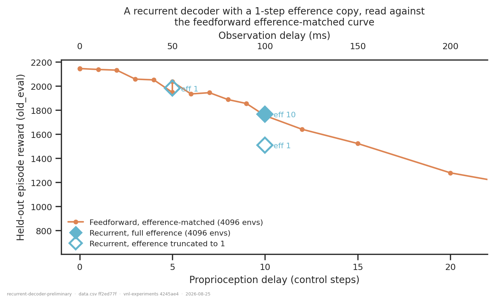

# Preliminary: does a recurrent decoder help under proprioception delay?

## Question

Replace the enc-dec network's feedforward decoder with
`pre-MLP → LSTM(512) → post-MLP → sampler` (`RodentEncDecRecurrent`), leaving the
encoder, the variational bottleneck, the delayed proprioception branch, the efference
queue and the privileged critic untouched. Three sub-questions:

1. **Does recurrence help?**
2. **Does it tolerate a shorter efference copy?** The queue is an *explicit* memory of
   recent actions; a recurrent decoder could in principle reconstruct it.
3. **Is any difference just the extra parameters?**

## Dataset & comparability

35 runs, all `AbsoluteImitation`, `reference_root`, new XML, full decoder inputs, ≥590 M
steps, regularisation intact (`pipeline.regularized_training_mask`).

| condition | n | n_envs | params |
|---|---|---|---|
| `feedforward` (`RodentEncDecDelays`) | 28 | 4096 (25), 1024 (3) | 4.13–4.32 M |
| `recurrent` (`RodentEncDecRecurrent`, LSTM 512) | 7 | 4096 (3), 1024 (4) | 6.22–6.42 M |

Every network and PPO invariant is single-valued within and across conditions — `env`,
`total_steps`, `rollout_length`, `learning_rate`, `n_minibatches`, `latent_size`, encoder
and critic sizes, `body_target_frame`, `ctrl_dt`, `walker_xml_path`
([comparability.txt](comparability.txt)). `dec_hidden_sizes` is absent by construction:
the recurrent decoder replaces it, so it is the axis, not an invariant.

**Preliminary — four liberties, all recorded per row:**

- **Feedforward references pool two code epochs** (pre-refactor `ef060b7` and post-fix
  `a3450a9`). Justified by measurement rather than assumption:
  [`refactor-regression`](../refactor-regression/report.md) shows the epochs agree to
  **+0.06 %** at the fully matched point. The two *unregularized* commits are excluded.
- **`n_envs` and `seed` both vary** (1024/4096; seeds 42/43/52). Neither is a condition.
  Conclusions are drawn only inside a matched cell, listed explicitly below.
- **Mixed metric source** (`metric_source`): offline artifact where present, else the
  inline `final_eval`. Calibrated at +0.35 % ± 1.53 % on `old_eval` over 10 runs with both.
- **n = 1 per cell.** Everything here is a single run. The replicate spread measured for
  this architecture in [`forward-model-vs-encdec-seeds`](../forward-model-vs-encdec-seeds/report.md)
  is ~2 % at delay 0 and ~8.5 % at delay 10 — differences below that are not resolved.

Old-XML reduced-efference runs (`no_efference` / `efference_trunc` in
[`action-buffer-length`](../action-buffer-length/report.md)) were **not** pooled in: they
were trained on `rodent.xml`, and spanning two bodies is the walker-XML trap, not a
liberty. That is why only one feedforward short-efference run exists here.

## Figures

The four cells where a feedforward and a recurrent run share delay, efference, `n_envs`
and seed.

The recurrent runs at 4096 envs read against the feedforward efference-matched delay
curve. Hollow markers are the truncated (`eff 1`) efference copy.

## Conclusions

**1. Recurrence does not help — it ties at best.** Across the four matched cells the LSTM
scores +0.5 %, −4.9 %, −9.1 % and +0.7 %. The two ties are the cells with the most
favourable conditions (delay 0, and delay 10 at 4096 envs); the two losses are both at
1024 envs. Nothing here is outside the ~2–8.5 % replicate spread, so the honest reading is
**no detectable benefit**, not a deficit — but there is certainly no win to report.

**2. It substitutes for the efference copy at delay 5, but not at delay 10.** At 4096
envs, the recurrent decoder with a **1-step** efference queue scores **1984** at delay 5,
against **1949 / 2038** for the two feedforward runs with the **full 5-step** queue — i.e.
squarely on the feedforward curve. That is the one genuinely encouraging result: at delay
5 the LSTM's hidden state fully replaces four steps of explicit action memory. At delay
10 the substitution breaks down: **1511** with `eff 1` against **1755** feedforward with
`eff 10`, a 13.9 % shortfall that places it near where the feedforward net sits at *delay
15*. So recurrence buys roughly 5 steps of delay tolerance and no more.

The 1024-env pair points the same way but is confounded (the `eff 10` runs are seed 52,
the `eff 1` runs seed 43): feedforward falls 1424 → 749 (−47 %) and recurrent 1354 → 681
(−50 %) — neither tolerates truncation at that batch size.

**3. The parameter question is open but not urgent.** The LSTM carries **6.24 M** against
**4.32 M** parameters, +45 %, and no parameter-matched feedforward control exists in this
cohort. That control matters when the richer model is *ahead* and you need to know why;
here it ties or loses, so the extra capacity is already failing to pay for itself. A
matched control would only sharpen an already-negative result.

**4. Batch size interacts with delay, and this is the most actionable finding.** At delay
0 the 1024-vs-4096 gap is ~3 %; at delay 10 it is **−18.9 %** (feedforward, 1424 vs 1755)
and **−23.4 %** (recurrent, 1354 vs 1767). 1024 envs is adequate for the easy end of the
delay sweep and clearly not for the hard end — and it penalises the recurrent net slightly
more, which is plausible given BPTT gradients over a smaller minibatch.

## Follow-ups

1. **The missing control: feedforward, delay 10, `eff 1`, 4096 envs, seed 42.** One run
   turns conclusion 2 from "reads against a curve" into a matched pair, and it is the
   single highest-value run in this list.
2. **Raise `rollout_length`.** Every run here used 20, i.e. 0.2 s of BPTT at
   `ctrl_dt = 0.01`. A memory that only sees 0.2 s cannot be expected to replace a 10-step
   (0.1 s) queue *and* integrate a 10-step delay. Try 40 before concluding recurrence
   does not help.
3. **Seeds.** Every cell is n = 1 against a replicate spread of up to 8.5 % at delay 10.
   Two more seeds on the delay-10 matched pair at 4096.
4. **Longer delays.** Recurrence buys ~5 steps of tolerance at delay 5–10; the interesting
   regime for a memory is 20–50, which is untested here.
5. **GRU / vanilla RNN.** Both are registered and untested. The vanilla RNN in particular
   would say whether gating matters or the hidden state alone is the active ingredient.
