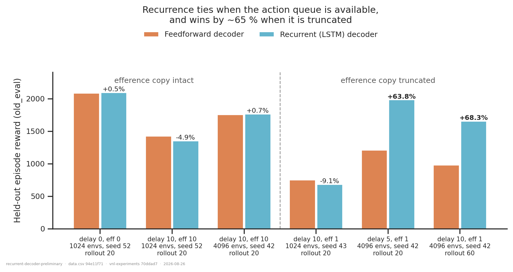
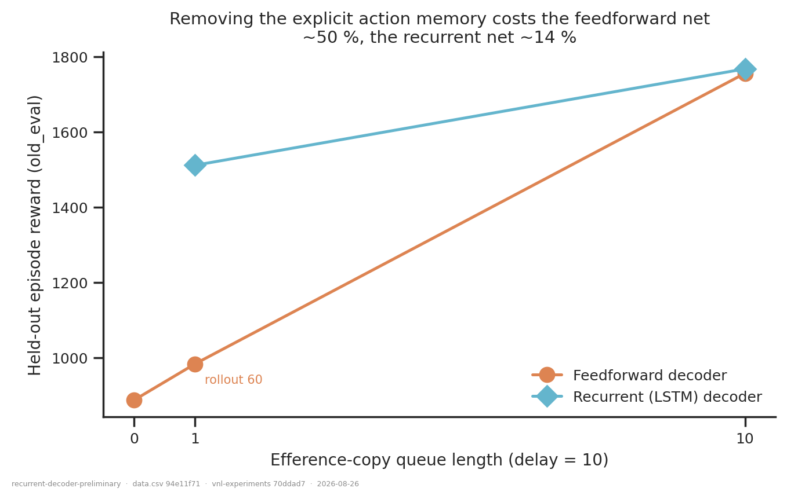
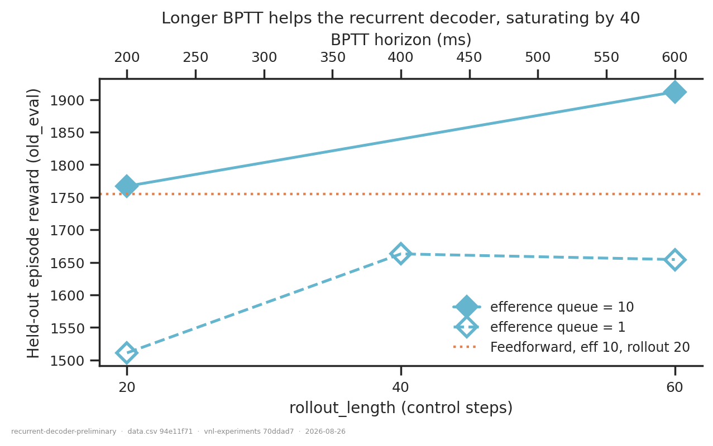

# Preliminary: does a recurrent decoder help under proprioception delay?

## Question

Replace the enc-dec network's feedforward decoder with
`pre-MLP → LSTM(512) → post-MLP → sampler` (`RodentEncDecRecurrent`), leaving the
encoder, the variational bottleneck, the delayed proprioception branch, the efference
queue and the privileged critic untouched. Three sub-questions:

1. **Does recurrence help?**
2. **Does it tolerate a shorter efference copy?** The queue is an *explicit* memory of
   recent actions; a recurrent decoder could in principle reconstruct it from its hidden
   state.
3. **Is any difference just the extra parameters?**

## Dataset & comparability

41 runs, all `AbsoluteImitation`, `reference_root`, new XML, full decoder inputs, ≥590 M
steps, regularisation intact (`pipeline.regularized_training_mask`).

| condition | n | n_envs | rollout_length | params |
|---|---|---|---|---|
| `feedforward` (`RodentEncDecDelays`) | 31 | 4096 (28), 1024 (3) | 20, 60 | 4.13–6.07 M |
| `recurrent` (`RodentEncDecRecurrent`, LSTM 512) | 10 | 4096 (5), 1024 (4) | 20, 40, 60 | 6.22–6.42 M |

**Comparability: no invariant varies.** `env`, `total_steps`, `learning_rate`,
`n_minibatches`, `latent_size`, encoder and critic sizes, `body_target_frame`, `ctrl_dt`
and `walker_xml_path` are single-valued within and across conditions
([comparability.txt](comparability.txt)). `dec_hidden_sizes` is absent by construction —
the recurrent decoder replaces it. `n_envs`, `seed` and (since 2026-08-25)
`rollout_length` are experimental axes carried as data columns, and every comparison
below is read inside a cell matched on **all three**.

**Preliminary — four liberties, all recorded per row:**

- **Feedforward references pool two code epochs** (pre-refactor `ef060b7` and post-fix
  `a3450a9`/`4245ae4`). Justified by measurement:
  [`refactor-regression`](../refactor-regression/report.md) shows the epochs agree to
  **+0.06 %** at the fully matched point. The two *unregularized* commits are excluded.
- **Mixed metric source** (`metric_source`): offline artifact where present, else the
  inline `final_eval`. Calibrated at +0.35 % ± 1.53 % on `old_eval` over 10 runs with both.
- **n = 1 per cell.** Replicate spread for this architecture is ~2 % at delay 0 and ~8.5 %
  at delay 10 ([`forward-model-vs-encdec-seeds`](../forward-model-vs-encdec-seeds/report.md));
  differences below that are not resolved. The two headline effects are ~65 %.
- **The delay-10 truncated pair is at `rollout_length = 60`**, not 20, because the
  `rollout 20` feedforward counterpart (`i6g61lxy`) crashed. Both members of the pair share
  it, so the pair is matched — but it is not the same cell as the delay-5 pair.

Old-XML reduced-efference runs (`no_efference` / `efference_trunc` in
[`action-buffer-length`](../action-buffer-length/report.md)) are **not** pooled in: they
were trained on `rodent.xml`, and spanning two bodies is the walker-XML trap.

## Figures

The six cells where a feedforward and a recurrent run share delay, efference, `n_envs`,
seed *and* `rollout_length`, split by whether the efference copy is intact.

How each architecture degrades as the explicit action memory is shortened, at delay 10.

BPTT horizon sweep for the recurrent decoder at delay 10.

## Conclusions

**1. Recurrence buys nothing when the efference copy is intact, and a great deal when it
is not.** This reverses the previous reading of this folder, which lacked the matched
short-efference controls. With the full queue the LSTM ties: **+0.5 %** (delay 0),
**+0.7 %** (delay 10, 4096) and **−4.9 %** (delay 10, 1024) — all inside replicate spread.
With the queue truncated to one step it wins decisively:

| cell (4096 envs, seed 42) | feedforward | recurrent | Δ |
|---|---|---|---|
| delay 5, eff 1, rollout 20 | 1211.0 | **1983.6** | **+63.8 %** |
| delay 10, eff 1, rollout 60 | 983.0 | **1654.3** | **+68.3 %** |

**2. The recurrent decoder substitutes for the explicit action memory almost completely.**
At delay 10 (4096 envs, seed 42) the feedforward net falls from **1755** with a 10-step
queue to **983** with one step and **886** with none — roughly **−50 %**. The recurrent
net falls from **1767** to **1511**, about **−14 %**. Put differently, the LSTM with a
*one-step* queue at delay 5 scores **1984**, matching the feedforward net with its *full
five-step* queue (1949 / 2038). This is the result the architecture was built to test, and
it is the one clear positive finding so far.

**3. The extra parameters are unlikely to be the explanation, but the control is now worth
running.** The LSTM carries 6.24 M against the feedforward net's 4.14 M at `eff 1`.
However, the feedforward net has essentially the *same* capacity at `eff 10` (4.32 M) and
scores 1755 — so the 983 result is not a capacity ceiling, it is missing information, and
capacity is not what the LSTM is supplying. That argument is suggestive, not conclusive.
Because the LSTM is now *ahead*, a parameter-matched feedforward control (a wider or
deeper decoder at `eff 1`) has become the obvious objection to pre-empt — the opposite of
the previous conclusion here, which was written when the LSTM was merely tying.

**4. Longer BPTT helps, and saturates by 40.** For the recurrent decoder at delay 10,
`rollout_length` 20 → 40 → 60 gives 1511 → 1663 → 1654 with `eff 1` (+10 % then flat) and
1767 → 1912 with `eff 10` (+8 %). So the earlier suspicion was right — 0.2 s of credit
assignment was limiting — but the gain is modest and the horizon is not the main story.
**Caveat:** there is no feedforward `rollout 60` control at `eff 10`, so the part of that
gain attributable to recurrence rather than to PPO generally is unmeasured.

**5. The advantage needs an adequate batch.** At 1024 envs the truncated-efference pair
goes the *other* way (**−9.1 %**, 749 vs 681): both architectures collapse and the LSTM
cannot exploit its memory. Combined with the delay interaction from before — the
1024-vs-4096 gap is ~3 % at delay 0 but ~19–23 % at delay 10 — 1024 envs is not a valid
setting for testing recurrence at all.

## Follow-ups

1. **Parameter-matched feedforward control at `eff 1`** — a wider/deeper decoder at
   ~6.2 M params, delay 5 and 10, 4096 envs, seed 42. This is now the single most
   load-bearing missing run.
2. **The crashed cell:** feedforward, delay 10, `eff 1`, 4096, `rollout 20` (`i6g61lxy`),
   which would put the delay-10 truncated pair in the same cell as the delay-5 one.
3. **A feedforward `rollout 60` control at `eff 10`**, to separate the BPTT gain from a
   generic PPO effect.
4. **Seeds** on the two headline cells — the effects are ~65 %, far above replicate
   spread, but n = 1 is still n = 1.
5. **Longer delays (20–50) with a truncated queue**, where the substitution should
   eventually break down; delay 10 already shows it is not perfect.
6. **GRU and vanilla RNN**, both registered and untested — the vanilla RNN would say
   whether gating matters or the hidden state alone is the active ingredient.
