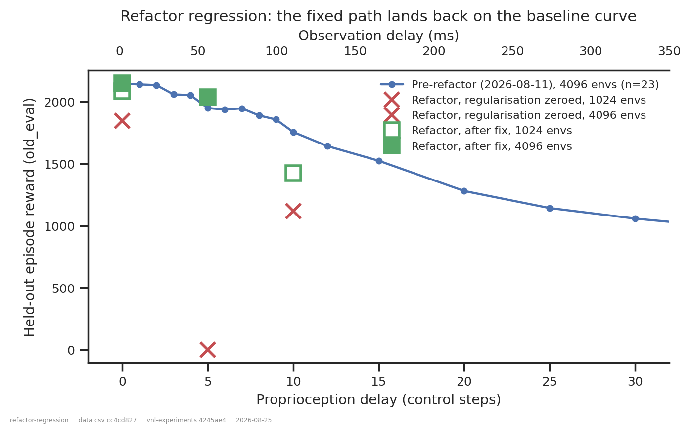
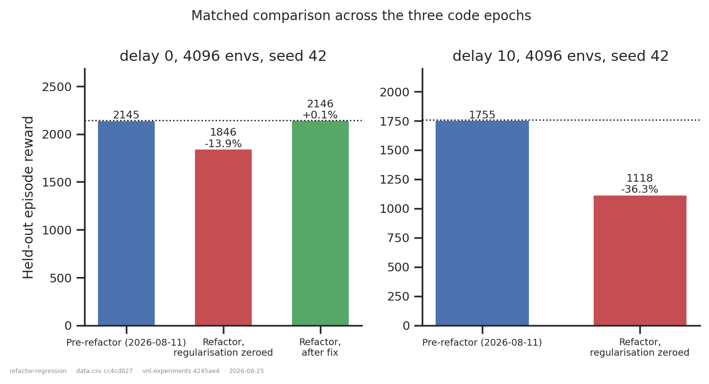

# Refactor regression: does the rewritten training path reproduce the baseline?

## Question

The 2026-08-21 registry refactor moved training onto the shared
`network_builders.build_network` path used by the offline eval. Two things need
separating:

1. **What the regularisation bug cost.** `_parse_net_params` ran `int(v)` on every value,
   and `int(0.01) == 0`, so `entropy_weight` (0.01), `kl_weight` (0.001), `min_std` (0.1)
   and `latent_min_std` (0.01) were all truncated to **0**. Training ran with no entropy
   bonus, no KL penalty and no policy-std floor.
2. **Whether the refactor is otherwise behaviour-neutral**, once that is fixed
   (`a3450a9`).

## Dataset & comparability

Three code epochs of the same architecture (plain feedforward enc-dec, efference-matched
`efference_length == delay_k`, full decoder inputs, new XML, `reference_root`, ≥590 M
steps trained).

| condition | commits | n | n_envs |
|---|---|---|---|
| `pre_refactor` | `ef060b7` | 23 | 4096 |
| `unregularized` | `62b52d9`, `232082e` | 3 | 4096 (2), 1024 (1) |
| `fixed` | `a3450a9` | 4 | 4096 (2), 1024 (2) |

**Comparability: comparable on every network and PPO invariant.** `env`, `total_steps`,
`rollout_length`, `learning_rate`, `n_minibatches`, `latent_size`, encoder/decoder sizes,
`body_target_frame`, `ctrl_dt` and `walker_xml_path` are single-valued within and across
conditions ([comparability.txt](comparability.txt)). `git_commit` is the axis, so it is
excluded from the invariants by design.

Three caveats, all preliminary-grade:

- **`config.seed` varies (42, 52)** — flagged `*** VARIES ***`. The two 1024-env `fixed`
  runs are seed 52; every 4096-env run is seed 42. So the 1024-vs-4096 contrast confounds
  batch size with seed and is read as indicative only. The headline claim uses seed 42 at
  4096 exclusively.
- **`n_envs` varies** by design; it is a data column, not a condition.
- **Mixed metric source**, recorded per row in `metric_source`. The `pre_refactor` cohort
  is `state = failed` (training completed; the end-of-training eval crashed), so it has
  offline `eval` artifacts and no inline summary; the new runs are the reverse, with no
  artifacts produced yet. The two paths were calibrated on 10 runs holding both:
  `old_eval` agrees to **+0.35 % ± 1.53 %**, an order of magnitude below the effects here.

All numbers are `old_eval` — the held-out 20 % split — because it is the one metric
measured identically across all three epochs. The in-training `eval/*` series is **not**
usable: before the refactor it scored the *train* split.

## Figures

The pre-refactor delay sweep as the reference curve, with the new runs as points on it.
Filled markers are 4096 envs, hollow are 1024. The fixed runs land on the curve; the
unregularized ones sit well below it.

The controlled comparison — same delay, same `n_envs`, same seed, three code epochs.

## Conclusions

**The refactor is behaviour-neutral once the parser bug is fixed.** At the fully matched
point (delay 0, 4096 envs, seed 42) the fixed path scores **2146.2** against the
pre-refactor **2145.0** — **+0.06 %**, far inside the ±1.53 % measurement calibration and
inside the ~2 % run-to-run spread measured for this architecture in
[`forward-model-vs-encdec-seeds`](../forward-model-vs-encdec-seeds/report.md). At delay 5
(4096, seed 42) the fixed path gives **2037.9** against **1948.7**, **+4.6 %** — above the
measurement noise but within the 6.5 % replicate spread that folder reports at delay 5.
Read as "no detectable regression", not as "an improvement".

**The bug was expensive and delay-dependent**: −13.9 % at delay 0 and −36.3 % at delay 10.
That gradient is what you would expect if the damage is lost exploration — the harder the
credit-assignment problem, the more the missing entropy bonus and std floor cost.

**Small-batch training is not inherently broken.** Yesterday's reading — that 512/1024-env
runs collapse — was confounded: every one of those runs also had the regularisation
zeroed. With the fix, 1024 envs at delay 0 reaches **2084.5** against 4096's **2146.2**,
about **−2.9 %** (and that gap also contains a seed change). The single collapsed run in
this cohort (`ul9wzzpl`, reward exactly 0, lifespan 2.9 steps) is `unregularized`. Batch
size is worth a real ablation now rather than an embargo.

## Follow-ups

1. **Seeds, not points.** Every cell here is n = 1. Two more seeds at delay 0 and 10,
   4096 envs, on `a3450a9`+, would convert "no detectable regression" into a bound.
2. **A `fixed` run at delay 10, 4096 envs, seed 42** is the one missing cell of the
   matched grid — the right-hand panel of figure 2 has no green bar.
3. **Produce `eval` artifacts for the new runs** and re-pin this folder to a single eval
   spec, removing the mixed-source caveat. This needs the producer `VERSION = 3` bump to
   be re-produced across both cohorts.
4. **Deliberate `n_envs` ablation** at fixed seed, now that the confound is gone.
