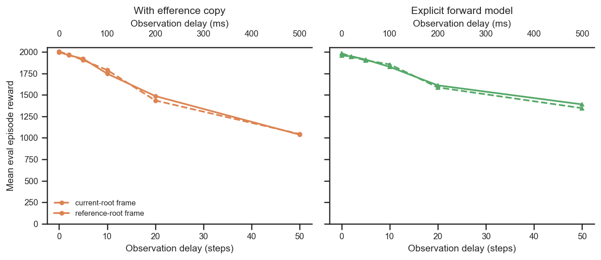
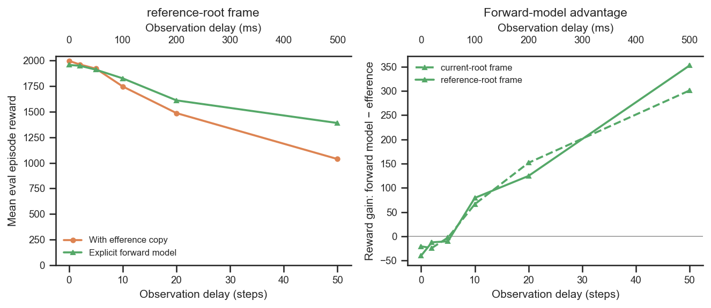

# Reference-root vs current-root imitation frame — and does the forward model still win?

## Question
`body_target_frame` selects the egocentric frame the absolute body target is expressed in:
`current_root` (the agent's *current* simulation-root frame) or `reference_root` (the
*reference* pose's root frame — the pure target-pose shape). **Every prior run in this project
actually used `current_root`** — the `reference_root` label had been set on the inert
`net_config` and never reached the environment (see the "body_target_frame bug" note in
[../README.md](../README.md)). After that was fixed, a new cohort was trained with the frame
genuinely set to `reference_root`. Two questions:

1. **Is `reference_root` better or worse than `current_root`?**
2. **Is an explicit forward model still advantageous under `reference_root`?**

## Dataset & comparability
A 2×2 (frame × network) design over an efference-matched delay sweep
(`efference_length == delay_k`), delays **{0, 2, 5, 10, 20, 50}**, seed 42, standard
architecture (enc `[512]×4`, dec `[512]×4`, critic `[1024,1024]`, `latent_size=32`,
`kl_weight=0.001`), all restored at `checkpoint_step = 600,064,000`, train clip 250 frames.

| condition | frame | network | commit |
|---|---|---|---|
| `reference_efference` | reference_root | efference EncDec | `909e774d` (new cohort) |
| `reference_forward_model` | reference_root | explicit FM (`fm_loss_weight=1`, detached) | `909e774d` (new cohort) |
| `current_efference` | current_root | efference EncDec | `1cd5838f` (canonical eff sweep) |
| `current_forward_model` | current_root | explicit FM (`fm_loss_weight=1`) | `54643764` (canonical FM sweep) |

- **Authoritative frame** is read from `env_params.body_target_frame` (not the inert
  `net_params` copy); network type from run **tags** (`ForwardModel`/`EncDec`). Selection and
  columns are in [extract.py](extract.py).
- **Metric.** `body_target_frame` changes only the *observation* handed to the policy, never
  the reward, so eval reward is directly comparable across frames. Reward is the end-of-training
  **eval-on-train-clips** episode reward (the training script sets `eval_env = train_env`). The
  "new logging api" renamed `episode_reward/mean` → `eval/episode_reward/mean` (same protocol);
  `extract.py` coalesces them. On matched conditions the two keys agree to ~1% (delay-0
  efference: 1998 vs 2006), confirming they measure the same thing.
- **Comparability: all invariants single-valued within every condition** (latent/kl/enc/dec/
  critic sizes, seed, clip_length, checkpoint step — see [comparability.txt](comparability.txt)).
  The experimental axes (`frame`, `network`, `delay_k`) and, by design, `git_commit` are the
  only things that vary.
- **The frame is confounded with the code commit** (reference runs at `909e774d`; current
  baselines at `1cd5838f`/`54643764`), so the training-relevant diffs were checked by hand and
  are **behaviourally inert for these configs**:
  - `efference_copy.py` (`1cd5838f`→`909e774d`): adds an `inject_key` argument, default `None`,
    which reproduces the original code path exactly; the efference baseline uses `None`.
  - `forward_model.py` (`54643764`→`909e774d`): adds `detach_prediction`, default `True`, which
    reproduces the original hardcoded `stop_gradient`; the canonical FM uses `True`. The rest is
    added logging.
  - Everything else in the diff is eval/analysis tooling (`eval_runs.py`, `eval_videos.py`),
    not used during training.
  So within each network the *only* training-relevant difference between the reference and
  current runs is the frame itself.
- **Caveats.** Single seed per cell (differences are indicative, not seed-significant). Reward
  is eval-on-train-clips only — these runs have **no offline batch eval yet** (no `new_eval`
  held-out / long-clip generalization, no termination-mode or hazard breakdown). The duplicate
  delay-0 `current_efference` run is collapsed by keeping the higher-reward row in `plot.py`.

## Figures
Q1 — within each network, the two frames essentially coincide across the whole delay sweep.

Q2 — under `reference_root`, the explicit forward model tracks the efference decoder at short
delay and pulls monotonically ahead from ~delay 10 (left). The forward-model *advantage*
(FM − efference) vs delay is essentially the **same curve for both frames** (right): a small
penalty at delay 0, crossing zero by ~delay 5–7, growing to +300–350 reward at delay 50.

## Tentative conclusions

**Q1 — `reference_root` is neither better nor worse than `current_root`.** Across the whole
sweep the two frames are within single-seed noise on eval reward:
- *Efference:* Δ(ref−cur) = −8 (delay 0), −43 (delay 10), −7 (delay 50) — |Δ| ≤ ~2.5%, no
  consistent sign.
- *Forward model:* Δ = −28 (delay 0), −29 (delay 10), +24 (delay 20), **+44 (delay 50)** — a
  hint that `reference_root` ages slightly better at long delay for the FM, but well within
  single-seed noise.

So switching to the principled `reference_root` representation (target pose independent of the
agent's current root pose) costs nothing on training-clip performance. This is consistent with,
and cleaner than, the earlier `imitation-target-representation` analysis, whose apparent
frame effect was shown to be a mislabelling artefact (both its conditions were in fact
`current_root`).

**Q2 — yes, the explicit forward model is still advantageous under `reference_root`, with the
same delay-dependent profile as under `current_root`.** FM − efference:
- *reference_root:* −40 (0), −10 (5), **+79 (10), +125 (20), +352 (50)**.
- *current_root:* −21 (0), −2 (5), +66 (10), +152 (20), +301 (50).

The crossover (~delay 5–7) and the magnitude of the long-delay gain are essentially frame-
independent — the forward-model benefit is a property of the delay/prediction problem, not of
the target representation. The FM's prediction error grows smoothly with delay
(`fm_pred_mse` ≈ 0.0002 → 0.010 → 0.024 → 0.065 at delays 0/2/10/50 under `reference_root`),
as expected when predicting further ahead.

**Bottom line.** Adopting `reference_root` as the standard frame is safe (no performance cost),
and the explicit forward model remains the right choice at longer delays regardless of frame.

### Follow-ups
- **Offline batch eval** (`eval_runs.py`) on these 12 runs to add `old_eval`/`new_eval`
  generalization, termination modes and hazard — the training-clip reward here can't speak to
  long-clip robustness (the axis on which the previous frame comparison went wrong).
- **Multiple seeds** per cell to turn the indicative long-delay `reference_root` FM edge
  (+44 @ delay 50) into a real signal or noise.
- Extend the delay sweep beyond 50 (to 100) to match the full canonical FM curve.
