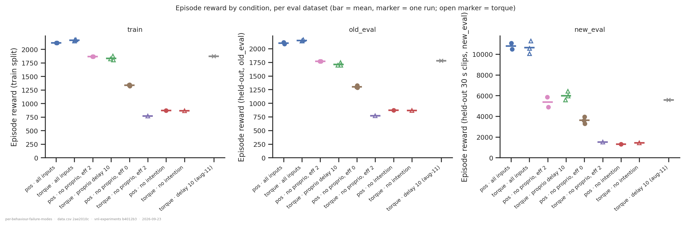
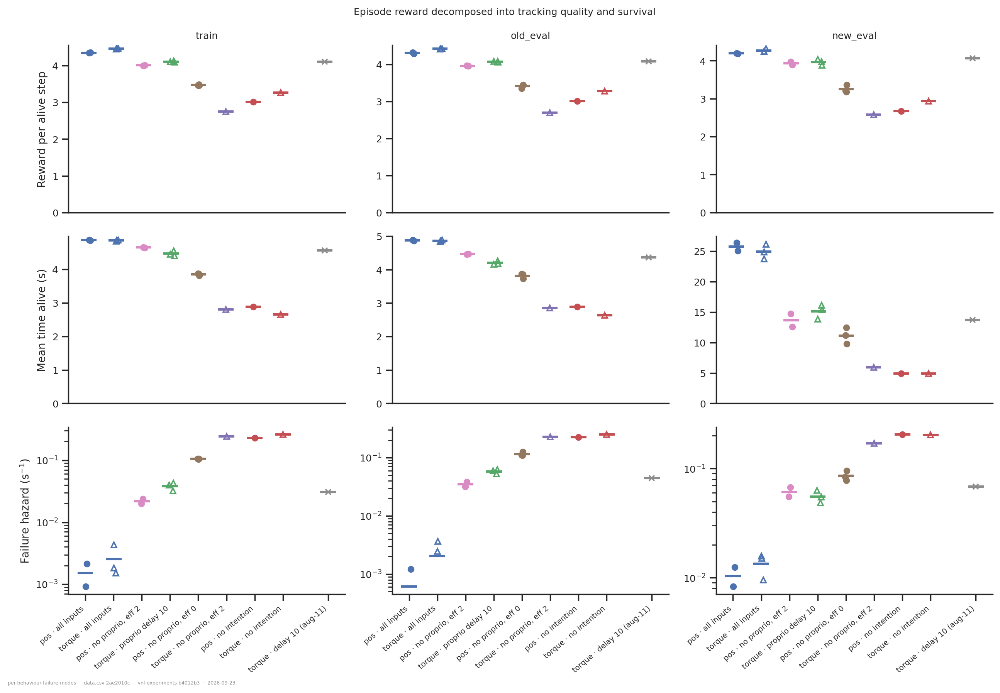
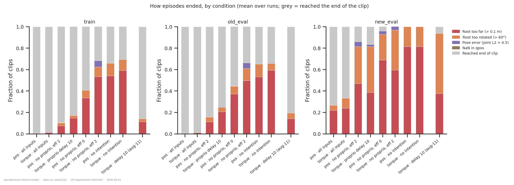
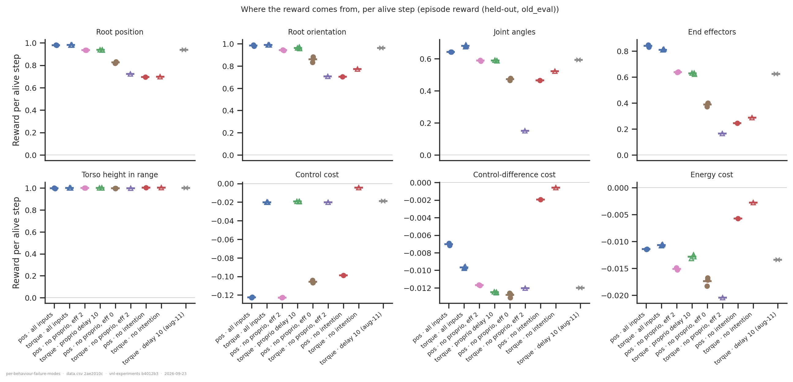
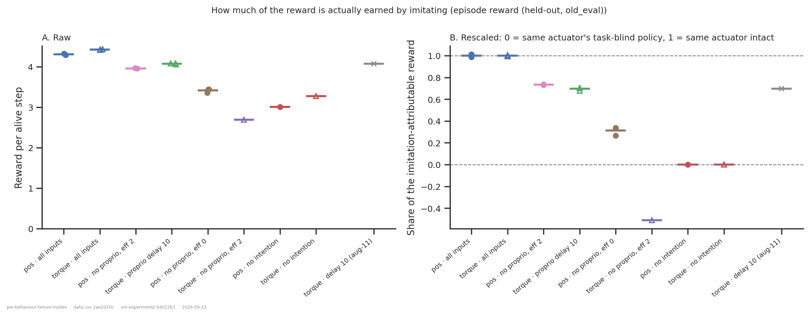
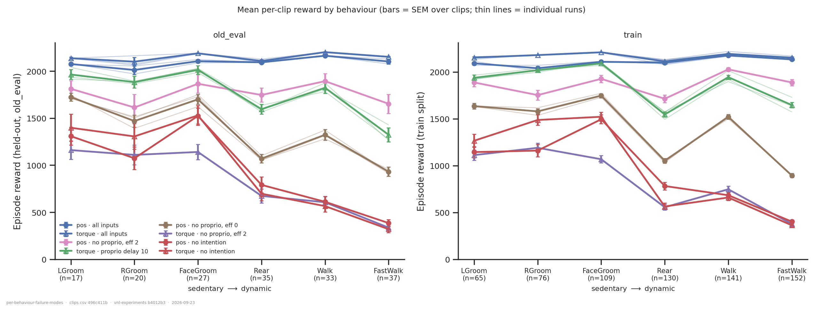
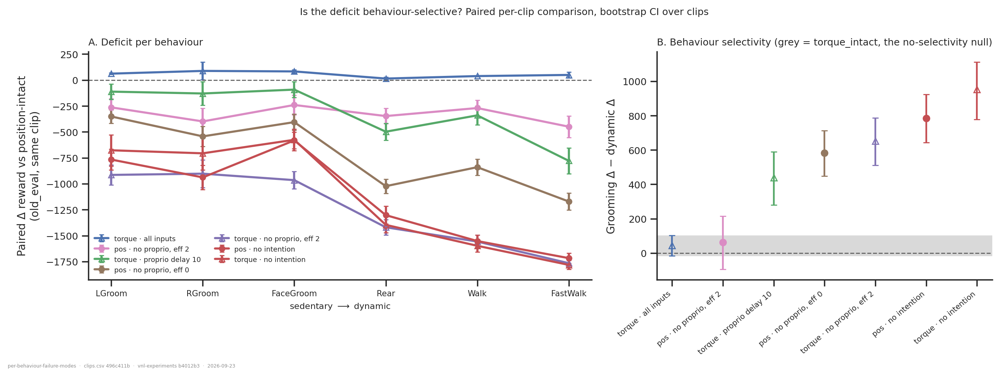
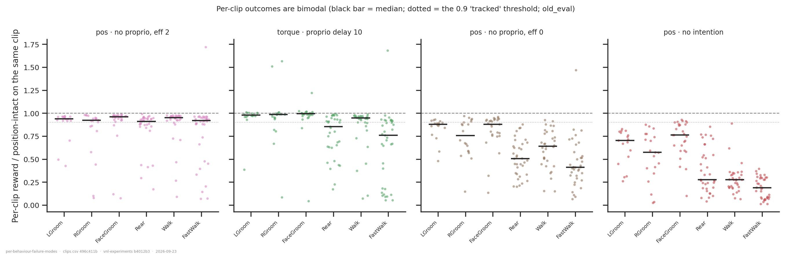
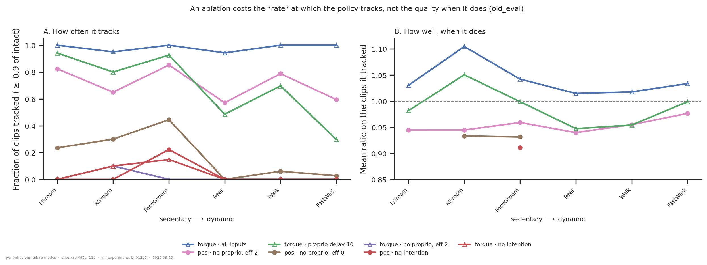
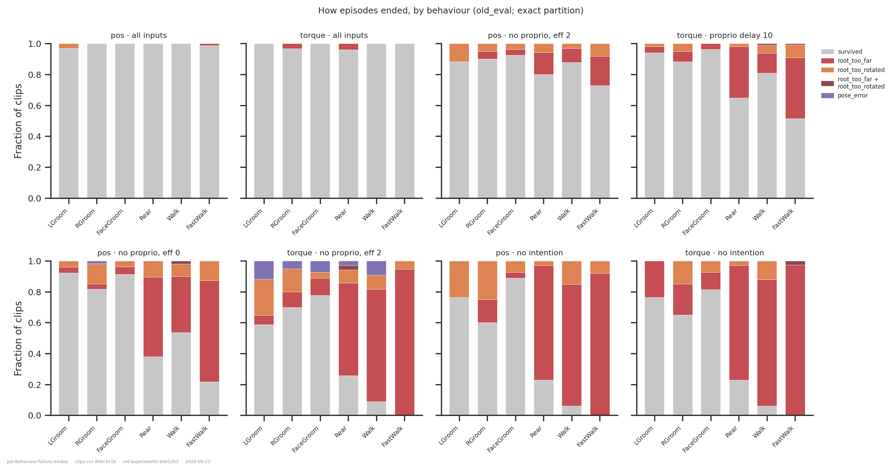

# Which behaviours does position-control-without-proprioception actually fail at?

> **Status: Stages A and B complete (16 of 17 runs), Stage C outstanding.** The
> per-behaviour question the folder was built for is **answered, and the answer inverts
> the hypothesis** — see [the conclusion](#conclusion). Stage C (per-frame behaviour on
> the 30 s clips, and what the animal was doing at the instant of failure) needs one more
> cluster job; [Stage C](#stage-c-what-is-still-missing) has the command. One run of the
> subject condition (`7w26do00`) failed to produce, so that cell is n = 1 — caveat 1 says
> what that costs.

## Question

[`../efference-copy-vs-proprioception/`](../efference-copy-vs-proprioception/) reports that
with the decoder's proprioception stream ablated, a **position**-actuated policy with a
2-step efference copy reaches 88 % of the proprioception-intact baseline on held-out 5 s
clips, while the torque arm reaches 33 %. Taken at face value that puts the
encoder–decoder premise in doubt: if handing intentions straight to local joint servos
nearly works, the decoder may not be doing much.

A cross-clip mean is the wrong statistic to settle that on, because the clip set is
behaviourally heterogeneous. Three decompositions of the same runs:

1. **By reward term and termination reason.** Is the deficit a tracking deficit or a
   falling-over deficit, and which of the ten reward terms carries it? *(Stage A.)*
2. **By behaviour.** Is the ablated position policy at the intact ceiling on sedentary
   behaviour and far below it on locomotion and rearing, so that 88 % is a mixture of
   ~100 % and ~70 % rather than a uniform 88 %? *(Stage B — **no**, and every comparison
   condition behaves that way instead.)*
3. **At the moment of failure.** What was the reference animal doing when the episode
   ended — which is not the same question as which clips scored badly. *(Stage C,
   outstanding.)*

### The interpretation rule, fixed before the numbers were looked at

`pos_nointent` and `torque_nointent` are in the cohort for a reason. They have
proprioception but no imitation target, so they bound the reward available for merely
standing around in a plausible pose. **If a task-blind policy also scores near the intact
ceiling on the sedentary bins, then "near-ceiling on sedentary behaviour" is a fact about
the reward function and not about the policy.** That rule is recorded in
[`extract.py`](extract.py)'s docstring and was committed before Stage A ran. It turned out
to matter more than expected — see the conclusion.

## Dataset & comparability

- **Source:** WandB `emiwar-team/nnx-ppo-rodent-delays`, selected by the `CONDITIONS` in
  [`extract.py`](extract.py) and frozen in [`runs.csv`](runs.csv). **17 runs, 9 conditions,
  all usable** — every run has all three datasets.
- **Metric.** The inline end-of-training eval (`summary.final_eval/<dataset>/*`), which
  carries per-reason `termination_rate`, all ten `reward_terms` and six `errors` for
  `train` / `old_eval` / `new_eval`. One run (`vo7jiiwr`) died in that eval and is read
  from its pinned `eval:eval3ds-382e9e69` artifact instead; its `reward_source` column says
  so and it is excluded from every primary claim.
- **Conditions.** All `AbsoluteImitation`, `rodent_no_tail_collisions.xml`,
  `body_target_frame=reference_root`, `RodentEncDecDelays` (enc/dec `[512]×4`, critic
  `[1024,1024]`), `latent_size=32`, `kl_weight=0.001`, `seed=42`, all twelve PPO
  hyperparameters matched, all trained to 600 M steps.

  | condition | n | decoder inputs | role |
  |---|---|---|---|
  | `pos_noproprio_eff2` | 2 | intention + efference 2 | **the subject** |
  | `pos_intact` | 2 | all three | position ceiling |
  | `torque_intact` | 3 | all three | torque ceiling |
  | `torque_delay10` | 3 | all three, proprioception delayed 10 | **reward-matched control** |
  | `pos_noproprio_eff0` | 3 | intention only | ablation floor |
  | `torque_noproprio_eff2` | 1 | intention + efference 2 | same ablation, other actuator |
  | `pos_nointent` | 1 | proprioception + efference | task-blind floor |
  | `torque_nointent` | 1 | proprioception + efference | task-blind floor |
  | `torque_delay10_aug11` | 1 | all three, delayed 10 | cross-check only |

- **The reward-matched control is well matched.** `torque_delay10` scores 1712 on
  `old_eval` against the subject's 1768 (−3.2 %), and the 2026-08-11 cross-check run 1778
  (+0.5 %). So "same mean reward, different mechanism" is a measured premise, not an
  assumption.

- **Stage B data.** [`clips.csv`](clips.csv) — one row per (run, dataset, clip), 13 984
  rows — and [`behaviour.csv`](behaviour.csv), aggregated per behaviour and per coarse
  group. Both from `eval` artifacts at the pinned per-clip spec `eval3ds-pc-fac96053`
  (produced on the cluster 2026-09-23; 16/17 runs, see caveat 1).

- **Programmatic comparability:** [`comparability.txt`](comparability.txt). Every
  `env_params` entry, every network size and regularisation setting, all twelve PPO
  hyperparameters, `total_steps` and `summary._step` are single-valued across all 17 runs.
  Four environment invariants vary, all expected and none experimental: `git_commit` (six
  values), `gpu` (five models), `cuda_version` and `os` (a cluster upgrade), and
  `repos.nnx_ppo.commit` (two values).

- **Two checks that are not ceremony.**
  - *The reward terms reconstruct the total.* The env's reward is the plain sum of its
    configured terms, so the ten `reward_terms` must add to `episode_reward` per run and
    dataset. They do, to a **4.1 × 10⁻⁷** maximum relative residual over **48/48** rows.
    This is what says the decomposition below is complete rather than missing a term. An
    earlier version of this check reported "48 rows" while silently validating three,
    because the inline summary elides the `/mean` leaf for `reward_terms` and `errors`
    where the artifact keeps it; the coverage count in the verdict line exists because of
    that.
  - *The clip axis is identical across runs.* `_pairable` in [`extract.py`](extract.py)
    gates on `reference_data_path`, `clip_length == 250` and a null `keep_clips_idx`,
    because `ReferenceClips.split()` is `RandomState(0).permutation` over those — if any
    differed, clip *i* would be a different clip for different runs and every paired
    figure in Stage B would be silently wrong. All 17 runs match, and with the artifacts
    in hand it is also asserted on the data: all 16 share one clip/label sequence on each
    of the three datasets, and each artifact's own stamped `clip_names` equals the
    committed labels.
  - *The per-clip artifacts agree with the independent inline numbers.* Two bounds,
    because the reward mean alone cannot separate "measured something else" from "one long
    clip fell over this time":

    | dataset | clips | reward agreement (worst / median) | survival agreement |
    |---|---|---|---|
    | `train` | 673 | 0.90 % / 0.12 % | ≤ 10 clips of 673 |
    | `old_eval` | 169 | 1.53 % / 0.25 % | ≤ 6 clips of 169 |
    | `new_eval` | 32 | **15.2 %** / 3.1 % | ≤ 3 clips of 32 |

    The `new_eval` column is not a different kind of error, it is the same error with a
    21× smaller denominator: a surviving 30 s clip banks ~12 000 reward against a few
    hundred for an early death, so **one clip of 32 flipping moves the mean ~10 %**. The
    three cells beyond 8 % differ by 1, 1 and 3 clips of survival, and reward delta
    correlates 0.70 with survival delta. This is why `new_eval` is read for trend only.

### Caveats

1. **The subject condition is n = 1 for Stage B.** `7w26do00` failed to produce its
   per-clip artifact, so every per-behaviour number for `pos_noproprio_eff2` comes from
   `rfoe9wu2` alone. What that costs is bounded rather than guessed: across the three
   conditions that *do* have replicates, the run-to-run spread of the headline interaction
   contrast is **27–88 reward** (`pos_noproprio_eff0` 542–619, `torque_delay10` 422–449,
   `torque_intact` 33–59). The subject's 63 sits ~375 below the nearest comparison
   condition, so a single run is enough for the headline — but it is one run, and the two
   runs' `new_eval` aggregates differ by 18 %, so nothing behaviour-resolved on the 30 s
   clips should rest on it.
2. **Six of nine cells are n = 1**, including both task-blind floors, which the rescaling
   in figure 5B depends on. The floors are the least-replicated and most load-bearing
   measurements here.
2. **One seed.** Every run is `seed = 42`, so nothing here bounds seed-to-seed variation.
   The parent folder measures a 2.51 % run-to-run floor on this cohort's reward at this
   budget; read every difference below against that.
3. **`vo7jiiwr` is selected against a weaker record.** It predates
   `net_params.network_class` / `efference_length` / `dec_use_*` being logged, so the only
   thing separating it from the `RodentForwardModel` run at the same delay in the same
   launch is the `EncDec` tag — a documented departure from "tags are not evidence",
   justified because the tag is the only surviving record. It is kept in its own condition
   and excluded from every primary figure.
4. **`train` is the policy's own training split** and is shown for power, not for
   generalisation. It agrees with `old_eval` throughout.
5. **The `new_eval` numbers are a single unwindowed evaluation** on 32 clips where one
   early termination is expensive, so read its trends and not its point values.
7. **`new_eval` cannot be broken down by behaviour at clip level.** Its 30 s clips are
   behaviour *mixtures*: the modal MotionMapper behaviour covers a median of only **32 %**
   of a clip's frames (range 21–63 %). So a per-clip label there is close to meaningless
   and no figure uses one — that dataset needs the per-frame join in Stage C.
8. **Terminations can co-occur.** The env evaluates each predicate independently, so the
   per-reason rates in `termination_rate` are not a partition: summed with `survived` they
   exceed 1 in 19 of 51 (run, dataset) cells, by up to 0.6 %. Measured over 13 984
   episodes, 0.21 % fired `root_too_far` and `root_too_rotated` together and nothing else
   ever co-occurred. Figure 3 stacks the raw independent rates and so overflows slightly;
   the per-behaviour version (figure 9) uses an exact partition with the overlap as its own
   band.

## Figures



**Figure 1 — the headline, reproduced from the index alone.** Three panels rather than one
axis or a ratio: `new_eval` clips are 30 s against 5 s, so its reward is ~6× larger before
anything about the policy enters. The subject sits just below the reward-matched torque
control on all three.



**Figure 2 — episode reward split into tracking quality and survival.** The two disagree,
which is the first informative thing. On `old_eval` the subject has *lower* per-step
tracking than the reward-matched torque control (3.96 vs 4.07) but lives *longer* (4.47 s
vs 4.20 s) and fails at **0.035/s against 0.058/s** — it reaches the same reward by
surviving better while imitating slightly worse. On `new_eval` that reverses: the torque
control lives longer (15.1 s vs 13.6 s). So the position servo's advantage is a
short-horizon one.



**Figure 3 — how episodes ended.** Both intact arms essentially never fail on 5 s clips
(survival 0.99–1.00). `root_too_far` dominates every ablated condition on `old_eval`. On
`new_eval` the subject's failures split almost evenly between `root_too_far` (0.47) and
`root_too_rotated` (0.34), while the ablation floor is overwhelmingly `root_too_far`
(0.69) — the efference copy converts "falls behind the target" into "loses its
orientation", it does not remove the failure.



**Figure 4 — where the reward comes from.** Per alive step, because the stored terms are
episode totals and would otherwise mostly re-measure lifespan. This is the panel that
reframes the question. `torso_z_range` is **~1.00 for every condition including the
task-blind ones**, and `root_pos` / `root_quat` are ~0.70 there against ~0.98 intact. The
only terms that separate conditions are `joints` and `end_eff`, and `end_eff` does most of
the work: intact 0.84, subject 0.64, task-blind 0.25, torque-ablated 0.16.



**Figure 5 — the headline, corrected for free reward.** Panel A is raw. Panel B is the
folder's one derived axis and is justified by the pre-registered rule above: roughly 70 %
of this reward function is collectable without knowing the imitation target at all, so
"88 % of intact" overstates how much imitating is happening. Rescaled onto each actuator's
**own** floor and ceiling, the subject earns **73 %** of the imitation-attributable reward
on `old_eval`, not 88 %.

### Stage B — by behaviour



**Figure 6 — the primary figure, and the hypothesis fails.** Ordered sedentary → dynamic,
so the predicted "good at grooming, bad at locomotion" would read as a downward slope.
`pos_noproprio_eff2` (pink circles) does not slope: it runs roughly parallel to the intact
ceiling across all six bins. The condition that *does* slope steeply is the reward-matched
torque control (green), which is near-ceiling on grooming and falls away on Rear and
FastWalk. By coarse group:

| condition | groom | rear | locomote | range |
|---|---|---|---|---|
| `pos_intact` | 2068 | 2093 | 2131 | 63 |
| **`pos_noproprio_eff2`** | **1772** | **1746** | **1766** | **26** |
| `torque_delay10` | 1959 | 1595 | 1559 | 400 |
| `pos_noproprio_eff0` | 1634 | 1070 | 1116 | 564 |
| `pos_nointent` | 1326 | 791 | 492 | 834 |



**Figure 7 — the single inferential claim.** Panel B is the pre-specified contrast: mean
paired deficit on grooming minus mean paired deficit on the dynamic behaviours, bootstrapped
over clips. The grey band is `torque_intact` measured the same way — a different but equally
competent policy, and therefore what "no behaviour selectivity" actually looks like.

| condition | interaction (old_eval) | 95 % CI | train |
|---|---|---|---|
| `torque_intact` (null) | 45 | — | 86 |
| **`pos_noproprio_eff2`** | **63** | **[−92, 213]** | **37 [−20, 93]** |
| `torque_delay10` | 438 | [274, 592] | 368 [309, 431] |
| `pos_noproprio_eff0` | 583 | [454, 713] | 569 [509, 630] |
| `torque_noproprio_eff2` | 653 | [519, 788] | 615 [547, 683] |
| `pos_nointent` | 784 | [644, 927] | 743 [668, 817] |
| `torque_nointent` | 952 | [779, 1109] | 975 [898, 1050] |

The subject is the **only** condition whose CI includes zero, on both datasets, and its
point estimate sits inside the intact null band. Every other condition is 6–20× larger.



**Figure 8 — why these means are interpretable: the outcomes are bimodal.** A clip either
lands in a dense mode just below 1.0 or collapses below 0.5, with little between. So a
per-behaviour mean is close to `P(tracked) × 0.95`, and the whole question is about *how
often* a policy fails rather than how well it tracks when it doesn't.



**Figure 9 — the decomposition that follows.** Panel A carries all the behaviour
selectivity; panel B is flat for every condition that has enough tracked clips to draw.
When these policies track at all they track at 0.93–0.96 of intact regardless of behaviour;
what an ablation costs is the **rate**. Tracked fractions for the subject are
0.82/0.65/0.85/0.57/0.79/0.59 against the matched control's 0.94/0.80/0.93/0.49/0.70/0.30 —
the two cross over between the sedentary and dynamic bins.



**Figure 10 — how the failures happen, per behaviour.** An exact partition (see caveat 8).
Survival for the subject is 0.88/0.90/0.93/0.80/0.88/0.73 against the matched control's
0.94/0.88/0.96/0.65/0.81/0.51. The *reasons* differ too: the subject's residual grooming
failures are `root_too_rotated` (orientation) with almost no `root_too_far`, while the
torque control's dynamic failures are overwhelmingly `root_too_far` (falling behind).

## Conclusion

### Stage B — the hypothesis is refuted, and inverted

**The no-proprioception position policy is not behaviour-selective at all. It is the one
condition in the cohort that is not.**

- **Its profile is flat.** 1772 / 1746 / 1766 reward on grooming / rearing / locomotion —
  a 26-point range on a ~1760 mean, or 1.5 %. The interaction contrast is 63 [−92, 213] on
  `old_eval` and 37 [−20, 93] on `train`, the only CIs in the cohort containing zero, and
  the point estimate falls inside the band spanned by the three fully-intact torque runs
  (33–59). **Its behaviour profile is as flat as an intact policy's.**
- **The reward-matched control is the lopsided one.** `torque_delay10` scores the same
  *mean* (1712 vs 1768, −3.2 %) with a 400-point spread across the same three groups
  (1959 / 1595 / 1559) and an interaction of 438 [274, 592]. So the methodological point
  this folder was built to make holds — a mean can hide a behaviour split — but it is the
  **control**, not the subject, that hides one. Two policies with the same score are good
  at different things: delayed proprioception buys near-intact grooming and poor fast
  locomotion, while a position servo with no proprioception at all buys a uniform ~85 %
  everywhere.
- **The pre-registered rule mattered, in the opposite direction.** Grooming clips really
  are much easier to fake: the task-blind policy reaches 63 % of the ceiling on `LGroom`
  and 18 % on `FastWalk`. So a policy that *were* selective for sedentary behaviour would
  have been hard to distinguish from one merely collecting free reward. The subject is not
  doing either — it is uniformly good, which is a stronger claim than the hypothesis would
  have been.
- **What an ablation costs is the failure *rate*, not tracking quality.** Outcomes are
  bimodal (figure 8): conditional on not collapsing, every condition tracks at 0.93–0.96
  of intact in every behaviour (figure 9B). All the behaviour structure is in *how often*
  the policy collapses. That reframes "which behaviours does it fail at" as a question
  about robustness rather than about representational adequacy.
- **Where the subject is still weakest is rearing and fast walking**, just not by much:
  tracked fractions 0.57 (Rear) and 0.59 (FastWalk) against 0.82–0.85 on grooming. The
  ordering the hypothesis predicted is there; its *magnitude* is 6–20× smaller than in
  every comparison condition, which is why the interaction is not significant.
- **The control cost is flat too.** The subject pays −0.12 reward per step in control cost
  in every behaviour, exactly as the intact position policy does, while `torque_delay10`
  pays −0.011 on grooming rising to −0.035 on FastWalk. The position servo's price is a
  constant, not something it pays more of when the reference moves fast.

### Stage A — where in the reward function

**The 88 % is smaller than it looks, and the reward-matched torque control reaches its
score by almost exactly the same aggregate mechanism.**

- **Most of this reward is free.** A policy with proprioception and *no imitation target*
  scores 3.01 of the intact 4.31 reward per alive step on `old_eval` — 70 %. It collects
  `torso_z_range` in full and ~70 % of root position and orientation. Only `joints` and
  `end_eff` discriminate.
- **So the headline drops from 88 % to 73 %.** Measured on per-step reward against the
  same actuator's task-blind floor and intact ceiling, `pos_noproprio_eff2` earns 73.4 %
  of the imitation-attributable reward on `old_eval` (82.8 % on `new_eval`), and
  `pos_noproprio_eff0` 31.1 %. The parent folder's conclusion survives in direction and
  shrinks in size.
- **The deficit is concentrated in the end effectors.** Per alive step the subject keeps
  92 % of intact's `joints` reward but only 76 % of its `end_eff`, and its end-effector
  tracking error is 2.1× intact's (0.040 m vs 0.019 m) while its root position error is
  only 2× (0.012 m vs 0.006 m) on a term that is nearly saturated anyway. The paws are what
  is lost, which is what the mechanism in the parent folder predicts: a commanded joint
  angle is a good proxy for a joint angle and a poor one for where a foot ends up.
- **`torque_noproprio_eff2` is worse than knowing nothing.** At −51 % on the rescaled axis
  it sits *below* its own actuator's task-blind floor in per-step tracking (2.69 vs 3.28).
  The parent folder called this "suggestive, not shown" against a cross-actuator reference;
  with each actuator's own floor measured it is unambiguous, though still n = 1 per side.
- **The reward-matched control is matched in mechanism too, on 5 s clips.** The subject and
  `torque_delay10` agree to within a percent on `joints` (0.588 vs 0.588), `end_eff` (0.639
  vs 0.627) and joint error (1.465 vs 1.452). They differ in survival and in control cost:
  the position policy pays **6× more** (−0.123 vs −0.019 per step). Two very different
  routes to the same actuator command converge on nearly the same tracking.
- **Read against Stage B, the aggregate agreement between the subject and the matched
  control was misleading.** They agree to within a percent on `joints`, `end_eff` and joint
  error *pooled over clips* — and yet their per-behaviour profiles differ by a factor of
  17 in spread. Matching two policies on a mean, and then on a term-by-term decomposition
  of that mean, still did not make them the same policy.

## Stage C: what is still missing

Stage B landed on 2026-09-23. `EvalProducer` gained a `per_clip` spec key (default `None`,
so `eval3ds-382e9e69` and the 393 stored artifacts are untouched and `VERSION` stays at 3 —
the `action_noise` precedent from `analysis/README.md` §2), and 16 of 17 runs were produced
on the cluster and pulled. The one failure is `7w26do00`; see caveat 1 for what that costs
and the note below for the likely cause.

**Stage C — per-step traces.** A new artifact kind, `trace` (`VERSION = 1`, HDF5, one per
(run, dataset), 3–10 MB). It records every env metric per step plus `reward`, `alive` and
`running`, including `current_frame` — so the reference frame a step was tracking is *read*
rather than inferred. Two things need it, both about `new_eval`, whose 30 s clips are
behaviour mixtures no per-clip label can describe (caveat 7):

* **behaviour-resolved reward inside a clip** — reward per alive step while the reference
  was in each of the 13 MotionMapper behaviours, which is the `new_eval` replication of
  figure 6 with a different taxonomy and different clips;
* **what the animal was doing at the instant of failure** — the termination step maps to a
  reference frame and hence to a behaviour, plus the modal behaviour over the preceding
  0.5 s. This is the original question that no amount of per-clip data answers.

```bash
python -m vnl_experiments.artifacts plan --kind trace \
    --runs analysis/rodent/per-behaviour-failure-modes/runs.csv --out todo_trace.txt
scp todo_trace.txt cannon:$SCRATCH/vnl-experiments/
sbatch -p gpu_h200 slurm_eval.sh todo_trace.txt trace          # on the cluster
python -m vnl_experiments.artifacts pull --kind trace \
    --runs analysis/rodent/per-behaviour-failure-modes/runs.csv
```

`extract.py` detects the traces and writes `behaviour_frames.csv` and
`failure_context.csv`; `REQUIRES` grows with them, so `coverage.txt` reads as a plan until
then and as a guarantee afterwards. The code path is tested against real trace artifacts
but has not yet run on this cohort.

### The run that failed to produce, and the near-miss it exposed

`7w26do00` is one of the two `pos_noproprio_eff2` replicates. Its `ensure` failed with
`JSONDecodeError: Extra data: line 118 column 2 (char 2718)` — the parser read a complete
document and found more after it. Diagnosed on the downloaded checkpoint:

- The file is 2719 bytes and ends `}}`. Its first 2718 bytes parse cleanly; the last byte
  is a stray `}`.
- **61 of the 62 config leaves match the WandB-logged config exactly. The 62nd is
  `env_params.torque_actuators`, which the file says is `True` and WandB says is `False`.**
- WandB is right. The run's own inline `eval.json` gives a control cost of **−0.1226 per
  alive step**, inside the position band (−0.123 … −0.099 across this cohort) and 6×
  outside the torque band (−0.020 … −0.005). `control_cost` is `0.02·Σ action²`, and a
  position action is a joint-angle target held near the reference while a torque action
  idles near zero, so this is a measurement of which actuator was simulated rather than a
  restatement of a config.
- The cause is an **in-place write without truncation**. The torque variant of this config
  is exactly one byte shorter (`true` vs `false`): 2718 bytes. Written over the original
  2719-byte position file without truncating, it leaves the original's final `}` behind —
  which is precisely the 2719-byte file with a stray trailing brace that exists. Flipping
  `torque_actuators` back to `False` reproduces a 2719-byte file, the original's size.
  [`config.reconstructed.json`](../../../downloaded_checkpoints/RodentEncDec_delay0_eff2_noproprio-20260902-205526/config.reconstructed.json)
  is that reconstruction, verified to parse and to agree with WandB on all 62 leaves. The
  corrupt file is left in place beside it as the evidence.

**The parse error was the only thing that made anyone look, and that is the finding.**
`parse_env_config` reads `torque_actuators` from the checkpoint, so had the overwrite been
one byte longer instead of one byte shorter, the artifact would have produced *cleanly* —
simulating a position-trained policy with torque actuators and filing it under
`pos_noproprio_eff2`, in the one folder whose parent question is position versus torque. It
would have looked like a successful run. This is the 2026-08-18 walker-XML failure mode in
a new field, and the same lesson: the provenance asserts in `load_per_clip_eval` compare
strings that the *same* file supplied, so they cannot catch a file that is internally
consistent and wrong.

Two guards were added, deliberately of different kinds:

- **Retroactive and physical.** `assert_artifact_actuator` in [`extract.py`](extract.py)
  compares each artifact's control cost per alive step against the actuator the run trained
  with, per the index. It needs nothing recorded by the producer, so it covers artifacts
  made before today. **All 16 pass**, with the two bands at −0.123 … −0.103 and
  −0.022 … −0.009 — a factor of 5 clear of the −0.05 boundary, and the margin is printed to
  `comparability.txt` so a future cohort that narrows it is visible.
- **Forward-looking and recorded.** `_asset_provenance` now stamps
  `resolved.torque_actuators`, and `load_per_clip_eval` asserts it against the index at
  load time. An absent stamp means the artifact predates 2026-09-23, which is not an error
  — the physical check covers those.

Neither is a substitute for the other: the stamp catches the problem at the point of use
and says what was chosen, the physical check is the one that does not trust the record.

**To recover the run**, copy the reconstruction onto the cluster and re-produce there —
not locally, since a laptop-produced eval is ~1.2 % noise on a quantity the cluster
computes exactly, and `load_per_clip_eval` refuses one:

```bash
scp downloaded_checkpoints/RodentEncDec_delay0_eff2_noproprio-20260902-205526/config.reconstructed.json \
    cannon:$CKPT/RodentEncDec_delay0_eff2_noproprio-20260902-205526/config.json
ssh cannon 'cd $SCRATCH/vnl-experiments && sbatch -p gpu_h200 slurm_eval.sh \
    <(echo 7w26do00) eval --set per_clip=true'
python -m vnl_experiments.artifacts pull --kind eval \
    --runs analysis/rodent/per-behaviour-failure-modes/runs.csv
```

It is also worth checking whether any *other* checkpoint in the project has the same
corruption, since nothing about the mechanism is specific to this run:

```bash
ssh cannon 'for f in $CKPT/*/config.json; do
    python -c "import json,sys;json.load(open(sys.argv[1]))" "$f" 2>/dev/null \
      || echo "UNPARSEABLE $f"; done'
```

That finds the ones that were overwritten by a *shorter* config. The dangerous case is the
opposite — overwritten by a longer or equal-length one, which parses fine — and the only
general defence against that is the pair of guards above.

### Behaviour labels

[`behaviour_labels.py`](behaviour_labels.py) builds both labellings and asserts them;
[`behaviour_labels.txt`](behaviour_labels.txt) is the verdict of every check. They are
**different partitions** and must be compared only through the coarse grouping:

| | `train` / `old_eval` (5 s) | `new_eval` (30 s) |
|---|---|---|
| source | `snips_order` in `reference_clips.h5` | `behavior/motion_mapper` in `2020_12_22_1.h5` |
| granularity | one label per clip | one label per frame |
| classes | 6 | 16 names over 100 clusters |
| `old_eval` / frame mix | FastWalk 37, Rear 35, Walk 33, FaceGroom 27, RGroom 20, LGroom 17 | still 46 %, locomote 37 %, rear 16 %, **groom 2 %** |

The two are complementary rather than redundant: the snippet set has **no still class at
all** and 64 of 169 held-out clips are grooming, while `new_eval` is 46 % still and only
2 % grooming. So the grooming arm of the hypothesis is testable on `old_eval` and the
stillness arm on `new_eval`, and agreement between them would be real replication.

Two traps in the `new_eval` join, both asserted rather than assumed: the MotionMapper ids
are **1-based** (`names[k-1]`; the 0-based reading makes WalkFast slower than ProneStill),
and the frame alignment must be checked on **`pose/keypoints`, never `pose/qpos`** — the
session file is a different STAC fit whose `qpos` differs by up to 1.7 while its keypoints
match the eval clips' source to float32 rounding.

## Follow-ups

1. **Run Stage C.** The only part of the original question still unanswered is what the
   animal was doing at the instant of failure, and it needs one cluster job.
2. **Why is the position servo behaviour-uniform?** This is now the interesting question,
   and it is mechanistic rather than descriptive. The obvious candidate: under position
   control the actuator closes a loop on joint angle locally, at the plant, so the policy
   does not need proprioception to *hold a posture* — only to know which posture it is in.
   If that is right, the uniform ~15 % loss should be a loss of *timing* rather than of
   posture, and would show up as a roughly constant phase lag against the reference across
   behaviours. The traces from Stage C are enough to test it without new runs.
3. **A second replicate of the subject** (`7w26do00`, see above) and a second seed. The
   headline interaction is robust to run-to-run noise as measured (spread 27–88 against a
   375 margin), but it currently rests on one run of one seed.
4. **A second task-blind run per actuator.** Both floors are n = 1 and figure 5B's
   rescaling divides by them.
5. **The bimodality deserves its own question.** Outcomes are near-ceiling or catastrophic
   with little between (figure 8), and what every ablation here costs is the *rate* of
   collapse. That suggests the interesting variable is a robustness margin, not a
   representational one — and it would be measurable directly by sweeping a perturbation
   (`EvalProducer` already has an `action_noise` axis, with a stored sweep at 0–0.25).
6. **Probe the end-effector claim per body.** The Stage A deficit is concentrated in
   `end_eff`, and the per-clip artifacts already carry all 18 per-body errors — enough to
   say whether it is the forelimbs, the hindlimbs or the head, with no new compute. They
   are in the store but deliberately not in `clips.csv`.
7. **The session file also carries `ephys/spike_counts`** (360 000 × 131 units) on the same
   frame index as the behaviour labels. Nothing in this project uses it yet.

---

*Reproduce:* `../.venv/bin/python analysis/rodent/per-behaviour-failure-modes/behaviour_labels.py --verify && ../.venv/bin/python analysis/rodent/per-behaviour-failure-modes/extract.py && ../.venv/bin/python analysis/rodent/per-behaviour-failure-modes/plot.py`
(add `--sync --refresh` to the extract to pull in runs added since `runs.csv` was frozen).
Drift checks: `behaviour_labels.py --check` and `extract.py --check`, both non-zero on drift.
