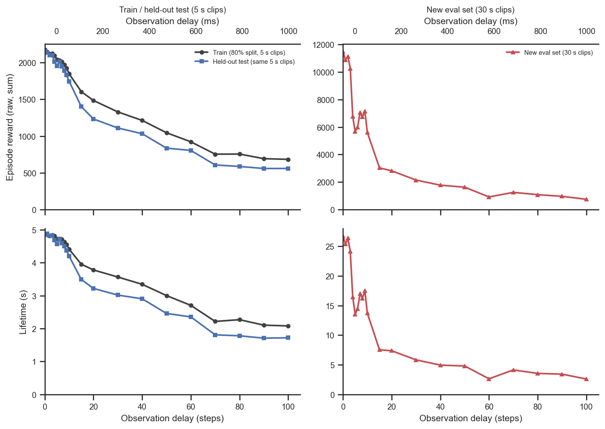
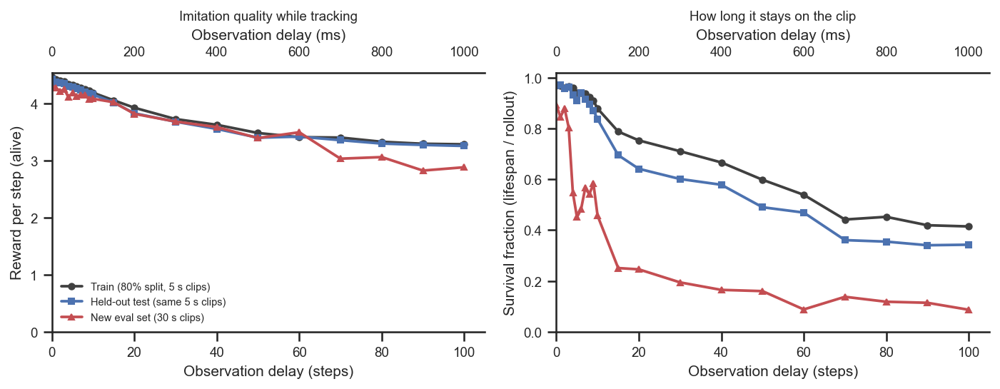
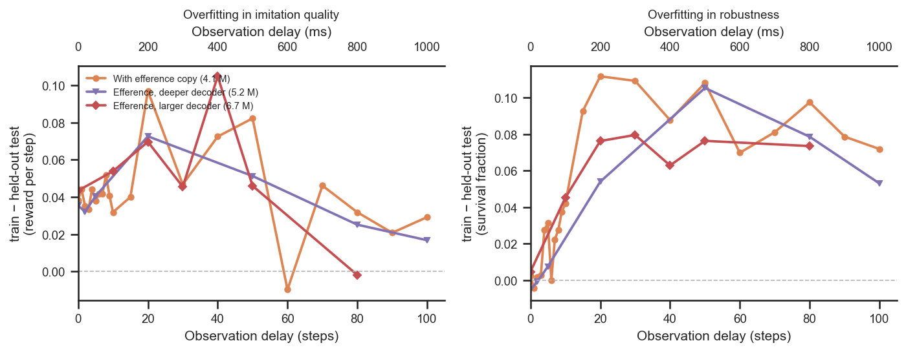
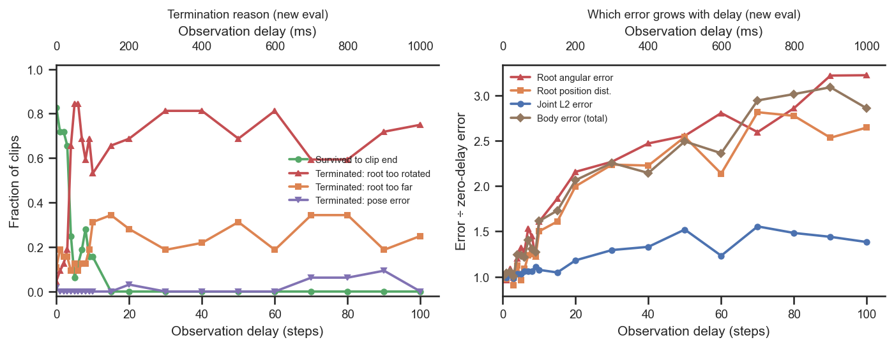

# Train vs. eval generalization and delay tolerance (standard efference decoder)

## Question
Using the new batch evaluation (`vnl_experiments/delays/eval_runs.py`, results in
`eval_results/`), which re-evaluates each checkpoint on **three datasets** — the 80% **train**
split, the held-out 20% **old_eval** split (same 250-frame clips), and a fresh **new_eval** set
(32 clips of 1500 frames) — we ask, for the **standard with-efference EncDec decoder**:

1. Does it tolerate the same amount of delay on the longer/new eval set?
2. How much better is it on the training data?
3. Does it overfit?
4. If so, do larger networks overfit more?
5. As delays get longer, *how* does the model fail (termination reasons, error components)?

## Dataset & comparability
- Sources (all joined in `extract.py`, the only data-touching stage):
  - committed `analysis/*/data.csv` — authoritative, already-vetted run set + `condition` labels;
  - WandB `emiwar-team/nnx-ppo-rodent-delays` — independent re-verification of the invariants;
  - local `eval_results/*.json` — the three-dataset re-evaluation metrics.
- Conditions: `efference` (standard, `efference_length == delay_k`, n=22, delays 0–100, the
  focus), plus `efference_larger` (decoder `[1024]×4`, 6.7 M params, n=7) and `efference_deeper`
  (decoder `[512]×8`, 5.2 M, n=7) for the network-size question, and `no_efference` as a floor.
- **Comparability: comparable, with documented differences** (see [comparability.txt](comparability.txt)).
  Every invariant is single-valued *within* each condition: `body_target_frame=reference_root`,
  `latent_size=32`, `kl_weight=0.001`, enc `[512]×4`, critic `[1024,1024]`, restored
  `checkpoint_step = 600,064,000`, train/old clip_length `250`. Caveats:
  - **Git differs by design across conditions** (efference/no_efference `1cd5838`;
    larger/deeper `5464376`) — the only shared-code change is the backward-compatible
    `inject_key` on `EfferenceCopy`; the standard concat-efference path is identical.
  - **Time units (two clocks).** `clip_length` is counted in **mocap frames @ 50 Hz**, so the
    clips are **5 s** (250 frames, train/old) and **30 s** (1500 frames, new) of motion. The
    eval rollout now scans the **full clip**: with `ctrl_dt = 0.01 s` (100 Hz) and the reference
    advancing `ctrl_dt × mocap_hz = 0.5` frames/step, a clip of `F` frames needs
    `ceil(F / 0.5) + 2` control steps — **502** (train/old) and **3002** (new). The restored
    train rewards now match the training-time WandB totals (e.g. eval-train ≈ 1970 vs WandB
    ≈ 2004 at delay 0–4), confirming full clips are played (an earlier eval run mistakenly used
    the frame count as the step count and covered only the first half; that is fixed here).
    Observation delay is in control steps (1 step = 10 ms), as on the figures' top axes.
  - **Cumulative `episode_reward` is NOT comparable across datasets**: the new_eval rollout is
    3002 control steps vs 502 for train/old, so raw reward is ~6× larger purely by clip length.
    All figures use length-normalised metrics: **reward_per_step** = reward / lifespan (quality
    while alive) and **survival_frac** = lifespan / rollout-length (502 or 3002 steps).
  - **survival_frac across datasets is partly length-confounded**: sustaining the 30 s new-eval
    clip (3002 steps) is intrinsically harder than the 5 s train/old clip (502 steps) even at
    equal per-step hazard, so the new_eval survival drop overstates the pure delay/difficulty
    effect. The cross-dataset *quality* comparison (reward_per_step) is length-clean; the
    *train vs old_eval* survival comparison is clean (identical 502-step rollouts). new_eval
    survival should be read qualitatively. (A surviving clip reaches ~0.97, not 1.0, because
    truncation fires a couple of frames before the scan horizon.)
  - Single seed per delay (except 2 seeds at delay 0); replicate seeds averaged per delay.

## Figures
Raw (non-normalised) episode reward and lifetime vs delay (efference). Because the clips differ
in length (5 s / 502-step rollout for train/old vs 30 s / 3002-step for new_eval), the two
groups are on separate panels — their absolute scales are not directly comparable. These are
the un-normalised starting point; the normalised metrics below remove the clip-length effect.

Delay tolerance on each dataset (efference): per-step imitation quality (left) and survival
fraction (right).

Train-minus-held-out-test gap (overfitting) vs delay, for the three decoder sizes.

How the policy fails on the new eval set as delay grows: termination-reason rates (left) and
error components as fold-change over the zero-delay baseline (right).

## Tentative conclusions

**1 & 2 — Delay tolerance is qualitatively similar but quantitatively worse on the new set,
and the new-set penalty grows with delay.** Per-step imitation quality (`reward_per_step`)
degrades smoothly with delay on all three datasets and the curves nearly coincide out to
delay ~50–60; beyond that the new_eval curve falls increasingly below train (delay 50: 3.40 vs
3.48; delay 100: **2.88 vs 3.29**, ~12% lower). Train is only marginally above the held-out
test everywhere (≤ ~0.1 reward/step). So in terms of *quality while tracking*, the model is
only slightly better on training data and tolerates delay almost as well on the new set.

**3 — Little classic overfitting; the new-set gap is distribution/length shift, not
memorisation.** Train and the held-out test (same clips, held out and unseen) are nearly identical
in per-step quality at all delays, and close in survival at short delays — the policy is **not
memorising specific training clips**. A *modest, delay-growing* train-vs-test gap does appear in
**survival** (e.g. delay 50: 0.60 vs 0.49; delay 100: 0.42 vs 0.34): at long delay the policy is
somewhat less robust on unseen clips. The much larger new_eval shortfall is dominated by the
different, longer clips (distribution + 6× length), not by overfitting.

**4 — Larger networks do *not* overfit more (nor generalise better).** Across the three decoder
sizes (4.1 / 5.2 / 6.7 M params) the train-minus-test gap is small and **scales with delay, not
with network size** — the curves overlap and are noisy, with no systematic ordering by size
(right-hand panel). On the new eval set the larger and deeper decoders match (or slightly trail)
the standard one at matched delays (e.g. delay 50: 3.40 / 3.47 / 3.05 reward/step for
standard / deeper / larger). Extra decoder capacity is essentially neutral here: it neither
causes overfitting nor buys generalization.

**5 — At long delay the model fails by losing *root pose*, not limb pose.** On the new
eval set the dominant termination reason is **`root_too_rotated`**, which overtakes "survived"
already by delay ~4–5 and stays at ~0.7–0.8 thereafter; `root_too_far` is a secondary
contributor (~0.25–0.3) and `pose_error`/`nan` are negligible. Consistently, the error
components that **grow fastest with delay are the root errors** — root angular error reaches
~3.2× its zero-delay value by delay 100, root position distance ~2.6× and the aggregate body
error ~2.9× — while the **joint L2 (limb pose) error grows only ~1.4×**. So the limbs keep
tracking comparatively well; what diverges under delay is the global **position and orientation
of the root**, with over-rotation tripping the termination. This points at root control (or its
reference representation) as the bottleneck for long-delay imitation — a natural lead-in to the
reference-representation runs (`body_target_frame` variants, git `f315e336`) that are excluded here.

### Follow-ups
- Re-run with multiple seeds per delay to firm up the (currently single-seed, noisy) gap curves.
- Add a length-matched control: subsample the 30 s new clips to 5 s segments to separate the pure
  clip-length effect from genuine distribution difficulty in `survival_frac`.
- The root-orientation failure motivates the next question on reference representations
  (`reference_root` vs `current_root` vs `neither`).
