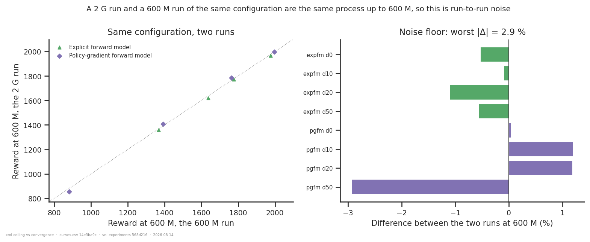
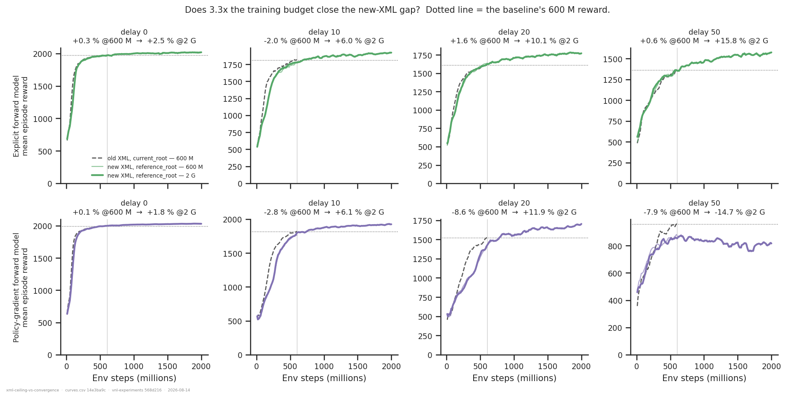
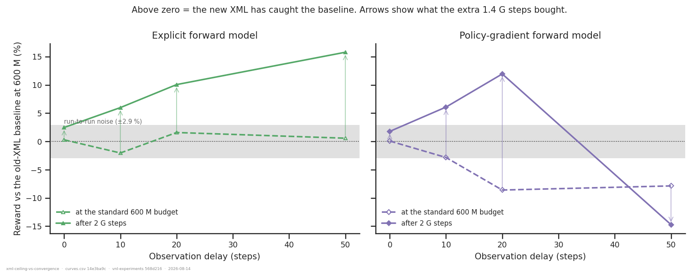
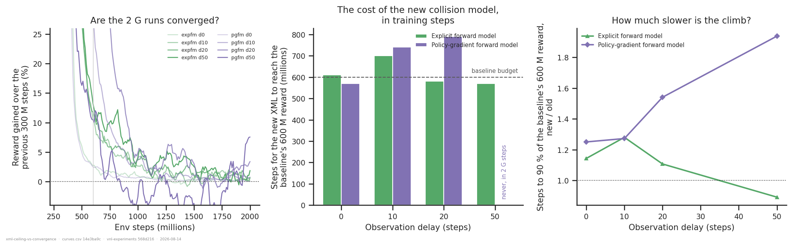
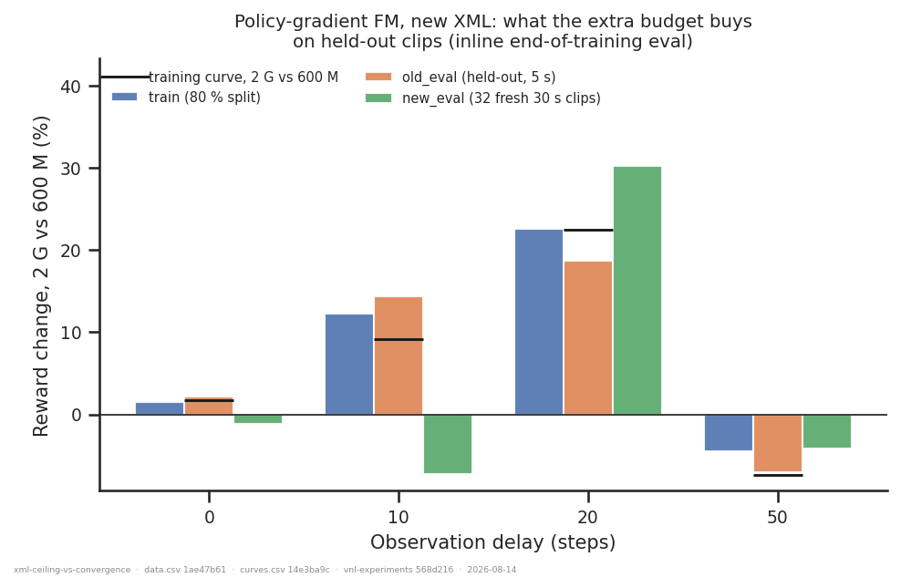

# Is the new-XML deficit a lower ceiling, or a slower climb?

## Question

[`collision-model-xml/`](../collision-model-xml/) found that the new (almost-full-
collision) walker XML costs up to −20 % reward under torque control in a band of
observation delays (~25–60), and split that band by extrapolating the remaining slope at
600 M steps: the leading edge looked like unfinished training, the trailing edge like a
real plateau. Eight **2 G-step** runs of the going-forward configuration (new XML +
`reference_root` + torque), launched 2026-08-13, replace that extrapolation with a
measurement.

An answer looks like this: **if the 600 M deficit closes when the new arm is given 3.3×
the budget, it was convergence speed; if the new arm flattens below the baseline, it is a
ceiling.**

## Answer, in one line

**Both, and the split is by delay.** At delays 0–20 the deficit is entirely convergence
speed — the new XML costs ~1.1–1.5× more steps to reach a given reward and then overtakes
the baseline. At delay 50 in the policy-gradient FM it is a ceiling: that run peaks at
600–700 M and *declines*, ending 14.7 % below a baseline it never reaches.

## Dataset & comparability

**Source:** WandB `emiwar-team/nnx-ppo-rodent-delays`, tag `TrainEvalSplit`, selected by
the `CONDITIONS` in `extract.py` and frozen in `runs.csv` (29 runs). All runs: seed 42,
torque actuators, `min_std = 0.1`, standard architecture, `AbsoluteImitation`,
`delay_k == efference_length`, restricted to the four delays the 2 G cohort covers.

| condition | n | delays | budget | XML | frame | commit | launched |
|---|---|---|---|---|---|---|---|
| `expfm_new_2g` | 4 | 0/10/20/50 | 2 G | new | reference | `25732c42` | 2026-08-13 |
| `pgfm_new_2g` | 4 | 0/10/20/50 | 2 G | new | reference | `25732c42` | 2026-08-13 |
| `expfm_new_600m` | 4 | 0/10/20/50 | 600 M | new | reference | `ef060b73` | 2026-08-11 |
| `pgfm_new_600m` | 5 | 0/10/10/20/50 | 600 M | new | reference | `25732c42` | 2026-08-12 |
| `expfm_old_600m` | 4 | 0/10/20/50 | 600 M | old | current | `54643764` | 2026-06-19 |
| `pgfm_old_600m` | 4 | 0/10/20/50 | 600 M | old | current | `d4bd4dc0` | 2026-06-30 |
| `expfm_oldref_600m` | 4 | 0/10/20/50 | 600 M | old | reference | `909e774d` | 2026-07-06 |

`expfm` = explicit forward model (`fm_loss_weight = 1`, prediction detached); `pgfm` =
policy-gradient forward model (`fm_loss_weight = 0`, not detached). The `*_old_600m`
cells are the same runs `collision-model-xml` used as baselines, pinned to the same
tranches. `expfm_oldref_600m` is a frame-matched control.

**Included despite `state = failed`:** the four `expfm_new_600m` runs at `ef060b73` died
in the *post-training* evaluation. All reached `summary._step = 600_064_000` and have
every training metric. The inclusion rule is `state ∈ {finished, failed}` **and**
`_step == ` the budget's expected value; a run that died during training cannot satisfy
the second.

**Artifacts** (`coverage.txt`): `history` 29/29. Batch offline eval (`eval3ds-66aaff5b`)
**4/29** — only `pgfm_old_600m`. See *Missing data*.

**Programmatic comparability** (`comparability.txt`): every invariant is single-valued
within every condition, including all PPO hyper-parameters and all eleven env knobs.
Across conditions only the designed axes vary: `total_steps`, `summary._step`,
`walker_xml_path`, `body_target_frame`, `git_commit`.

**Manual comparability.** Beyond the programmatic report:

- *All 90 `env_params.*` / `net_params.*` / `config.*` columns were diffed pairwise*
  between each 2 G run and its 600 M twin. The **only** difference is
  `config.ppo.total_steps`. Same diff against the old-XML baselines returns only the two
  designed axes, `total_steps`, `config.*.logging_level` (which metrics are accumulated —
  `nnx_ppo/algorithms/metrics.py`, `rollout.py`; logging only, no effect on the gradient),
  and the inert `net_params.body_target_frame` (unset on the newer runs; the authoritative
  copy is on `env_params`, per the README trap).
- *`ef060b73` → `25732c42`* (the 600 M explicit-FM arm → the 2 G runs): `git diff --stat`
  touches **`analysis/` only**. The two are the same training code.
- *`d4bd4dc0` → `25732c42`* (PG-FM baseline → new arms): in the network path only
  `latent_key: str → str | None` with a `None` branch these runs never take, plus an
  additive metrics dict, in `vnl_experiments/delays/forward_model.py`.
- *`54643764` → `25732c42`* (explicit-FM baseline → new arms): an eight-week span. In
  `forward_model.py` the changes are additive and default-preserving
  (`detach_prediction=True` is the old behaviour). Everything else is new files and eval
  tooling.
- Tags and notes read; `min_std`, `latent_min_std`, `std_scale` checked explicitly, since
  these separate in-scope from out-of-scope new runs and are invisible in a run's name.

**The `nnx-ppo` version is not recorded per run**, and it moved between June and August
(`0.2.0` → `0.3.0`). This is the one uncontrolled axis in the baseline comparisons; it is
*not* an axis in the 2 G-vs-600 M comparisons, which are same-week and same-commit.

**Caveats.**

1. **There is no 2 G old-XML run.** "Ceiling" here means *flat, and below the baseline's
   600 M value*, not *below the baseline's asymptote*. The baselines are themselves still
   gaining 0.3–6.4 % per 100 M at 600 M, so this is a one-sided test: it can show the new
   XML fails to catch up, and it can show it catches up, but it cannot compare converged
   optima.
2. **Only delay 50 lies inside the 25–60 deficit band.** The 2 G cohort samples
   0/10/20/50. Delay 30, where `collision-model-xml` measured the worst PG-FM point
   (−21.5 %), is not covered.
3. **No 2 G EncDec run.** EncDec carried the largest deficit (−19.7 % at delay 40) and is
   absent here entirely.
4. **One run per cell** (all seed 42) — but see *Noise floor*, which is the first
   empirical bound on what that costs.

## Noise floor — what one run per cell is worth



Because `total_steps` only bounds PPO's training loop and the learning rate is constant
(`nnx_ppo/algorithms/ppo.py`), a 2 G run and a 600 M run of the same configuration are the
**same process** up to the stopping point. Comparing a 2 G run's reward *at 600 M* with
its 600 M twin therefore measures nothing but run-to-run noise. Across eight matched
cells the differences are **−2.9 % to +1.2 %**, worst case 2.9 % (PG-FM, delay 50).

That is the yardstick for everything below: a contrast inside ±3 % is not a result.

It also settles a discrepancy with `collision-model-xml`. Every number there was the
single final eval point from the run summary; here each is the mean of the five eval
points in the last 50 M steps. Same runs, different reduction:

| network | delay | deficit @600 M, windowed | deficit @600 M, last point |
|---|---:|---:|---:|
| expfm | 10 | −2.1 % | −3.2 % |
| pgfm | 20 | −8.6 % | −4.6 % |
| pgfm | 50 | **−7.9 %** | **−15.2 %** |

The headline −15.2 % PG-FM deficit at delay 50 is roughly half noise in the final eval
point. The windowed −7.9 % is the better estimate.

## Primary result





| network | delay | baseline @600 M | new @600 M | new @2 G | deficit @600 M | deficit @2 G |
|---|---:|---:|---:|---:|---:|---:|
| expfm | 0 | 1971 | 1977 | 2020 | +0.3 % | **+2.5 %** |
| expfm | 10 | 1813 | 1776 | 1922 | −2.1 % | **+6.0 %** |
| expfm | 20 | 1611 | 1636 | 1773 | +1.6 % | **+10.1 %** |
| expfm | 50 | 1360 | 1367 | 1574 | +0.6 % | **+15.8 %** |
| pgfm | 0 | 1996 | 1997 | 2031 | +0.1 % | **+1.8 %** |
| pgfm | 10 | 1815 | 1763 | 1925 | −2.8 % | **+6.1 %** |
| pgfm | 20 | 1522 | 1391 | 1704 | −8.6 % | **+11.9 %** |
| pgfm | 50 | 958 | 882 | 817 | −7.9 % | **−14.7 %** |

**Seven of the eight cells end above the baseline.** The only cell that does not is
PG-FM at delay 50, and it does not merely fail to close — it gets *worse*: the curve peaks
at 876 around 660 M steps and drifts down to 817 by 2 G, a 6.8 % loss from its own peak.
The deficit widens from −7.9 % to −14.7 %.

The explicit forward model shows no deficit at any of these delays at 600 M (within the
±3 % noise floor) and gains monotonically more from the extra budget as delay grows:
+2.5 % at delay 0 rising to +15.8 % at delay 50. It is the least converged at 600 M
precisely where the task is hardest.

## Convergence speed — the new XML costs steps, not reward



| network | delay | steps for new XML to reach baseline's 600 M reward | steps to 90 % of it, old → new | slowdown |
|---|---:|---:|---:|---:|
| expfm | 0 | 610 M | 140 M → 160 M | 1.14× |
| expfm | 10 | 700 M | 250 M → 320 M | 1.28× |
| expfm | 20 | 580 M | 280 M → 310 M | 1.11× |
| expfm | 50 | 570 M | 370 M → 330 M | 0.89× |
| pgfm | 0 | 570 M | 120 M → 150 M | 1.25× |
| pgfm | 10 | 740 M | 330 M → 420 M | 1.27× |
| pgfm | 20 | 790 M | 370 M → 570 M | 1.54× |
| pgfm | 50 | **never** | 320 M → 620 M | 1.94× |

Read as a sample-efficiency tax, the new collision model costs roughly **1.1–1.3× the
steps** at delays 0–10 in both networks, and that is the whole story there — the arms
converge to the same or better place. In the PG-FM the tax grows with delay (1.5× at
delay 20, 1.9× at delay 50) until at delay 50 it stops being a tax and becomes a wall.

The left panel answers the obvious objection: **are the 2 G runs themselves finished?**
Mostly. Over the last 500 M steps the gains are +0.3 % to +2.6 % (largest: PG-FM delay 20
at +2.6 %, explicit FM delay 10 at +2.5 %). PG-FM delay 50 is at −0.4 %. So the ceiling
verdict at delay 50 is solid, while the delay-20 crossings are, if anything,
under-stated — those runs are still climbing.

## Held-out clips



Only the PG-FM arms carry a held-out number on both sides: the inline end-of-training eval
exists only on runs from 2026-08-10 onward (which rules out both baselines), and the 600 M
explicit-FM cohort died *in* that eval. So this compares 600 M with 2 G **within** the new
configuration, and shows the training-curve story is not an artefact of evaluating on the
training clips:

| delay | train | `old_eval` (held-out) | `new_eval` (30 s) | training curve |
|---:|---:|---:|---:|---:|
| 0 | +1.5 % | +2.2 % | −1.2 % | +1.7 % |
| 10 | +12.3 % | +14.3 % | −7.3 % | +9.2 % |
| 20 | +22.6 % | +18.7 % | +30.2 % | +22.5 % |
| 50 | −4.5 % | −7.0 % | −4.2 % | −7.4 % |

Held-out reward tracks the training curve at every delay, including the **negative** value
at delay 50. `new_eval` is 32 clips at a single seed and is noisy (the delay-10 point
disagrees in sign); read it for trend only.

## The frame control

At these four delays the frame is free on the old XML, reproducing
`collision-model-xml` independently: `expfm_oldref_600m` vs `expfm_old_600m` is −0.0 %,
−0.3 %, −0.8 %, −2.2 % at delays 0/10/20/50 — all inside the ±2.9 % noise floor, with no
trend worth reading. So attributing the primary contrast to the XML rather than the frame
remains sound.

## Tentative conclusion

- **At delays 0–20, the 600 M deficit was convergence speed.** Given 2 G steps both
  networks pass the baseline by 2–12 %. The new collision model costs ~1.1–1.5× the
  training steps at these delays and nothing in final reward.
- **At delay 50 in the policy-gradient FM, it is a ceiling** — and worse than a plateau:
  the run peaks near 660 M and declines. This is the one cell where more compute makes the
  gap wider, not narrower.
- **The explicit forward model has no deficit at any tested delay**, and benefits most
  from the longer budget at long delay (+15.8 % at delay 50). `collision-model-xml`'s
  "the explicit FM is immune" holds and strengthens: it is not merely unharmed, it was the
  arm most starved by the 600 M budget.
- **Practical reading:** if the going-forward setup keeps the explicit forward model,
  the new XML is free and 600 M is simply too short a budget at delay ≥ 20. If it uses the
  policy-gradient FM, delays beyond ~20 have a real problem that compute does not fix.
- **Hedges:** one run per cell; the decisive delay-50 PG-FM cell is a single run whose
  decline could in principle be a seed-specific collapse; and no baseline was trained to
  2 G, so none of the "+x % above baseline" numbers are asymptote-to-asymptote.

## Missing data

- **No offline batch eval on 25 of 29 runs** — only `pgfm_old_600m` has
  `eval3ds-66aaff5b`. A single batch pass over this whole cohort would give the first
  held-out *new-vs-old* comparison (the inline evals above cannot cross that boundary:
  the baselines predate the feature, and inline and batch evals measure different
  weights). Highest-value thing to run:

  ```bash
  python -m vnl_experiments.artifacts plan --kind eval \
      --runs analysis/xml-ceiling-vs-convergence/runs.csv --out eval_todo.txt
  # on the cluster:  sbatch slurm_eval.sh eval_todo.txt eval
  python -m vnl_experiments.artifacts pull --kind eval \
      --runs analysis/xml-ceiling-vs-convergence/runs.csv
  ```

- `expfm_old_600m` and `expfm_oldref_600m` hold only the older `legacy-batch` /
  `legacy-batch-v0` specs, which must not be mixed with `eval3ds-66aaff5b`.

## Follow-ups

- **A 2 G old-XML run at delay 20 and 50, in the PG-FM.** One pair would turn every
  "above the baseline's 600 M value" statement into a real asymptote comparison, and would
  say whether the old XML also stalls at delay 50 or genuinely goes higher.
- **A second seed for PG-FM at delay 50, both XMLs.** The single most load-bearing cell in
  this report is one run per arm, and the new arm's late decline is the kind of thing a
  seed can produce on its own.
- **Delay 30 at 2 G**, the worst point of the band in `collision-model-xml` (−21.5 %) and
  the boundary between the two regimes found here.
- **A 2 G EncDec run**, the network with the largest deficit and no long run at all.
- ~~**Why does PG-FM delay 50 decline?** It is the only cell that loses reward late. Its
  `fm_pred_mse` and the entropy/KL traces would say whether the predictor degrades or the
  policy collapses.~~ Answered in
  [`explicit-vs-implicit-fm-2g/`](../explicit-vs-implicit-fm-2g/): the **predictor
  degrades**. Its prediction MSE rises from ~0.50 early in training to 1.00 at 2 G
  (peaking at 1.16 near 1.7 G), its action σ is the only one of the eight that rises, its
  encoder KL falls and its tracking error rises. The decline shows on held-out clips too,
  so it is degradation rather than overfitting.

---

*Reproduce:* `../.venv/bin/python analysis/xml-ceiling-vs-convergence/extract.py && ../.venv/bin/python analysis/xml-ceiling-vs-convergence/plot.py`
(add `--sync --refresh` to the extract to pull in runs added since `runs.csv` was frozen).
